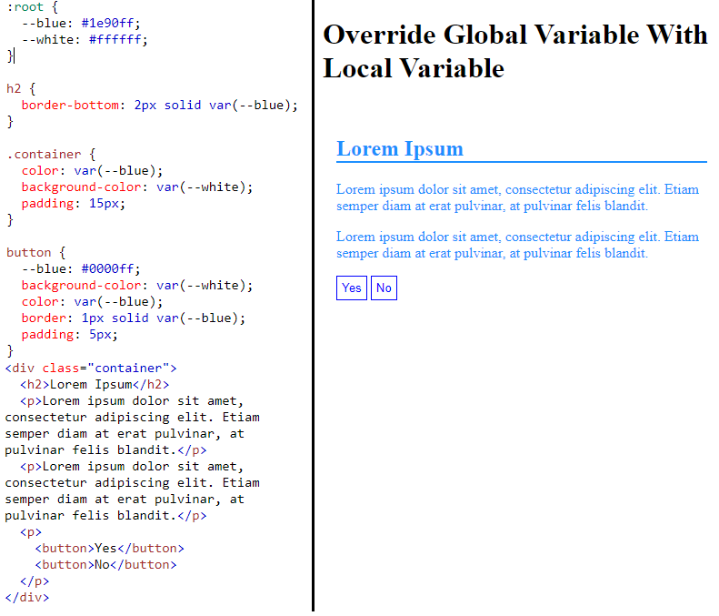

# CSS BASIC

## 1. Giới thiệu ngắn gọn:

- CSS là ngôn ngữ Chúng ta dùng để style cho 1 trang web
- Được dùng để xác định kiểu cho các trang web, bao gồm thiết kế, bố cục hiển thị trên các thiết bị và kích thước màn hình khác nhau.

## 2. Cách thêm CSS:

- Có 3 cách:
  - thêm từ 1 files .css bên ngoài
    - Bằng cách `<link rel="stylesheet" href="namefile.css">` trong cặp thẻ `<head></head>`
  - Css style từ bên trong file .html thông qua cặp thẻ `<style></style>` trong cặp thẻ `<head></head>`
  - inline style. Css thông qua thuộc tính **chung** **style** của ELMS

## 3. Sử dụng:

### 3.1 SELECTOR CƠ BẢN:

1. Id

   

Ta có thể style cho elm có id là `para1`

2. class

   

Tà có thể style cho elms có class là `center`

3. `*` SELECTOR:

   ```html
   * { key: value }
   ```

   Tất cả các thẻ đều được style

4. SECLECTOR theo name "TAG":

   ví dụ:

   ```html
   h1 { text-align: center; color: red;} h2 {text-align: center; color: red;}
   etc...
   ```

### 3.2 Một số SELECTOR nâng cao:

**Cú Pháp**

- `.class1.class2` : chọn tất cả những elms có `class="class1"` và `class="class2"`

- `.class1 .class2` : Chọn tất cả những elms có `class="class2"` là con của những elms `class="class1"`.

- `element.class1` : Chọn tất cả những elements có `class="class1"`.
- `element, element` : Ví dụ `div, p` Chọn tất cả những thẻ `div` và `p`.
- `element > element` : Ví dụ `div > p` Chọn tất cả thẻ `p` là con trực tiếp của thẻ `div`.
- `element + element` : Ví dụ `div + p ` Chọn 1 phần tử đầu tiên là thẻ `p` liền kề sau thẻ `div`.
- `element ~ element` : Ví dụ `p ~ ul ` Chọn mọi phần tử `ul` sau thẻ `p` cùng cấp.
- `[attribute]` : Ví dụ `[target] or [type] ...` Chọn mọi phần tử có attribute như là `target` or `[type]`
- `[attribute="value"]`: ví dụ `[type="text"]` Chọn mọi elms có attribute là `type="text"`
- `[attribute~="value"]` : Ví dụ `[title ~= "abcd"]` Chọn mọi elms có attri `title` chứa từ `abcd`
- `[attribute |= "en"]` : Ví dụ `[title |= "abc"]` Chọn mọi elms có attri `title` chứa value bắt đầu bằng từ `abc` và theo sau là dấu `-`.
- `[attribute^=value]` : Ví dụ `a[href^= "https"]` Chọn mọi thẻ `a` có attri `href` chứa value bắt đầu `https` gần giống `|=`
- `[attribute$=value]` : Ví dụ `a[href$=".pdf"]` Chọn mọi thẻ `a` có attr `href` chứa value cuối là `".pdf"`
- `[attribute *= value ]` : Ví dụ `a[href *= "w3school"]` chọn mọi thẻ a có attr `href` chứa value `"w3school"`.

`Ngoài những Selector này ra còn có nhiều selector khác mà ta có thể tham khảo thêm:` https://www.w3schools.com/cssref/css_selectors.asp

### 3.3 CSS UNITS:

1. Đơn vị `Tuyệt Đối`:
   - Gồm có px, cm , mm ... px là đơn vị được dùng nhiều nhất
2. Đơn vị `Tương Đối`:
   - Những đơn vị được dùng phổ biến nhất là: %, rem, em, vw, vh
     - unit `%`: phụ thuộc vô thằng chứa: ví dụ thằng `<div>` parent có width = 500px `<div>` child có width = 50% thì `<div>` child có width là 250px
     - unit `rem`: phụ thuộc vô thằng html định nghĩa ra
     - unit `em` : phụ thuộc vô unit gần nhất chứa nó (inherit)
     - unit `vw` : view witdh độ rộng màn hình
     - unit `vh` : view height độ cao màn hình

ex: https://www.w3schools.com/cssref/tryit.asp?filename=trycss_units

### 3.4 CSS Text:

`Css có nhiều thuộc tính định dạng văn bản.`

#### 3.4.1 Text Alignment:

- `text-align` : Có 3 giá trị `center` , `left` or `right` or `justify` ( thuộc tính này đặc biệt là nó sẽ điều chỉnh chiều rộng mỗi dòng đều bằng nhau.)
- `direction` : rtl or ltr là hướng chữ xuất phát từ trái hoặc phải.
- `vertical-align` : `top`, `middle` or `bottom` ví dụ: https://www.w3schools.com/css/tryit.asp?filename=trycss_vertical-align

- `text-decoration` : `none`, `overline`, `line-through`, or `underline` ví dụ: https://www.w3schools.com/css/tryit.asp?filename=trycss_text-decoration

- `text-transform` : `uppercase`, `lowercase` or `capitalize` Ví dụ: https://www.w3schools.com/css/tryit.asp?filename=trycss_text-transform

- `text-indent`: Dùng để thụt lề dòng đầu tiên trong 1 đoạn văn bản. Ví dụ: https://www.w3schools.com/css/tryit.asp?filename=trycss_text-indent

- `letter-spacing`: Chỉ định khoảng cách giữa các `chữ cái`.

- `Line Height` : khoảng cách giữa các dòng. ví dụ: https://www.w3schools.com/css/tryit.asp?filename=trycss_line-height

- `word-spacing`: Khoảng cách giữa các `từ`

- `white-space`: default `normal`, `pre` có thể custom `nowrap` ví dụ: https://www.w3schools.com/cssref/playit.asp?filename=playcss_white-space&preval=pre-wrap

- `text-overflow`: thường dùng kết hợp với thuộc tính `overflow`: hidden và `white-space`: nowrap để thấy hiệu quả.

  - `clip` văn bản bị cắt ngang.

  - `ellipsis` nếu nội dung dài hơn khung chứa thì sẽ render ra (...) để đại diện thay cho những phần văn bản bị cắt

- `text-shadow` : thuộc tính dùng để `thêm bóng` cho 1 đoạn text. Ví dụ: https://www.w3schools.com/css/tryit.asp?filename=trycss3_text-shadow3

### 3.6 CSS Box Model:

- **Box model** được dùng khi thiết kế bố cục 1 trang web.
- Bao bọc xung quanh mọi phần tử HTML. Bảo gồm: margin, borders, padding, và content.


1. `Content` : Nội dung của box có thể là chữ or hình ảnh
2. `Padding` : Phần đệm, không có màu ( Nếu mà set background-color thì padding cũng có màu )
3. `Border` : Đường viền xung quanh padding.
4. `Margin` : Lề bên ngoài border, khoảng cách giữa 2 box cùng 1 mặt phẳng.

#### 3.6.1 Margin:

`Được dùng để tạo khoảng cách xung quanh của một thành phần,`

- `margin-top`
- `margin-right`
- `margin-bottom`
- `margin-left`

Những thuộc tính được liệt kê phía trên chỉ định lề của 4 phía: top, right, bot, left.

**Shorthand Property**:

- margin: 10px 20px 30px 40px;

  - margin-top: 10px
  - margin-right: 20px
  - margin-bottom: 30px
  - margin-left: 40px

- margin: 25px 50px 75px;
  - margin-top: 25px
  - margin-right và left: 50px
  - margin-bottom: 75px
- margin: 25px 50px
  - margin-top và bottom: 25px
  - margin-right và left: 50px
- margin: 25px
  - top left right bottom đều là 25px

**Margin collapse**:

Ví dụ:

```html
<div>
  <h1 style=" margin-bottom: 50px">Heading 1</h1>
  <h2 style=" margin-top: 20px">Heading 2</h2>
</div>
```

Dễ nhầm lẫn là khoảng cách giữa `h1` và `h2` là 70px nhưng thực ra là 50px. ( Thẻ `thẻ heading` có tính chất mặc định `display: block`)
Nếu ta set css 1 trong 2 thẻ heading `display: inline-block` thì khoảng cách giữa `h1` và `h2` là 70px

#### 3.6.2 Padding:

Gần giống `margin`

#### 3.6.3 Border:

**Thuộc Tính border cho phép style width, màu và nét đường viền của 1 thành phần**

- `border-style`: Chỉ định kiểu đường viền như 1 số value thường dùng như dotted, dashed, solid, double, v.v...
- `border-width`: Chỉ định độ dày của đường viền. giá trị của nó có thể là 1 giá trị áp dụng cho 4 hướng or 2 giá trị áp dụng cho 2 hướng và 3 giá trị áp dụng cho 3 hướng giống padding và margin
- `border-color`: Chỉ định màu của border và giá trị của nó thể là HEX value or rgb or rgba
- Ta có thể style riêng lẻ cho từng phía.
  - `border-top-style`
  - `border-right-style`
  - `border-bottom-style`
  - `border-left-style`

**Short Hand**

`border-width: 10px`, `border-style: solid` và `border-color: red` được viết ngắn gọn: `border: 10px solid red`

ví dụ: 

**Border-radius**

`Được sử dụng để bo góc các đường viền`

#### 3.6.4 OutLine

`Là một đường được vẽ bên ngoài đường viền của phần tử. `

- Nó có cú pháp short hand giống border. Nó không có chỉ định hướng riêng lẻ
- Nó có một thuộc tính khác `outline-offset` là khoảng trống giữa outline và border

#### 3.6.5 CSS Width/Height:

1. set width và height để xác định chiều rộng và chiều cao của 1 elm

### 3.7 CSS Fonts:

1. font family:
   - Css dùng thuộc tính `font-family` chỉ định phông chữ văn bản.
   - Ta nên dụng nhiều font dự phòng để nhỡ máy người khác không có font đo thì còn có font dự phòng.
2. Font web an toàn:

- font web là font được cài đặt phổ biến trên tất cả các trình duyệt và thiết bị.
- Một số web font an toàn cho HTML và CSS: - Arial (sans-serif) - Verdana (sans-serif) - Helvetica (sans-serif) - v.v...

`Trước khi code ra web, ta nên kiểm tra thử coi font xuất hiện như thế trên mọi trình duyệt và thiết bị và ta dùng thêm font dự phòng. `

3. font-style:
   - `font-style`: italic or là oblique (oblique ít được hỗ trợ) tác dụng in nghiêng chữ
   - `font-weight`: bold (Bối đậm chữ)
4. font-size:
   - `font-size: 30px` : set kích thước font chữ
5. shothand:
   - font-style
   - font-weight
   - font-size/line-height
   - font-family

Có thể được viết tắt là:
`font: italic bold 12px/24px Georgia, sans serif;`
tức là:

- `font-style`: italic;
- `font-weight`: bold;
- `font-size`: 12px/`line-height`: 24px
- `font-family` là Georgia và font dự phòng là sans serif.

### 3.6 CSS Icons:

- Để thêm icon vào trong trang HTML, là thư viện icons như `Font Awesome`

### 3.8 Link:

- `Link` có thể được style những kiểu khác nhau phụ thuộc vào `trạng thái` của nó
  - `a:link` : là trạng thái bình thường khi link chưa được truy cập.
  - `a:visited` : là trạng thái khi link đã được truy cập.
  - `a:hover` : là trạng thái khi người dùng đưa chuột vào link.
  - `a:active` : là trạng thái link người dùng click nhưng chưa thả chuột ra.
- `cursor` : một số thuộc tính `cursor` https://www.w3schools.com/css/tryit.asp?filename=trycss_cursor

### 3.9 CSS Lists:

- **Unordered List** : Được đánh dấu bằng dấu bằng dấu đầu dòng.


- **Ordered Lists** : Danh sách các item được đánh dấu với số hoặc chữ cái.


`CSS list properties: `

- cho phép list item đặt một hình ảnh làm điểm đánh dấu đầu dòng.

`ex:` 

- `Position The List Item Markers`:

  - `Outside`: 

  - `Inside`: 

### 3.10 CSS Table:

#### 3.10.1 Table Border:

**border-collapse** là thuộc tính để set table có một border duy nhất

ví dụ: 

### 3.11 CSS background:

- `Css background` là thuộc tính được dùng để thêm hiệu ứng backgrounds cho elms

  - `background-color` value của nó là **color name**, **HEX** và **RGB**
  - `background-image` là thuộc tính chỉ định 1 hình ảnh được dùng làm nền cho 1 thành phần.
    `ex:` 

  - `background-repeat` -`repeat-x`

    - `repeat-y`
    - `no-repeat`;

  - `background-position`: value của nó là `top`, `right`, `bottom`, `left` và `center`.
  - `background-attachment`: hình nền được `fixed` hay `scroll` với phần còn lại của trang
    - `fixed`
    - `croll`;
  - `background-size`:

    - `giá trị tuyệt đối` (giá trị lần lượt là width và height)
    - `cover`
    - `contain`

  - `background-origin`:
  - `content-box` toàn bộ hình ảnh đều nằm trong content.

    

  - `border-box`

    

  - `padding-box`

    

### 3.12 CSS Position:

- `Position` là thuộc tính chỉ định vị trí cho 1 element
- Có 5 giá trị để định vị cho thuộc tính `position`: - `static` - `relative` - `fixed` - `absolute` - `sticky`.
  Khi xét thuộc tính `position` với 1 trong 4 giá trị `relative` or `fixed` or `absolute` or `sticky`. Ta có thể dùng các thuộc tính như `top` khoảng cách so với top , `bottom` cách bot, `right` cách phải hoặc `left` cách trái để chỉ định vị trí cho elm đó.

1.  `position: static` :

    - Đây là giá trị mặc định của 1 elm.
    - Static position này không thể dùng `top`, `bottom`, `right` or `left` để xét vị trị cho elm đó.
    - Đây là giá trị hiển thị vị trí bình thường của elm đó hay được định vị theo dòng bình thường của trang

2.  `position: relative` :

    - Khi dùng thuộc tính này sẽ khiến elm đó bị điều chỉnh khỏi vị trí bình thường. Nhưng những elm cùng cấp ở phía sau sẽ không được điều chỉnh để phù hợp với khoảng trống mà do elm có `position: relative` để lại.

`ex:`


3. `position: absolute` :

   - 1 Element có thuộc tính `position: absolute`. Được chỉ định vị trí tương đối với vị trí của phần tử cha.
   - Nếu 1 elm được sử dụng với `position: absolute` mà không có elm cha để làm gốc định vị. Thì nó sẽ phụ thuộc vào element `body`.

   **Lưu ý:** elm cha để làm gốc định vị là có thể là `relative`, `fixed`, `sticky`

   ví dụ: làm ví dụ trực tiếp trong này.

   https://www.w3schools.com/css/tryit.asp?filename=trycss_position_absolute

4. `position: sticky` :

   - 1 element với thuộc tính `position: sticky` được định vị dựa trên vị trí hành vi cuộn của. `Cuộn trái`, `Cuộn phải` or `Cuộn xuống`. Khi cuộn ngã nào thì elm có thuộc tính `position: sticky` nó sẽ được `fixed` ngược về phía hướng cuộn lại.

   `ex:` Tự code

   https://www.w3schools.com/css/tryit.asp?filename=trycss_position_sticky

### 3.13 CSS Overflow:

- Là thuộc tính chỉ định có `ẩn nội dung` hay thêm `scroll bar` Khi nội dung của 1 element quá **lớn** để vừa với khu vực được chỉ định.
- `Overflow` Có 4 giá trị:

  - `visible`: default value, nếu nội dung vượt quá kích thước của 1 khối thì nó lấn ra bên ngoài

    

  - `hidden `: Phần content bị tràn ra được ẩn đi

     

  - `scroll`: Nếu content lớn hơn chiều rộng hoặc chiều dài của khối thì sẽ xuất hiện thanh `scroll bar`

     

### 3.14 CSS Pseudo:

1.  **Pseudo - Element:**

**Một số lớp giả thông dụng**:

- `::first-letter` Chỉ định chữ cái đầu tiên.
  `ex:`

  

- `::first-line` Chỉ định dòng đầu tiên

  `ex:`

  

- `::marker` chọn các element được đánh dấu của các mục trong 1 danh sách.

  `ex:`

  

- `::selection` là phần được người dùng bôi lên text

  `ex:`

   

- `:nth-child(n)` chọn phần tử thứ `n` của element nào đó . Tham số trong `:nth-child(param)` param có thể là `số` or even (phần tử con chẵn) or odd ( phần tử lẻ)

  `ex:`
  

- `:nth-last-child(n)` phần tử con thứ hai của phần tử thứ `n` cha của nó, tính từ phần tử cuối cùng:

  `ex:`

  

2. **Pseudo ::before và ::after:**

- `::before` và `::after` được dùng để chèn nội dung trước và sau nội dung của một thành phần.

- Ngoài ra cũng có thể chèn hình ảnh cho nó.
- Để sử dụng `::before` và `::after` thì thuộc tính bắt buộc là phải có `content`

  `ex:`

  

**Ngoài ra có thể tìm hiểu thêm:** https://www.w3schools.com/css/css_pseudo_elements.asp

### 3.15 CSS Display cơ bản:

`Display` là thuộc tính quan trọng trong việc control layout

- Một số giá trị của `display`:

  - `block`
  - `inline`
  - `none`
  - `inline-block`

- Mỗi elms HTML có giá trị `display` mặc định. Hầu hết mọi elms có default value là `block` or `inline`
- Mỗi phần tử có thuộc tính `display: block` luôn bắt đầu 1 dòng mới và chiếm hết độ dài của 1 dòng. 1 số thẻ có thuộc tính block như: div, h1...h6, form, header, section, v.v...
- Mỗi phần tử có thuộc tính `display: inline` 1 thành phần inline không bắt đầu 1 dòng mới và chỉ chiếm độ dài bằng nội dung nó chứa. Nó không phải thành phần khối nên không thể xét `margin` và `padding` cho: `top` và `bottom`
- Mỗi phần tử có thuộc tính `display: inline-block` 1 thành phần inline block không bắt đầu 1 dòng mới và chỉ có độ dài bằng với nội dung nó chứa

`ex:`


`ex:`


`ex:`


### 3.16 CSS Advanced:

- CSS Gradient cho phép ta hiển thị dài màu chuyển tiếp 1 cách smooth.

  #### 3.16.1 Linear Gradients:

  - Để tạo dải Linear Gradients tuyến tính, ta phải xác định 2 điểm màu cụ thể. Đặt hướng với hiệu ứng gradient

  ex:

  

  Ví dụ: này mặc định hướng là từ `top` đến `bottom`

  - Để xét hướng chuyển màu có 2 cách.

    - cách 1:

      ex:

      

    - cách 2:

      ex:

      

  Ta cũng có thể thêm nhiều màu vào hàm `linear-gradient(red, yellow, green, newParam...)`

  #### 3.16.2 Radial Gradients:

  - Radial gradient được xác định bởi tâm.

  - Tạo radial gradient tương tự linear gradients.

  - Mặc định dải màu trong radial gradient là `ellipse`. Ta có thể xét thành `circle`

  #### 3.16.3 Box Shadow:

  - Tương tự như text-shadow

  ví dụ:

  

#### 3.16.4 Box-sizing:

- Thuộc tính `box-sizing` cho phép ta xét phần tử khối bao gồm phần `padding` và `border` trong tổng chiều rộng và chiều cao của phần tử.

Ví dụ trường hợp k có box-sizing:

  

Ví dụ trường hợp có box-sizing:

  

#### 3.16.5 Object-fit:

- Css `object-fit` là thuộc tính được dùng để chỉ định `ảnh` hoặc `video` nên được thay đổi kích thước để fit vừa với cái hộp chứa
- Thuộc tính này cho biết nội dung cần lắp đầy vùng chứa theo nhiều cách khác nhau. Như `giữ nguyên tỷ lệ khung hình` đó, chiếm nhiều không gian nhất có thể.
- `object-fit` có 4 giá trị:
  - `fill` default value, ảnh sẽ được thay đổi kích thước để đưa vào kích thước cho trước. Nhược điểm dễ gây hư ảnh
  - `contain`: Ảnh được giữ nguyên tỉ lệ khung hình; nhược điểm dễ bị hổng ảnh theo chiều cao or chiều ngang
  - `cover` : Hình ảnh giữ nguyên tỷ lệ zoom và lấp đầy kích thước đã cho. Hình ảnh sẽ bị cắt bớt phần thừa.
  - `none` : Hình ảnh không được thay đổi kích thước.
  - `scale-down` : Hình ảnh được thủ nhỏ để vừa với khung chứa.

#### 3.16.6 Object-position:

- Css `Object-position` là thuộc tính được dùng để chỉ định cách định vị `hình ảnh` hoặc `video` trong vùng chứa của nó.
- `Object-position` giá trị của thuộc tính này được định vị bằng tọa độ x và y bên trong khung chứa.

#### 3.16.7 Multi-Column Properties:

- `Multi-column` là một cách trình bày layout. Ví dụ trong thực tế. Để ý ta sẽ thấy cách trình bày này thường xuất hiện trên báo.

**Ví dụ:**


- `column-count` chỉ định số cột được chia khi nội dung văn bản lớn

- `column-gap` Khoảng cách giữa các cột

- `column-rule` là syntax short-hand của `column-rule-width`, `column-rule-style` (giá trị của nó giống như `border`) và `column-rule-color`.
- `column-span` như kiểu là `tiêu đề` của bài viết. Giá trị của nó là số cột mà nội dung chính được chia.

- Ngoài ra, thay vì chia cột nội dung bằng `column-count` ta cũng có thể chia cột bằng `column-width` giá trị của nó sẽ là mỗi cột chiếm bao nhiêu đó. Số cột phụ thuộc và độ rộng màn hình.

#### 3.16.8 CSS Variables:

- `var()` được sử dụng để chèn giá trị của một biến CSS.

- Trọng một bản design web sẽ có nhiều nơi trong 1 trong sẽ bị trùng mã màu. Thay vì ta sao chép và dán các màu giống nhau lặp đi lặp lại. Ta có thể đặt chúng `vào một biến`. Và khi cần thay đổi thì ta chỉ cần thay đổi màu được định nghĩa ban đầu thì mọi vị trị có màu đó sẽ được thay đổi mà k cần tới từng nơi để sửa.

**Cách sử dụng**:

- Để tạo một biến có phạm vi toàn bộ bên trong root. `:root` là bộ chọn phần tử gốc của tài liệu mà trong HTML, `root` là html element

- Tạo 1 biến với phạm vi toàn cục. Tên biến phải bắt đầu bằng `hai dấu gạch ngang (-)` và nó có phân biệt `chữ hoa` và `chữ thường`!

Ex:

  

### 3.17 Making Layout With Flex:

#### 3.17.1 LayOut flex:

- `Flex Box` giúp dễ dàng và linh hoạt trong việc thiết cấu trúc layout.

- Để sử dụng `Flexbox` ta phải xác định được vùng chứa (element cha) những **item** ( tức là những phần tử con trực tiếp của vùng chứa cha).

  

- Một số `property` của `flexbox`:

  - `flex-direction`: Chỉ định hướng, có 4 value:

    - `row`: Các item bên trong sẽ được xếp trên 1 dòng theo trục `main axis`. Từ trái sang phải.
    - `row-reverse`: xếp trên 1 dòng từ phải qua trái.
    - `column`: xếp trên 1 cột theo trục `cross axis`. Từ trên xuống dưới
    - `column-reverse`: xếp trên 1 cột, Từ dưới lên trên

      ví dụ:
      https://www.w3schools.com/css/tryit.asp?filename=trycss3_flexbox

  - `flex-wrap` : Chỉ định liệu răng những `flex item` có được xuống hàng hay không. Nếu không xuống hàng thì nó sẽ bị co lại dần. Có 2 value:

    - `wrap`: các `flex item` sẽ được xuống hàng.
    - `nowrap`: các `flex item` vẫn sẽ nằm trên 1 hàng và làm thay đổi kích thước của những item đó.
    - `wrap-reverse` : các hàng mà được xuống dòng được sẽ bị đảo ngược.

  - `justify-content`: là thuộc tính được sử dụng để căn chỉnh các `flex item` theo trục `Main axis`. có 5 values:

    - `flex-start`: default value.
    - `center`: tất cả các item sẽ được căn giữa phần tử cha.
    - `flex-end`: tất cả các item sẽ được căn phải trong phần tử cha.
    - `space-around`: tất cả các item sẽ được trải đều trên 1 dòng của phần tử cha, nó sẽ chia đều vị trí cho từng item. Nhưng những item đầu và item cuối trong một hàng sẽ có khoảng hở.
    - `space-between`: tất cả các item sẽ được trải đều trên 1 dòng của phần tử cha. Và những item đầu và item cuối trong một hàng đứng sát mép của phần tử cha.

    Ví dụ minh họa: https://www.w3schools.com/css/tryit.asp?filename=trycss3_flexbox_justify-content_space-around

  - `align-item`: là thuộc tính được sử dụng để căn chỉnh các `flex-items` theo trục `cross-axis`.

    - `flex-start`: default value, các item sẽ được bắt đầu từ `cross start`.
    - `center`: các item sẽ được bắt đầu từ giữa chiều cao `flex-container`.
    - `flex-end`: các item sẽ được bắt đầu từ `cross end`.
    - `strech` : các item sẽ được kéo dài và lắp đầy phần chứa `flex-container`.
    - `baseline`: các `flex-items` được căn chỉnh theo đường cơ sở văn bản.

  - `align-content`: là thuộc tính được sử dụng để căn chỉnh các `flex-items` theo trục `cross-axis`. Trong trường hợp `flex-container` có chiều cao lớn hơn so với `flex items` và có 4 values:

    - `space-between`: theo trục `cross-axis` giá trị khoảng trắng giữa các dòng có khoảng cách bằng nhau. Như sát dòng đầu sẽ sát mép trên và dòng cuối sát mép dưới `flex-container`
    - `space-around`: theo trục `cross-axis` giá trị khoảng trắng giữa các dòng có khoảng cách bằng nhau. ....
    - `stretch` kéo giãn độ cao các dòng k còn khoảng trắng trong `flex-container`
    - `center`: các `flex-item` có có kích thước nội dung như nó chứa và tất cả đều đều được hiển thị nằm giữa chiều cao của `flex-container`.
    - `flex-start`: vô ví dụ
    - `flex-end`: vô ví dụ

      Ví dụ: https://www.w3schools.com/css/tryit.asp?filename=trycss3_flexbox_align-content_space-around

  #### Flex-Item.

  **Là các elms con trực tiếp của flex-container**

  - `Flex-item` có các thuộc tính:

    - `order` Chỉ định thứ tự của các flex-item

      ví dụ: 

    - `flex-grow` là thuộc tính chỉ định 1 flex-item sẽ chiếm bao nhiêu phần còn lại của các mục flex.

      ví dụ: 

    - `flex-shrink` là thuộc tính được dùng khi tổng chiều dài các flex-item lớn hơn chiều dài flex-container và những flex-items nào k có thuộc thuộc `flex-shrink` thì nó sẽ bị co lại. Ngược lại với `flex-grow` giá trị của nó mặc định là 1.

      ví dụ: 

    - `flex-basis` là Thuộc tính chỉ định độ dài ban đầu của một mục flex.

      ví dụ: 

    - `flex` là thuộc tính short-hand của `flex-grow`, `flex-shrink` và `flex-basis`.

      ví dụ: 

    - `align-self` : Có 3 giá trị. Khi chiều cao của `flex-container` lớn thì `flex-item` sẽ tự căn chỉnh theo trục `cross-axis`

      - `flex-start`: `flex-item` có thuộc tính `align-self: flex-start` được căn chỉnh phía trên cùng của `flex-container`
      - `center`: `flex-item` có thuộc tính `align-self: center` được căn chỉnh ở giữa của `flex-container`
      - `flex-end`: `flex-item` có thuộc tính `align-self: flex-start` được căn chỉnh phía dưới cùng của `flex-container`

        ví dụ: 

#### Responsive Với Flex:

1. Chia lưới:


