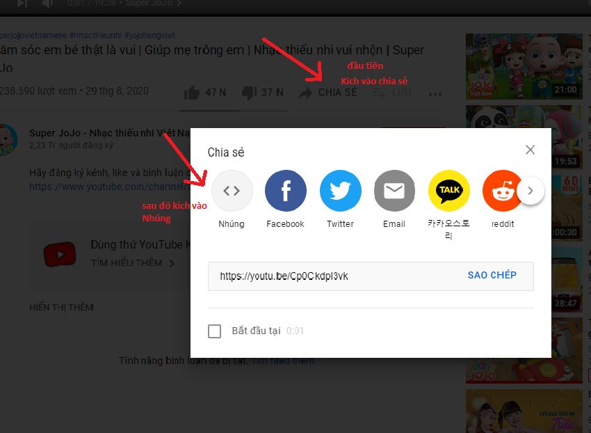

## HTML

## HTML Basic

**_Một vài thẻ Meta Cơ Bản_**

```html
<meta charset="UTF-8" />
<!-- Thẻ mã hóa ký tự cho phép viết hoa ...-->
<!-- To display a HTML page correct, a web must know the character be set to used in the page, specified in meta tag-->

<meta http-equiv="X-UA-Compatible" content="IE=edge" />

<meta http-equiv="refresh" content="" />
<!-- time in attribute "content" -->
<!-- provide content security-policy, content type default, refreshpage, corresponding 1, 2, 3 -->

<meta name="keywords" content="HTML, CSS, JavaScript" />
<!-- Define keywords for search engines -->

<meta name="description" content="this is introduce about web page" />
<!-- introduce about your web page -->

<meta name="author" content="John Doe" />
<!-- introduce author for your web page -->

<meta name="viewport" content="width=device-width, initial-scale=1.0" />
<!-- set the viewport to make your web look good in all devices-->
```

Đây là một số thẻ **Meta** thông dụng. Và mô tả theo ý kiến cá nhân tìm hiểu.

**_Một vài thẻ Thông dụng_**

## 1. Một số thẻ text

```html
<h1>
  This's h1, And tag heading have total 6 tags. from 1 to 6 Corresponding 6
  level from hight to low
</h1>
<p>this's tag paragraph</p>
```

```html
<pre>
  My Bonnie lies            over the ocean.

  My Bonnie lies over the sea.

  My Bonnie lies            over the ocean.

  Oh, bring back my Bonnie to me.
</pre>
```

`Kết quả đầu ra: `

<pre>
  My Bonnie lies            over the ocean.

  My Bonnie lies over the sea.

  My Bonnie lies            over the ocean.

  Oh, bring back my Bonnie to me.
</pre>

Thẻ pre bảo toàn mọi khoảng trắng bên trong thẻ

## 2. Thẻ hình ảnh

```html

<!-- Đây là thẻ hình ảnh, alt là attribute chỉ định văn bản thay thế cho hình ảnh khi ảnh bị lỗi or sai đường dẫn -->
```

## 3. Một Số thẻ định dạng phổ biến:

```html
<p>ví dụ về thẻ b <b>Tag "b" 's used to make text bold </b></p>
```

`Kết quả đầu ra: `

<p>ví dụ về thẻ b <b>Tag "b" 's used to make text bold </b></p>

```html
<p>
  ví dụ về thẻ strong
  <strong
    >Tag "strong" 's used to make text bold and this's text is important
  </strong>
</p>
```

`Kết quả đầu ra: `<p>
ví dụ về thẻ strong
<strong
    >Tag "strong" 's used to make text bold and this's text is important
</strong>

</p>

```html
<p>ví dụ về thẻ i <i>Tag "i" 's used to make text itaclic </i>...</p>
```

`Kết quả đầu ra: `

<p>ví dụ về thẻ i <i>Tag "i" 's used to make text itaclic </i>...</p>

```html
<p>ví dụ về thẻ em<em>"This text is emphasized and same as tag i. "</em></p>
```

`Kết quả đầu ra: ` <p>ví dụ về thẻ em <em> " This text is emphasized and same as tag i. "</em></p>

```html
<p>ví dụ về thẻ small<small> "This is some smaller text."</small></p>
```

`Kết quả đầu ra: `

<p>ví dụ về thẻ small<small> "This is some smaller text."</small></p>

```html
<p>Ví dụ về thẻ mark "this's tag used to <mark>mark</mark> text</p>
```

`Kết quả đầu ra: ` <p>Ví dụ về thẻ mark "this's tag used to <mark>mark</mark> text</p>

```html
<p>
  Ví dụ về thẻ del "this's tag used to <del>strike a line through </del> deleted
  text.
</p>
```

`Kết quả đầu ra: `

<p>
  Ví dụ về thẻ del "this's tag used to <del>strike a line through </del> deleted
  text.
</p>

```html
<p>Ví dụ về thẻ ins <ins>underline inserted text</ins>.</p>
```

`Kết quả đầu ra: `

<p>>Ví dụ về thẻ ins <ins>underline inserted text</ins>.</p>

```html
<p>Ví dụ về thẻ sub <sub>tag sub</sub>.</p>
```

`Kết quả đầu ra: ` <p>Ví dụ về thẻ sub <sub>tag sub</sub>.</p>

```html
<p>Ví dụ về thẻ sup <sup>tag sup</sup></p>
```

`Kết quả đầu ra: ` <p>Ví dụ về thẻ sup <sup>tag sup</sup></p>

## 4. Một số thẻ trích dẫn:

```html
<article>
  <p>Here is a quote from WWF's website:</p>
  <blockquote cite="http://www.worldwildlife.org/who/index.html">
    For 50 years, WWF has been protecting the future of nature. The world's
    leading conservation organization, WWF works in 100 countries and is
    supported by 1.2 million members in the United States and close to 5 million
    globally.
  </blockquote>
  <p>
    thẻ blockquote là thẻ trích dẫn với attribute cite là nguồn gốc trích dẫn
  </p>
</article>
```

`Kết quả đầu ra:`

<article>
  <p>Here is a quote from WWF's website:</p>
  <blockquote cite="http://www.worldwildlife.org/who/index.html">
    For 50 years, WWF has been protecting the future of nature. The world's
    leading conservation organization, WWF works in 100 countries and is
    supported by 1.2 million members in the United States and close to 5 million
    globally.
  </blockquote>
  <p>thẻ blockquote là thẻ trích dẫn với attribute cite là nguồn gốc trích dẫn</p>
</article>

## 5. Thẻ link

```html
<a href="https://www.google.com/" title="link to google"> Google Link</a>
```

`Kết quả đầu ra: `<a href="https://www.google.com/" title="link to google"> Google Link</a>

## 6. Thẻ liệt kê danh sách

```html
<ol type="i">
  <li>item 1 in order list</li>
  <li>item 2 in order list</li>
  <li>item 3 in order list</li>
  <li>item 4 in order list</li>
  <!-- order theo stt -->
</ol>
<ol type="A">
  <li>item 1 in order list</li>
  <li>item 2 in order list</li>
  <li>item 3 in order list</li>
  <li>item 4 in order list</li>
  <!-- order theo alpha -->
</ol>
<!-- tag ol là thẻ liệt kê các list item theo thứ tự được đánh dấu bởi type -->

<ul type="square">
  <li>item 1 in order list</li>
  <li>item 2 in order list</li>
  <li>item 3 in order list</li>
  <li>item 4 in order list</li>
</ul>
<!-- An unordered HTML list: -->
<!-- tag ul là thẻ liệt kê các list item theo thứ tự được đánh dấu bởi type -->
```

`Tương ứng với đầu ra:`

<ol type="i">
  <li>item 1 in order list</li>
  <li>item 2 in order list</li>
  <li>item 3 in order list</li>
  <li>item 4 in order list</li>
</ol>
<ol type="A">
  <li>item 1 in order list</li>
  <li>item 2 in order list</li>
  <li>item 3 in order list</li>
  <li>item 4 in order list</li>
</ol>
<ul type="square">
  <li>item 1 in order list</li>
  <li>item 2 in order list</li>
  <li>item 3 in order list</li>
  <li>item 4 in order list</li>
</ul>

```html
<dl>
  <dt>Coffee</dt>
  <!-- defined term <dt>-->
  <dd>- black hot drink</dd>
  <!-- describles for term <dt>-->
  <dt>Milk</dt>
  <dd>- white cold drink</dd>
</dl>
<!-- tag dl cũng là thẻ liệt kê các list item ( dt )  -->
```

`Kết quả đầu ra:`

<dl>
  <dt>Coffee</dt>
    <dd>- black hot</dd>
  <dt>Milk</dt>
    <dd>- white cold</dd>
</dl>

## 7. Thẻ Table

```html
<table>
  <caption>
    caption: this's table
  </caption>
  <thead>
    <th>title 1</th>
    <th>title 2</th>
    <th>title 3</th>
  </thead>
  <tbody>
    <tr>
      <td>content of title 1</td>
      <td>content of title 2</td>
      <td>content of title 2</td>
    </tr>
    <tr>
      <td>content of title 1</td>
      <td>content of title 2</td>
      <td>content of title 2</td>
    </tr>
  </tbody>
</table>
```

`Đâu ra kết quả:` <table >

<caption>caption: this's table</caption>
<thead>
<th>title 1</th>
<th>title 2</th>
<th>title 3</th>
</thead>
<tbody>
<tr>
<td>content of title 1</td>
<td>content of title 2</td>
<td>content of title 2</td>
</tr>
<tr>
<td>content of title 1</td>
<td>content of title 2</td>
<td>content of title 2</td>
</tr>
</tbody>
</table>

## 8. Thẻ Table

**1. Thẻ image**

```html

```

`Kết quả đầu ra: `


Các định dạng hình ảnh có thể được dùng là: `APNG, GIF, ICO, JPEG, PNG, SVG`

**2. thẻ image có sử dụng thuộc tính usemap:**

```html

<map name="mymap">
  <area
    shape="rect"
    coords="34,44,270,350"
    alt="Computer"
    href="https://www.google.com/"
/></map>
```

`Kết quả đầu ra:`

<map name="mymap">
<area
    shape="rect"
    coords="50,50,150,150"
    alt="Computer"
    href="https://www.google.com/"
/></map>

**3. Thẻ picture:**

```html
<picture>
  <source
    media="(min-width: 650px)"
    srcset="
      https://kinhnghiemquy.com/upload/img/2020/01/14/ca_betta_2_1578970632441.jpg
    "
  />
  <source
    media="(min-width: 465px)"
    srcset="https://baokhuyennong.com/wp-content/uploads/2020/11/ca-xiem-1.jpg"
  />
  
</picture>
```

`Kết quả đầu ra:`
<picture>

  <source media="(min-width: 650px)" srcset="https://kinhnghiemquy.com/upload/img/2020/01/14/ca_betta_2_1578970632441.jpg">
  <source media="(min-width: 465px)" srcset="https://baokhuyennong.com/wp-content/uploads/2020/11/ca-xiem-1.jpg">
  
</picture>

- Element `picture` có thể chứa nhiều nhiều emls `<scource>` và mỗi elm `<source>` đó link tới những hình ảnh khác nhau thông qua srcset ="url".
- Trình duyệt sẽ tự động chọn hình ảnh với chế độ xem hoặc thiết bị hiện tại
- Mỗi emls `<scource>` có thuộc tính `media` để xác định break point để thay đổi hình ảnh cho phù hợp
- Ngoài ra Một số trình duyệt hoặc thiết bị có thể không hỗ trợ tất cả các định dạng hình ảnh. Ta sử dụng `<picture>` để Trình duyệt sẽ sử dụng định dạng hình ảnh mà nó nhận dạng được và bỏ qua tất cả những elms còn lại

## 9. Thẻ Form

```html
<form action="/action_page.php" target="_blank" method="GET">
  <fieldset>
    <legend>Form:</legend>
    <label for="cars">Choose a car:</label>
    <select name="cars" id="cars">
      <optgroup label="Swedish Cars">
        <option value="volvo">Volvo</option>
        <option value="saab">Saab</option>
      </optgroup>
      <optgroup label="German Cars">
        <option value="mercedes">Mercedes</option>
        <option value="audi">Audi</option>
      </optgroup>
    </select>
    <!-- 
        select defines a drop-down list:
        - size attribute to specify amount item visible in menu dropdown
        - beside, tag select have "multiple" attribute to choose more than one value
        <option> element defines an option can be selected.
        if <option> don't have attri selected. default, first item in drop down is selected
     -->
    <br /><br />
    <label for="email">Enter your email:</label>
    <input type="email" id="email" name="email" placeholder="abc@gmail.com" />
    <br /><br />
    <label for="colorpicker">pick your color</label>
    <input type="color" id="colorpicker" name="colorpicker" />
    <br />
    <br />
    <input
      list="browsers"
      name="browser"
      id="browser"
      placeholder="this datalist"
    />
    <datalist id="browsers">
      <option value="Edge"></option>
      <option value="Firefox"></option>
      <option value="Chrome"></option>
      <option value="Opera"></option>
      <option value="Safari"></option>
    </datalist>

    <br />
    <br />
    <textarea name="areaMessage"></textarea>
    <!-- 
        textarea have some difference attributes such as: name, rows, cols
        rows specifies the visible number of lines in textarea
        cols specifies the visible width of a areatext
     -->
    <br /><br />
    <input
      type="number"
      id="quantity"
      name="quantity"
      min="1"
      max="10"
      placeholder="số lượng"
      style=" width: 100px"
    />
    <br /><br />
    <input
      type="text"
      name="example"
      readonly
      value="this's field only to Read not edit"
    />
    <br /><br />
    <input
      type="text"
      name="example"
      placeholder="this input type text"
      size="20"
      autofocus
    />
    <!-- size attribute specifies visible width, in charaters, của 1 input field default size = 20
        maxlength attribute specifies amount max charaters allow in an input field.
        autofocus attribute specified cursor will always focus field which have a attribute autofocus
    -->
    <br /><br />
    <input id="myNumber" name="myNumber" type="number" step="2" min="1.2" />
    <!-- step là attribute có giá trị là number mà khi tăng hoặc giảm ứng với value đó được thêm hoặc trừ đi -->
    <br /><br />
    <input type="submit" value="Submit" class="btn" />
    <input type="reset" value="reset" />
    <!-- input type button will make form data reset all input back value default -->
  </fieldset>
</form>
<!-- form có các atributes như
    - action: chỉ định nơi mà form data gửi tới when 1 form được submit
    - autocomplete: Chỉ ra rằng liệu 1 form có autocomplete trước đó hay k ( value của attri này là on or of) tức là
    kích double vào từng trường sẽ thấy có những phần hoàn thành trước đã đc lưu vào cookies
    - enctype: là thuộc tính chỉ ra cách mà form nên được mã hóa khi submit nó đến server. ( thuộc tính này chỉ được dùng nếu có method ="post" )
    - accept-charset: Chỉ định ra mã hóa ký tự cho form submit ("thường thì value là utf-8")
    - name: chỉ định ra name của form
    - novalidate: chỉ định ra form có nên được validated khi submit k?
    - target: chỉ định nơi hiển thị phản hồi sau khi submit form 
-->
```

`Kết quả đầu ra:`


## 10. Thẻ Iframe

```html
<iframe width="100%" height="400" src="https://www.24h.com.vn/"> </iframe>
```

`Kết quả đầu ra: `


## 11. Các thẻ Media

**1. Tag Video**

```html
<video
  controls
  width="320"
  height="240"
  poster="https://encrypted-tbn0.gstatic.com/images?q=tbn:ANd9GcTM10M_ATxpyciNv0HZ40i5XyZBBjQex4Ef2q7a180Z6Blz-pCTXZGjFjvsoin2iwcAD8U&usqp=CAU"
>
  <source src="https://www.youtube.com/watch?v=AGV-2RHDeZI" type="video/mp4" />
</video>
<!-- Besides, this tag video contain some attribute such as: "loop , autoplay, controls, muted, preload, 
    Chrome browsers do not allow autoplay in most cases. However, muted autoplay is always allowed.
-->
```

`Kết quả đầu ra: `


**2. Tag Audio**

```html
<audio width="320" height="240" controls>
  <source src="./../redcp.mp4" type="video/mp4" />
</audio>
```

`Kết quả đầu ra: `


**3. Phát Video dễ dàng hơn với Youtube**

- Việc convert các định dạng video có thể gặp khó khăn và tốn thời gian
- Một phương pháp dễ dàng hơn là sử dụng Youtube để phát video trên trang web của mình.
  `Các Bước Để Phát 1 Video Youtube`
  1. Tạo tài khoản trên Youtube và upload video lên youtube.
  2. Sử dụng 1 cặp thẻ `<iframe>` trong web của bạn.

```html
<iframe src="https://www.youtube.com/embed/ (id của video)"> </iframe>
```

3. Trong thuộc tính src trỏ đến URL ( mà bạn đã chia sẻ )
   

Bằng cách trên ta có thể tạo ra trình phát video tương tự thay vì sử dụng tags `<video>`

**Tuy nhiên sẽ có một số vấn đề phát sinh**
Ta không thể sử sử dụng một số attribute của `<Video>` Như **loop, autoplay, controlsmuted, preload ...** trong thẻ mở của `<Iframe>` mà ta phải sử dụng các attribute này trong trong attribute `src` của Tag mở `<Iframe>`

Ví dụ: `src = https://www.youtube.com/embed/(id của video)?autoplay=1&mute=1`

Điều này có nghĩa là video của bạn sẽ được phát tự động (Nhưng bị im lặng). Nhưng sẽ gây sự khó chịu cho người sử dụng khi tự động phát. Theo suy nghĩ cá nhân thì không cần tham số `autoplay=1` vào mà chỉ cần `mute=2` thày vì `mute=1`. Và ta sẽ được đường dẫn như sau

Ví dụ: `src = https://www.youtube.com/embed/(id của video)?mute=2`

Thì khi trình duyệt khởi động thì người dùng chỉ cần click vào video để phát video đồng thời sẽ có âm thanh

**`YouTube Loop`**

- Nếu không thêm giá trị loop vào attribute `src` trong thẻ `<iframe>` thì giá trị mặt định của `loop=0` tức là video sau khi kết thúc thì k thể phát lại và ngược lại nếu muốn phát lại video thì ta cho `loop=1` thì video sẽ phát đi phát lại mãi khi video kết thúc.
- Nếu ta muốn phát lại video thì phải thêm vào `src` như sau:

  src = https://www.youtube.com/embed/**(id của video)**?**playlist**= **(id của video)\*\*&loop=1

  ***

  Ta cũng có thể kết hợp với thuộc tính `autoplay` và `mute` và `controls` bằng dấu `&` đăng sau **url** tùy mục đích sử dụng

## 12. Các thẻ có nghĩa Và các thẻ không có nghĩa: ( semantic & non-semantic)

- Thành phần có nghĩa là thành phần mô tả ý nghĩa rõ ràng của nó đối với trình duyệt và người phát triển.

Nói theo quan điểm cá nhân thì thành phần có nghĩa là cách đặt tên cho mỗi tag ứng với **vai trò và nội dung** bên trong cặp tag nó chứa.

```html
Ví dụ:
<form></form>
,
<table></table>
,
<article></article>
,
<header></header>
,
<nav></nav>
,
<footer></footer>
,
<section></section>
,...
```

Trong mỗi thẻ trên ta có thể hiểu phần nào nội dung mỗi thẻ đó chứa.

Ví dụ 1 ý nghĩa 1 số thẻ:

```html
<form></form>
<!-- Chứa nội dung biểu mẫu dữ liệu -->
<header></header>
<!--  1 els đại diện cho 1 vùng chứa nội dung giới thiệu or sắp xếp các link điều hướng -->
<nav></nav>
<!-- thành phần định nghĩa sắp xếp các link điều hướng. -->
<section></section>
<!-- Định nghĩa 1 phần nào đó của tài liệu -->
<details>
  <summary></summary>
  <small> </small>
</details>
<!-- Xác định tiêu đề cho elm details  -->
<figure></figure>
<!-- thẻ chỉ định nội dung độc lập, như đồ họa, sơ đồ, ảnh -->
<figcaption></figcaption>
<!-- Thẻ định nghĩa 1 Chú thích cho 1 thành phần <figure> -->
```

- Thành phần vô nghĩa là thành phần k mô tả ý nghĩa rõ ràng của nó: Ví dụ như `<div>` và `<span>`

## 13. Thành phần đồ họa:

- tag svg là từ viết tắc của scalable vector graphic ( vector đồ họa mở rộng ). SVG định nghĩa đồ họa dựa trên vectơ ở định dạng XML. nó được dùng để định dạng đồ họa cho web. Nó có 1 số methods cho việc vẽ là paths, boxes, circles, text, and graphic images

- canvas là thành phần được dùng để vẽ đồ họa.Nó là vùng chứa cho đồ họa. Nó có 1 số methods cho việc vẽ paths, boxes, circles, text, and adding images.
