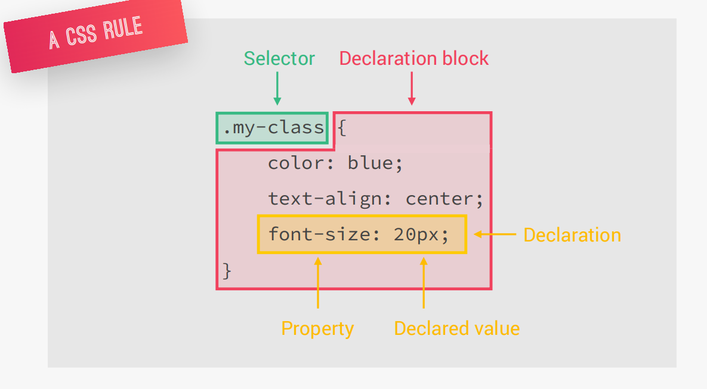

# HTML

## HTML là gì ?

HTML (viết tắt của từ Hypertext Markup Language, hay là "Ngôn ngữ Đánh dấu Siêu văn bản") là một ngôn ngữ đánh dấu được thiết kế ra để tạo nên các website. Cùng với CSS và JavaScript, HTML là một trong những ngôn ngữ quan trọng trong lĩnh vực thiết kế website.

1. [Form](./note-html/Form.md)
2. [Table](./note-html/Table.md)
3. [List](./note-html/List.md)
4. [Media](./note-html/Media.md)
5. [SVG](./note-html/SVG.md)
6. [Basic](./note-html/Basic.md)

# CSS

## CSS là gì?

CSS (Cascading Style Sheet) là ngôn ngữ tạo phong cách cho trang web. Nó dùng để tạo phong cách và định kiểu cho những yếu tố được viết dưới dạng ngôn ngữ đánh dấu, như là HTML. Nó có thể điều khiển định dạng của nhiều trang web cùng lúc để tiết kiệm công sức cho người viết web. Nó phân biệt cách hiển thị của trang web với nội dung chính của trang bằng cách điều khiển bố cục, màu sắc, và font chữ.

1. [CSS-Specificity](./note-css/CSS-Specificity.md)
2. [CSS-Selector](./note-css/CSS-Selector.md)
3. [Pseudo-Class](./note-css/Pseudo-Class.md)
4. [Pseudo-Element](./note-css/Pseudo-Element.md)
5. [CSS-BoxModel](./note-css/CSS-BoxModel.md)
6. [CSS-Display](./note-css/CSS-Display.md)
7. [CSS-Position](./note-css/CSS-Position.md)
8. [CSS-FlexBox](./note-css/CSS-FlexBox.md)
9. [CSS-Grid](./note-css/CSS-Grid.md)
10. [CSS-Float](./note-css/CSS-Float.md)
11. [CSS-Animation](./note-css/CSS-Animation.md)

# Git

[Git](./git.md)

# Layout1: https://training.vfftech.com/baonqa/layout1/
