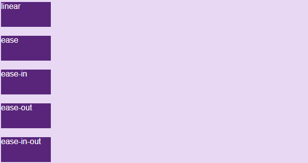

# CSS-Animations
- Animation được giới thiệu trong phiên bản CSS3, cho phép tạo hiệu ứng chuyển động mà không cần sử dụng đến Javascript.
- Animation được hiểu là hiệu ứng chuyển động, sử dụng để tạo hiệu ứng di chuyển cho các phần tử và được ứng dụng khá nhiều trong các website hiện nay.
- Để tạo một chuyển động Animation, bạn cần phải có các keyframe. Mỗi keyframe sẽ được chạy ở một thời điểm xác định và trong keyframe đó nó quy định việc phần tử sẽ di chuyển ra sao.
- Cú pháp:
```css
@keyframes Name { 
  /*code*/
}
```
- `Name`: tên của animation.
- `code`: Các đoạn code quy định tiến trình chuyển động. Có 2 dạng:
+ Sử dụng `phần trăm` từ 0% đến 100%.
+ `from...to`: thiết lập giá trị từ khởi đầu (from - tương đương với 0%) đến kết thúc (to - tương đương với 100%).

- Các thuộc tính:
+ `animation-name`: xác định phần tử sẽ thực thi animation nào.
+ `animation-duration`:  là khoảng thời gian diễn ra hiệu ứng. Nếu phần `animation-duration` không được chỉ định sẽ không xảy ra hiệu ứng vì giá trị mặc định bằng 0s.
+ `animation-timing-function` dùng để xác định tốc độ thay đổi khi hiệu ứng di chuyển. 
    * `ease`: tạo hiệu ứng chuyển đổi khi bắt đầu thì chậm sau đó nhanh dần và gần kết thúc lại chậm dần (giá trị mặc định).
    * `linear`: tạo hiệu ứng chuyển đổi từ lúc bắt đầu với lúc kết thúc tốc độ là như nhau.
    * `ease-in`: tạo hiệu ứng chuyển đổi chậm lúc bắt đầu.
    * `ease-out`: tạo hiệu ứng chuyển đổi chậm lúc kết thúc.
    * `ease-in-out`: tạo hiệu ứng chuyển đổi chậm cả lúc bắt đầu và kết thúc.
    
+ `animation-delay`: xác định khoảng thời gian trì hoãn của animation. Giá trị mặc định 0s.
+ `animation-iteration-count`: sử dụng để thiết lập số lần thực hiện một animation. Giá trị `infinite` làm cho animation lặp lại vô hạn.
+ `animation-direction` sử dụng để xác định chiều chạy của animation. Các gía trị:
    * `normal`: animation di chuyển bình thường tiến về phía trước (mặc định).
    * `reverse`: animation di chuyển theo hướng ngược lại.
    * `alternate`: animation di chuyển tiến về trước, sau đó lui theo hướng ngược lại
    * `alternate-reverse`: animation di chuyển ngược lại trước, rồi đổi chiều tiến về trước.
+ `animation-fill-mode` sử dụng để thay đổi trạng thái của phần tử trước khi bắt đầu sau khi kết thúc Animation.
    * `none`: khi animation không hoạt động thì nó sẽ giữ nguyên trạng thái bất động của phần tử, không thêm một style nào vào thành phần (mặc định).
    * `forwards`: khi animation không hoạt động sau khi kết thúc animation, giá trị này sẽ apply các thuộc tính của lần cuối cùng xuất hiện trong keyframe vào trạng thái của phần tử (phụ thuộc vào animation-direction và animation-iteration-count).
    * `backwards`: khi animation không hoạt động trước khi bắt đầu animation (đang trong thời gian delay), giá trị này sẽ apply các thuộc tính của lần xuất hiện đầu tiên trong keyfame vào trạng thái của phần tử (phụ thuộc vào thuộc tính anmation-direction).
    * `both`: kết hợp cả forwards và backwards cho trạng thái phần tử.
+ `animation-play-state` quy định animation hoạt động hay dừng lại.
    * `running`: chạy (mặc định).
    * `paused`: dừng lại.


