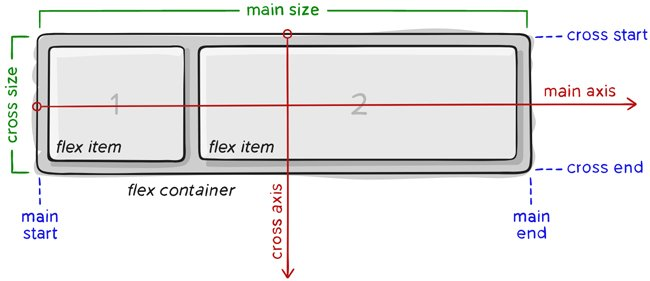

# CSS Flex Box
Flexbox Layout là một kiểu bố cục trang có khả năng tự cân đối kích thước, thay đổi chiều rộng/chiều cao và thứ tự phần tử bên trong để phù hợp với tất cả các loại thiết bị hiển thị và kích thước màn hình.
Sơ đồ cấu trúc Flexbox:


## Các thuộc tính của Flex Container
1. flex-direction
- Thuộc tính `flex-direction` xác định hướng của main-axis để container sắp xếp các item.
- Cú pháp:
```css
.container { 
  flex-direction: row | row-reverse | column | column-reverse; 
}
```
- Các giá trị:
+ `row`: mặc định, flex item được sắp xếp theo chiều ngang, từ trái qua phải (main axis nằm ngang).
+ `row-reverse`: flex item được sắp xếp theo chiều ngang, từ phải qua trái (main axis nằm ngang).
+ `column`: flex item được sắp xếp theo chiều dọc, từ trên xuống dưới (main axis đứng dọc).
+ `column-reverse`: flex item được sắp xếp theo chiều dọc, từ dưới lên trên (main axis đứng dọc).

2. justify-content
- Thuộc tính `justify-content` dùng để điều chỉnh vị trí bắt đầu và căn chỉnh các item bên trong container theo trục main, chiều ngang hoặc chiều dọc tùy thuộc vào `flex-direction`.
- Cú pháp:
```css
.container {
  justify-content: flex-start | flex-end | center | space-between | space-around | space-evenly; 
}
```
Các giá trị:
+ `flex-start`: giá trị mặc định, item sẽ bắt đầu từ lề chính main-start của container.
+ `flex-end`: item sẽ bắt đầu từ lề chính main-end của container (khác với row-reverse là đổi hướng hiển thị).
+ `center`: item sẽ nằm giữa container.
+ `space-between`: các item sẽ có khoảng cách giữa các phần tử bằng nhau do container sẽ tự động căn khoảng cách, item đầu tiên sát lề chứa điểm main-start, item cuối cùng sát lề chứa điểm main-end.
+ `space-around`: tương tự space-between, nhưng khác ở chỗ là mỗi item có khoảng cách 2 bên cạnh và những khoảng cách này bằng nhau.
+ `space-evenly`: các item được phân phối sao cho khoảng cách giữa hai item bất kỳ, giữa item và các lề là gần bằng nhau.

3. align-items
- Thuộc tính `align-items` sử dụng để điều chỉnh vị trí bắt đầu và căn chỉnh các item bên trong container theo trục cross, chiều ngang hoặc chiều dọc tùy thuộc vào `flex-direction`.
- Cú pháp:
```css
.container { 
  align-items: stretch | flex-start | flex-end | center | baseline; 
}
```
- Các giá trị:
+ `stretch`: giá trị mặc định, các phần tử sẽ được kéo dài để lấp đầy container chứa nó, nhưng sẽ ưu tiên giá trị height/width nếu có, khi đó item sẽ không cao full mà chỉ lấy giá trị height/width mà bạn set.
+ `flex-start`: item sẽ bắt đầu từ lề cross-start của container.
+ `flex-end`: item sẽ bắt đầu từ lề cross-end của container.
+ `center`: item sẽ căn giữa theo chiều của cross axis.
+ `baseline`: item được căn chỉnh theo đường cơ sở của chúng. Đường cơ sở là đường mà tất cả các chữ cái sẽ "ngồi lên".

4. flex-wrap
- Thuộc tính `flex-wrap` cho phép item tự động xuống dòng khi kích thước container thay đổi.
- Cú pháp:
```css
.container{ 
  flex-wrap: nowrap | wrap | wrap-reverse; 
}
```
- Các giá trị:
+ `nowrap`: mặc định, tất cả các item sẽ nằm trên một dòng.
+ `wrap`: khi kích thước container thay đổi và tổng chiều rộng các item cộng lại lớn hơn chiều rộng của container thì item sẽ tự động xuống dòng.
+ `wrap-reverse`: tương tự như wrap, nhưng thay vì xuống dòng thì item sẽ tự động nhảy lên trên.

5. align-content
- Thuộc tính `align-content` sử dụng để căn chỉnh khoảng cách các item bên trong container theo dọc theo trục cross axis, chiều ngang hoặc chiều dọc tùy thuộc vào flex-direction.
- Cú pháp:
```css
.container { 
  align-content: flex-start | flex-end | center | space-between | space-around | stretch; 
}
```
+ `stretch`: giá trị mặc định, các phần tử sẽ được kéo dài, căn chỉnh sao cho lấp đầy container chứa nó (vẫn ưu tiên giá trị height/width nếu có).
+ `flex-start`: item sẽ bắt đầu từ lề chứa cross-start của container.
+ `flex-end`: item sẽ bắt đầu từ lề chứa cross-end của container.
+ `center`: item sẽ nằm giữa container căn theo cross-axis.
+ `space-between`: các item sẽ có khoảng cách giữa các phần tử bằng nhau do container tự động căn khoảng cách, item đầu tiên sát lề chứa cross-start, item cuối cùng sát lề chứa cross-end.
+ `space-around`: tương tự space-between, nhưng khác ở chỗ là mỗi item có khoảng cách 2 bên cạnh và những khoảng cách này bằng nhau.
+ `space-evenly`: các item được phân phối sao cho khoảng cách giữa hai item bất kỳ, giữa item và các lề là gần bằng nhau.

## Các thuộc tính của Flex Item
1. Order
- Theo mặc định, các item sẽ hiển thị theo thứ tự xuất hiện trong HTML, nhưng với thuộc tính `order`, bạn có thể sắp xếp lại vị trí sắp xếp của các item.
- Cú pháp:
```css
.item { 
  order: <integer>; /* mặc định là 0 */ 
}
```
2. flex-grow
- Thuộc tính `flex-grow` cho phép các phần tử giãn theo độ rộng của container. `flex-grow: 0` là giá trị mặc định.
- Cú pháp:
```css
.item {
  flex-grow: <number>; /* mặc định là 0 */ 
}
```

3. flex-shrink
- Thuộc tính `flex-shrink` ngược lại với thuộc tính `flex-grow` ở trên, nó không giãn ra mà lại co lại khi chúng ta thay đổi độ rộng của container. `flex-shrink: 1;` là giá trị mặc định.
- Cú pháp:
```css
.item { 
  flex-shrink: <number>; /* mặc định là 1 */ 
}
```
- Nếu `flex-shrink: 0` thì item sẽ không co giãn mà lấy nguyên giá trị của thuộc tính width/height.
4. flex-basis
- Thuộc tính flex-basis sử dụng để xác định độ dài ban đầu của một item.
- Cú pháp:
.item { 
  flex-basis: <length> | auto; /* mặc định là auto */ 
}
5. align-self
- Thuộc tính `align-self` có tác dụng tương tự như `align-items` của phần container nhưng sử dụng riêng cho từng item.
- Cú pháp:
```css
.item { 
  align-self: flex-start | flex-end | center | baseline | stretch; 
}
```

