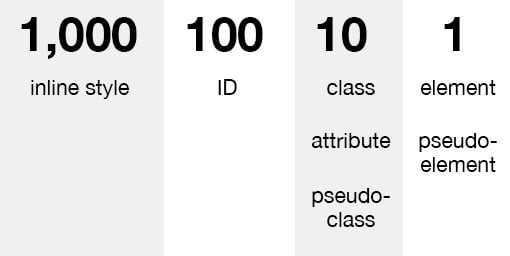

# CSS Specificity

- Nếu có 2 hay nhiều CSS rule cùng nhắm vào một phần tử thì khi đó trình duyệt sẽ chỉ tuân theo một nguyên tắc, xem trong list CSS rule đâu là quy tắc cao nhất để chọn ra và apply vào phần tử.

- Ở đây chúng ta sẽ có bảng xếp hạng cho CSS rule để trình duyệt tuân theo khi áp dụng CSS, được sắp xếp theo thứ tự ưu tiên từ trên xuống dưới:

    + Inline style: thiết lập các thuộc tính CSS trực tiếp bên trong một phần tử.
    ```html
    <h1 style="color: #ffffff;">
    ```
    + ID: thiết lập các thuộc tính CSS cho một phần tử được định danh duy nhất trong một trang.
    ```
    #menu, #header
    ```
    + Class, attribute, pseudo-class: 
    ```
    .menu, .header..., attribute như a[target] và pseudo-class như :hover, :focus...
    ```
    + Element, pseudo-element
    ```
    h1, h2, div, p... và pseudo-element như là ::before, ::after, ::selection.
    ```
- Cách tính Specificity
    Tính toán giá trị của CSS Specificity để biết được rule nào được áp dụng vào phần tử, giúp chúng ta không bị mắc lỗi khi viết CSS.

    

    Specificity được tính là những con số nguyên dương. Cụ thể như sau:

    + Inline style là 1000.
    + ID là 100.
    + Class, attribute, pseudo-class là 10.
    + Element, pseudo-element là 1.
    ```html
    A: h1{color: blue"}
    B: #content h1{color: red"}
    C: <div id="content"><h1 style="color: green">Heading</h1></div>
    ```
    + A bằng 1 (một element là h1).
    + B bằng 101 (một ID là content, là một element là h1).
    + C bằng 1000 (inline style).
    + => Quy tắc (C) có độ ưu tiên cao nhất, nên màu của h1 là màu green.
- `Nếu có các Specificity bằng nhau, quy tắc viết sau cùng sẽ được áp dụng.`
```html
<!DOCTYPE html>
<html>
    <head>
        <style>
            h1 {
                color: red;
            }

            h1 {
                color: purple;
            }
        </style>
    </head>
    <body>
        <h1>Website Quản Trị Mạng - Heading 1</h1> <!-- color purple -->
    </body>
</html>
```
## ! important
- `!important` sẽ ghi đè tất cả các quy tắc tạo kiểu trước đó cho thuộc tính cụ thể trên phần tử đó!
```html
<!DOCTYPE html>
<html>
    <head>
        <style>
            h1 {
            color: red !important;
            }
        </style>
    </head>
    <body>
        <h1 style="color: blue;">Website Quản Trị Mạng - Heading 1</h1>  <!-- color red -->
    </body>
</html>
```
    


