# CSS3
## Background
   - `background-color` (màu nền)
      - a valid color name - like "red"
         ```css
         body {
            background-color: red;
            opacity: 0.3; /* độ mờ */
         }
         ```
      - a HEX value - like "#ff0000"
         ```css
         div {
            background-color: #ff0000;
         }
         ```
      - an RGB value - like "rgb(255,0,0)"
         ```css
         div {
            background: rgba(0, 128, 0, 0.3) /* nền màu xanh với 30% opacity */
            }
         ```
         + rgba(red, green, blue, alpha)
            + alpha độ mờ từ 0 - 1 (nó như là opacity tỉ lệ 0%-100%)
   - `background-image`
      ```css
         body {
         background-image: url("paper.gif");
         }
      ```
   - `background-repeat` (lặp lại)
      ```css
         body {
            background-image: url("gradient_bg.png");
            background-repeat: repeat-x; /* trục ngang */
            background-repeat: repeat-y;  /*trục dọc*/
            background-repeat: no-repeat; /*không lặp*/
         }
      ```
   - `background-attachment` (hình nền đứng hoặc chạy so với phần còn lại của trang)
      ```css
         body {
         background-image: url("img_tree.png");
         background-repeat: no-repeat;
         background-position: right top;
         background-attachment: fixed; /* kéo thanh trang thì ảnh nó cố định bên góc ko mất ảnh*/
      }
      ```
      + Demo: [attachment](https://www.w3schools.com/css/tryit.asp?filename=trycss_background-image_attachment)
   - `background-position` (tài sản được sử dụng để xác định vị trí của các hình nền)
      ```css
         body {
            background-image: url("img_tree.png");
            background-repeat: no-repeat;
            background-position: right top; /*góc trên cùng bên phải: */
         }
      ```
   - `background (shorthand property)` (thuộc tính tốc ký "gộp code 1 dòng có tất cả thuôc tính")
      ```css
         body {
            background: #ffffff url("img_tree.png") no-repeat right top;
            /* màu - địa chỉ- ko lặp - nằm trên góc phải */
         }
      ```
   - `CSS background-clip` (tài sản cách xa nền)
      ```css
         div {
            border: 10px dotted black;
            padding: 15px;
            background: lightblue;
            background-clip: border-box|padding-box|content-box|initial|inherit;
            /*nằm mép trong background - nằm mép ngoài background - nằm sát cái bộ khung nội dung - đặt giá trị này thành giá trị mặc định*/
         }
      ```
      + Demo: [clip](https://www.w3schools.com/cssref/tryit.asp?filename=trycss3_background-clip)
   - `background-origin ` (xử lí vị trí xử lí hình nền)
      ```css
         <style>
            #example1 {
            border: 10px dashed black;
            padding: 25px;
            background: url(paper.gif);
            background-repeat: no-repeat;
            background-origin: padding-box|border-box|content-box|initial|inherit;
            /*Hình nền đều bắt đầu góc trái trên cùng 
            -pad:nằm góc trong đường viền
            -bor: nằm góc ngoài của đường viền
            -cont: nằm góc trái của nội dung */
         }
         </style>
         <body>
            <div id="example1">
            <h2>Hello World</h2>
            <p>Pharagrap</p>
            </div>
         <body>
      ```
       + Demo: [origin](https://www.w3schools.com/cssref/tryit.asp?filename=trycss3_background-origin)
   - `CSS background-size` (kích thước nền)
      ```css
         div {
         background-image:url('w3css.gif');
         background-repeat:no-repeat;
         background-size:auto|length=px|percentage=%|cover|contain|initial|inherit|;
         }
      ```
      + `auto`: kích thước mặc định của nó
      + `length` và `percentage`: chiều rộng và cao của nó nếu đặt 1 thì còn lại tự động
      + `cover`: Thay đổi kích thước hình nền để bao phủ toàn bộ vùng chứa (bể ảnh).
      + `contain`: Thay đổi kích thước hình nền để đảm bảo hình ảnh hiển thị đầy đủ(không bể)
## Overflow 
   - Overflow (Phần tràn)
      ```css
      div {
         width: 200px;
         height: 50px;
         background-color: #eee;
         overflow: visible|hidden|scroll |auto|;
      }
      ```
      + visible- Mặc định. Phần tràn không được cắt bớt. Nội dung hiển thị bên ngoài hộp của phần tử
      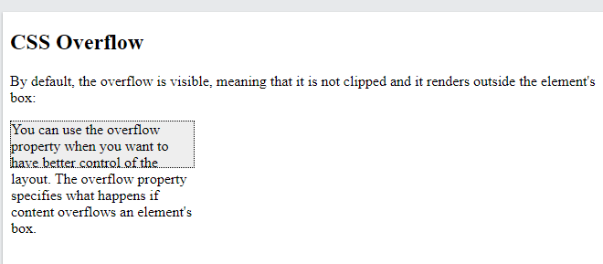
      + hidden - Phần tràn bị cắt bớt và phần còn lại của nội dung sẽ không hiển thị
      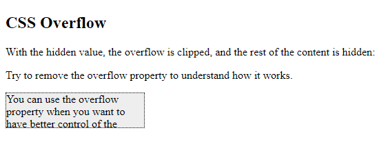
      + scroll - Phần tràn được cắt bớt và một thanh cuộn được thêm vào để xem phần còn lại của nội dung
      
      + auto- Tương tự như scroll, nhưng nó chỉ thêm thanh cuộn khi cần thiết
      + `overflow-x` và `overflow-y`
         ```css
         div {
            background-color: #eee;
            width: 200px;
            height: 50px;
            border: 1px dotted black;
            overflow-x: hidden;/*làm việc trái/phải*/
            overflow-y: scroll;/*làm việc trên/dưới*/
         }
         ```
## Display Flex 
- Hiển thị một phần tử dưới dạng vùng chứa linh hoạt cấp khối
- Chiếm 100% chiều rộng ( còn có `display: block`, `display: table`)
- Flex 
      ```css
      #main div {
      -ms-flex: 1; /* IE 10 dùng để hổ tr */ 
      flex: 1; /*flex-grow
               flex-shrink
               flex-basis */
      }
      ```
   + `flex-grow`
   * Khối chia theo: Phần tử lớn = Số lần * 1 phần của phần tử nhỏ nhất (Một số chỉ định mục sẽ tăng bao nhiêu so với phần còn lại của các mục linh hoạt)
      ```html
      <head>
         <style>
      #main {
         width: 350px;
         height: 100px;
         border: 1px solid #c3c3c3;
         display: flex;
      }
      #main div:nth-of-type(1) {flex-grow: 5;}
      #main div:nth-of-type(2) {flex-grow: 1;}
      </style>
      </head>
      <body>
         <div id="main">
            <div style="background-color:red;
            "></div>
            <div style="background-color:blue;"></div>
         </div>
      </body>
      ```
   + `flex-shrink`
      ```html
      <style> 
      #main {
         width: 100%;
         height: 100px;
         border: 1px solid #c3c3c3;
         display: flex;
      }
      #main div {
         flex-grow: 1;/* độ tăng lên khi kéo */
         flex-shrink: 1;/* độ giảm khi kéo thả*/
         flex-basis: 100px; /*giá trị min 100px*/
      }
      #main div:nth-of-type(2) /*vị trí backgroud mình cần xử lí*/ {
         flex-shrink:2;/*tỉ lệ với flex trên div*/
      }
      </style>
      </head>
      <body>
      <div id="main">
         <div style="background-color:coral;"></div>
         <div style="background-color:lightblue;"></div>
         <div style="background-color:khaki;"></div>
      </div>
      </body>
      ```
   + `flex-basis`
      + Để cố định độ px của background 
      + Hoạt động khi không có sự co dản `flex-grow: 0 -flex-shrink 0;`
      ```html
      <style>
      #main {
      width: 300px;
      height: 100px;
         border: 1px solid #c3c3c3;
         display: flex;
      }
      #main div {
         flex-grow: 0;
         flex-shrink: 0;
         flex-basis: 50px;
      }
      #main div:nth-of-type(2) {
         flex-basis: 110px;
      }
      </style>
      </head>
      <body>
      <div id="main">
         <div style="background-color:coral;">50px</div>
         <div style="background-color:lightblue;">100px</div>
      </div>
      ```
   + `flex-flow`
      ```css
         div {
         display: flex;
         flex-flow: flex-direction flex-wrap|initial|inherit;
         }
      ```
      - `flex-wrap`
         ```css
         div{
            display: flex;   
            flex-wrap: nowrap|wrap|wrap-reverse|initial|inherit;
         }
         ```
         + nowrap : Các hoạt động linh hoạt sẽ không được bọc
         + wrap : Các hoạt động linh hoạt sẽ được bọc lại nếu cần
         + wrap-reverse: Các hoạt động linh hoạt sẽ được bọc lại, nếu cần, ngược lại thứ tự.
         + Demo: [flow](https://www.w3schools.com/cssref/playit.asp?filename=playcss_flex-flow)
      - `flex-direction` (Định hướng các mặt)
      ```css
         div {
            display: flex;
         flex-direction: row|row-reverse|column|column-reverse|initial|inherit;
         }
         ```
         + row: hàng ngang gắn góc trái trên
         + row-reverse: hàng ngang gắn góc phải trên
         + column: hàng dọc góc trái trên
         + column-reverse: hàng dọc góc trái dưới
         + initial: kế thừa thuộc tính mẹ 
         + Demo: [flex](https://www.w3schools.com/cssref/playit.asp?filename=playcss_flex-direction&preval=row)
   * _Note: Internet Explorer 10 and earlier versions do not support the property._
- Grid
## Animations
- CSS cho phép tạo hoạt ảnh cho các phần tử HTML mà không cần sử dụng JavaScript hoặc Flash!
- Thuộc tính:
   - `@keyframes` (hoạt ảnh sẽ dần thay đổi từ kiểu hiện tại -> kiểu mới trong time quy định)
      ```css 
      <style> 
      div {
         width: 100px;
         height: 100px;
         background-color: red;
         position: relative;
         animation-name: example;
         animation-duration: 4s;
         animation-iteration-count: 3;
      }
      @keyframes example {
      0%   {background-color:red; left:0px; top:0px;}
      25%  {background-color:yellow; left:200px; top:0px;}
      50%  {background-color:blue; left:200px; top:200px;}
      75%  {background-color:green; left:0px; top:200px;}
      100% {background-color:red; left:0px; top:0px;}
      }
      </style>
      <body>
      <div></div>
      </body>
      ```
      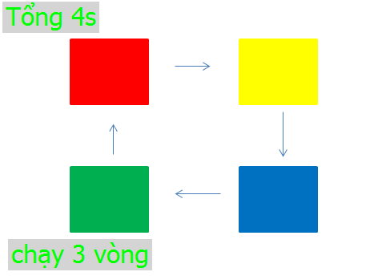
   + `animation-name` ( gọi đến tên animation cần xử lí)
      ```css
      animation-name: keyframename|none;
      ```
      + keyframename: Chỉ định tên của khung hình chính mà bạn muốn liên kết với bộ chọn
      + none: Chỉ định rằng sẽ không có hoạt ảnh
   + `animation-duration` ( Xác định thời gian hoạt động tổng mặc định 0s)
      ```css
         animation-duration: time;
      ```
   +   (Thời gian trì hoản thực hiện hoạt động)
   + `animation-iteration-count` (Quy định số lần chạy n)
      + infinite (vô hạn)
   + `animation-direction` ( Quy định hoạt ảnh đi theo kiểu nào)
      + normal- mặc định như thường
      + reverse - đi hướng ngược lại
      + alternate - sau khi chạy đủ 1 vòng lệnh frames thì nó chạy ngược lại
      + alternate-reverse - xuất phát tại điểm cuối rồi chạy ngược lại vòng đầu
   + `animation-timing-function` (quy định đường cong tốc độ ảnh)
      ```css
         <style> 
         div {
            width: 100px;
            height: 50px;
            background-color: red;
            font-weight: bold;
            position: relative;
            animation: mymove 5s infinite;
         }
         #div1 {animation-timing-function: linear;}
         #div2 {animation-timing-function: ease;}
         #div3 {animation-timing-function: ease-in;}
         #div4 {animation-timing-function: ease-out;}
         #div5 {animation-timing-function: ease-in-out;}
         @keyframes mymove {
            from {left: 0px;}
            to {left: 300px;}
         }
         </style>
         <body>
            <div id="div1">linear</div>
            <div id="div2">ease</div>
            <div id="div3">ease-in</div>
            <div id="div4">ease-out</div>
            <div id="div5">ease-in-out</div>
         </body>
      ```
      + ease - chậm nhanh chậm
      + linear - cùng 1 tốc độ từ đầu -> cuối
      + ease-in - khởi động chậm
      + ease-out - kết thúc chậm
      + ease-in-out - khởi động và kết thúc chậm
      + cubic-bezier(n,n,n,n) - cho phép chon giá trị ( 0 < n < 1 )
   + `animation-fill-mode`
      + none - Giá trị mặc định
      + forwards - Phần tử sẽ giữ lại các giá trị kiểu được đặt bởi khung hình chính cuối cùng 
      + backwards - Phần tử sẽ nhận các giá trị kiểu được đặt bởi khung hình chính đầu tiên và giữ lại giá trị này trong khoảng thời gian trễ hoạt ảnh
      + both - Hoạt ảnh sẽ tuân theo các quy tắc cho cả tiến và lùi, mở rộng các thuộc tính hoạt ảnh theo cả hai hướng /*??*/
   + `animation` (Code 1 dòng chung )
      ```css
         div {
         animation: example 5s linear 2s infinite alternate;
      /*animation- |name|duration|timing-function|delay|iteration-count|direction */
         }  
      ```
   + `animation-play-state`
      ```css
      div {
         animation-play-state:paused|running|initial|inherit;
         /* chỉ định dựng bất kì lúc nào / chỉ định chạy lại khi dừng bất kì */
      }
      ```
      + Demo: [play-state](https://www.w3schools.com/cssref/playit.asp?filename=playcss_animation-play-state&preval=paused)
## Position
   - static: Các phần tử HTML được định vị tĩnh theo mặc định.
   - relative: Được định vị so với vị trí bình thường của nó.
       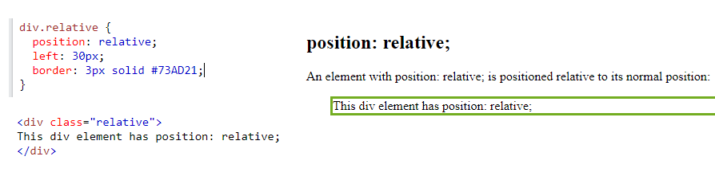
   - fixed: được định vị so với chế độ xem nằm mặc định trên chế độ xem bất kì vị trí nào
       
   - absolute 
      + Được định vị tương đối với tổ tiên được định vị gần nhất
      + Nếu một phần tử được định vị tuyệt đối không có tổ tiên được định vị, nó sẽ sử dụng phần thân tài liệu và _di chuyển cùng với việc cuộn trang_.
      + Sử dụng top, left, bottom, right để điều chỉnh phần tử.
   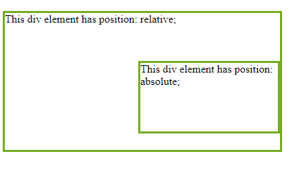
   - sticky: được định vị dựa trên vị trí cuộn của người dùng.
      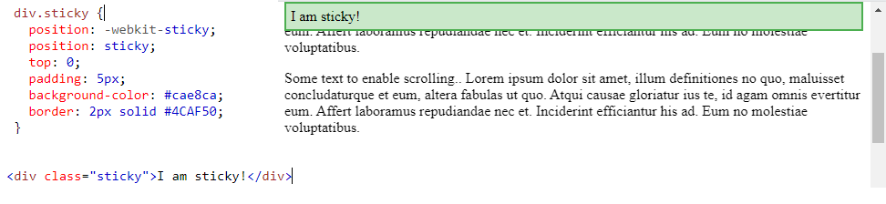
   - z-index: xác định thứ tự chồng của một nguyên tố (trong đó yếu tố nên được đặt ở phía trước, hoặc phía sau, những người khác (-1 = sau).
## Media Queries
   - Cú pháp truy vấn
      ```css
      @media not|only mediatype and (mediafeature and|or|not mediafeature) {
      CSS-Code;
      }
      ```
   + only: chỉ sử dụng cái mình gọi (nếu dùng only thì dùng hết /*thuộc tính mặc định*/)
   + not: áp dụng cho tất cả
   + mediatype: chế độ chọn
      - Có thể có các bảng định kiểu khác nhau cho các phương tiện khác nhau:
      ```css
         <link rel="stylesheet" media="mediatype and|not|only (expressions)" href="print.css">
      ```
      - Phương tiện
         + all: tất cả 
         + print: dùng cho máy in
         + screen: dùng cho màn hình máy tính, máy tính bảng, điện thoại thông minh, v.v.
         + speech: dùng cho trình đọc màn hình cỡ lớn
   + mediafeature
      + min-width
      + max-width
   - Ex:
      ```css
      <style>
      .wrapper {overflow: auto;}
      #main {margin-left: 4px;}
      #leftsidebar {
         float: none;
         width: auto;
         }
      #menulist {
         margin: 0;
         padding: 0;
      }
      .menuitem {
         background: #CDF0F6;
         border: 1px solid #d4d4d4;
         border-radius: 4px;
         list-style-type: none;
         margin: 4px;
         padding: 2px;
      }
      @media screen and (min-width: 480px) {
      #leftsidebar {width: 200px; float: left;}
      #main {margin-left: 216px;}
      }
      </style>
      ```
      
## Responsive
   - Responsive Web Design (RWD)
      + Thiết kế web đáp ứng giúp trang web của bạn trông đẹp trên tất cả các thiết bị.
      + Thiết kế web đáp ứng chỉ sử dụng HTML và CSS.
      + Thiết kế web đáp ứng không phải là một chương trình hay một JavaScript.
   - Viewport
      - Thêm <meta>phần tử khung nhìn sau trong tất cả các trang web của mình:
         ```html
         <meta name="viewport" content="width=device-width, initial-scale=1.0">
         ```
         + Thẻ <meta> viewport thiết lập cho trang web hiển thị tương ứng với kích thước của từng thiết bị khác nhau.
         + `width=device-width` đặt chiều rộng của trang tuân theo chiều rộng màn hình của thiết bị (sẽ thay đổi tùy theo thiết bị).
         + `initial-scale=1.0` đặt mức thu phóng ban đầu khi trang được tải lần đầu tiên bởi trình duyệt.
      - Quy tắc
         + KHÔNG sử dụng các phần tử có chiều rộng cố định lớn 
         + KHÔNG để nội dung dựa vào chiều rộng khung nhìn cụ thể để hiển thị tốt 
         + Sử dụng các truy vấn phương tiện CSS để áp dụng các kiểu khác nhau cho các màn hình lớn và nhỏ 
      - Thiết kế web theo chế độ lưới giúp ít cho việc xem (Responsive Web Design - `Grid`-View)
      *Lưu ý: Luôn thiết kế cho thiết bị di động đầu tiên
   - Media Query
      - Ex:
         ```css
          /* Extra small devices (phones, 600px and down) */
         @media only screen and (max-width: 600px) {...}
         /* Extra large devices (large laptops and desktops, 1200px and up) */
         @media only screen and (min-width: 1200px) {...}
         ```
      - Orientation: Portrait / Landscape (Định hướng)
         ```css
         <head>
         <meta name="viewport" content="width=device-width, initial-scale=1.0">
         <style>
         body {
            background-color: lightgreen;
         }
         @media only screen and (orientation: landscape) { /* */
         body {
            background-color: lightblue;
            }
         }
         </style>
         </head>
         <body>
            <p>Resize the browser window. When the width of this document is larger than the height, the background color is "lightblue", otherwise it is "lightgreen".</p>
         /body>
         ```
         + portrait: Chế độ xem theo hướng dọc, tức là chiều cao lớn hơn hoặc bằng chiều rộng.
         + landscape: Chế độ xem theo hướng ngang, tức là chiều rộng lớn hơn chiều cao.
         + Demo: [por_land](https://www.w3schools.com/css/tryit.asp?filename=tryresponsive_mediaquery_orientation)
         
      - Hide Elements (Ẩn các phần tử trên các phương tiện khác nhau)
         ```css
         /* If the screen size is 600px wide or less, hide the element */
         @media only screen and (max-width: 600px) {
         div.example {
         display: none;
            }
         }
         ```
         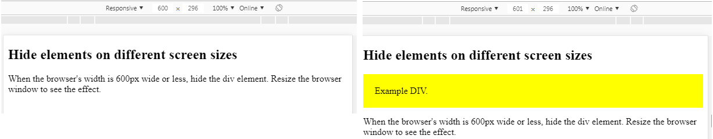
         + Demo: [elenments](https://www.w3schools.com/css/tryit.asp?filename=trycss_mediaqueries_hide)
      - Thay đổi font-size trong khoảng
         ```css
         /* If the screen size is 601px or more, set the font-size of <div> to 80px */
         @media only screen and (min-width: 601px) {
         div.example {
            font-size: 80px;
            }
         }
         /* If the screen size is 600px or less, set the font-size of <div> to 30px */
         @media only screen and (max-width: 600px) {
         div.example {
            font-size: 30px;
            }
         }
         ```
   - RWN - Images (or Videos)
      - Using The width Property ( sử dụng chiều rộng)
         ```css
         img {
            width: 100%;
            height: auto;
         }
         ```
      + Ảnh giản theo khung hình
      - Using max-width (chiều rộng tối đa)
         ```css
         img {
            max-width: 100%;
            height: auto;
         }
         /* Giảm thoải mái nhưng tăng thì đến độ rộng mặc định của ảnh */
         ```
   - RWD - Frameworks
      + Sử dụng CSS Framework miễn phí cung cấp Thiết kế đáp ứng
      ```html
      /* Sử dụng bộ w3.css*/
      <!DOCTYPE html>
      <html>
      <title>W3.CSS</title>
      <meta name="viewport" content="width=device-width, initial-scale=1">
      <link rel="stylesheet" href="https://www.w3schools.com/w3css/4/w3.css">
      <body>
      <div class="w3-container w3-green">
            <h1>W3Schools Demo</h1> 
            <p>Resize this responsive page!</p> 
      </div>
      <div class="w3-row-padding">
         <div class="w3-third">
            <h2>London</h2>
            <p>London is the capital city of England.</p>
            <p>It is the most populous city in the United Kingdom,
            with a metropolitan area of over 13 million inhabitants.</p>
         </div>
      </div>
      </body>
      </html>
      ```
      + Sử dung Bootstrap
   - RWN - Templates (Mẫu có sẵn) : Band Template, Architect Template, Food Blog Template...
## Float
   - Float (Thuộc tính CSS chỉ định cách một phần tử sẽ nổi.)
      ```css
         <!DOCTYPE html>
      <html>
      <head>
      <style>
         img {
            float: right; 
         }
      </style>
      </head>
      <body>
         <p>
         Lorem ipsum dolor sit amet, consectetur adipiscing elit</p>
      </body>
      </html>
      ```
      
      + left - Phần tử nổi ở bên trái vùng chứa của nó
      + right - Phần tử nổi ở bên phải vùng chứa của nó
      + none- Phần tử không trôi nổi (sẽ được hiển thị ngay tại nơi nó xuất hiện trong văn bản). Đây là mặc định
      + inherit - Phần tử kế thừa giá trị float của phần tử cha của nó
   - Clear (Thuộc tính CSS chỉ định những phần tử nào có thể trôi nổi bên cạnh phần tử đã xóa và ở phía nào)
      + Quy định cụ thể sở hữu những yếu tố nào có thể nổi bên cạnh các yếu tố xóa và về phía nào.
      ```css
      <head>
      <style>
      .div1 {
         float: left;
         width: 100px;
         height: 50px;
         margin: 10px;
         border: 3px solid #73AD21;
      }
      .div2 {
         border: 1px solid red;
      }
      .div3 {
         float: left;
         width: 100px;
         height: 50px;
         margin: 10px;
         border: 3px solid #73AD21;
      }
      .div4 {
         border: 1px solid red;
         clear: left; /* Cách phổ biến nhất để sử dụng clear là sau khi đã sử dụng thuộc float.*/
      }
      </style>
      </head>
      <body>
         <h2>Without clear</h2>
         <div class="div1">div1</div>
         <div class="div2">div2 - Lưu ý rằng div2 đứng sau div1 trong mã HTML. Tuy nhiên, vì div1 trôi về bên trái nên văn bản trong div2 sẽ chảy xung quanh div1.
         </div>
         <br><br>
         <h2>With clear</h2>
         <div class="div3">div3</div>
         <div class="div4">div4 - Ở đây, clear: left; di chuyển div4 xuống bên dưới div3 nổi. Giá trị "left" xóa các phần tử được chuyển sang bên trái. Bạn cũng có thể xóa "right" and "both"</div>
      </body>
      ```
      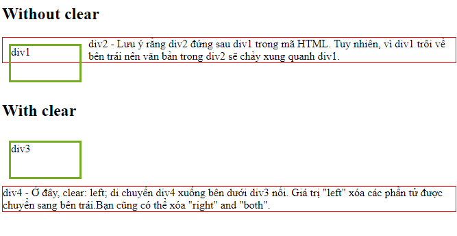
      + none - Cho phép các phần tử nổi trên cả hai mặt. Đây là mặc định
      + left - Không cho phép phần tử nổi ở phía bên trái
      + phải- Không cho phép các phần tử nổi ở phía bên phải
      + both - Không cho phép phần tử nổi ở bên trái hoặc bên phải
      + inherit - Phần tử kế thừa giá trị rõ ràng của phần tử gốc của nó
   - Clearfix Hack
      ```css
      <head>
      <style>
      div {
         border: 3px solid #4CAF50;
         padding: 5px;
      }
      .clearfix {
         overflow: auto; /*chống tràn*/
      }
      .img2 {
         float: right;
      }
      </style>
      </head>
      <body>
      <div class="clearfix">
         
         Lorem ipsum dolor sit amet, consectetur adipiscing elit. Phasellus imperdiet, nulla et dictum interdum...
      </div>
      </body>       
      ```
      
   - Lưới hộp và hộp (có chiều rộng bằng nhau)
      ```css
      .box {
         float: left;
         width: 33.33%;
         padding: 50px;
      }
      ```
      
   - Height Boxes (Đặt chiều cao cố định)
      ```css
      .box {
         float: left;
         width: 50%;
         padding: 50px;
         height: 300px; /*đặt nó mặc đinh*/
      }
      ```
      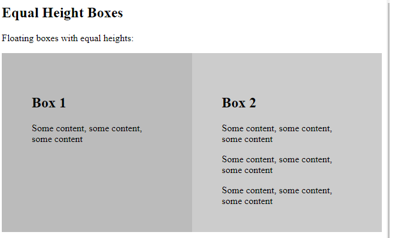
      + Đặt cố định không đảm bảo khi nội dung thêm nhiều
      + khắc phục
      ```css
      .flex-container {
         display: flex;
         flex-wrap: nowrap; /* Sử dụng  Flexbox */
         background-color: DodgerBlue;
      }
      ```
      
   - `box-sizing` Xác định cách tính chiều rộng và chiều cao của một phần tử
      ```css 
         box-sizing: content-box|border-box;
      ```
      + content-box: Thuộc tính chiều rộng && cao chỉ bao gồm nội dung. Đường viền và phần đệm _không được bao gồm_
      + border-box: Thuộc tính chiều rộng && cao bao gồm nội dung, _phần đệm và đường viền_
      + Khác biệt
      
   * Note: Chức năng điều hướng. Sử dụng float với danh sách các siêu liên kết để tạo menu ngang
   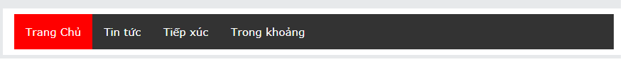
## PX-EM conventer   
   - PX to EM Converter
   + Đặt kích thước phông chữ mặc định (thường là 16px)
   + Chuyển đổi giá trị pixel thành em, dựa trên kích thước mặc định or chuyển đổi giá trị em thành pixel, dựa trên kích thước mặc định
   ```css
      px	em	percent
      5px	0.3125em	31.25%
      .     .        .
      15px	0.9375em	93.75%
      16px	1.0000em	100.00%
      17px	1.0625em	106.25%
      .     .        .
      25px	1.5625em	156.25%
   ```
   + Sự khác biệt giữa PX, EM và %.
      + Pixel là phép đo tĩnh, trong khi phần trăm và EM là phép đo tương đối. 
      + Phần trăm phụ thuộc vào kích thước phông chữ mẹ của nó. 
      + EM là liên quan đến kích thước phông chữ hiện tại của phần tử 
         + EX: 2em = 2 lần kích thước của phông chữ hiện tại. Kích thước phông chữ của body là 16 pixel, thì 150% sẽ là 24 pixel (1,5 * 16) 
         ```css
            <head>
            <style>
            h1 {
               font-size: 1em;
               color: red;
            }
            p {
               font-size: 16px;
               line-height: 50px;
               color: red;
            }
            </style>
            </head>
            <body>
            <h1>This is heading 1</h1>
            <h2>This is heading 2</h2>
            <p>This is a paragraph.</p>
         </body>
         ```
         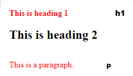
## Units
   - Units (Đơn vị)
      + Nhiều thuộc tính CSS có giá trị "length", chẳng hạn như width, margin, padding, font-sizevv
      + Có hai loại đơn vị độ dài: 
         - Tuyệt đối (Các đơn vị độ dài tuyệt đối là cố định và độ dài được biểu thị bằng bất kỳ đơn vị nào trong số này sẽ xuất hiện chính xác như kích thước đó.)
            ```css
            <head>
               <style>
               h1 {
                  font-size: 60px|5cm|4mm|
                  3in|2pt|1pc;
               }
               p {
                  font-size: 25px;
                  line-height: 50px;
               }
               </style>
               </head>
               <body>
               <h1>This is heading 1</h1>
               <h2>This is heading 2</h2>
               <p>This is a paragraph.</p>
               <p>This is another paragraph.</p>
               </body>
            ```
            + cm:	centimeters
            + mm:	millimeters
            + in:	inches (1in = 96px = 2.54cm)
            + px:	pixels (1px = 1/96th of 1in)
            + pt:	points (1pt = 1/72 of 1in)
            + pc:	picas (1pc = 12 pt)
         - Tương đối (Chỉ định độ dài liên quan đến một thuộc tính độ dài khác)
            + em	Liên quan đến kích thước phông chữ của phần tử (2em: gấp 2 lần kích thước phông chữ hiện tại)
               ```css
               <head>
               <style>
               p {
                  font-size: 16px;
                  line-height: 2em;
               }
               div {
                  font-size: 30px;
                  border: 1px solid black;
               }
               span {
                  font-size: 0.5em; /*0.5 em = 30/2*/
               }
               </style>
               </head>
               <body>
               <p>Các đoạn văn này có line-height: 2x16px = 32px.</p>
               <div>Kích thước phông chữ của phần tử div được đặt thành 30px. <span>Phần tử span bên trong phần tử div có kích thước phông chữ là 0,5em, tương đương với 0,5x30 = 15px.</span> . </div>
               </body>
               ```
               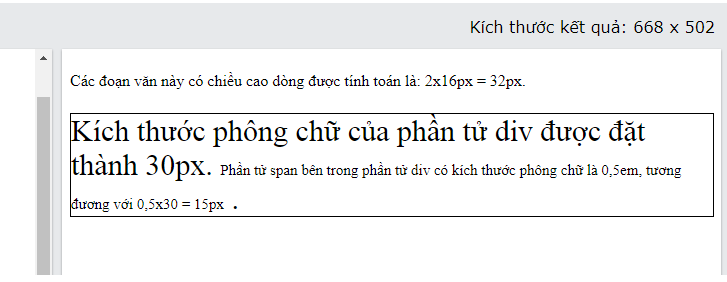
            + ex	(Liên quan đến chiều cao x của phông chữ hiện tại - Hiếm sử dụng)
            + ch (Tương đối với chiều rộng của "0")
            + rem	(Liên quan đến kích thước phông chữ của phần tử gốc)
               ```html
                  <head>
                  <style>
                  html {
                     font-size:16px;
                  }
                  div {
                     font-size: 3rem; /* = 48px*/
                     border: 1px solid black;
                  }
                  #top-div {
                     font-size: 2rem; /* = 32px*/
                     border: 1px solid red;
                  }
                  </style>
                  </head>
                  <body>
                  <p>The font-size of this document is 16px.</p>
                  <div id="top-div"> 
                     Kích thước phông chữ của phần tử div này là 2rem, có nghĩa là 2 x kích thước phông chữ của trình duyệt.
                     <div> Kích thước phông chữ của phần tử div này là 3rem. Nó cũng cho thấy rằng nó không kế thừa từ kích thước phông chữ phần tử mẹ của nó.
                     </div>
                  </div>
                  <p>Đơn vị rem đặt kích thước phông chữ so với kích thước phông chữ cơ sở của trình duyệt và sẽ không kế thừa từ cha mẹ của nó.</p>
                  </body>
               ```
               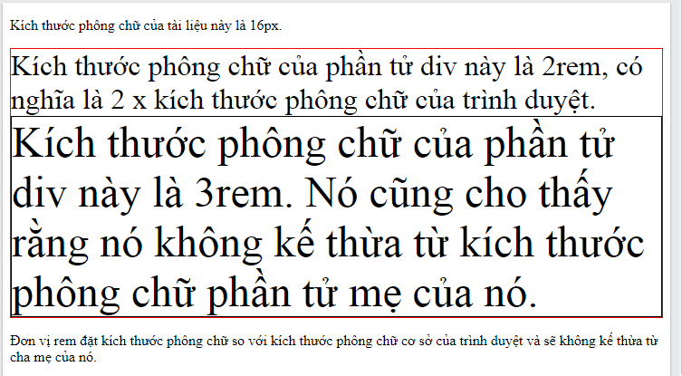
            + vw (Tương đối với 1% chiều rộng của khung nhìn)   
               ```html
                  <head>
                  <style>
                     h1 {
                     font-size: 20vw;
                     }
                  </style>
                  </head>
                  <body>
                  <h1>Hello</h1>
                  <p>Thay đổi kích thước chiều rộng của cửa sổ trình duyệt để xem kích thước phông chữ của h1 thay đổi như thế nào.                  </p>
                  <p>1vw = 1% chiều rộng khung nhìn.</p> 
                  <p>Đơn vị vw không được hỗ trợ trong IE8 trở về trước.</p>
               ```
               + Kéo theo chiều rộng cỡ chữ giãn ra theo 1% chiều rộng
            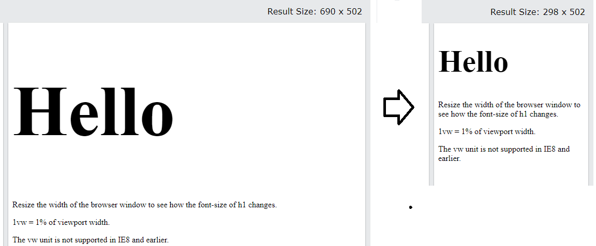
            + vh (Tương đối với 1% chiều cao của khung nhìn giống vw)
            + vmin	
               - Thay đổi kích thước cửa sổ trình duyệt (cả chiều rộng và chiều cao)
               - 1vmin = 1vw hoặc 1vh, tùy theo giá trị nào nhỏ hơn.
            + vmax
               - Thay đổi kích thước cửa sổ trình duyệt (cả chiều rộng và chiều cao)
               - 1vmax = 1vw hoặc 1vh, tùy theo giá trị nào lớn hơn.
               - Đơn vị vmax không được hỗ trợ trong Edge 15 trở về trước, cũng như trong Safari 6.1 trở về trước.
            + %	
               ```html
                  <head>
                  <style>
                  body {
                     font-size:10px;
                  }
                  div {
                     font-size: 150%;  /* 150%= 1.5x10= 15px*/
                     border: 1px solid black;
                  }
                  </style>
                  </head>
                  <body>
                     <p>Kích thước phông chữ của tài liệu này là 10px.. </p>
                     <div>Kích thước phông chữ của phần tử div này là 150%. </div>
                     <p>Đơn vị% đặt kích thước phông chữ so với kích thước phông chữ hiện tại.</p>
                  </body>                 
               ```
            + Sự khác biệt giữa em và rem
               - rem: là đơn vị tham chiếu tỷ lệ so với phần tử gốc của website ở đây là thẻ `<html>` dựa vào giá trị của thuộc tính font-size
               - em: là đơn vị tham chiếu tỷ lệ so với phần tử cha trực tiếp chứa nó hoặc chính nó dựa vào giá trị của thuộc tính là font-size
               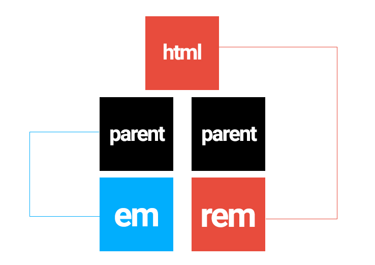
## Transions
- Chuyển tiếp CSS cho phép bạn thay đổi các giá trị thuộc tính một cách trơn tru, trong một khoảng thời gian nhất định.
   + transition
      ```html
      <head>
      <style> 
      div {
         width: 100px;
         height: 100px;
         background: red;
         transition: width 2s; /* thuộc tính CSS && thời gian của hiệu ứng (mặc định 0)*/
      }
      div:hover {
         width: 300px;
      }
      </style>
      </head>
      <body>
      <h1>The transition Property</h1>
      <p>Hover over the div element below, to see the transition effect:</p>
      <div></div>
      <p><b>Note:</b> This example does not work in Internet Explorer 9 and earlierversions.</p>
      </body>
      ```
   + Có thể thêm hiệu ứng chuyển tiếp
      ```css
      div {
         transition: width 2s, height 4s;
      }
      ```
   + transition-delay (Thời gian trì hoản)
      ```css
         transition-delay: time;
      ```
   + transition-duration (Xác định thời gian hoạt động tổng mặc định 0s)
      ```css
         transition-duration: time;
      ```
   + transition-property (thuộc tính CSS hiệu ứng chuyển tiếp )
      ```css
         transition-property: none|all|property|initial|inherit;
      ```
      + none: Không có thuộc tính nào sẽ có hiệu ứng chuyển tiếp
      + all: Giá trị mặc định. Tất cả các thuộc tính sẽ có hiệu ứng chuyển tiếp
      + property: Xác định danh sách các tên thuộc tính CSS được phân tách bằng dấu phẩy mà hiệu ứng chuyển tiếp dành cho (width, height)
   + transition-timing-function
      + Quy định các đường cong tốc độ của hiệu ứng chuyển tiếp.
         ```css
         transition-timing-function: linear|ease|ease-in|ease-out|ease-in-out|step-start|step-end|steps(int,start|end)|cubic-bezier(n,n,n,n)|initial|inherit;
         ```
         + linear: Hiệu ứng chuyển tiếp với cùng tốc độ từ đầu đến cuối (<=> với bậc ba (0,0,1,1))
         + ease: Giá trị mặc định. (chậm -> nhanh-> chậm (<=>(0,25,0.1,0.25,1))
         + ease-in: Khởi động chậm (<=> (0,42,0,1 ,1))
         + ease-out: Kết thúc chậm (<=> (0,0 ,0.58,1))
         + ease-in-out: Đầu và cuối chậm (<=> (0,42,0,0.58,1))
         + step-start: <=> (1,start)
         + step-end: <=> (1,end)
         + cubic-bezier(n,n,n,n): CHọn giá trị của riêng trong khối-bezier. (0<n<1)
   + Demo: [transition](https://www.w3schools.com/css/tryit.asp?filename=trycss3_transition4)
## !important
- Giải quyết declarations xung đột
   - Các declarations có thể đến từ nhiều nguồn khác nhau:
      +  Author: Các CSS mà dev viết.
      +  User: CSS mà người dùng thay đổi (như người dùng thay đổi font-size của trình duyệt -> declaration cho font size)
      +  Browser: CSS mà trình duyệt định nghĩa sẵn (như thẻ a thì được in chữ màu xanh, có gạch chân)
   - Khi mỗi source đều có CSS khác nhau cho 1 elemnt, browser sẽ chọn CSS theo quy tắc(rule)
      ```css
      Important > Specificity > Source Order
      ```
   - 1. Important ( phần tử mạnh nhất ghi đè tất cả các quy tắc tạo kiểu trước đó)
      - Việc lạm dụng `!important` sẽ gây khó khăn cho việc bảo trì.
      - Khi các rule có cùng mức độ quan trọng (importance), browser sẽ đi so sánh mức độ chi tiết (specificities).
         ```css
         h1{
            color: red!important;
            }
         ```
   - 2. Specificity
      - Inline styles: (thiết lập các thuộc tính CSS trực tiếp bên trong một phần tử bằng thuộc tính style)
         ```css
         <h1 style="color: red"></h1>
         ```
      - ID (thiết lập các thuộc tính CSS cho một phần tử được định danh duy nhất trong một trang.)
         ```css
            #nav, #header
         ```
      - Classes, pseudo-classes, attributes: 
         + `.menu, .header,... , attribute`( a[target] )
         + pseudo-class ( `:hover`, `:focus`...)
      - Elements, pseudo-elements
         + Elements ( h1, h2, div, p...) 
         + `pseudo-element` ( ::before, ::after, ::selection)
      * Khi có nhiều rule cùng áp dụng cho 1 slide, browser sẽ tính toán 4 giá trị trên và đem ra so sánh, sau đó chọn rule nào có giá trị cao nhất để đem ra hiển thị.
      * Inline luôn có độ ưu tiên cao hơn style được viết trong file.
   - 3. Source order
      - Khi các css declaration có cùng specificity, declarations cuối cùng trong code sẽ được chọn.
      - Nếu phải dùng css của bên thứ 3, bạn cần lưu ý để đặt author stylesheet cuối cùng.

