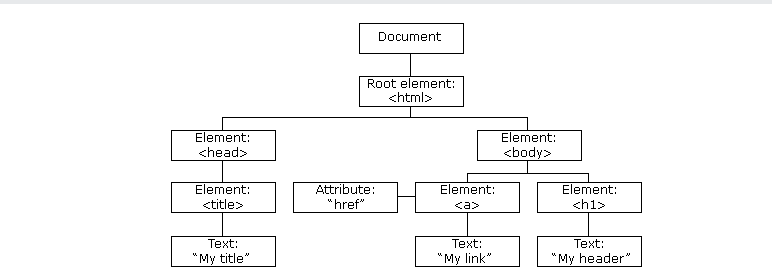

# JavaScript 
## DOM (Document Object Model)  
- 
    - HTML DOM là một mô hình đối tượng tiêu chuẩn và giao diện lập trình cho HTML
    - Sự phân cấp và các thuộc tính của thẻ HTML này ta gọi là selector và trong DOM sẽ có nhiệm vụ xử lý các vấn đề như đổi thuộc tính của thẻ, đổi cấu trúc HTML của thẻ,..
    - DOM document: có nhiệm vụ lưu trữ toàn bộ các thành phần trong tài liệu của website4
    - DOM element: có nhiệm vụ truy xuất tới thẻ HTML nào đó thông qua các thuộc tính như tên class, id, name của thẻ HTML
    - DOM 
        - Finding HTML Elements (tìm kiếm phần tử): 
            + `document.getElementById(id)`
                ```javascript
               <p id="intro">Hello World!</p>
               <p id="demo"></p>
               <script>
                  var myElement = document.getElementById("intro");
                  document.getElementById("demo").innerHTML = 
                  "The text from the intro paragraph is "   + myElement.innerHTML;
               </script>
                ```
            + `document.getElementsByTagName(name)`
                ```javascript
               <p>Hello World!</p>
               <p id="demo"></p>
               <script>
                  var x = document.getElementsByTagName("p");
                  document.getElementById("demo").innerHTML = 
                  'The text in first paragraph (index 0) is: '  + x[0].innerHTML;
                  </script>
                ```
            + `document.getElementsByClassName(name)`
                ```javascript
               <p>Hello World!</p>
               <p class="intro">The DOM is very useful.</p>
               <p id="demo"></p>
               <script>
                  var x = document.getElementsByClassName("intro");
                  document.getElementById("demo").innerHTML = 
                  'The first paragraph (index 0) with class="intro": '  + x[0].innerHTML;
               </script>
                ```
            + Tìm các phần tử HTML bằng Bộ chọn CSS `querySelectorAll()`
                ```javascript
               <p class="intro">The DOM is very useful.</p>
               <p class="intro">This example demonstrates the <b>querySelectorAll</b> method.</p>
               <p id="demo"></p>
               <script>
                  var x = document.querySelectorAll("p.intro");
                  document.getElementById("demo").innerHTML = 
                  'The first paragraph (index 0) with class="intro": '  + x[0].innerHTML;
               </script>
                ```
            + Finding HTML Elements by HTML Object Collections (Tìm các phần tử HTML bằng Bộ sưu tập đối tượng HTML)
                ```html
               <form id="frm1" action="/action_page.php">
                  First name: <input type="text" name="fname" value="Donald"><br>
                  Last name: <input type="text" name="lname" value="Duck"><br><br>
                  <input type="submit" value="Submit">
               </form> 
               <p>Click "Try it" to display the value of each element in the form.</p>
               <button onclick="myFunction()">Try it</button>
               <p id="demo"></p>
               <script>
               function myFunction() {
                  var x = document.forms["frm1"];
                  var text = "";
                  var i;
                  for (i = 0; i < x.length ;i   +  +) {
                  text  += x.elements[i].value   + "<br>";
                  }
               document.getElementById("demo").innerHTML = text;
               }
               </script>
                ```
        - Changing HTML Elements (thay đổi phần tử )
            + `element.setAttribute(attribute, value)`
        - Adding and Deleting Elements(thêm và xóa các phần tử)
            + `document.createElement(element)`: Create an HTML element
            + `document.removeChild(element)`: Remove an HTML element
            + `document.appendChild(element)`: Add an HTML element
            + `document.replaceChild(new, old)`: Replace an HTML element
            + `document.write(text)`: Write into the HTML output stream
        - Adding Events Handlers (Thêm trình xử lí sự kiện)
            + `document.getElementById(id).onclick = function(){code}`
    - DOM HTML: có nhiệm vụ thay đổi giá trị nội dung và giá trị thuộc tính của các thẻ HTML
        + Thay đổi luồng đầu ra
        ```js
         <script>
         document.write(Date());
         </script>
        ```
        + Thay đổi nội dung (thẻ p)
        ```js
         <p id="p1">Hello World!</p>

         <script>
         document.getElementById("p1").innerHTML = "New text!";
         </script>
         <p>The paragraph above was changed by a script.</p>
        ```
        + Thay đổi giá trị (`smiley.gif`) bị chuyển thành (`landscape.jpg"`)
        ```js
         

         <script>
            document.getElementById("image").src = "landscape.jpg";
         </script>

         <p>The original image was smiley.gif, but the script changed it to landscape.jpg</p>
        ```
   - DOM CSS: có nhiệm vụ thay đổi các định dạng CSS của thẻ HTML
        + Thay đổi kiểu
        ```js
         <p id="p1">Hello World!</p>
         <p id="p2">Hello World!</p>

         <script>
         document.getElementById("p2").style.color = "blue";
         document.getElementById("p2").style.fontFamily = "Arial";
         document.getElementById("p2").style.fontSize = "larger";
         </script>
        ```
        + Thay đổi trình sự kiện (click vào thì h1 đổi màu)
        ```js
         <h1 id="id1">My Heading 1</h1>

         <button type="button" 
         onclick="document.getElementById('id1').style.color = 'red'">
         Click Me!</button>
        ```
   - DOM Event: có nhiệm vụ gán các sự kiện như `onclick()`, `onload()` vào các thẻ HTML
        + Phản ứng sự kiện
        ```js
         <h1 onclick="this.innerHTML = 'Ooops!'">Click on this text!</h1>
        ```
        + Event Attributes
        ```js
         <p>Click the button to display the date.</p>
         <button onclick="displayDate()">The time is?</button>
         <script>
         function displayDate() {
          document.getElementById("demo").innerHTML = Date();
            }
         </script>
         <p id="demo"></p>
        ```
        + Assign Events
        ```js
         <p>Click "Try it" to execute the displayDate() function.</p>
         <button id="myBtn">Try it</button>
         <p id="demo"></p>
         <script>
         document.getElementById("myBtn").onclick = displayDate;
         function displayDate() {
         document.getElementById("demo").innerHTML = Date();
         }
         </script>
        ```
        + The onload and onunload Events
        ```js
         <body onload="checkCookies()">
         <p id="demo"></p>
         <script>
         function checkCookies() {
         var text = "";
            if (navigator.cookieEnabled == true) {
               text = "Cookies are enabled.";
               } else {
                  text = "Cookies are not enabled.";
               }
         document.getElementById("demo").innerHTML = text;
         }
         </script>
        ```
        + Sự kiện trao đổi (Khi bạn rời khỏi trường nhập, một hàm được kích hoạt để chuyển văn bản đầu vào thành chữ hoa.s)
        ```js
         <head>
         <script>
         function myFunction() {
         var x = document.getElementById("fname");
         x.value = x.value.toUpperCase();
         }
         </script>
         </head>
         <body>
         Enter your name: <input type="text" id="fname" onchange="myFunction()">
         <p>When you leave the input field, a function is triggered which transforms the input text to upper case.</p>
        ```
        + `onmouseover` (xuất hiện) and `onmouseout` (rê chuột hiện sau) 
        ```js
         <div onmouseover="mOver(this)" onmouseout="mOut(this)" 
         style="background-color:#D94A38;width:120px;height:20px;padding:40px;">
         Mouse Over Me</div>

         <script>
         function mOver(obj) {
             obj.innerHTML = "Thank You"
         }
         function mOut(obj) {
            obj.innerHTML = "Mouse Over Me"
         }
        ```
   - DOM Listener: có nhiệm vụ lắng nghe các sự kiện tác động lên thẻ HTML đó
        + `addEventListener()` method
            + Phương pháp gắn một event handler cho một yếu tố mà không ghi đè lên xử lý sự kiện hiện có.
            + Thêm nhiều sự kiên vào dễ dàng
            + Thêm trình xử lý sự kiện vào bất kỳ đối tượng DOM nào không chỉ các phần tử HTML (tức là đối tượng cửa sổ)
            + Khi sử dụng `addEventListener()`, JavaScript được tách biệt khỏi đánh dấu HTML
            + Loại bỏ sự kiện `removeEventListener()`
            + Syntax (cú pháp)
                + `element.addEventListener(event, function, useCapture);`
   - DOM Navigation dùng để quản lý, thao tác với các thẻ HTML, thể hiện mối - quan hệ cha - con của các thẻ HTML

   - DOM Node, Nodelist: có nhiệm vụ thao tác với HTML thông qua đối tượng (Object)
   - Tạo kiểu cho phần tử 
        + Phần tử _container_ phải được tạo với `style = " position: relative"`.
        + Phần tử _animation_ phải được tạo với `style = " position: absolute"`.
## ECMAScript 2015 - ES6
- let : Cho phép khai báo một biến với phạm vi khối.
    ```js
    <body>
    <h2>Declaring a Variable Using let</h2>
    <p id="demo"></p>
    <script>
    var  x = 10;
    // Here x is 10
    {  
    let x = 2;
    // Here x is 2
    }
    // Here x is 10
    document.getElementById("demo").innerHTML = x; /* x = 10 */
    </script>
    </body>
    ```
    + Demo: [let](https://www.w3schools.com/js/tryit.asp?filename=tryjs_es6_let)
- const: 
    + Khai báo một hằng số (một biến với giá trị không đổi).
    + Hằng tương tự như biến let, ngoại trừ giá trị không thể thay đổi.
    + Không phải hằng số thực (Nó KHÔNG xác định một giá trị không đổi. Nó xác định một tham chiếu không đổi đến một giá trị).
        ```js
        <body>
        <h2>Declaring a Variable Using const</h2>
        <p id="demo"></p>
        <script>
        var  x = 10;
        // Here x is 10
        {  
        const x = 2;
        // Here x is 2
        }
        // Here x is 10
        document.getElementById("demo").innerHTML = x; /* x = 10*/
        </script>
        </body>
        ```
        + Demo: [const](https://www.w3schools.com/js/tryit.asp?filename=tryjs_es6_const)
        + ví dụ: 
            + Khai báo 
            ```js
                let||var a = 1;
                a = 100;
                consolog.log(a);/*100*/ 
                /*nhưng khai báo const */
                const a = 1;
                a = 100; /* ko thể gán lại lần 2*/
                consolog.log(a);/*báo lỗi*/ 
            ```
- Template literals
    ```js
        const biena = 'lap trinh';
        const bienb = `hoc ${biena}`; /* sử dụng dấu huyền*/
        console.log(bienb); /* hoc lap trinh */
    ```
    + Multi-line String
    ```js
        const lines= `line 1
        line 2              
        line 3`;/* binh thương se viet line 1\n + line 2\n + ... */
    console.log(lines);
    ```
- Arrow Functions
    + Hàm mũi tên cho phép viết một cú pháp ngắn gọn để viết biểu thức hàm.
    + Lược bỏ functiont, return từ khóa và dấu ngoặc nhọn.
        ```js
        // ES5
        var x = function(x, y) {
        return x * y;
        }

        // ES6
        const x = (x, y) => x * y;
        ```
    + Nó không có contructor
    + Node: Không hổ trợ IE11 or nhỏ hơn
- The For/Of Loop
    + Lệnh `for/of` lặp qua các giá trị của một đối tượng có thể lặp lại.
    + `for/of` cho phép lặp qua các cấu trúc dữ liệu có thể lặp lại như Arrays, Strings, Maps, NodeLists,..
        ```js
        for (variable of iterable) {
        // khối mã được thực thi
        }
            ```
            + variable: Đối với mỗi lần lặp, giá trị của thuộc tính tiếp theo được gán cho biến. Biến có thể được khai báo với const, let hoặc var.
            + iterable: Một đối tượng có các thuộc tính có thể lặp lại.
        + Looping over an Array ( Vòng qua 1 mảng)
            ```js
        var cars = ["BMW", "Volvo", "Mini"];
        var x;
        for (x of cars) {
        document.write(x    + "<br >");/* BMW
                                       Volvo
                                       Mini */
        }
            ```
            + Demo: [for/of_array](https://www.w3schools.com/js/tryit.asp?filename=tryjs_object_for_of)
        + Looping over a String ( Vòng qua 1 chuỗi)
            ```js
        var txt = "JavaScript";
        var x;
        for (x of txt) {
        document.write(x    + "<br >");/*  J
                                        a
                                        v                                       
                                        .
                                        .   */
        }
        ```
        + Demo: [for/of_string](https://www.w3schools.com/js/tryit.asp?filename=tryjs_object_for_of2)
- JavaScript Classes
    + Sử dụng từ khóa class để tạo một lớp học.
    + Luôn thêm một phương thức có tên constructor()
    + syntax
        ```js
        class ClassName {
        constructor() { ... }
        }
            ```
            + ex:
            ```js
            class Car { /* lớp tên xe */
            constructor(name, year) { /* lớp có hai thuộc tính ban đầu*/
                this.name = name; 
                this.year = year;
            }
        }
        ```
        + Using a Class
        + Ex:
            ```js
            let myCar1 = new Car("Ford", 2014);
            let myCar2 = new Car("Audi", 2019);
            ```
            + Demo: [ojb](https://www.w3schools.com/js/tryit.asp?filename=tryjs_class_init) 
        + JavaScript Promises
            + Promise là một đối tượng JS liên kết "Producing Code" and "Consuming Code".
                + "Producing Code" có thể mất chút thời gian 
                + "Consuming Code" must phải đợi kết quả.
            + Syntax
                ```js
                let myPromise = new Promise(function(myResolve, myReject) {
                // "Producing Code" (Có thể mất một chút thời gian)
                myResolve(); // khi thành công
                myReject();  // khi lỗi
                });
                // "Consuming Code" (Phải đợi 1 Promise được hoàn thành ).
                myPromise.then(
                function(value) { /* code nếu thành công */ },
                function(error) { /* code nếu lỗi*/ }
                );
                ```
                + Demo: [promises](https://www.w3schools.com/js/tryit.asp?filename=tryjs_promise3)
        + The Symbol Type 
            + Biểu tượng JavaScript là một kiểu dữ liệu nguyên thủy giống như Number, String, or Boolean..
            + Nó đại diện cho một mã định danh "ẩn" duy nhất mà không có mã nào khác có thể vô tình truy cập.
                ```js
                const person = {
                firstName: "John",
                lastName: "Doe",
                age: 50,
                eyeColor: "blue"
                };
                let id = Symbol('id');
                person[id] = 140353;
                // Now Person[id] = 140353
                // but person.id is still undefined
                ```
                + Demo: [symbol](https://www.w3schools.com/js/tryit.asp?filename=tryjs_symbol)
        + Default Parameter Values (Giá trị tham số mặc định)
            + ES6 cho phép các tham số hàm có giá trị mặc định.
                ```js
                function myFunction(x, y = 10) { /* giá trị được gán ngay trong luôn*/
                // y is 10 if not passed or undefined
                return x    + y;
                }
                myFunction(5); // will return 15
                ```
                + Demo: [values_default](https://www.w3schools.com/js/tryit.asp?filename=tryjs_es6_default)
        + Function `Rest` Parameter (Rest định nghĩa ra tham số)
            + Tham số còn lại (...) cho phép một hàm coi một số lượng vô hạn đối số là một mảng:
            + Demo: [rest](https://www.w3schools.com/js/tryit.asp?filename=tryjs_rest)
        + Enhanced object literals
            + Định nghĩa key: value cho obj
            ```js
                var name = 'q';
                var price = 1000;
                var course = {
                    name,           /* name: name,*/
                    price          /* price: price*/
                } 
            ```
            + Định nghĩa method cho obj
            ```js
                var name = 'q';
                var price = 1000;
                var course = {
                    name,          
                    price,
                    getName(){              /* getName: function(){ */
                        return name;        /*     return name;     */
                    }                       /* }                    */
                } 
            ```
            + Định nghĩa key cho obj dưới dạng biến
            ```js
                var fieldName = 'name';
                var fieldPrice = 'price';
                const course = {
                    /*thong dung name: 'javascripts*/
                    [fieldName]: 'javascripts'; 
                    [fieldPrice]: 1000
                };
            ```
                + khai báo nhằm mục địch nếu như ta ko lấy giá trị fieldName rồi gán tiếp còn không thì dùng thông dụng
        + Distructuring
        ```js
            var array = ["toi", "di","hoc"];
            var [a, b, c] = array;
        ```
        + `Spread` (Khi truyền đến hàm gọi đối số)
            + Toán tử (... giống rest nhưng khác công dụng)
            ```js
                var ar1 = ['a','b','c'];
                var ar2 = ['c','d','e'];
                var ar3 = [...ar1, ...ar2]; /* bt dung join để nối*/
            ```
            + Dùng để nối hoặc hợp object
            + Truyền tham số cho hàm
- Array.find ()
        + Phương thức trả về giá trị của các phần tử mảng đầu tiên mà đi một chức năng kiểm tra.(giá trị)
        + Demo: [find](https://www.w3schools.com/js/tryit.asp?filename=tryjs_array_find)
        + Lưu ý rằng hàm có 3 đối số:
            + value
            + index
            + array
- Array.findIndex()
        + Phương thức trả về chỉ số của phần tử mảng đầu tiên mà đi một chức năng kiểm tra. (vị trí)
        + Demo: [findIndex](https://www.w3schools.com/js/tryit.asp?filename=tryjs_array_find_index)
- New Math Methods (5 phương thức mới)
    - Math.trunc(): trả về phần nguyên của x
        ```js
        Math.trunc(4.9);    // returns 4
        Math.trunc(4.7);    // returns 4
        Math.trunc(4.4);    // returns 4
        Math.trunc(4.2);    // returns 4
        Math.trunc(-4.2);   // returns 4
        ```
    - Math.sign(): trả về nếu x là âm, null hoặc dương
        ```js
            Math.sign(-4);    // returns -1
            Math.sign(0);    // returns 0
            Math.sign(4);    // returns 1
        ```
    - Math.cbrt(): trả về gốc khối của x
        ```js
            Math.cbrt(8);    // returns 2
            Math.cbrt(64);    // returns 4
            Math.cbrt(125);    // returns 5
        ```
    - Math.log2(): trả về logarit cơ số 2 của x
        ```js
        Math.log2(2);    // returns 1
        ```
    - Math.log10(): trả về logarit cơ số 10 của x
        ```js
        Math.log10(10);    // returns 1
        ```
    - New Number Properties (Thuộc tính số mới)
        + EPSILON
             ```js
            var x = Number.EPSILON; /*  ε = 2.220446049250313e-16 */
                ```
            + MIN_SAFE_INTEGER
                + Thực hiện phép tính an toàn trong khoảng này
                ```js
                var x = Number.MIN_SAFE_INTEGER;/* -9007199254740991 */
                ```
            + MAX_SAFE_INTEGER
                ```js
                var x = Number.MAX_SAFE_INTEGER;/*  9007199254740991 */
                ```
    - New Number Methods (Phương pháp số mới)
        + Number.isInteger(): trả về `true` nếu đối số là một số nguyên.
            ```js
            Number.isInteger(10);        // returns true
            Number.isInteger(10.5);      // returns false
            ```
            + Number.isSafeInteger(): phương thức trả về `true` nếu đối số là một số nguyên `an toàn`.
            + Demo: [maxmininterger](https://www.w3schools.com/js/tryit.asp?filename=tryjs_es6_issafeinteger)
