## Tổng quan về website
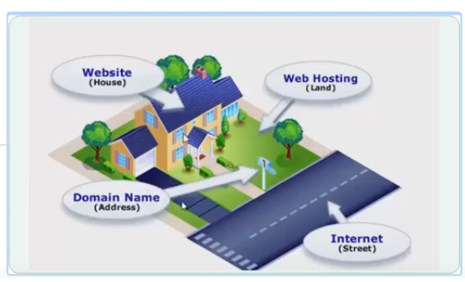
- Internet hoạt động như thế nào ?
    + Internet là một mạng lưới cáp vật lý toàn cầu, có thể bao gồm dây đồng điện thoại, cáp TV và cáp quang. Ngay cả các kết nối không dây như Wi-Fi và 3G / 4G cũng dựa vào các loại cáp vật lý này để truy cập Internet.
    + Khi truy cập một trang web, máy tính sẽ gửi một yêu cầu qua các dây này tới một máy chủ. Máy chủ là nơi lưu trữ các trang web và nó hoạt động giống như ổ cứng máy tính của bạn. Khi yêu cầu đến, máy chủ sẽ truy xuất trang web và gửi dữ liệu chính xác trở lại máy tính của bạn. Điều tuyệt vời là tất cả điều này xảy ra chỉ trong vài giây.
- Mô tả về Domain, DNS, Hosting 
    - Domain (miền): 
        + Địa chỉ để truy cập web nhập vào thanh URL trên trình duyệt như Google, Cốc Cốc, Mozilla Firefox,…
        + Tên miền để định danh một địa chỉ IP (Internet Protocol) của máy chủ (domain ko bắt buộc có thể dùng IP(xx.yy.) để truy cập)
        + Cấu trúc:
        
            + Tên miền.hậu tố(`.com`, `.vn` ,`.org`,...): google.com 
                + google (tên miền) : domain name 
                + .com : hậu tố (có 2 loại)
                    + 1 từ (TLD = Top level domain): .com, .vn,...
                    + 2 từ: .com.vn, .net.cn, .co.cc,...
                        - .vn là TLD 
                        - .com là SLD = Second level domain
                    + chú ý: google.com. (sau .com có dấu chấm thường thì ko viết nhưng nó tồn tại và được lưu theo dạng phân cấp)
                        + Dấu `.` : là root
                        + Dạng phân cấp
                        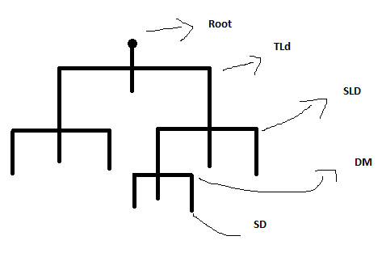
                        + Trên thế giới có 300 root server 13 IP tính đến 2017 (năm 2007 chỉ có 13 root server)
                         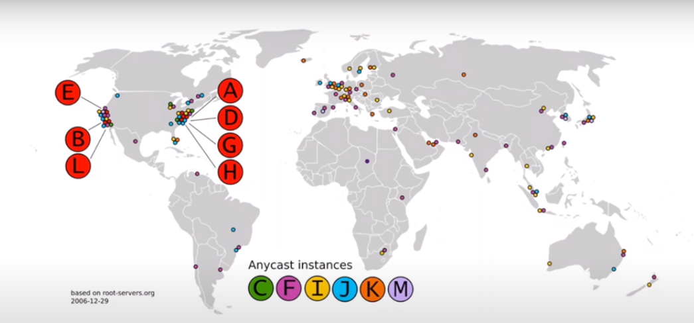
            + Miền phụ.Tên miền.hậu tố : mail.google.com (mail miền phụ = [sub domain])
            + Hoạt động: Khi gọi đến domain thì nó sẽ xử lí qua các DNS để gọi đến IP(xx.yy..)
    - DNS (Domain name system)
        + Địa chỉ IP duy nhất (mỗi máy tính, hệ thống, thiết bị...)
        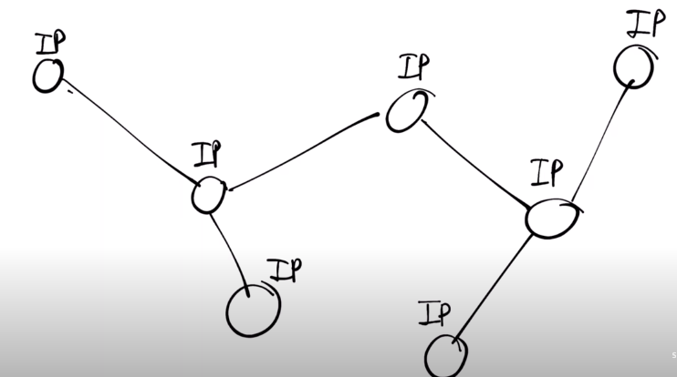
        + 2 loại: 
            + IPV4 ( sử dụng phổ biến từ 1981 )
            + IPV6 ( dần cãi tiến để thay thế cho v4 từ 1999)
             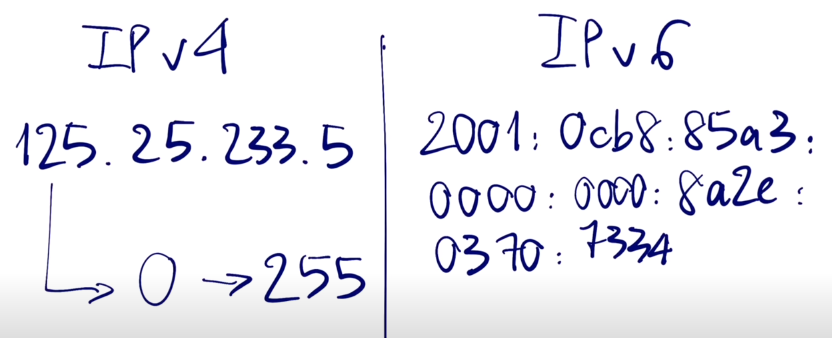
        + IP động (vào mạng ở nhà mỗi ngày cấp IP khác)
        + IP tĩnh (IP không thay đổi, cấp cho các trang web cố định)
            + Thuận tiện cho việc dễ nhớ và sử dụng người ta dùng DNS để gán IP vào domain 
            + Hoạt động hiểu đơn giản
            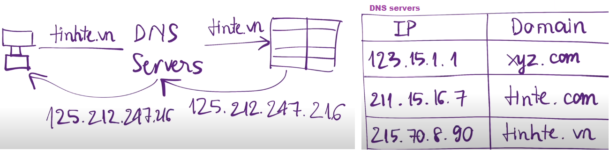
            + Phức tạp hơn
            EX: `google.com` -> Query(truy vấn)-> RNS(Resolving Name Server)
                + RNS -> Query -> Root Server (tìm được nơi có tên miền .com ) -> Response(Trả về) IP
                + RNS -> Query -> Top Lever Domain Name Server ( tìm được nơi có tên miền google) -> Response IP
                + RNS-> Query -> Authority Name Server (tìm được IP tương ứng ) -> Response IP cho RNS -> Response IP Máy tính 
                + Dùng địa chỉ IP này truy cấp vào web
                (RNS lưu vào CACHE)
    - Hosting : Nơi chứa  toàn bộ dữ liệu Database
        - Khi có người gõ domain vào thanh trình duyệt Hosting sẽ gửi toàn bộ dữ liệu lên trình duyệt đó
        - Phân loại
            + hosting Việt Nam: (ổn định ko ảnh hướng nếu cáp quang đứt)
            + hosting Quốc tế: (cấu hình cao hơn VN, đội ngủ sp hùng hậu)
            + Các loại phổ biến:
                + Share Hosting: Rẽ nhất phù hợp cho newbie, tốc độ ổn
                + VPS Hosting: Có thể cấu hình Custom tùy theo ý thích. Giá thành phải chăng, cấu hình cao, chịu tải tốt hơn
                + Dedicate Server: Giành cho web phim or truyện tranh. Giá thành cao, tốc độ cao và chịu tải cao nhất trong 3 loại
    - Cách triển khai 1 trang web html lên môi trường internet:
        + (1) Tạo ra web site
        + (2) Upload web site đó lên một web server nào đó
        + (3) (Tùy chọn) Đăng kí (mua) tên miền cho web site của mình.
## HTTP / HTTP2 / HTTPS
- HTTP (HyperText Transfer Protocol)
    + Giao thức truyền tải siêu văn bản được sử dụng trong www dùng để truyền tải dữ liệu giữa Web server đến các trình duyệt Web và ngược lại.
    + Giao thức này sử dụng cổng 80 (port 80) là chủ yếu.
    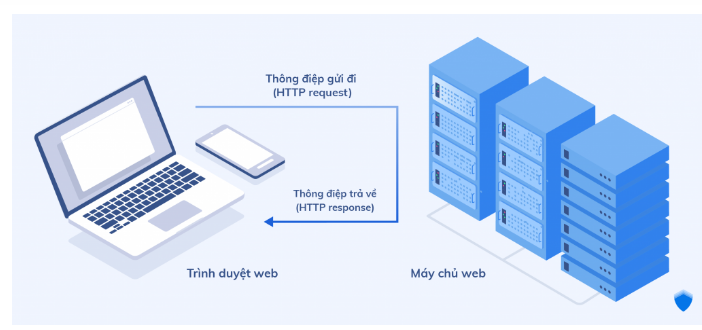
    + VD trả về HTTP
        ```html
        HTTP/1.1 200 OK
        Date: Mon, 23 May 2005 22:38:34 GMT
        Content-Type: text/html; charset=UTF-8
        Content-Encoding: UTF-8
        Content-Length: 138
        Last-Modified: Wed, 08 Jan 2003 23:11:55 GMT
        Server: Apache/1.3.3.7 (Unix) (Red-Hat/Linux)
        ETag: "3f80f-1b6-3e1cb03b"
        Accept-Ranges: bytes
        Connection: close

        <html>
        <head>
        <title>An Example Page</title>
        </head>
        <body>
            Hello World, this is a very simple HTML document.
        </body>
        </html>
        ```
- HTTP/2 (tên ban đầu là HTTP/2.0) 
    +  Một bản sửa đổi lớn của giao thức mạng HTTP được WWW sử dụng. Nó được bắt nguồn từ giao thức SPDY thử nghiệm trước đó.
        + Các SPDY (nhanh chóng rõ rệt) giao thức là một mã nguồn mở, Transmission Control Protocol (TCP) dựa trên giao thức lớp ứng dụng mà nội dung vận chuyển trên Web.
        + Các giao thức SPDY được tạo thành từ một lớp phiên trên đầu trang của một lớp vỏ an toàn (SSL), tạo điều kiện nhiều suối đồng thời và xen kẽ qua kết nối TCP
        + SPDY định nghĩa một định dạng khung mới để mã hóa và truyền dữ liệu qua dây dẫn
- HTTPS (HyperText Transfer Protocol Secure)
    + Giao thức Http có sử dụng thêm SSL (Secure Sockets Layer) để mã hóa dữ liệu trong lúc truyền tải dữ liệu nhầm gia tăng thêm tính an toàn cho việc truyền dữ liệu giữa Web server và trình duyệt Web. 
    + Giao thức Https thì sử dụng cổng 433 để truyền dữ liệu.
    + Https chủ yếu được dùng cho các trang web có giao dịch trực tuyến sử dụng thẻ thanh toán đơn hàng.
    + Truy cập Https chậm hơn so với Http
    + Sử dụng giao thức Https thì Website của bạn phải có chứng chỉ SSL
    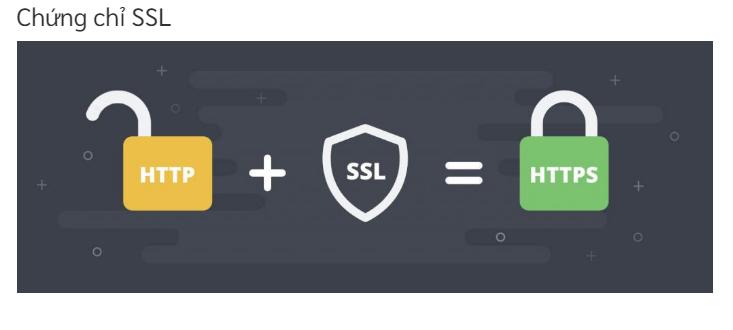
        + SSL sử dụng hệ thống PKI (Public Key Infrastructure - hạ tầng khóa công khai) không đối xứng. 
        + Hệ thống này sử dụng hai “khóa” để mã hóa thông tin liên lạc, “khóa công khai” (public key) và “khóa riêng” (private key). Bất cứ thứ gì được mã hóa bằng khóa công khai chỉ có thể được giải mã bởi khóa riêng và ngược lại.
## Browsers work
- Cấu trúc của một trình duyệt:
    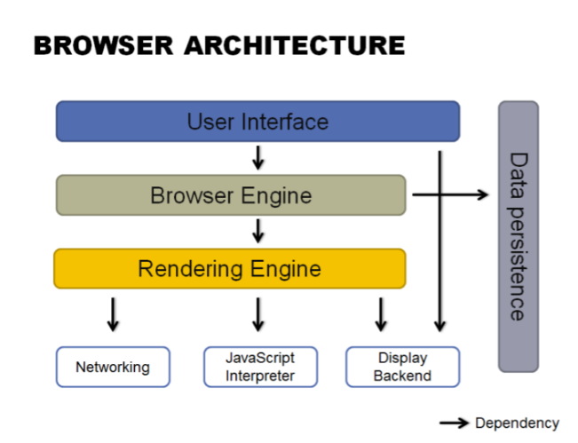
    - User Interface (tầng cao nhất)
        +  Nơi tương tác chủ yếu giữa người dùng và trình duyệt( thanh Address, các nút Reload – Back – Home, Biểu tượng Bookmarks…)
        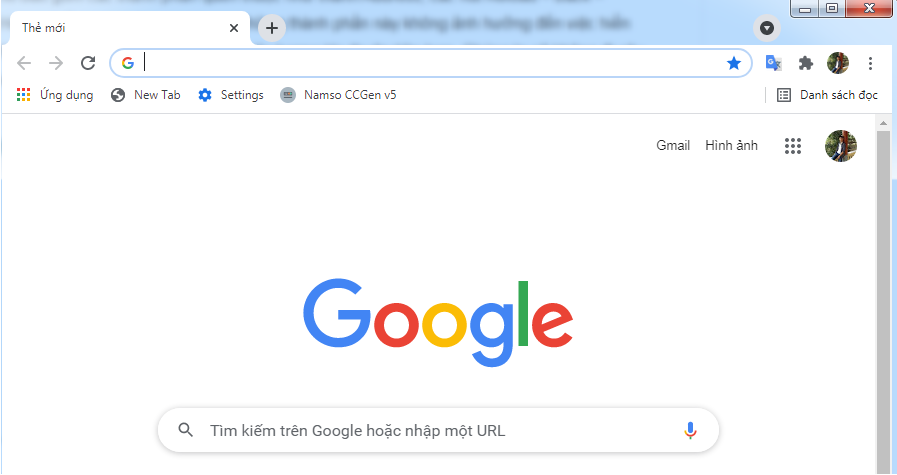
    - Browser Engine
        + Cung cấp các hành động (actions) để giao tiếp và xử lý dữ liệu tầng trên và dưới nó
        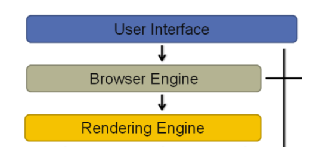
    - `Rendering Engine` (Layout engine): Tầng quan trọng
        + Xử lý (rendering) các thẻ – câu lệnh HTML, CSS, XML, JS để hình thành giao diện (layout)
        + Các trình duyệt họ dùng những bộ xử lý Rendering Engine không giống nhau
        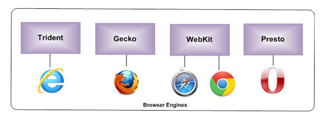
        + IE: Trident Engine
        + Firefox: Gecko Engine
        + Safari & Chrome: WebKit (Lưu ý: Chrome sử dụng Blink sau phiên bản 27)
        + Opera: Presto
        - `Flow of rendering engine` (luồng công cụ kiết xuất )
            
            + Bước 1 – Parsing (HTML to DOM and CSS to CSSOM).
                - Parses HTML tag: Phân tích các thẻ (tags) HTML được viết trong trong code và tạo thành một cấu trúc dạng DOM tree
                - HTML parsing được xử lý từ trên xuống và sẽ dừng lại nếu gặp thẻ `internal / external <script>`, quá trình này sẽ dừng lại để tìm đến các thẻ mã `<script>` sau đó gởi các script này qua cho lớp “Javascript engine” xử lý
                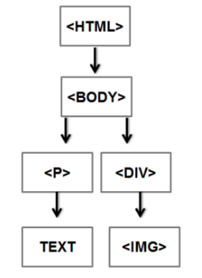
                - Thẻ `<script>` có hai thuộc tính quyết định việc load scripts:
                    + `async` – Sẽ được load lên độc lập, không cần quan tâm đến việc chờ nội dung đã load lên xong hay chưa.
                    + `defer` – Script sẽ chỉ được thực thi sau khi nội dung đã load lên hoàn tất. Không xử lý nếu nội dung chưa được load xong.
            + Bước 2 – Render tree (Combine DOM and CSSOM together).
                
                - Render Tree chỉ chứa những thành phần sẽ hiển thị (visible elements) trên web. 
                - Những element có thuộc tính CSS là “display: none” hay không hiển thị sẽ không được đưa vào Render Tree (còn lại sẽ được đưa vào). 
                    + `“display:none“`: Xem như không hiển thị và không ảnh hưởng đến hiệu năng.
                    + `“visiblity:hidden“`: trình duyệt sẽ phải xử lý để ẩn element này và sẽ ảnh hưởng & tác động đến hiệu năng trang web.
            + Bước 3 – Layout of the render tree.
                - Tính toán vị trí hiển thị cũng như hình dáng của các đối tượng của render tree
                - Việc tính toán và phân bổ đối đối tượng sẽ được thực hiện tuần tự từ trái sang phải và trên xuống dưới tính từ tọa độ trên cùng từ bên trái.
                - Bước Layout sẽ tính các thông số như vị trí các elements, kích thước các element, dòng nội dung, Z-index property…v..v.
            + Bước 4 – Painting the render tree.
                - Trình duyệt sẽ hiển thị nội dung đến cho người dùng
                - Quá trình painting làm theo thứ tự từ trên xuống, trái qua phải, từ background colour => background image => border) và xuất ra dạng pixels hiển thị.
    - `Networking – JavaScript Interpreter – Display UI Backend`
        + Networking: 
            + Có nhiệm vụ gọi các giao thức về mạng. 
            + Ví dụ như các giao thức HTTP.
        + JavaScript interpreter: 
            + Xử lý và thực thi các đoạn mã JavaScript để hiển thị lên trang web. 
            + Đây cũng là một thành phần rất quan trọng ảnh hưởng đến việc hiển thị trang web, do các trang web hiện nay thường cần xử lý và sử dụng khá nhiều mã JavaScript.
        + UI Backend: 
            + Có chức năng xử lý và hiển thị các UI components phổ biến như combo-boxes, textbox, drop-down hiển thị trên web.
    - `Data persistence:` 
        + Có chức năng lưu trữ thông tin và dữ liệu trên máy local. 
        + Những dữ liệu này có thể là `Cache, Cookies, localStorage, IndexedDB, WebSQL and FileSystem` tùy vào từng hệ thống web.
## Git
- Git (Một hệ thống quản lý phiên bản phân tán)
    - Một trong những hệ thống quản lý phiên bản phân tán phổ biến nhất hiện nay. 
        + Git cung cấp cho mỗi lập trình viên kho lưu trữ (repository) riêng chứa toàn bộ lịch sử thay đổi.
    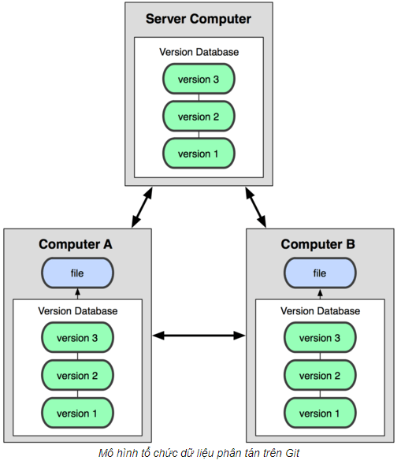
    - Quy trình xử lý công việc
        + Không thể sửa trên git phải thông qua chức năng tiện ích trên IDE của ngôn ngữ lập trình đang làm việc
        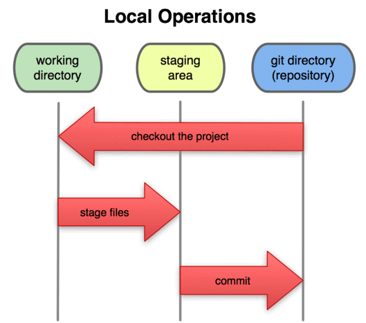
    - Repository (kho lưu trữ)

        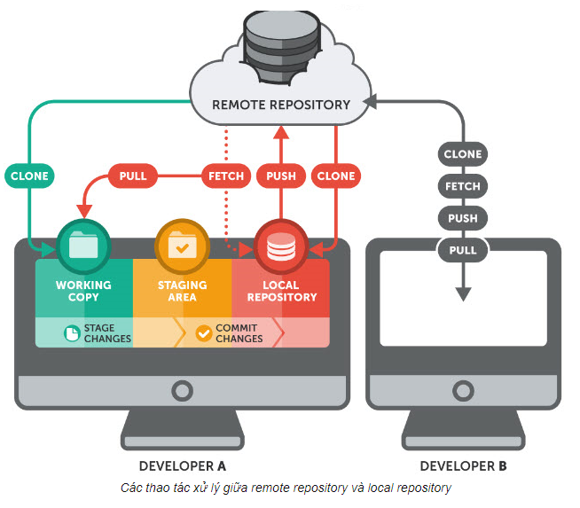
    - clone
        + Sao chép một kho chứa đã tồn tại
            ```css
            $ git clone đường dẫn /*Câu lệnh này sẽ tạo một thư mục mới có tên giống trên của Repo.*/
            ```
    - branch (có thể tạo ra nhiều nhánh (branch) khác nhau). 
        + Kiểm tra branch hiện tại
            ```css   
            $ git branch
            ```
        + Để tạo mới một branch:
            ```css
            $ git branch <name_branch>
            ```
        + Để chuyển và tạo mới:
            ```css
            $ git branch -b <name_branch>
            ```
        + Chuyển nhánh
            ```css
            $ git checkout <name_branch>
            ```
        + Gộp nhánh vào nhánh master
            ```css
            $ git checkout master
            ```
            $ git merge <new_branch>
    - commit (Cập nhật thay đổi): file -> Staging Area -> Respository -> server
        - Cập nhật lên respository
            + Sau khi thay đổi source code: thêm mới, sửa, xoá files,… Cần phải cập nhật lên Staging Area
                ```css
                $ git add . /* . update hết or có thể thay bằng tên files*/
                ```
            + Sau lệnh add, bạn cần sử dụng câu lệnh Commit để đây thông tin thay đổi lên Local Respository:
                ```css
                $ git commit -m "Message" /* thông tin thay đổi*/
                ```
        - Cập nhật lên server
            + Sau câu lệnh Commit, thông tin mới chỉ được cập nhật lên Local Repository. Nếu muốn cập nhật lên server thì bạn phải sử dụng câu lệnh `push`
                ```css
                $ git push origin <name_branch>
                ```
            *Ngoài ra, nếu chưa tồn tại remote trên server thì bạn cần phải add mới một remote trước rồi mới push:
                ```css
                $ git remote add origin <remote_url>
                $ git push origin <name_branch>
                ```
            + Xem thay đổi trước khi push
                ```css
                $ git diff /*biết thay đổi giữa nhánh hiện tại và nhánh trước nó*/
                ```
        - Xem lại lịch sử commit
            ```css
            $ git log /*biết về người commit, ngày giờ, message của những lần commit đó*/
            ```    
    - Pull từ remote repository
        ```css
        $ git pull origin master /*gộp những thay đổi mới kéo về từ máy chủ từ xa với nhánh hiện tại trên máy local.*/
        ```