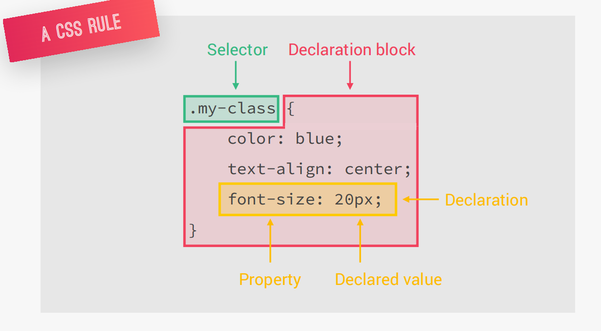
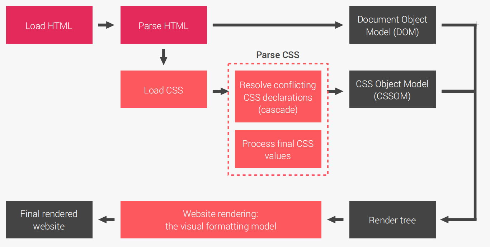
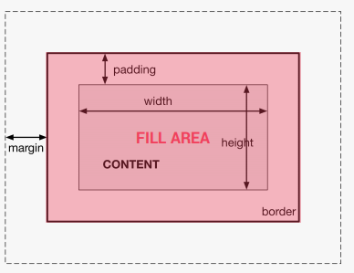
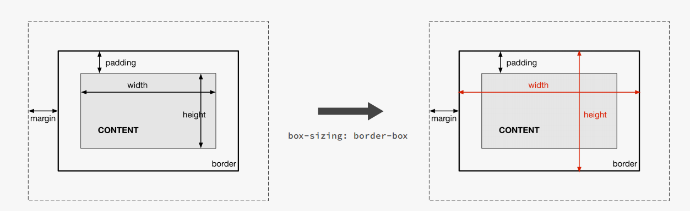
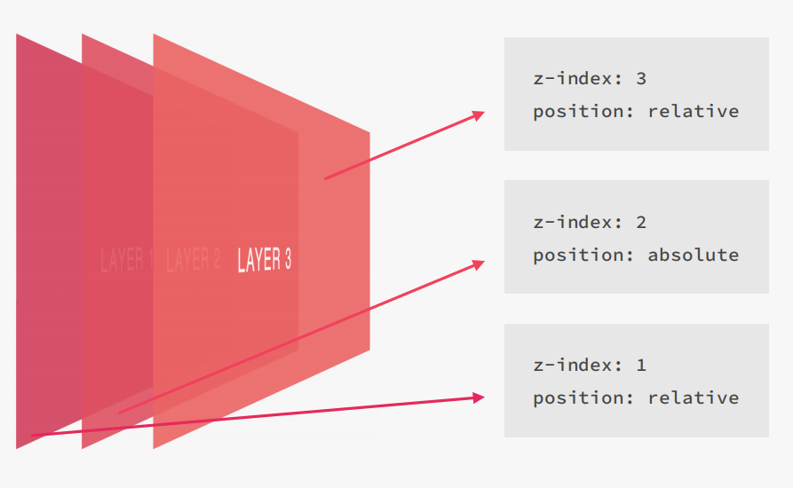
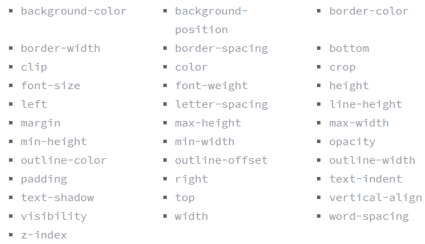

# CSS3
- Viết tắt của Cascading Style Sheets

- Là ngôn ngữ tạo phong cách và định kiểu cho những yếu tố được viết dưới dạng ngôn ngữ đánh dấu như HTML
# RULE CSS3

# I. LOAD CSS3 
{:height="30px" width="30px"}.

1. Đầu tiên Browser tải tệp HTML -> Parse HTML -> xây dựng nên DOM.
2. Trong quá trình Parse HTML tìm thấy ở phần head có stylesheet và nó cũng bắt đầu tải chúng.
3. Quá trình Parse CSS có hai giai đoạn : 
    1. Giải quyết các conflict giữa các định nghĩa CSS(tức là nếu 1 element được config/ kế thừa nhiều giá trị CSS khác nhau thì nên chọn cái nào để hiển thị)
    2. Tính toán các giá trị final value
## 1. Resolve conflicting CSS declarations (Cascade)
Các declarations có thể đến từ nhiều nguồn khác nhau: 
- Author : Các CSS mà dev viết.
- User : CSS mà người dùng thay đổi (như người dùng thay đổi font-size của trình duyệt -> declaration cho font size)
- Browser : CSS mà trình duyệt định nghĩa sẵn (như thẻ a thì được in chữ màu xanh, có gạch chân)

Khi mỗi source đều có CSS khác nhau cho 1 elemnt, browser sẽ chọn CSS theo quy tắc(rule)

> *Important > Specificity > Source Order*

### a. Important
- Định nghĩa CSS mà có `!important` sẽ được ưu tiên nhất. Tuy nhiên việc làm dụng `!important` sẽ gây khó khăn cho việc bảo trì.
- Khi các rule có cùng mức độ quan trọng (importance), browser sẽ đi so sánh mức độ chi tiết (specificities).
### b. Specificity
- Inline styles
- IDs.
- Classes, pseudo-classes, attributes
- Elements, pseudo-elements
* Khi có nhiều rule cùng áp dụng cho 1 slide, browser sẽ tính toán 4 giá trị trên và đem ra so sánh, sau đó chọn rule nào có giá trị cao nhất để đem ra hiển thị.
* Inline luôn có độ ưu tiên cao hơn style được viết trong file.


### c. Source order
- Khi các css declaration có cùng specificity, declarations cuối cùng trong code sẽ được chọn.

- Nếu phải dùng css của bên thứ 3, bạn cần lưu ý để đặt author stylesheet cuối cùng.
## 2. Process final CSS value
### a. Process

- Quá trình process css gồm 6 bước, được thể hiện bằng hình bên dưới


- Declared value: Lấy tất cả các value đã được định nghĩa (author declarations)
- Cascaded value: Lấy giá trị cascaded.
- Specified value: Nếu không có giá trị cascaded, sẽ lấy giá trị default.
- Computed value: Convert các relative values thành absolute (ví dụ: color: red thì sẽ chuyển thành mã màu gì)
- Used value: Tính toán, dựa trên layout để đưa ra giá trị thích hợp. (ví dụ: 66% thì quy ra px là bao nhiêu) -> phần này có thể cần used value của các phần tử parent.
- Actual value: Làm tròn (phụ thuộc vào browser và device)

### b. Convert như thế nào ? 

- Default font-size của trình duyệt thường là 16px.
- Các giá trị % hoặc relative(tương đối) đều sẽ được convert ra pixels.
- Nếu dùng font-size: xx% -> giá trị sẽ được tính dựa vào parent font-size.
- Nếu dùng width(padding, margin, ...): x% -> giá trị sẽ được tính dựa vào parent length.
- em dùng cho font-size sẽ được tính bằng parent font-size.
- em dùng để tính length (padding, ..) sẽ cần dựa trên current font-size.
- rem luôn dựa vào document’s root font-size (nếu k có sẽ dùng default font-size của trình duyệt.
- vh and vw được tính trên % của viewport height và width.
### c. Inheritance
- Kế thừa cho phép pass values từ phần tử cha cho phần tử con :v
- 1 số properties được kế thừa: font-family, font-size, color,… (padding, margin sẽ không được kế thừa).
- Computed value là giá trị sẽ được dùng để kế thừa, không phải declared value.
- Chỉ lấy giá trị kế thừa nếu không có value nào được định nghĩa cho phần tử đó.
- Để force việc kế thừa cho 1 gía trị, ta có thể dùng từ `inherit`. Để reset giá trị initial của 1 propety, ta dùng keywork `initial`.

## 3. RENDER TREE


## 4. WEBSITE RENDERING : THE VISUAL FORMATTING MODEL
- Thuật toán tính toán các hộp và xác định bố cục
trong số các hộp chủ đề, cho mỗi phần tử trong cây kết xuất, để xác định
bố cục cuối cùng của trang.
### Cách bố trí các hộp này phụ thuộc vào các yếu tố sau

- Kích thước của hộp [box model]
- Loại hộp [inline, inline-block, block]
- Sơ đồ định vị [float, positioning]
- Xếp chồng [z-index]

### 4.1. BOX MODEL



- Content : Nội dung trong hộp nơi hiển thị văn bản, hình ảnh.
- Padding : Phần khoảng trắng xung quanh nội dung, trong suốt.
- Border  : Đường viền xung quanh nội dung và padding.
- Margin  : Phần lề bên ngoài đường viền, trong suốt.

### Độ rộng thực tế sẽ là 
**total width** = right border + right padding + specified width + left padding + left border
**total height** = top border + top padding + specified height + bottom padding + bottom border

### Property Box-sizing: boder-box;
**total width** = specified width 

**total height** = specified height



### 4.2 BOX TYPES


### BLock-level boxes
- Bắt đầu trên dòng mới
- Chiếm 100% chiều rộng

    >`display: block`

    >`display: flex`

    >`display: table`
### Inline-block boxes
- Chiếm không gian nội dung
- Không ngắt dòng

    >`display: inline-block`

### Inline boxes
- Chỉ chiếm không gian nội dung
- Không ngắt dòng
- Không thay đổi được chiều cao và rộng
- Thay đổi được padding và margin(left, right)

    >`display: inline`

### 4.3 POSITIONING

- Normal flow :
    - Sơ đồ định vị mặc định 
    - Không trôi nổi
    - Không được định vị tuyệt tối
    - Các yếu tố được bố trí theo thứ tự nguồn của họ 
    - Mặc định là : 
    >`position: static`
- Float: 
    > `float : left`

    > `float right`
    - Các phần tử bị xóa khỏi normal flow
    - Các phần tử văn bảng và nội tuyến sẽ quấn quanh phần tử nổi.
    - Vùng chứa sẽ không điều chỉnh chiều cao của phần tử
- Absolute positioning
    > `position : absolute`

    > `top,left,bottom,right`

    
    - Các phần tử bị xóa khỏi normal flow
    - Không ảnh hưởng đến nội dung, các yếu tố xung quanh .
    - Sử dụng top, left, bottom, right để điều chỉnh phần tử.

### 4.4 STACKING
- Xếp chồng các phần tử 

    


# II. PROPERTY

## 1. COLOR
- Màu sắc được chỉ định bằng cách sử dụng tên màu xác định trước hoặc giá trị RGB, HEX, HSL, RGBA, HSLA.
   >rgb(red, green, blue)

    >#rrggbb

    >hsl(hue, saturation, lightness)

    >rgba(red, green, blue, alpha)

    >hsla(hue, saturation, lightness, alpha)

* Trong đó 
    - Mỗi tham số (red, green và blue) xác định cường độ của màu trong khoảng từ 0 đến 255.
    - hue: Xác định độ trên vòng tròn màu (từ 0 đến 360) - 0 (hoặc 360) là màu đỏ, 120 là xanh lục, 240 là xanh lam
    - saturation : Xác định độ bão hòa; 0% là màu xám và 100% là màu đầy đủ (độ bão hòa đầy đủ)
    - lignthness : Xác định độ đậm nhạt; 0% là màu đen, 50% là bình thường và 100% là màu trắng
    - alpha : Xác định độ mờ là một số trong khoảng từ 0,0 (hoàn toàn trong suốt) đến 1,0 (hoàn toàn không trong suốt)
## 2. BACKGROUND

>background-color: color|transparent|initial|inherit;

- color : chỉ định màu nền
- transparent: trong suốt
- initial Đặt thuộc tính này thành giá trị mặc định
- inherit Kế thừa thuộc tính này từ phần tử mẹ của nó

>background-image: url|none|initial|inherit;

- url: URL của hình ảnh. Để chỉ định nhiều hình ảnh, hãy phân tách các URL bằng dấu phẩy
- None : Không có hình nền sẽ được hiển thị. Đây là mặc định
- linear-gradient(): Đặt một gradient tuyến tính làm hình nền. Xác định ít nhất hai màu
- repeating-linear-gradient() :Lặp lại một gradient tuyến tính
- repeating-radial-gradient() :Lặp lại một gradient xuyên tâm
- initial Đặt thuộc tính này thành giá trị mặc định
- inherit Kế thừa thuộc tính này từ phần tử mẹ của nó
>background-repeat: repeat|repeat-x|repeat-y|no-repeat|initial|inherit;
- repeat: Hình nền được lặp lại theo cả chiều dọc và chiều ngang. Hình ảnh cuối cùng sẽ được cắt bớt nếu nó không vừa vặn. Đây là mặc định
- repeat-x: Hình nền chỉ được lặp lại theo chiều ngang
- repeat-y: Hình nền chỉ được lặp lại theo chiều dọc
- no-repeat: Hình nền không được lặp lại. Hình ảnh sẽ chỉ được hiển thị một lần
- space: Hình nền được lặp lại nhiều nhất có thể mà không cần cắt bớt. Hình ảnh đầu tiên và hình ảnh cuối cùng được ghim vào hai bên của phần tử và khoảng trắng được phân bổ đồng đều giữa các hình ảnh
- round: Hình nền được lặp lại và thu nhỏ hoặc kéo dài để lấp đầy khoảng trống (không có khoảng trống)
- initial:
- inherit:
>background-attachment: scroll|fixed|local|initial|inherit;
- scroll : Hình nền sẽ cuộn theo trang. Đây là mặc định.
- fixed  : Hình nền sẽ không cuộn theo trang
- local  : Hình nền sẽ cuộn với nội dung của phần tử
- initial:
- inherit:
>background-position: value;
- left top
- left center
- left bottom
- right top
- right center
- right bottom
- center top
- center center
- center bottom
- x% y%
- xpos ypos
- initial:
- inherit:
>background: bg-color bg-image position/bg-size bg-repeat bg-origin bg-clip bg-attachment initial|inherit;

>background-size: auto|length|cover|contain|initial|inherit;
- auto: Giá trị mặc định. Hình nền được hiển thị ở kích thước ban đầu
- lenght: Đặt chiều rộng và chiều cao của hình nền. Giá trị đầu tiên đặt chiều rộng, giá trị thứ hai đặt chiều cao. Nếu chỉ có một giá trị được cung cấp, giá trị thứ hai được đặt thành "tự động"
- parcentage: Đặt chiều rộng và chiều cao của hình nền theo phần trăm của phần tử mẹ. Giá trị đầu tiên đặt chiều rộng, giá trị thứ hai đặt chiều cao. Nếu chỉ có một giá trị được cung cấp, giá trị thứ hai được đặt thành "tự động"
- cover: Thay đổi kích thước hình nền để bao phủ toàn bộ vùng chứa, ngay cả khi nó phải kéo dài hình ảnh hoặc cắt bớt một chút ở một trong các cạnh
- contain: Thay đổi kích thước hình nền để đảm bảo hình ảnh hiển thị đầy đủ
> background-blend-mode: normal|multiply|screen|overlay|darken|lighten|color-dodge|saturation|color|luminosity;

- normal :  Đặt chế độ hòa trộn bình thường
- multiply : Chế độ hòa trộn nhân
- screen : chế độ hòa trộn bình thường
- overlay: chế độ hòa trộn lớp phủ
- dark : chế độ hòa trộn làm tối
- lighten : chế độ hòa trộn làm sáng
- color-dodge: chế độ hòa trộn màu dodge
- saturation: chế độ hòa trộn bảo hòa
- color : chế độ hòa trộn màu sắc
- luminosity: chế độ hòa trộn độ sáng

## 3.FLOAT

- Có tác dụng đẩy phần tử sang bên trái hoặc bên phải
- Cú pháp
> float: left | right | none | inherit;
- left: đẩy phần tử sang bên trái
- right: đẩy phần tử sang bên phải
### Nguyên lý hoạt động
- Khi một phần tử được thiết lập thuộc tính float:
    - Nó sẽ được bắt đầu ở hàng phái trên, nếu hàng phía trên còn đủ chỗ trống để chứa nó
    - Nó sẽ bằng đầu ở hàng mới, nếu hàng phía trên không đủ chỗ trống để chứa nó
    - Nếu một phần tử được thiết lập float mà trong khi phần tử đứng trước nó không được thiết lập float thì mặc định nó được bắt đầu ở hàng mới.
    - Khi trên một hàng có nhiều phần tử được thiết lập thuộc tính float và mỗi phần tử có chiều cao khác nhau, nếu hàng không đủ chỗ chứa phần tử thì phần tử sẽ bắt đầu bên cạnh phần tử có chiều cao thấp nhất và còn đủ khoảng trống để chứa nó

- Tắt sự ảnh hưởng của thuộc tính float
    - Nếu một phần tử được thiết lập thuộc tính float, trong khi phần tử nằm phía sau nó không được thiết lập thuộc tính float, thì khi đó phần tử nằm phía sau sẽ bị tác động xấu bởi thuộc tính float.
    - Để khắc phục vấn đề này, ta thêm thuộc tính clear vào phần tử phía sau theo cú pháp:
    > clear: none | left | right | both | inherit;
    - none: cho phép phần tử chịu sự ảnh hưởng của thuộc tính float
    - left: không bị ảnh hưởng bởi thuộc tính float left
    - right: không bị ảnh hưởng bởi thuộc tính float right
    - both: không bị ảnh hưởng bởi thuộc tính float
    - inherit: kế thừa giá trị thuộc tính clear của phần tử chứa nó
- Chống tràn phần tử 
    - Nếu một phần tử được thiết lập thuộc tính float và có kích thước lớn hơn phần tử chứa nó thì khi đó phần tử sẽ bị tràn ra khỏi phần tử chứa nó.

    - Để khắc phục vấn đề này, ta thêm thuộc tính overflow:auto vào phần tử chứa nó.

## 4. BIẾN
- Cú pháp: 
    > --varidable_name: value;
- Thường được khai báo bên trong pseudo:root (global)
    ```css
    :root{
    --ten-bien: gia tri;
    --background-main-color: #ffa400;
    }
    ```
- Cách dùng:
    - Chỉ cần viết như sau thì có thể gọi biến ra để dùng
    > var(variable_name)
    ```css
    .box {
    background-color: var(--background-main-color);
    }
    ```
- Khai báo local
    ```css
    :root {
    --red: red;
    }
    .other-box {
    --red:pink;    
    /* dùng biến --red ở bên trong để ghi đè ở :root*/
    background-color: var(--red);
    }
    ```
## 5. PSEUDO ELEMENT
1. Syntax 

    `selector::pseudo-element {
    property: value;
    }`
2. Pseudo

  ## `:first-line`
   - Áp dụng cho element con đầu tiên trong element cha.  
   - Các properties được áp dụng :
        - font properties
        - color properties
        - background properties
        - word-spacing
        - letter-spacing
        - text-decoration
        - vertical-align `[sắp xếp nội dung theo chiều dọc]`
        - text-transform
        - line-height
        - clear

   ## `:first-letter`
   - Áp dụng cho chữ cái đầu tiên trong element
   - Các properties được áp dụng :
        - Bao gồm các properties của first-line
        - margin properties
        - padding properties
        - border properties
        - float

## `::before`    
- Dùng để chèn một số nội dung vào trước nội dung của một element
- Proptier content: thường dùng là none, text, url.

## `::after`
- Dùng để chèn một số nội dung vào sau nội dung của một element

## `::mark`
- Sử dụng cho các điểm đánh dấu của các mục danh sách

## `::selection`
- Áp dụng kiểu cho các phần tử được người dùng đánh dấu (nhấp chuột hoặc kéo chuột qua văn bản)

## 6. PSEUDO CLASS

- Cú pháp:

```css
selector:pseudo-class {
  property: value;
}
```

- Được sử dụng để xác định trạng thái đặc biệt của một element.
- Một số pseudo-classes thường dùng:

  - `Anchor Pseudo-class`: các liên kết có thể được hiển thị theo nhiều cách khác nhau.

    - `:link`: Trạng thái hiện tại của thẻ (chỉ dùng cho thẻ `a`).
    - `:visited`: Trạng thái khi đã click vào thẻ (chỉ dùng cho thẻ `a`).
    - `:hover`: Trạng thái khi di chuyển chuột vào thẻ (dùng cho nhiều thẻ).
    - `:active`: Trạng thái khi click chuột vào thẻ (dùng cho nhiều thẻ).

  - Các `Pseudo-class` khác:

    - `:First-child `: element được chỉ định là element con đầu tiên của element khác.
    - `:Last-child `: Tương tự first-child nhưng là element con cuối cùng
    - `:first-of-type` Với mọi element là element con đầu tiên, của một kiểu cụ thể, của element cha của nó.
    - `:last-of-type` Với mọi element là element con cuối cùng, của một kiểu cụ thể, của element cha của nó.
    - `:nth-child(n)`: Với mọi element là element con thứ n , bất kể kiểu, của element cha của nó. (n có thể là một số, một từ khóa hoặc một công thức.).
    - `:nth-last-child(n)`: Tương tự như child nhưng tính từ element cuối cùng lên.
    - `:nth-last-of-type(n)`:Với mọi element là element con thứ n , của một kiểu cụ thể, của cha mẹ của nó, tính từ element cuối cùng.
    - `:nth-of-type(n)`:Với mọi element là element con thứ n , của một kiểu cụ thể, của element cha của nó.
    - `:only-of-type`: chọn element là con duy nhất của loại nó là con của element cha.
    - `only-child`: trong element cha chỉ có duy nhất 1 element nếu có > 1 thì không được chọn.
    - `:checked `: Với mọi element `<input>` đã chọn (chỉ dành cho các type radio và checkbox) và element `<option>`.
    - `:disabled`: Với mọi element bị disable (chủ yếu được sử dụng trên các element biểu mẫu).
    - `:enabled`: Với mọi element enable (chủ yếu được sử dụng trên các element biểu mẫu).
    - `:empty `: Với mọi element không có element con (bao gồm cả các nút văn bản).
    - `:focus`: dùng để chọn element được focus vào.
    - `:in-range`: chọn tất cả các element có giá trị nằm trong một phạm vi xác định.(trong vùng min - max).
    - `:out-of-range`: chọn tất cả các element có giá trị nằm trong một phạm vi xác định.(ngoài vùng min - max).
    - `:invalid`: chọn các form elements có giá trị không xác thực theo cài đặt của element. (chỉ hoạt động cho các form elements có giới hạn, chẳng hạn như element đầu vào có thuộc tính tối thiểu và tối đa, trường email không có email hợp pháp hoặc trường số không có giá trị số, v.v.).
    - `:valid`: chọn các form elements có giá trị xác thực theo cài đặt của element. (chỉ hoạt động cho các form elements có giới hạn, chẳng hạn như element đầu vào có thuộc tính tối thiểu và tối đa, trường email không có email hợp pháp hoặc trường số không có giá trị số, v.v.).
    - `:lang()`: chọn được sử dụng để chọn các element có attribute lang với giá trị được chỉ định. Giá trị của `lang="value"` thường là mã ngôn ngữ gồm 2 chữ cái.
    - `:not(selector)`: Mọi element KHÔNG phải là element / bộ chọn được chỉ định.
    - :`optional`: Những input không có attribute `required` thì sẽ được chọn (chỉ dùng cho thẻ `input`, `select`, `textarea`)
    - `:read-only`: Những form elements có attribute `readonly` sẽ được chọn
    - `:read-write`: Những form elements `có thể đọc` và `có thể ghi` sẽ được chọn (những element có attribute `readonly` và `disable` sẽ không được chọn).
    - `:required`: Những form elements có attribute `required` sẽ được chọn (chỉ áp dụng cho các thẻ `input`, và `textarea`.)
    - `:root`: Chọn phần tử `root`.
    - `:target`: chọn những element có `id` trùng với `href` trong thẻ `a`


## 7. ATTRIBUTE SELECTOR

- Vùng chọn `[attribute="value"]` được sử dụng để chọn tất cả các phần tử có thuộc tính `[attribute]` và giá trị value được chỉ định.
```css
   li a[rel='contact'] {font-weight: bold;color: cadetblue;} 
```
- Bộ chọn `[attribute~="value"]` được sử dụng để chọn tất cả các phần tử có thuộc tính `[attribute]` chứa giá trị value được chỉ định.

```css
  li .friend[rel~='friend'] {font-weight: bold; font-size: 40px;} 
```
- Bộ chọn `[attribute|="value"]` được sử dụng để chọn tất cả các phần tử có thuộc tính `[attribute]` bắt đầu bằng giá trị value được chỉ định. Không áp dụng cho những giá trị viết liền nhau.
```css
   li a[class|='friend']{
      font-size: 30px;
      color: cornflowerblue;
  } 
```
- Bộ chọn `[attribute^="value"]` được sử dụng để chọn tất cả các phần tử có thuộc tính `[attribute]` bắt đầu bằng giá trị value được chỉ định. Có thể áp dụng cho những giá trị viết liền nhau.
```css
  li a[class^='friend']{
      font-size: 30px;
      color: cornflowerblue;
  } 
```

- Bộ chọn `[attribute$="value"]` được sử dụng để chọn tất cả các phần tử có thuộc tính `[attribute]` kết thúc bằng giá trị value được chỉ định.
```css
  li a[class$='1']{
      font-size: 30px;
      color: cornflowerblue;
  } 
```
- Bộ chọn `[attribute*="value"]` được sử dụng để chọn tất cả các phần tử có thuộc tính `[attribute]` chứa bằng giá trị value được chỉ định.
```css
  li a[class*='e']{
      font-size: 30px;
      color: cornflowerblue;
  } 
```

  


# III. FLEX BOX

- Được W3 đề xuất sử dụng kể từ tháng 10/2017 nhằm hỗ trợ chia bố cục, căn chỉnh và phân phối giữa các mục trong một thùng chứa ngay cả khi chúng không xác định.

- Bố cục flex được thiết lập từ một khung lớn đóng vai trò là khung linh hoạt và các thẻ con ngay trong nó đóng vai trò các mục nhỏ linh hoạt.

- Các thành phần chính :

    

- Các item sẽ được bố trí theo main axis (trục chính) (từ main start đến main end) hoặc trục vuông góc với trục chính - cross axis (từ cross start đến cross end).
    - main axis : Trục chính của flex container là trục chính dọc, theo đó các flex item được đặt ra. Lưu ý, nó không nhất thiết phải nằm ngang. Nó được quy định dựa vào thuộc tính flex-direction.
    - main start và main end: Các flex item được đặt trong container bắt đầu từ main-start và đến main-end.
    - main size : chiều rộng của container
    - cross axis : Trục vuông góc với trục chính được gọi là cross axis. Hướng của nó phụ thuộc vào hướng trục chính.
    - cross start và cross end : Điểm bắt đầu và điểm kết thúc của flex item theo hướng cross axis.
    - cross size : Phụ thuộc vào chiều rộng hoặc chiều cao của flex item.

##  1. CÁC THUỘC TÍNH CỦA FLEXBOX    
    
* ### THUỘC TÍNH FLEX CHO CONTAINER


### a. display
- Thuộc tính display được sử dụng để định nghĩa một flex container.
- Nó cho phép tạo ra một bối cách flex để sắp xếp các item.
    ```css
    .container{
        display:flex;
    }
    ```
### b. flex-direction
- Thiết lập trục chính (main-axis), do đó xác định hướng các flex-item sẽ được đặt trong flex container.

```css
    .container{
        flex-direction:row | row-reverse | column | column-reverse;
    }
```
`row` : mặc định từ trái sang phải

`row-reverse` : đảo ngược từ phải sang trái

`column` : cột từ trên xuống dưới

`column-reverse` : đảo ngược cột từ dưới lên trên


### c. flex-wrap
- Theo mặc định, tất cả các flex item sẽ cố gắng khớp với một dòng. Bạn có thể thay đổi điều đó và cho phép các item xuống hàng (tách hàng) khi cần thiết với thuộc tính flex-wrap.


```css
.container {
    flex-wrap: nowrap | wrap | wrap-reverse;
}
```
`nowrap `(mặc định): tất cả flex item sẽ được đặt trên một dòng

`wrap`: flex item sẽ tự động tách dòng, từ trên xuống dưới.

`wrap-reverse`: flex item sẽ tách thành nhiều dòng từ dưới lên trên

### d. flex-flow 
- Thuộc tính flex-flow là một cách viết tắt cho các thuộc tính flex-direction và flex-wrap.
- Nó cùng nhau xác định main axis và cross axis của flex container. Giá trị mặc định là row nowrap.

```css
.container {
    flex-wrap: direction wrap | wrap| direction | wrap direction;
}
```
### e. justify-content
- Thuộc tính justify-content xác định sự liên kết dọc theo trục chính.
- Nó giúp điều chỉnh phần không gian trống còn lại khi tất cả các flex item cùng đặt trên một dòng.


```css
.container {
    justify-content:
    flex-start | flex-end |
    center | space-between |
    space-around | space-evenly |
    start | end |
    left | right |
    + ... safe | unsafe;
}
```

- flex-start (mặc định): Các item được đặt dồn về phía bắt đầu (theo hướng của flex-direction).
- flex-end: các item được dồn về phía cuối của flex-direction.
- start: các item được đặt về phía bắt đầu của hướng wirting-mode
- end: các item được đặt về phía cuối của hướng wirting-mode
- left: các item được đặt về phía trái, cạnh của container.
- right: các item được đặt về phía phải, cạnh của container.
- center: đặt các item dồn vào giữa.
- space-between: các item được đặt cách đều nhau, item đầu và cuối đặt tại điểm bắt đầu và kết thúc.
- space-around: Khoảng cách giữa các item đều nhau. Nhưng, item đầu tiên và cuối cùng có khoảng cách so với container chỉ bằng 1 nửa so với khoảng cách của các item với nhau.
- space-evenly: Khoảng cách giữa các item và container là đều nhau.

### f. align-items
- Thuộc tính align-items xác định hành vi mặc định cho cách các flex item được đặt dọc theo cross axis trên dòng hiện tại.
- Nó như là justify-content nhưng dành cho cross axis (vuông góc với trục chính).


```css
.container {
    align-items:
    stretch | flex-start |
    flex-end | center |
    baseline | first baseline |
    last baseline |
    start | end |
    self-start | self-end |
    + ... safe | unsafe;
}
```

- stretch (mặc định): kéo dài item để lấp đầy container 
- flex-start : các item được đặt ở đầu cross axis. 
- flex-end: các mục được đặt ở cuối cross axis.
- center: các item được căn giữa trong cross axis
- baseline: các item được căn chỉnh như căn chỉnh đường cơ sở của chúng

### g. align-content
- Phân phối khoảng trống giữa các hàng item, hàng item với cạnh container (theo trục cross axis)

```css
.container {
    align-content:
    flex-start | flex-end | center |
    space-between | space-around | space-evenly |
    stretch | start | end |
    baseline | first baseline | last baseline |
    + ... safe | unsafe;
}
 
```
- flex-start / start: các hàng item được đặt vào đầu container (theo trục cross axis). 
- flex-end / end: các hàng item được đặt ở cuối container (theo trục cross axis). 
- center: các hàng item nằm giữa container
- space-between: các hàng item phân bố đều. Dòng đầu tiên ở đầu container trong khi dòng cuối cùng ở cuối container.
- space-around: các hàng item được phân bổ đều với không gian bằng nhau xung quanh mỗi dòng. (Item đầu và cuối vẫn có khoảng cách tối thiểu với cạnh container)
- space-evenly: các hàng item được phân bố đều với không gian bằng nhau xung quanh chúng. (cả với cạnh container)
- stretch (mặc định): các hàng item được kéo dãn để lấp đầy khoảng trống (theo trục cross axis)
* ### THUỘC TÍNH FLEX CHO ITEM


### a. order
- Theo mặc định, các flex item được đặt theo thứ tự sắp xếp trong HTML. Tuy nhiên, thuộc tính order có thể kiểm soát thứ tự xuất hiện của chúng trong flex container.

```css
.item {
    order: <integer>;
    /* Mặc định là 0 */
}
```
- Số dương thì nằm lui sau
- Số âm thì nằm tới trước

### b. flex-grow

- Thuộc tính này nó cho các element giãn theo `width` của `container`.
- Mặc định giá trị trong thuộc tính `flex-grow` là 0.
- Công thức tính tỉ lệ `width` với điều kiện các item điều có flex-grow >= 1 của các element như sau: `width-item = (flex-grow của item hiện tại/Tổng flex-grow của các item)* width-container`.
- Nếu áp dụng công thức ra bằng 0 thì width sẽ phụ thuộc vào nội dung bên trong element.


```css
.item {
    flex-grow: <number>;
    /* Mặc định là 0 */
}
```
### c. flex-shrink
- Thuộc tính này nó cho các element co lại theo width của container.
- Mặc định giá trị trong thuộc tính flex-shrink là 1 nghĩa là cho phép element được co lại khi `width` của container giảm xuống.
- Nếu giá trị `flex-shrink: 0` thì khi co lại element sẽ không bị thay đổi width

```css
.item {
    flex-shrink: <number>;
    /* Mặc định là 1 */
}
```

### c. flex-basic
- Dùng để set `width` hoặc `height` của element dựa vào `flex-direction` là `row` hay `column`.
- Mặc định là `flex-direction: row` cho nên lúc này `flex-basis` sẽ tương ứng với thuộc tính `width` của element.
- Khi `flex-direction: column` thì lúc này `flex-basis` sẽ là `height` của element.
- `flex-basis` sẽ đè lên thuộc tính `width` hoặc `height` của element.

```css
.item {
  flex-basis: <length> | auto; /* default auto */
}
```
### d. flex
- Thuộc tính flex là viết tắt cho sự kết hợp thuộc tính flex-grow, flex-shrink và flex-basis.

```css
.item {
    flex: none | [ <'flex-grow'> <'flex-shrink'>? || <'flex-basis'>]
}
```

### e. align-self

- Tương tự như align-item nhưng chỉ định cho một item riêng.


```css
.item {
  align-self: auto | flex-start | flex-end | center | baseline | stretch;
}
```

## NOTE: float, clear, vertical-align không ảnh hưởng đến flex item


# IV. GRID

- Grid (lưới) là một hệ thống bố cục dựa trên lưới hai chiều với cả chiều dọc và chiều ngang, được sử dụng để định ví các khối trên một grid.

## Thuật ngữ

### 1. Grid line
- Là các đường ngang và dọc tạo thành cấu trúc grid. Chúng được sử dụng để định vị các khối trên grid.


### 3. Grid Tracks and Cells
- Grid Tracks là không gian giữa 2 grid line liền kề nhau. 
- Grid Cell là khoảng không gian giữa 2 row liền kề của gird. Nó là những hàng và cột của grid.


### 4. Grid areas
- Là một hoặc nhiều ô lưới tạo thành một vùng hình chữ nhật trên lưới


### 5. Gutters
- Các khoảng cách giữa grid cells có thể được tạo ra bằng cách sử dụng grid-column-gap hoặc grid-row-gap điều thay cho việc chúng ta phải sử dụng padding hay margin.
    - Màu xanh thể hiện grid-column-gap.
    - Màu đỏ thể hiện grid-row-gap


## FRACTION UNIT (`fr`)
- Đây là giá trị được dùng trong CSS GRID.
- Giá trị này sẽ chiếm khoảng trống lớn nhất có thể.
## THUỘC TÍNH CHO CONTAINER
### a. grid-template-columns, grid-template-rows
- grid-template-columns: Dùng để xác định số lượng cột trong grid layout và nó có thể xác định width của mỗi cột.
- grid-template-rows: Dùng để xác định số lượng row trong grid layout và nó có thể xác định height của mỗi cột
- Đơn vị ở đây có thể dùng là: px, %, em, rem, auto và fr.
```css
.container{
    grid-template-columns:40px 50px auto 50px 40px; 
}
```
`repeat` 
- Dùng để lặp lại ví dụ bạn muốn row 1 và row 2 đều là 40px thì khai báo như sau: 
    ```css
        .container{
        grid-template-rows: repeat(2,40px) 50px 40px; 
        }
    ```

### b. grid-template-areas
- Xác định mẫu lưới bằng cách tham chiếu tên của các vùng lưới được chỉ định với thuộc tính vùng lưới. 
- Việc lặp lại tên của một vùng lưới làm cho nội dung kéo dài các ô đó. Dấu chấm biểu thị một ô trống.
```css
/* đặt tên cho các item trong container grid */
   .item-1 {
    grid-area: header;
    background-color: lightseagreen;
}

.item-2 {
    background-color: rgb(90, 178, 32);

    grid-area: main;
}

.item-3 {
    background-color: rgb(163, 178, 32);

    grid-area: sidebar;
}

.item-4 {
    grid-area: footer;
    background-color: rgb(178, 32, 32);

}

/* container grid  */
.container {
    display: grid;
    /* grid-template-columns: repeat(4, 1fr);
    grid-template-rows: repeat(3, 200px); */
    grid-template-areas:
        "header header header header"
        "main main . sidebar"
        "footer footer footer footer "
    ;
}
```


### c. grid-template
- Là cách viết tắt để thiết lập grid-template-columns grid-template-rows gird-template-areas
```css
.container {
    display: grid;
    grid-template:
     "header header" 50px 
     "main sidebar" 100px 
     "footer footer" 190px /1fr 1fr
     ;
}

```

### d. column-gap, row-gap, grid-column-gap, grid-row-gap
- Thiết lập khoảng cách giữa các columns và rows
```css
.container {
  /* standard */
  column-gap: <line-size>;
  row-gap: <line-size>;

  /* old */
  grid-column-gap: <line-size>;
  grid-row-gap: <line-size>;
}
```

### e. gap, grid-gap
- Là cách viết tắt để thiết lập column-gap, row-gap.
```css
.container {
  /* standard */
  gap: <grid-row-gap> <grid-column-gap>;

  /* old */
  grid-gap: <grid-row-gap> <grid-column-gap>;
}
```
### f. Justify-items
- Căn chỉnh nội dung bên trong grid item theo trục dọc
```css
.container {
  justify-items: start | end | center | stretch;
}
```
## `start`

## `end`

## `center`

## `stretch`


### g. align-items
- Căn chỉnh nội dung bên trong grid item theo trục ngang
```css
.container {
  align-items: start | end | center | stretch;
}
```
## `start`

## `end`

## `center`

## `stretch`


### h. justify-content
- Đôi khi tổng kích thước của lưới của bạn có thể nhỏ hơn kích thước của vùng chứa lưới của nó. Điều này có thể xảy ra nếu tất cả các mục lưới của bạn có kích thước bằng các đơn vị không linh hoạt như px. Trong trường hợp này, bạn có thể đặt căn chỉnh của lưới trong vùng chứa lưới.
- Căn theo trục dọc

```css
.container {
  justify-content: start | end | center | stretch | space-around | space-between | space-evenly;    
}
```
## `start`

## `end`

## `center`

## `stretch`
 
## `around`

## `space-between`

## `space-evenly`


### i. align-content
- Căn theo trục ngang
```css
.container {
  align-content: start | end | center | stretch | space-around | space-between | space-evenly;    
}
```

## `start`

## `end`

## `center`

## `stretch`
 
## `around`

## `space-between`

## `space-evenly`


### j. grid-auto-columns , grid-auto-rows
- Dùng để tạo kích thước columns or rows được tạo ra bằng chính px mình mong muốn
```css
.container {
  grid-auto-columns: <track-size> ...;
  grid-auto-rows: <track-size> ...;
}
```

- ex: 
```css
.container {
  grid-template-columns: 60px 60px;
  grid-template-rows: 90px 90px;
}
```

```css
.item-a {
  grid-column: 1 / 2;
  grid-row: 2 / 3;
}
.item-b {
  grid-column: 5 / 6;
  grid-row: 2 / 3;
}
```

```css
.container {
  grid-auto-columns: 60px;
}
```

### k. grid-auto-flow
- Các grid item không được sắp xếp khi dùng thuộc tính này nó sẽ tự động sắp xếp cho mình theo row hoặc column
```css
.container {
  grid-auto-flow: row | column | row dense | column dense;
}
```
### l. grid
- Một cách viết tắt để thiết lập tất cả các thuộc tính sau trong một khai báo duy nhất: grid-template-rows, grid-template-columns, grid-template-areas, grid-auto-rows, grid-auto-columns, and grid-auto-flow.
- Tự tìm hiểu thêm.

## THUỘC TÍNH CHO ITEMS


#  `NOTE`
- float, display: inline-block, display: table-cell, vertical-align and column-* Không ảnh hưởng đến grid item

### a. grid-column-start, grid-column-end, grid-row-start, grid-row-end


```css
.item {
  grid-column-start: <number> | <name> | span <number> | span <name> | auto;
  grid-column-end: <number> | <name> | span <number> | span <name> | auto;
  grid-row-start: <number> | <name> | span <number> | span <name> | auto;
  grid-row-end: <number> | <name> | span <number> | span <name> | auto;
}
```
- grid-column-start: grid item xuất phát từ cột line thứ mấy đó
- grid-column-end : gird item kết thúc từ cột line thứ mấy đó
- grid-row-start: grid item xuất phát từ cột line thứ mấy đó
- grid-row-end : gird item kết thúc từ cột line thứ mấy đó

> grid-rows: start/end; viết tắt của gird-row-start vs grid-row-end
> grid-columns:start /end;

> span start thì tính từ dòng line chiếm bao nhiêu span về trước
> span end thì tính từ dòng line chiếm bao nhiêu span về sau

       
### b. justify-self

- Căn chỉnh grid item bên trong một ô theo trục dọc
```css
.item {
  justify-self: start | end | center | stretch;
}
```
## `start`

## `end`

## `center`

## `stretch`
  
     

### c. align-self

- Căn chỉnh grid item bên trong một ô theo trục ngang
```css
.item {
  align-self: start | end | center | stretch;
}
```
## `start`

## `end`

## `center`

## `stretch`
  

### d. place-sefl
- Đặt cả thuộc tính align-self và justify-self trong một khai báo duy nhất.

- Giá trị đầu tiên đặt align-self, giá trị thứ hai justify-self. Nếu giá trị thứ hai bị bỏ qua, giá trị đầu tiên được gán cho cả hai thuộc tính.

```css
.item-a {
  place-self: center;
}
```
  


```css
.item-a {
  place-self: center stretch;
}
```
  


# V. TRANSITION 

- Cách để dễ xác định trasition cho các trạng thái khác nhau là sử dụng `:hover`, `:focus`, `:active ` và `target`, `pseudo-class`.
- Để tạo ra hiệu ứng chuyển đổi Transition, bạn phải xác định ít nhất 2 điều: 
  - Thuộc tính CSS muốn thêm hiệu ứng vào
  - Thời gian chuyển đổi diễn ra
  - Nếu duration không được chỉ định thì giá trị mặc định bằng 0.
- Transition có 4 thuộc tính:

  `transition-property` :
  - Xác định chính xác những thuộc tính nào sẽ được thay đổi cùng với các thuộc tính chuyển tiếp khác.
  - Một số thuộc tính phổ biến :
  
    
  `transition-duration`

  - Thời gian diễn ra quá trình chuyển đổi bằng cách sử dụng thời gian s hoặc mili giây(ms)
  
  `transition-timing-function`
  - Dùng để xác định tốc độ thay đổi khi chuyển đổi.
  - Các giá trị có sẵn: 
    - ease :tạo hiệu ứng chuyển đổi khi bắt đầu thì chậm sau đó nhanh dần và gần kết thúc lại chậm từ từ (giá trị mặc định)
    - linear: tạo hiệu ứng chuyển đổi từ lúc bắt đầu với lúc kết thúc tốc độ là như nhau.
    - ease-in: tạo hiệu ứng chuyển đổi chậm ở lúc bắt đầu.
    - ease-out: tạo hiệu ứng chuyển đổi chậm ở lúc kết thúc.
    - ease-in-out: tạo hiệu ứng chuyển đổi chậm ở lúc bắt đầu và lúc kết thúc.

  `transition-delay`
  - Sử dụng để xác định khoản thời gian trì hoẵn giữa thời gian một thuojc tính thay đổi và lúc chuyển tiếp thực sự bắt đầu.

  `transition`: Viết tắt bao gồm các thuộc tính trên
  `transition : property name | duration | easing function | delay` 
  - Khi sử dụng cho 2 thuộc tính trở lên thì dùng , .

[DEMO-TRANSITION](https://codepen.io/Sadioho/pen/WNpoxbE)

# VI. ANIMATION

- Cho phép tạo ra hiệu ứng chuyển động mà không cần sử dụng đến JS hay Flash
- Animation là hiệu ứng chuyển động.
- Để tạo ra một chuyển động Animation cần phải có các keyframe
- Mỗi Keyframe được chạy ở 1 thời điểm xác định và trong keyframe đó nó quy định việc phần tử sẽ di chuyển ra sao
- Ngoài ra Animation còn quy định một số thuộc tính quy định các chi tiết khá quan trọng :
### `animation-name `
- Khai báo tên Keyframe được sử dụng
### `animation-duration `
- Tương tự như trasition 
### `animation-timing-function`
- Tương tự như trasition 
### `animation-delay`
- Tương tự như trasition   
### `animation-iteration-count`
- Sử dụng để thiết lập số lần thực hiện một animation.
- Giá trị thường là: 
  - Một số lần nhất định 
  - infinite: animation lặp lại liên tục vô hạn.
### `aniamtion-direction`
- Xác định chiều chạy của animation.
- Các giá trị:
  - `normal`: animation di chuyển bình thường tiến về phía trước (mặc định)
  - `reverse`: animation di chuyển theo hướng ngược lại, lui về sau.
  - `alternate`: animation di chuyển tiến về trước, sau đó lui theo hướng ngược lại
  - `alternate-reverse`: animation di chuyển ngược lại trước, rồi đổi chiều tiến về trước.
### `animation-fill-mode`
- Sử dụng để thay đổi trạng thái của phần tử trước khi bắt đầu sau khi kết thúc Animation.
  - Các thuộc tính: 
    - `none`
    - `forwards`
    - `backwards`
    - `both`

### `animation-play-state`
- `paused`  : Xác định chuyển động dừng lại
- `running` : Xác định chuyển động chạy
## Rule Keyframe
  - Quy định phần tử sẽ chuyển động ra sao tại mỗi thời điểm nhất định
  - Syntax: 
    - Name: tên của animation bạn muốn tạo
    - Code: Các đoạn code quy định tiến trình chuyển động. Có 2 dạng: 
      - Sử dụng phần trăm từ **0% đến 100%**.
      - **from...to**: thiết lập giá trị từ khởi đầu (from - tương đương với 0%) đến kết thúc (to - tương đương với 100%).
  ```css
  @keyframes Name { 
  /*code*/
  }
  ```

[DEMO-ANIMATION](https://codepen.io/Sadioho/pen/XWMNjXb)
  


# VII. RESPONSIVE

- Responsive là kỹ thuật giúp website hiển htij tương thích với nhiều kích thước màng hình khác nhau.
- Tối ưu trải nghiệm người dùng: 
  - Hiển thị õ ràng các thành phần (hình xảnh, cỡ chữ, nút bấm)
  - Ẩn / Hiện các thành phần phù hợp theo kích thước màn hình

## View Port
## @Mediaquery
- Cú pháp
```css
  @media only|not Media-type and (Media-future and|or|not Media-future) {
    tag {
        property: value;
    }
}
```
- Media-type: 
  - screen : Dành cho trang hiển thị
  - print  : Dành cho bản in
  - all    : Mặc định, dành cho trang hiển thị và vả bảng in.
  - speech : Dành cho phiên bản hỗ trợ đọc thành tiếng
- Media-future
  - Có nhiều giá trị khác nhau nhưng phổ biến là :
    - max-width: Chiều rộng lớn nhất màn hình của thiết bị, tức là những thiết bị có màn hình nhỏ hơn max-width sẽ bị ảnh hưởng source code.
    - min-width: Chiều rộng nhỏ nhất màn hình của thiết bị, tức là những thiết bị có màn hình lớn hơn min-width sẽ bị ảnh hưởng source code.
- And : kết hợp nhiều điều kiện
- Or  : hoặc điều kiện này hoặc điều kiện kia (dùng với dấu ,)
- Not : phủ định
- Only : được dùng để ngăn chặn các browser cũ

### CSS Breakpoint
  - CSS Breakpoint là những điểm (phạm vi giới hạn) mà tại đó nội dung của website sẽ co dãn một cách linh hoạt phụ thuộc vào chiều rộng của thiết bị nhằm đem đến cho người xem một trải nghiệm tuyệt vời và hoàn hảo nhất.
  - CSS Breakpoints còn được gọi là media query breakpoint, do chúng thường được sử dụng với media query.
  - Cách để đặt breakpoint
    - Cách thứ 1, đặt breakpoint dựa trên thiết bị, hiện nay có 3 độ rộng phổ biến nhất 
      - **320px** (breakpoint thường dùng cho smartphone)
      - **768px** (breakpoint thường dùng cho tablet)
      - **1024px** (breakpoint thường dùng cho thiết bị màn hình lớn như laptop, PC, TV….). 
```css
      /* ----------- iPhone 6, 6S, 7 and 8 ----------- */
 
          /* Portrait */
          
          @media only screen
          
          and (min-device-width: 375px)
          
          and (max-device-width: 667px)
          
          and (-webkit-min-device-pixel-ratio: 2)
          
          and (orientation: portrait) {
          
          }
          
          /* Landscape */
          
          @media only screen
          
          and (min-device-width: 375px)
          
          and (max-device-width: 667px)
          
          and (-webkit-min-device-pixel-ratio: 2)
          
          and (orientation: landscape) {
          
          }
          
```
    - Cách thứ 2 đặt breakpoint dựa trên nội dung
      - Việc đặt breakpoint theo cách này sẽ phụ thuộc vào nội dung của trang web mà bạn có, thay vì dựa vào độ rộng của thiết bị người dùng sở hữu.
      - Phương pháp này cho phép bạn đơn giản hóa việc thêm breakpoint tại nơi mà một nội dung nào đó cần sự thay đổi layout. 
      - Điều này sẽ giúp bạn hạn chế vấn đề phải làm việc với một danh sách các media query “siêu to khổng lồ” như cách đầu, cũng như giúp media query của bạn dễ quản lý và đơn giản hơn.

```css
      @media only screen and (min-width: 1024px){
 
        ...
        
        }
        <!-- Ngoài ra bạn cũng có thể dùng cách này để giới hạn lại phạm vi tốt hơn  -->
        @media only screen and (min-width: 768px) and (max-width: 1024px){
        
        ...
        
        }
```
### Cách sử dụng min-width, max-width
- Nếu bạn thiết kế giao diện với cách tiếp cận mobile-first, thì sử dụng breakpoint min-width (chiều rộng tối thiểu). Khi đó, style mặc định của bạn sẽ là những thiết bị nhỏ và code bạn vừa mới tạo ra sẽ dùng để điều chỉnh cho các thiết bị lớn hơn.
- Nếu bạn thiết kế cho các thiết bị lớn với cách tiếp cận desktop-first, khi đó style mặc định của bạn sẽ là những thiết bị lớn và code bạn vừa mới tạo ra sẽ dùng để điều chỉnh cho các thiết bị nhỏ hơn với breakpoint max-width (chiều rộng tối đa) - tức là ta chỉ áp dụng những thứ bên trong dấu {} khi và chỉ khi màn hình nhỏ hơn hoặc bằng max-width.

### Desktop First:
  - Sử dụng max-width
  - Giao diện thay đổi khi độ rộng màn hình nhỏ hơn hoặc bằng break point
### Mobile First:
  - Sử dụng min-width
  - Giao diện thay đổi khi độ rộng màn hình lớn hơn hoặc bằng break point
  
[demo responsive](https://codepen.io/Sadioho/pen/NWpbjQp)