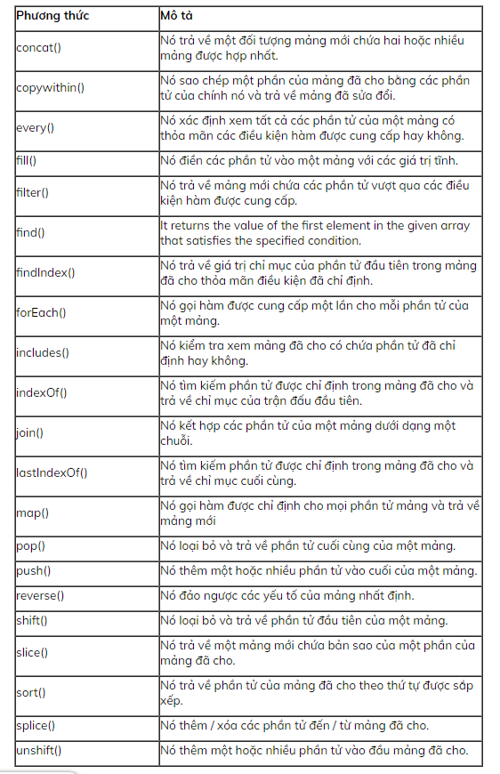

# JAVASCRIPT

- JavaScript là ngôn ngữ kịch bản phía máy khách phổ biến nhất và được sử dụng rộng rãi. Kịch bản phía máy khách đề cập đến các tập lệnh chạy trong trình duyệt web của bạn. JavaScript được thiết kế để thêm hiệu ứng tương tác và động cho các trang web bằng cách thao tác nội dung được trả về từ máy chủ web.

- JavaScript là một ngôn ngữ hướng đối tượng và nó cũng có một số điểm tương đồng về cú pháp với ngôn ngữ lập trình Java. Nhưng, JavaScript không liên quan đến Java theo bất kỳ cách nào.

## Biến
- Các biến là cơ bản cho tất cả các ngôn ngữ lập trình. Các biến được sử dụng để lưu trữ dữ liệu, như chuỗi văn bản, số, v.v. Dữ liệu hoặc giá trị được lưu trữ trong các biến có thể được gán, thay đổi và truy xuất bất cứ khi nào cần. Nói chung, các biến là tên tượng trưng cho các giá trị.

- Bạn có thể tạo 1 biến với từ khóa var, toán tử gán (=) được sử dụng để gán giá trị cho biến, như: `var varName = value`;

### 1. Phạm vi biến
- Global Variables (Biến toàn cục)− Một biến toàn cục có phạm vi toàn cầu, có nghĩa là nó có thể được định nghĩa ở bất kỳ đâu trong mã JavaScript của bạn.

- Local Variables (Biến cục bộ) − Một biến cục bộ sẽ chỉ hiển thị trong một hàm được định nghĩa. Các tham số chức năng luôn luôn cục bộ với chức năng đó.

```js
    var myVar = "out of function";      // Declare a global variable
    function do_something( ) {
        var myVar = "in of function";    // Declare a local variable
            console.log(myVar);
    }
    do_something( ); // Output: "in of function"

    // or

    var myVar = "out of function";      // Declare a global variable
    function do_something( ) {
            console.log(myVar);
    }
    do_something( ); // Output: "out of function"
```
### 2. Kiểu dữ liệu của biến

- `string` : Kiểu dữ liệu chuỗi được sử dụng để thể hiện dữ liệu văn bản (nghĩa là các chuỗi ký tự). Chuỗi được tạo bằng cách sử dụng dấu ngoặc đơn hoặc kép bao quanh một hoặc nhiều ký tự, như hiển thị bên dưới:

```js
    var a = 'Hi';  // using single quotes
    var b = "Hi";  // using double quotes
```
- `number`:Kiểu dữ liệu số được sử dụng để biểu thị các số dương hoặc âm có hoặc không có vị trí thập phân hoặc các số được viết bằng ký hiệu số mũ như 1.5e-4 (tương đương 1.5x10-4)

```js
    var a = 25;         // integer
    var b = 80.5;       // floating-point number
    var c = 4.25e+6;    // exponential notation, same as 4.25e6 or 4250000
    var d = 4.25e-6;    // exponential notation, same as 0.00000425
```
- `NaN` đại diện cho giá trị đặc biệt Not-a-Number (Không phải là số). Đó là kết quả của một phép toán không hợp lệ hoặc không xác định, như căn bậc 2 của -1, hay chia 0 cho 0. v.v

```js
    console.log("Some text" / 2);       // Output: NaN
    console.log("Some text" / 2 + 10);  // Output: NaN
    console.log(Math.sqrt(-1));         // Output: NaN``
```
- `boolean`:Kiểu dữ liệu Boolean chỉ có thể chứa hai giá trị: true hoặc false. Nó thường được sử dụng để lưu trữ các giá trị như có (đúng) hoặc không (sai), on(đúng) hoặc off(sai), v.v. như được trình bày dưới đây:

```js
    var isReading = true;   // yes, I'm reading
    var isSleeping = false; // no, I'm not sleeping
```

- `null`:Đây là một loại dữ liệu đặc biệt khác chỉ có thể có một giá trị - giá trị null. Giá trị null có nghĩa là không có giá trị. Nó không tương đương với một chuỗi rỗng ("") hoặc 0, nó chỉ đơn giản là không có gì.

```js
    var a = null;
    console.log(a); // Output: null
    
    var b = "Hello World!"
    console.log(b); // Output: Hello World!
    
    b = null;
    console.log(b) // Output: null
```

- `object`:Object là một kiểu dữ liệu phức tạp cho phép bạn lưu trữ các tập dữ liệu.Một object chứa các thuộc tính, được định nghĩa là một cặp key-value. key (tên thuộc tính) luôn là 1 chuỗi, Nhưng value (giá trị) của nó có thể là bất kỳ loại dữ liệu nào, như chuỗi, số, booleans hoặc các loại dữ liệu phức tạp như mảng, hàm và các đối tượng khác.

```js
    var emptyObject = {};
    var person = {"name": "Clark", "surname": "Kent", "age": "36"};
    
    // For better reading
    var car = {
        "modal": "BMW X3",
        "color": "white",
        "doors": 5
    }

```

- `array`:Mảng là một loại đối tượng được sử dụng để lưu trữ nhiều giá trị trong một biến. Mỗi giá trị (còn được gọi là một phần tử) trong một mảng có một vị trí số, được gọi là chỉ mục của nó và nó có thể chứa dữ liệu của bất kỳ loại dữ liệu nào - số, chuỗi, booleans, hàm, đối tượng và thậm chí các mảng khác. Chỉ số mảng bắt đầu từ 0, do đó phần tử mảng đầu tiên là arr[0] không phải là arr[1].

```js
    var colors = ["Red", "Yellow", "Green", "Orange"];
    var cities = ["London", "Paris", "New York"];
    
    console.log(colors[0]);   // Output: Red
    console.log(cities[2]);   // Output: New York
```

- `function`:Hàm này là đối tượng có thể gọi được cái mà thực thi một khối lệnh. Vì các hàm là các đối tượng, vì vậy có thể gán chúng cho các biến, như trong ví dụ dưới đây:

```js
    var greeting = function(){ 
        return "Hello World!"; 
    }
    
    // Check the type of greeting variable
    console.log(typeof greeting) // Output: function
    console.log(greeting());     // Output: Hello World!
```

### QUY ƯỚC ĐẶT TÊN BIẾN

-Các quy ước đặt tên cho các biến JavaScript

-Khi đặt tên cho các biến của bạn trong JavaScript, hãy ghi nhớ các quy tắc sau.

- Tên biến phải bắt đầu bằng một chữ cái, gạch dưới (_), hay ký tự dollar ($).
- Tên biến không thể bắt đầu bằng 1 chữ số.
- Tên biến chỉ có thể chưa ký tự alpha-numeric (A-z, 0-9) và gạch dưới.
- Tên biến không thể chưa ký tự cách.
- Tên biến không thể là các từ khóa của JavaScript hay reserved word (từ khóa riêng).
- Tên biến trong JS có phân biệt hoa thường. Ví dụ, Name và name là 2 biến khác nhau.


### TYPEOF

## TOÁN TỬ

-  Toán tử số học


```js
    var a = 3;
    var b = 2;
    var x = a * b;

    console.log(x); // output: 6

    var c = 3;
    x = (a * b) + c;

    console.log(x); // output: 9

    x = (a * b) % 5;

    console.log(x); // output: 1
```
- Toán tử đẳng thức


```js
    var x = 1;
    var y = 2;
    var z = "2";
    var w = "2";

    console.log(x != y); // output: true
    console.log(x == y); // output: false
    console.log(z == y); // output: true

    console.log(true == true); // output: true
    console.log(true != true); // output: false
```
-  Toán tử quan hệ


```js
    var i1 = 1;
    var i2 = 2;
    var i3 = 1;
    console.log(i1 > i2);    //prints: false
    console.log(i1 >= i2);   //prints: false
    console.log(i1 >= i3);   //prints: true
    console.log(i1 < i2);    //prints: true
    console.log(i1 <= i2);   //prints: true
    console.log(i1 <= i3);   //prints: true

    console.log('a' >= 'b');  //prints: false
    console.log('a' <= 'b');  //prints: true
```
-  Toán tử logic

```js
    var a = 1;
    var b = 2;
    var c = true;
    var d = false;

    console.log(a > 0 && b > 0); // output: true

    console.log(a == 2 && b == 2); // output: false
    console.log(a == 2 || b == 2); // output: true

    console.log(!c); // output: false
    console.log(!d); // output: true
```

-  Toán tử gán
    - Cách viết tắt của toán tử gán (+= -= *= /= %=) được gọi là toán tử gán phức hợp:
```js
    x += 2; //  result  x = x + 2;
    x -= 2; //  result  x = x - 2;
    x *= 2; //  result   x = x * 2;
    x /= 2; //  result   x = x / 2;
    x %= 2; //  result  x = x % 2;
```

## FUNCTION
- `Function `(Hàm) là một nhóm các câu lệnh thực hiện các nhiệm vụ cụ thể và có thể được giữ và duy trì riêng biệt tạo thành chương trình chính. Các hàm cung cấp một cách để tạo các gói code(mã) có thể tái sử dụng, dễ mang theo hơn và dễ gỡ lỗi hơn.
### 1. SYNTAX
- Khởi tạo 1 function bắt đầu với từ khóa function, tiếp theo đó là tên mà function mà bạn muốn tạo, tiếp theo là ngoặc đơn () và cuối cùng là nơi cách lệnh của function giữa các dấu ngoặc nhọn {}.

Đây là cú pháp cơ bản để khai báo hàm:
```js
    function functionName() {
        // Code to be executed
    }

    // Defining function
    function sayHello() {
        console.log("Hello");
    }
    
    // Calling function
    sayHello(); // 0utputs: Hello
```
### 2. FUNCTION CÓ PARAMETER
```js
    function functionName(parameter1, parameter2, parameter3) {
        // Code to be executed
    }
    // Defining function
    function displaySum(num1, num2) {
        var total = num1 + num2;
        console.log(total);
    }
    
    // Calling function
    displaySum(6, 20); // 0utputs: 26
    displaySum(-5, 17); // 0utputs: 12
```

### 3. FUNCTION CALLBACK
- Hàm callback là một hàm được truyền vào một hàm khác dưới dạng đối số, sau đó được gọi bên trong hàm ngoài để hoàn thành một số loại thường trình hoặc hành động.
```js
    function finish_add_numbers() {
        console.log('Finish function');
    }

    function add_two_numbers(a, b, callback) {
        var sum = a + b;
        console.log(sum);
        callback();
    }

    add_two_numbers(2, 4, finish_add_numbers);
    // output: 
    // 6
    // Finish function
```
### 4. CÁC LOẠI FUNCTION
 - Declaration function
```js
    function showMess(){}
```
- Có thể được gọi trước khi định nghĩa (hosting)

- Expression function
```js
    var showMess=function(){}
```
- Không thể gọi trước khi định nghĩa (không có hosting)

- Arrow function

## IF ELSE 
- Các lệnh lựa chọn có 3 biến thể:

- Lệnh `if` 

- Lệnh `if...else` 

- Lệnh `if...else if-...-else `

```js
    if(n > 5){
    console.log("n > 5");
    } else if (n == 5) {
    console.log("n == 5");
    } else if (n == 4) {
    console.log("n == 4");
    } else {
    console.log("n < 4");
    }
```
## VÒNG LẶP FOR WHILE
- While
    + Cú pháp:
    ```js
    while (condition){
    // do something
    }
    ```
    + Trong đó condition là điều kiện dừng vòng lặp, nếu condition đúng thì vòng lặp sẽ được thực thi cho tới khi condition có giá trị sai. Chính vì vậy nếu condition luôn luôn đúng thì vòng lặp sẽ dẫn tới lặp vô hạn.
    ```js
    var i = 1;
        while (i <= 10){
            console.log(i);
            i++;
        }
    ```
- Do while
    + Cú pháp:
    ```js
    do {
        // some thing
    }
    while (condition);
    ```
    + Trong đó condition là điều kiện để dừng vòng lặp.
    ```js
    var i = 1;
    do {
        console.log(i);
        i++;
    }
    while (i <= 10);
    ```
- For
    + Cú pháp:
    ```js
    for (let i = 0; i < 10; i++){
        // some thing
    }
    ```
    + Trong đó 
        + `(i = 0)` là điểm bắt đầu lặp.
        + `(i < 100)` là điều kiện dừng vòng lặp.
        + `(i++)` là tăng bước nhảy.
    ```js
    for (let i = 0; i <= 10; i++) {
        console.log(i);
    }
    ```
## TRUTHY AND FALSY

- `Truthy` - to bool is true
    - Bất cứ giá trị nào trong Javascript khi chuyển đổi sang kiểu dữ liệu boolean mà có giá trị true thì ta gọi giá trị đó là Truthy.
- `Falsy` - to bool is false
    - Bất cứ giá trị nào trong Javascript khi chuyển đổi sang kiểu dữ liệu boolean mà có giá trị false thì ta gọi giá trị đó là Falsy.
    - Trong Javascript có 6 giá trị sau được coi là Falsy:
        - false
        - 0 (số không)
        - '' or "" (chuỗi rỗng)
        - null
        - undefined
        - NaN

## Làm Việc Với Chuỗi 

```js
    var txt = "JS";
    var sln = txt.length; // sln is 2

    String.prototype.add_more = function (char) {
        return this + char;
    };
    var a = "Java";
    var new_string  = a.add_more("Script"); // new_string is JavaScript
```

```js
    var str = "JavaScript";
    str.charAt(0); // returns "J"

    str.charAt(str.length-1); // returns "t"

    'ABC'.charCodeAt(0); // returns 65

    "Java".concat("Script"); // returns "JavaScript"

    "JavaScript".indexOf("J"); // returns 0
    "JavaScript".indexOf("X"); // returns -1

    'canal'.lastIndexOf('a'); // returns 3
    'canal'.lastIndexOf('x'); // returns -1

    "Ab".replace('b', 'a'); // returns Aa

    "Mozilla".substr(1, 2); // returns "oz"
    "Mozilla".substr(0, 4); // returns "Mozi"

    "Mozilla".substring(1, 3); // returns "oz"

    var str = 'The quick brown fox jumps over the lazy dog.';

    str.slice(31); // returns "the lazy dog."
    str.slice(4, 19); // returns "quick brown fox"
    str.slice(-4);// returns "dog."

    "Abc".toLowerCase(); // returns "abc"

    "Abc".toUpperCase(); // returns "ABC"

    "The quick brown fox".split(' '); // returns ['The', 'quick', 'brown', 'fox']
    "11,22".split(','); // returns ['11', '22']

    str = 'To be, or not to be, that is the question.';

    str.includes('To be'); 	// true
    str.includes('question');    // true
    str.includes('nonexistent'); // false
    str.includes('To be', 1);	// false
    str.includes('TO BE');	// false
    str.includes('');	// true
```
### TRIM()
-Phương thức trim() xóa bỏ khoảng trắng ở đầu vào cuối chuỗi. Khoảng trắng trong trường hợp này là (Ký tự cách, tab, no-break space ...) và các ký tự kết thúc dòng  (LF, CR ...).
```js
var greeting = '   Hello world!   ';

console.log(greeting);
// returns "   Hello world!   ";

console.log(greeting.trim());
// returns "Hello world!";
```

### REPLACE()
- Phương thức replace() trả về một chuỗi mới với một số hoặc tất cả các kết quả khớp của mẫu được thay thế bằng một chuỗi thay thế khác. Mẫu có thể là một chuỗi hoặc RegExp và thay thế có thể là một chuỗi. Nếu mẫu là một chuỗi, chỉ có mẫu đầu tiên sẽ được thay thế

- Syntax : `var newStr = str.replace(regexp|substr, newSubstr)`
```js
    var str = 'The quick brown fox jumps over the lazy dog. If the dog reacted, was it really lazy?';

    console.log(str.replace('dog', 'monkey'));
    // Returns "The quick brown fox jumps over the lazy monkey. If the dog reacted, was it really lazy?"

    //Nếu bạn sử dụng regexp cho phương thức replace() như sau. Tất cả từ "dog" sẽ được thay thế.
    var regex = /dog/gi;

    console.log(str.replace(regex, 'ferret'));
    // Returns "The quick brown fox jumps over the lazy ferret. If the ferret reacted, was it really lazy?"
```


## ARRAY
- Array (mảng) là một đối tượng đại diện cho một tập hợp các loại phần tử tương tự..
- Có 3 cách khai báo mạng
```js
//cách 1 Cú pháp tạo mảng bằng cách sử dụng mảng bằng chữ được đưa ra dưới đây:
    var arrayname=[value1,value2.....valueN];
    // Example: 
    var emp=["Sonoo","Vimal","Ratan"];
//cách 2 Cú pháp tạo mảng trực tiếp được đưa ra dưới đây:
    var arrayname=new Array();  
    // Example: 
    var emp = new Array();  
    emp[0] = "Arun";  
    emp[1] = "Varun";  
// cách 3 Sử dụng Array constructor (Dùng từ khóa new)
    var emp=new Array("Jai","Vijay","Smith");  
```


### `concat()`
```js
    var array1 = ['a', 'b', 'c'];
    var array2 = ['d', 'e', 'f'];
    var new_array = array1.concat(array2);
    console.log(new_array );
    // output: ["a", "b", "c", "d", "e", "f"]
```
### `every()`
- Phương thức `every()` kiểm tra xem tất cả các phần tử trong mảng có vượt qua kiểm tra được thực hiện bởi hàm được cung cấp hay không. Nó trả về giá trị `Boolean`.
- Syntax : `arr.every(callback(element[, index[, array]])[, thisArg])`
    - callback: Một hàm để kiểm tra cho từng phần tử, lấy ba đối số:

    - element: Phần tử hiện tại đang được xử lý trong mảng.

    - index (Optional): Chỉ mục của phần tử hiện tại đang được xử lý trong mảng.

    - array (Optional): Các mảng được gọi theo.

    - thisArg: Một giá trị để sử dụng như thế này khi thực hiện callback.
```js
    function isBelowThreshold(currentValue) {
    return currentValue < 40;
    }

    var array1 = [1, 30, 39, 29, 10, 13];

    console.log(array1.every(isBelowThreshold));
    // expected output: true
```

### `some()`
- Phương thức some() kiểm tra xem ít nhất một phần tử trong mảng có vượt qua kiểm tra được thực hiện bởi hàm được cung cấp hay không. Nó trả về giá trị Boolean.
- Syntax: `arr.some(callback(element[, index[, array]])[, thisArg])`
```js
    var array1 = [1, 2, 3, 101, 5];
    var array2 = [1, 2, 3, 5];

    var isBig= function(element) {
    // checks whether an element is even
    return element >= 100;
    };

    console.log(array1.some(isBig));
    // output: true

    console.log(array2.some(isBig));
    // output: false
```
### `filter()`
- Phương thức filter() tạo ra một mảng mới với tất cả các phần tử vượt qua kiểm tra được thực hiện bởi hàm được cung cấp.
- Mô tả: filter() sẽ thực thi hàm callback trên từng phần tử của mảng, và xây dựng một mảng mới với các phần tử mà giá trị trả về của callback nếu ép kiểu sẽ mang giá trị true. callback chỉ được thực thi tại những chỉ mục (index) của mảng mà chúng được gán giá trị; nó không được thực thi tại chỉ mục đã bị xóa hoặc chưa từng được gán giá trị. Những phần tử không thỏa điều kiện tại hàm thử callback sẽ bị bỏ qua, không được cho vào mảng mới.
- Syntax: `var newArray = arr.filter(callback(element[, index[, array]])[, thisArg])`
```js
    function isBigEnough(value) {
    return value >= 10;
    }
    var array1 = [12, 5, 8, 130, 44];

    var filtered = array1 .filter(isBigEnough);
    // output: [12, 130, 44]
```

### `find()`
- Phương thức find() trả về giá trị của phần tử đầu tiên trong mảng thỏa mãn hàm kiểm tra được cung cấp. Nếu không, không xác định được trả lại.

- Syntax : `arr.find(callback(element[, index[, array]])[, thisArg])`

    - callback: Một hàm để kiểm tra cho từng phần tử, lấy ba đối số:

    - element: Phần tử hiện tại đang được xử lý trong mảng.

    - index (Optional): Chỉ mục của phần tử hiện tại đang được xử lý trong mảng.

    - array (Optional): Các mảng được gọi theo.

    -thisArg: Một giá trị để sử dụng như thế này khi thực hiện callback.


```js
    var array1 = [5, 12, 8, 130, 44];

    var found = array1.find(function(element) {
    return element > 10;
    });

    console.log(found);
    // expected output: 12
```

### `forEach()`
- Phương thức `forEach()` thực thi một hàm được cung cấp một lần cho mỗi phần tử mảng. Có thể thay thế for để duyệt mảng
- Syntax: `arr.forEach(callback(currentValue [, index [, array]])[, thisArg]);`
    - callback: Hàm xử lý mỗi phần tử, có 3 tham số

    - currentValue: Phần tử hiện tại đang được xử lý trong mảng

    - index (tùy chọn): Chỉ mục của phần tử hiện tại đang được xử lý trong mảng.

    - array (tùy chọn): Mảng đang được foreach() xử lý.

    - thisArg (tùy chọn): Giá trị được gán cho từ khóa this bên trong hàm callback khi được thực thi.

```js
    var array1 = ['a', 'b', 'c'];

    array1.forEach(function(element) {
    console.log(element);
    });

    // output: "a"
    // output: "b"
    // output: "c"

    function logArrayElements(element, index, array) {
    console.log('a[' + index + '] = ' + element);
    }

    // Notice that index 2 is skipped since there is no item at
    // that position in the array.
    [2, 5, , 9].forEach(logArrayElements);
    // logs:
    // a[0] = 2
    // a[1] = 5
    // a[3] = 9
```
### `INCLUDES()`
- Phương thức include() xác định xem một mảng có bao gồm một giá trị nhất định trong số các mục nhập của nó hay không, trả về true hoặc false khi thích hợp.
- Syntax: `arr.includes(valueToFind[, fromIndex])`
    - valueToFind: Giá trị muốn kiểm tra.
    - fromIndex (Tùy chọn): Vị trí trong mảng để bắt đầu tìm kiếm valueToFind; đầu tìm kiếm tại fromIndex khi fromIndex mang giá trị dương, hoặc tại array.length + fromIndex khi fromIndex mang giá trị âm (sử dụng giá trị tuyệt đối của fromIndex làm số lượng kí tự tính từ cuối mảng làm vị trí bắt đầu). Giá trị mặc định là 0.    
```js
    var array1 = [1, 2, 3];

    console.log(array1.includes(2));
    // output: true

    var pets = ['cat', 'dog', 'bat'];

    console.log(pets.includes('cat'));
    // output: true

    console.log(pets.includes('at'));
    // output: false
```           
### `INDEXOF()`
- Phương thức indexOf() trả về chỉ mục đầu tiên mà tại đó một phần tử đã cho có thể được tìm thấy trong mảng hoặc -1 nếu không có.
- Syntax: `arr.indexOf(searchElement[, fromIndex])`                                                
    - searchElement: Phần tử cần tìm trong mảng.

    - fromIndex (Optional): Vị trí index nơi bắt đầu tìm kiếm. Nếu index lớn hơn hoặc bằng số phần tử trong mảng, -1 sẽ được trả về, việc tìm kiếm sẽ không xảy ra. Nếu giá trị fromIndex là một số âm, vị trí index được tính từ cuối mảng. Lưu ý: cho dù fromIndex là số âm, kết quả tìm kiếm vẫn tính từ đầu mảng trở về sau. Nếu index bằng 0, cả mảng sẽ được tìm kiếm. Mặc định: 0 (cả mảng sẽ được tìm kiếm)             
```js
    var beasts = ['ant', 'bison', 'camel', 'duck', 'bison'];

    console.log(beasts.indexOf('bison'));
    // expected output: 1

    // start from index 2
    console.log(beasts.indexOf('bison', 2));
    // expected output: 4

    console.log(beasts.indexOf('giraffe'));
    // expected output: -1
```       

### `JOIN()`
- Phương thức join() tạo và trả về một chuỗi mới bằng cách nối tất cả các phần tử trong một mảng (hoặc một đối tượng giống như mảng), được phân tách bằng dấu phẩy hoặc chuỗi phân tách được chỉ định. Nếu mảng chỉ có một mục, thì mục đó sẽ được trả về mà không cần sử dụng dấu phân cách.

- Syntax: `var array_in_string = arr.join([separator]);`
    - separator (tùy chọn): Là một chuỗi xác định dùng để ngăn cách các phần tử liền kề của mảng. Nếu bỏ qua, các phần tử sẽ được ngăn cách bởi dấu phẩy (","). Nếu là một chuỗi rỗng, các phần tử sẽ nối với nhau mà không có bất kì ký tự nào ngăn cách chúng.
```js
    var a = ['Wind', 'Water', 'Fire'];
    a.join();      // 'Wind,Water,Fire'
    a.join(', ');  // 'Wind, Water, Fire'
    a.join(' + '); // 'Wind + Water + Fire'
    a.join('');    // 'WindWaterFire'
```

### `MAP()`

- Phương thức map() tạo ra một mảng mới với kết quả gọi một hàm được cung cấp trên mọi phần tử trong mảng gọi.

- Syntax: `var new_array = arr.map(function callback(currentValue[, index[, array]]) {
    // Return element for new_array
}[, thisArg])`

    - currentValue: Giá trị của phần tử trong mảng đang được xử lý

    - index (Tùy chọn): Index của phần tử trong mảng đang được xử lý
    - array (Optional): Mảng đang được gọi với map

    - thisArg (Tùy chọn): Giá trị gán cho từ khóa this bên trong callback.
```js
    function double_value(x) {
        return x * 2;
    }
    var array1 = [1, 4, 9, 16];

    // pass a function to map
    const map1 = array1.map(double_value);

    console.log(map1);
    // output: Array [2, 8, 18, 32]


    var numbers = [1, 2, 3, 4];
    var filteredNumbers = numbers.map(function(num, index) {
    if(index < 3) {
        return num;
    }
    });
    //index goes from 0,so the filterNumbers are 1,2,3 and undefined.
    // filteredNumbers is [1, 2, 3, undefined]
    // numbers is still [1, 2, 3, 4]
```

### `shift()`
- Phương thức shift() xóa phần tử đầu liên của mạng và trả về phần tử bị xóa này. Phương thức này sẽ thay đổi độ dài của mang.
- Syntax: `arr.shift()`
```js
    var array1 = ["A", "B", "C"];

    var firstElement = array1.shift();

    console.log(array1);
    // output: Array ["B", "C"]

    console.log(firstElement);
    // output: A
```
### `unshift()`
- Phương thức unshift() thêm một hoặc nhiều phần tử vào vị trí đầu mảng sau đó trả về chiều dài của mảng mới.
- Syntax:  `arr.unshift(element1[, ...[, elementN]])`
```js
    var array1 = [1, 2, 3];

    console.log(array1.unshift(4, 5));
    // expected output: 5

    console.log(array1);
    // expected output: Array [4, 5, 1, 2, 3]
```
### `pop()`
- Phường thức pop() xóa đi phần tử cuối cùng của mảng và trả về phần tử này. Phương thức này sẽ thay đổi chiều dài của mảng.
- Syntax : `arr.pop()`

```js
    var plants = ['broccoli', 'cauliflower', 'cabbage', 'kale', 'tomato'];

    console.log(plants.pop());
    // output: "tomato"

    console.log(plants);
    // output: Array ["broccoli", "cauliflower", "cabbage", "kale"]

    plants.pop();

    console.log(plants);
    // output: Array ["broccoli", "cauliflower", "cabbage"]
```
### `push()`
- Phương thức push() thêm 1 hay nhiều phần tử vào cuối mảng và trả về độ dài của mảng mới.
- Syntax: `arr.push(element1[, ...[, elementN]])`
```js
    var animals = ['pigs', 'goats', 'sheep'];

    console.log(animals.push('cows'));
    // output: 4

    console.log(animals);
    // output: Array ["pigs", "goats", "sheep", "cows"]

    animals.push('chickens');

    console.log(animals);
    // output: Array ["pigs", "goats", "sheep", "cows", "chickens"]
```
### `reverse()`
- Phương thức reverse() đảo ngược thứ tự của chính mảng đó. Phần tử đầu tiên của mảng trở thành phần tử cuối và ngược lại, phần tử cuối trở thành phần tử đầu tiên của mảng.
- Syntax : `arr.reverse()`
```js
    var array1 = ['one', 'two', 'three'];
    console.log('array1: ', array1);
    // expected output: Array ['one', 'two', 'three']

    var reversed = array1.reverse(); 
    console.log('reversed: ', reversed);
    // expected output: Array ['three', 'two', 'one']

    /* Careful: reverse is destructive. It also changes
    the original array */ 
    console.log('array1: ', array1);
    // expected output: Array ['three', 'two', 'one']​
```
### `sort()`
- Phương thức sort() sẽ sắp xếp các phần tử của mảng ngay tại chỗ (in place) và trả về mảng đó. Kết quả sắp xếp có thể không ổn định (stable). Cách sắp xếp mặc định là theo Unicode code point của chuỗi.

- Syntax: `arr.sort([compareFunction]);`
- compareFunction (không bắt buộc)

Hàm dùng để xác định thứ tự sắp xếp. Nếu bỏ qua, mảng sẽ được sắp xếp dựa vào giá trị Unicode code point của từng ký tự của chuỗi được chuyển đổi từ giá trị của phần tử.
```js
    var numbers = [4, 2, 5, 1, 3];
    numbers.sort(function(a, b) {
    return a - b;
    });
    console.log(numbers);

    // [1, 2, 3, 4, 5]
```
## Object
    ```js
    var myInfo={
        name: "Danny Ho",
        age:22,
        [emailKey]:"hoxuananh9.3@gmail.com",
        getName: function(){
            return this.name;
            //this ở đây = myInfo.name
        }
    }
    ```
    - Thêm property có 2 cách 
        - object.key=value;
        - object[key]=value;

    - Function -> phương thức / method
    - Others -> Thuộc tính / propery gồm key: value

## Object constructor
- Hàm tạo mô tả thiết kế đối tượng.
```js
function User(firstName, lastName, avatar){
    this.firstName=firstName;
    this.lastName=lastName;
    this.avatar=avatar;
    this.getName= function(){
        return `${this.firstName} + ${this.lastName}`
    }
}

var author = new User("Sơn","Đặng","Avatar");
var user  = new User("Bảo","Nguyễn","Avatar");

author.getName();
user.getName();

```

