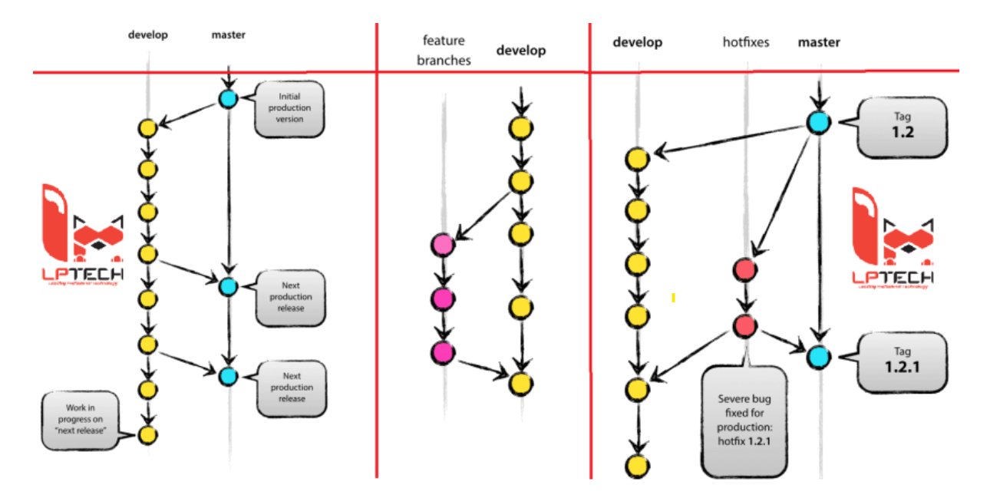

# GIT
- Giống các hệ thống quản lý phiên bản khác, Git cũng hỗ trợ quản lý code và lịch sử thay đổi. Tuy nhiên, Git ưu việt hơn vì có khả năng tách nhánh (branch), hỗ trợ rất tốt cho teamwork, những việc như phân chia task, tổng hợp code trở nên dễ dàng hơn nhiều.
- Git là một hệ thống quản lý phiên bản phân tán (distributed version control system). Nhờ Git, việc quản lý code và làm việc nhóm của developer trở nên đơn giản, thuận tiện hơn.

## LỢI ÍCH
- Dễ sử dụng, thao tác nhanh gọn lẹ rất an toàn.
- Dẽ dàng kết hợp các phân nhánh (branch), có thể giúp quy trình làm việc code theo nhóm đơn giản hơn rất nhiều.
- Chỉ cần clone mã nguồn từ kho chứa hoặc clone một phiên bản thay đổi nào đó từ kho chứa, hoặc một nhánh nào đó từ kho chứa là bạn có thể làm việc ở mọi lúc mọi nơi.
- Deployment sản phẩm của bạn một cách không thể nào dễ dàng hơn.

## THUẬT NGỮ QUAN TRỌNG

### 1. Working directory

- Là thư mục mà chúng ta đang làm việc, bao gồm toàn bộ file và thư mục con trong nó.

### 2.Staging area

- Thuật ngữ Staging aria là thuật ngữ giải thích cho tập hợp toàn bộ các file đã được chỉnh sửa và nằm trong Working directory.
- Chỉ các file nằm trong khu vực Staging area mới được phép commit.

### 3. Local repository

- Là repository ở trên máy tính của chính bản thân mình, dành cho một người dùng sử dụng.

### 4. Remote repository

- Là repository dùng để chia sẻ giữa nhiều người và bố trí trên server chuyên dụng.

## CÁC LỆNH GIT CƠ BẢN

1. Git config
- Tác dụng : Để set user name và email của bạn trong main configuration file.
- Cách xài : 
    - Để kiểm tra tên và kiểu email trong cấu hình dùng `git config -- global user.name` và `git config -- global user.email`.
    - Để set email hoặc tên mới git config -- global user.name = “Hải Nguyễn” và git config -- global user.email = “hainguyen@gmail.com”
2. git init
- Tác dụng : Khởi tạo 1 git repository 1 project mới hoặc đã có.
- Cách xài: `git init` trong thư mục gốc của dự án.
3. git clone
- Tác dụng: Copy 1 git repository từ remote source.
- Cách xài: `git clone <:clone git url:>`
4. git status
- Tác dụng: Để check trạng thái của những file bạn đã thay đổi trong thư mục làm việc. VD: Tất cả các thay đổi cuối cùng từ lần commit cuối cùng.
- Cách xài: git status trong thư mục làm việc.
5. git add
- Tác dụng: Thêm thay đổi đến stage/index trong thư mục làm việc.
- Cách xài: git add
6. git commit
- Tác dụng: commit nghĩa là một action để Git lưu lại một snapshot của các sự thay đổi trong thư mục làm việc. Và các tập tin, thư mục được thay đổi đã phải nằm trong Staging Area. Mỗi lần commit nó sẽ được lưu lại lịch sử chỉnh sửa của code kèm theo tên và địa chỉ email của người commit. Ngoài ra trong Git bạn cũng có thể khôi phục lại tập tin trong lịch sử commit của nó để chia cho một branch khác, vì vậy bạn sẽ dễ dàng khôi phục lại các thay đổi trước đó.
- Cách dùng: `git commit -m ”Đây là message, bạn dùng để note những thay đổi để sau này dễ dò lại”`
7. git push/ git pull
- Tác dụng: Push hoặc Pull các thay đổi đến remote. Nếu bạn đã added và committed các thay đổi và bạn muốn đẩy nó lên hoặc remote của bạn đã update và bạn apply tất cả thay đổi đó trên code của mình.
- Cách dùng: `git pull <:remote:> <:branch:>` and `git push <:remote:> <:branch:>`
8. git branch
- Tác dụng: liệt kê tất cả các branch (nhánh).
- Cách dùng: git branch hoặc git branch -a
9. git checkout
- Tác dụng: Chuyển sang branch khác
- Cách dùng: git checkout <: branch:> hoặc ** _ git checkout -b <: branch:> nếu bạn muốn tạo và chuyển sang một chi nhánh mới.

10. git stash
- Tác dụng: Lưu thay đổi mà bạn không muốn commit ngay lập tức.
- Cách dùng: git stash trong thư mục làm việc của bạn.

11. git merge
- Tác dụng: Merge 2 branch lại với nhau.
- Cách dùng: Chuyển tới branch bạn muốn merge rồi  dùng `git merge <:branch_ban_muon_merge:>`

12. git remote
- Tác dụng: Để check remote/source bạn có hoặc add thêm remote
- Cách dùng: git remote để kiểm tra và liệt kê. Và git remote add <: remote_url:> để thêm.
13. git add
- Tác dụng: Để đưa một tập tin vào Staging Area
- Cách dùng: git add tên_file hoặc muốn thêm hết file của thư mục thì git add all

# GIT FLOW

- Git Flow là tên gọi của 1 toll hỗ trợ branch model gọi là A successful Git branching model do Vincent Driessen đề xuất ra. Người ta thường gọi đó là model hay tool.
- Có 5 kiểu với mỗi vai trò khác nhau. 
- Switch các kiểu với nhau để phát triển bằng việc set trước các branch, những rule khi merge , dù có bao nhiêu developer cùng thời điểm phát triển cũng có thể quản lý branch dễ dàng, và tránh được những cấn đề do merge tiếp theo. 

## Mục đích
- Các nhóm công việc triển khai song song nhưng không ảnh hưởng tới nhau
- Các môi tường devlopment, staging và production tách biệt giúp quá trình kiểm thử (Quality Assurance = Đảm bảo chất lượng), trả lại feedback(phản hồi) và xử lý các issue được gọn gàng và thống nhất.
## Ý tưởng
- Duy trì các nhánh branch không đổi, tức không xóa trong suốt dòng đời sản phẩm. 
- Branch master sẽ luôn là branch chính áp dụng cho prodution (sản xuất), trong khi các branch hotfix, features hay develop cung cấp các bản để phục vụ QA( Quality Assurance) và hoàn thiện trước khi được đẩy lên master.
- Khác với cách thông thường tạo ra nhiều vấn đề xảy ra ngay trên production. Git Flow đẩy quá trình QA vào một phần bắt buộc cho cả developer và team QA yêu cầu sự hoàn thiện cao hơn về chất lượng đầu ra.

## Các nhánh trong git-flow

- Git-flow gồm có
    - 2 nhánh chính: 
        - Master và Develop
    - 3 nhánh phụ:
        - Feature
        - Release
        - HotFix
### 1. Nhánh Master
- Là branch được tạo mới repository và tạo mặt định trong Git. Trong git-flow thì ta không commit trực tiếp vào master, mà đây chỉ là branch dùng để thực hiện merge.

### 2. Nhánh Develop 

- Là branch trung tâm cho việc phát triển. Do với mỗi thay đổi ta lại ngắt branch feature tương ứng cho nên có thể nói đây là branch được dùng nhiều nhất trong quá trình phát triển. Cần đặt tên branch sao cho người khác có thể thấy ngay nội dung thay đổi là gì. Mỗi branch được ngắt ra để làm này sau khi làm xong ta lại merge vào develop, merge xong sẽ xóa nó đi.

### 3. Nhánh Release 
- Tách từ branch develop
- Merge vào develop và master
- Đặt tên : release-*

- Dùng để release sản phẩm như đúng tên gọi của nó. Khi release sản phẩm thì có rất nhiều task liên quan khác cần thiết, những task liên quan đó sẽ được release trên branch release mà ta ngắt từ branch develop. Sau khi release xong sẽ merge vào branch master và branch develom ghi release tag vào merge commit của branch master sau đó xóa branch release đi.

### 4. Nhánh Hotfix

- Tách từ master
- Merge vào develop và master
- Đặt tên : hotfix-*

- Khi release sản phẩm đôi khi phát hiện những bug rất nghiêm trọng. Những lúc như này ta sẽ ngắt ra branch hotfix trực tiếp từ branch master để tiến hành sửa, sau khi sửa xong sẽ merge vào master và develop và ghi release tag. Sau đó sẽ xoá branch hotfix đi.
- Ưu điểm của việc tách nhánh này ở chỗ các team members khác có thể tiếp tục công việc ở develop trong khi những người khách có thể tập trung vào fix bug của prodution.

### 5. Nhánh Feature

- Tách từ develop
- Merge vào develop
- Đặt tên: tự do ngoại trừ `master`, `develop`, `release-*`, `hotfix-*`

- Sử dụng để phát triển các feature mới phục vụ cho release sau này.
- Khi bắt đầu phát triển một chức năng, có thể chưa rõ thời điểm chức năng đó được tích hợp vào hệ thống và release. Feature branch sẽ tồn tại trong quá trình chức năng được phat triển, cuối cùng sẽ được merge lại vào develop hoặc bị bỏ đi nếu chức năng đó không còn cần thiết
- Chỉ tồn tại ở repos của developers chứ không ở origin