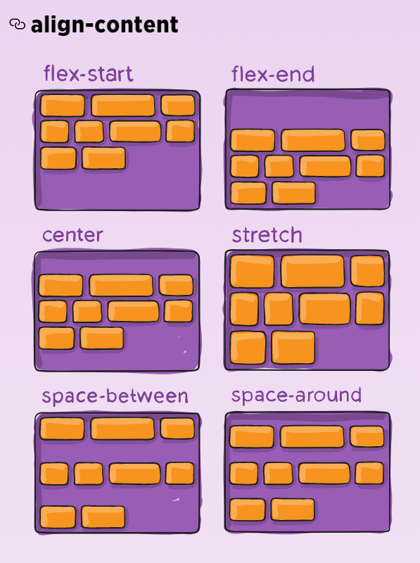

# CSS3

> CSS là chữ viết tắt của Cascading Style Sheets, nó là một ngôn ngữ được sử dụng để tìm và định dạng lại các phần tử được tạo ra bởi các ngôn ngữ đánh dấu (HTML).

> CSS3 là phiên bản thứ 3 và cũng là mới nhất của CSS. CSS3 được thừa hưởng và có bổ sung thêm nhiều tính năng mới tiện lợi hơn so với CSS.

## 1. Quá trình tải CSS

---


## 2. Cách nhúng CSS:

---

Có 3 cách nhúng CSS vào website:

- `Inline CSS` – Nhúng trực tiếp vào tài liệu HTML thông qua cặp thẻ `<style> </style>`.
- `Internal CSS` – dùng thẻ `<style>` bên trong thẻ `<head>` của `HTML` để tạo ra nơi viết mã CSS.
- `External CSS` – Tạo một tập tin .css riêng và nhúng vào tài liệu HTML thông qua cặp thẻ `<link>`.


## 3. Cấu trúc và Box Model của 1 bộ CSS:

---


Bố cục CSS thường chủ yếu dựa vào hình hộp và mỗi hộp đều chiếm những khoảng trống trên trang với các thuộc tính như:

- `Content` - Nội dung của hộp, nơi văn bản và hình ảnh xuất hiện
- `Padding`: Gồm không gian xung quanh nội dung (ví dụ: xung quanh đoạn văn bản).
- `Border`: Là đường liền nằm ngay bên ngoài phần đệm.
- `Margin`: Là khoảng cách xung quanh bên ngoài của phần tử.
- Chiều rộng của phần tử: (Total width)

  > TW = width + left padding + right padding + left border + right border + left margin + right margin

- Chiều cao của phần tử: (Total height)

  > TH = height + top padding + bottom padding + top border + bottom border + top margin + bottom margin

- `Box-sizing`: xác định kích cỡ của phần tử.
  - `content-box`: mặc định. Cách tính bỏ qua `padding, margin, border`, chỉ tính `width, height` dựa trên `content`.
  - `border-box`: Cách tính tất cả: `content, padding, border, margin`.

## 4. Giải quyết khai báo CSS xung đột (xếp tầng):

---


Các `declarations` có thể đến từ nhiều nguồn khác nhau nên browser sẽ chọn bộ CSS theo quy tắc:

> `Important > Specificity > Source Order`

Cụ thể:

### 4.1. `Important`:

- Định nghĩa CSS mà có `!important` sẽ được ưu tiên nhất. Tuy nhiên việc làm dụng `!important` sẽ gây khó khăn cho việc bảo trì.
- Khi các rule có cùng mức độ quan trọng (importance), browser sẽ đi so sánh mức độ chi tiết (specificities).

### 4.2. `Specificity`:

- Khi có nhiều quy tắc cùng áp dụng cho 1 element, browser sẽ tính toán 4 giá trị sau và đem ra so sánh, sau đó chọn rule nào có giá trị cao nhất để đem ra hiển thị. Thứ tự:
  1. Inline styles
  2. IDs.
  3. Classes, pseudo-classes, attributes
  4. Elements, pseudo-elements

### 4.3. `Source order`

- Khi các css declaration có cùng specificity, declarations cuối cùng trong code sẽ được chọn.

- Nếu muốn dùng css của bên thứ 3, bạn nên đặt author stylesheet phía dưới cùng.

## 5. Bộ chọn SELECTOR

```html
<div class="container">
  <div class="paragraph-container">
    <p id="hola-id" class="hola-class">Hola World</p>
    <p class="hello-class">Hello World</p>
    <p class="hello-class again-class">Hello Again World</p>
  </div>
</div>
```

### 5.1. Bộ chọn cơ bản:

- Chọn các phần tử dựa trên `tag name`, `id`, `class`

### 5.2. Descendant CSS Selector:

- Đây là các CSS Selector để chọn hậu duệ của bất kỳ phần tử nào.
- `Any descendant selector: A B.` Chọn bất kỳ phần tử B nào là hậu duệ của A. Hậu duệ có thể được lồng rất sâu. Kết hợp với `*` để chọn tất cả các phần tử hậu duệ
- `Child Selector: A > B`. CSS Selector này chỉ chọn hậu duệ trực tiếp.

```css
.container .hello-class {
  color: red;
}
/* anh 1 */
.paragraph-container * {
  color: blue;
}
/* anh 2 */
.paragraph-container > .hello-class {
  color: hotpink;
}
```

&nbsp;

### 5.3. Multiple CSS Selector:

- Multiple CSS Selector cho phép chúng ta chọn nhiều phần tử không liên quan với nhau.

```css
.outside-class,
.again-class,
.hola-class {
  color: purple;
}
```


### 5.4. Combination CSS Selector:

- Combination CSS Selector cho phép bạn chọn thành phần rất cụ thể bằng nhiều tham chiếu.
- `Combination CSS Selector: AB`. Cho phép chọn phần tử chứa cả A và B. Chúng sát nhau.

```css
p#hola-id {
  color: blue;
}
.hello-class.active {
  color: red;
}
```


### 5.5. Sibling CSS Selector:

- Sibling CSS Selector nhắm chọn các phần tử anh chị em.
- `Bộ chọn Anh / Chị / Em liền kề (Nghiêm ngặt): A + B`. Nhắm mục tiêu một phần tử anh chị em được đặt ngay sau phần tử đó. Nếu cách 2 phần tử sẽ không hoạt động.
- `Bộ chọn Anh / Chị / Em liền kề (Không nghiêm ngặt): A ~ B`. Giống như bộ chọn bên trên nhưng không giới hạn 1 phần tử đầu tiên.

```css
#hola-id + .again-class {
  color: blue;
}
#hola-id ~ .hello-class {
  color: red;
}
```


### 5.6. Pesudo CSS Selector:

a. `Pesudo Element`:

- Syntax:
  > `selector::pseudo-element { property: value; }`
- `:first-line`: Áp dụng cho element con đầu tiên trong element cha
- `:first-letter`: Áp dụng cho chữ cái đầu tiên trong element
- `::before`: Dùng để chèn một số nội dung vào trước nội dung của một element
- `::after`: Dùng để chèn một số nội dung vào sau nội dung của một element
- `::mark`: Sử dụng cho các điểm đánh dấu của các mục danh sách
- `::selection`: Áp dụng kiểu cho các phần tử được người dùng đánh dấu (nhấp chuột hoặc kéo chuột qua văn bản)

b. `Pseudo Classes`:

- Syntax:
  > `selector:pseudo-class { property: value; }`
- `Anchor Pseudo-class`: các liên kết có thể được hiển thị theo nhiều cách khác nhau.

  - `:link`: Trạng thái hiện tại của thẻ (chỉ dùng cho thẻ `a`).
  - `:visited`: Trạng thái khi đã click vào thẻ (chỉ dùng cho thẻ `a`).
  - `:hover`: Trạng thái khi di chuyển chuột vào thẻ (dùng cho nhiều thẻ).
  - `:active`: Trạng thái khi click chuột vào thẻ (dùng cho nhiều thẻ).

- Các `Pseudo-class` khác:

  - `:First-child `: element được chỉ định là element con đầu tiên của element khác.
  - `:Last-child `: Tương tự first-child nhưng là element con cuối cùng
  - `:first-of-type` Với mọi element là element con đầu tiên, của một kiểu cụ thể, của element cha của nó.
  - `:last-of-type` Với mọi element là element con cuối cùng, của một kiểu cụ thể, của element cha của nó.
  - `:nth-child(n)`: Với mọi element là element con thứ n , bất kể kiểu, của element cha của nó. (n có thể là một số, một từ khóa hoặc một công thức.).
  - `:nth-last-child(n)`: Tương tự như child nhưng tính từ element cuối cùng lên.
  - `:nth-last-of-type(n)`:Với mọi element là element con thứ n , của một kiểu cụ thể, của cha mẹ của nó, tính từ element cuối cùng.
  - `:nth-of-type(n)`:Với mọi element là element con thứ n , của một kiểu cụ thể, của element cha của nó.
  - `:only-of-type`: chọn element là con duy nhất của loại nó là con của element cha.
  - `only-child`: trong element cha chỉ có duy nhất 1 element nếu có > 1 thì không được chọn.
  - `:checked `: Với mọi element `<input>` đã chọn (chỉ dành cho các type radio và checkbox) và element `<option>`.
  - `:disabled`: Với mọi element bị disable (chủ yếu được sử dụng trên các element biểu mẫu).
  - `:enabled`: Với mọi element enable (chủ yếu được sử dụng trên các element biểu mẫu).
  - `:empty `: Với mọi element không có element con (bao gồm cả các nút văn bản).
  - `:focus`: dùng để chọn element được focus vào.
  - `:in-range`: chọn tất cả các element có giá trị nằm trong một phạm vi xác định.(trong vùng min - max).
  - `:out-of-range`: chọn tất cả các element có giá trị nằm trong một phạm vi xác định.(ngoài vùng min - max).
  - `:invalid`: chọn các form elements có giá trị không xác thực theo cài đặt của element. (chỉ hoạt động cho các form elements có giới hạn, chẳng hạn như element đầu vào có thuộc tính tối thiểu và tối đa, trường email không có email hợp pháp hoặc trường số không có giá trị số, v.v.).
  - `:valid`: chọn các form elements có giá trị xác thực theo cài đặt của element. (chỉ hoạt động cho các form elements có giới hạn, chẳng hạn như element đầu vào có thuộc tính tối thiểu và tối đa, trường email không có email hợp pháp hoặc trường số không có giá trị số, v.v.).
  - `:lang()`: chọn được sử dụng để chọn các element có attribute lang với giá trị được chỉ định. Giá trị của `lang="value"` thường là mã ngôn ngữ gồm 2 chữ cái.
  - `:not(selector)`: Mọi element KHÔNG phải là element / bộ chọn được chỉ định.
  - :`optional`: Những input không có attribute `required` thì sẽ được chọn (chỉ dùng cho thẻ `input`, `select`, `textarea`)
  - `:read-only`: Những form elements có attribute `readonly` sẽ được chọn
  - `:read-write`: Những form elements `có thể đọc` và `có thể ghi` sẽ được chọn (những element có attribute `readonly` và `disable` sẽ không được chọn).
  - `:required`: Những form elements có attribute `required` sẽ được chọn (chỉ áp dụng cho các thẻ `input`, và `textarea`.)
  - `:root`: Chọn phần tử `root`.
  - `:target`: chọn những element có `id` trùng với `href` trong thẻ `a`

### 5.7. Attribute CSS Selector:

```html
<div for="chocolate">Chocolate</div>
<div for="peanut">Peanut</div>
<div for="butter">Butter</div>
<div>Jelly</div>
```

- Bộ chọn thuộc tính CSS (Attribute CSS Selector) sử dụng để chọn thuộc tính HTML (HTML Attributes).
- `Bộ chọn thuộc tính cơ bản: A[B]`. Chọn tất cả các phần tử A có thuộc tính B.

```css
div[for] {
  color: red;
}
```

- `Bộ chọn thuộc tính cụ thể: A[B="C"]`. Chọn các phần tử A có thuộc tính B với giá trị là C.

```css
div[for="chocolate"] {
  color: blue;
}
```

- `Bộ chọn thuộc tính cụ thể (Bắt đầu với ...): A[B^="C"]`. Chọn tất cả các phần tử A có thuộc tính B với giá trị bắt đầu là C. Ký tự ^ là ký tự thể hiện chuỗi bắt đầu (trong Biểu thức chính quy (Regex)).

```css
div[for^="cho"] {
  color: magenta;
}
```

- `Bộ chọn thuộc tính cụ thể (Kết thúc với ...): A[B$="C"]`. Chọn tất cả các phần tử A có thuộc tính B với giá trị kết thúc là C. Ký tự $ là ký tự thể hiện chuỗi kết thúc trong (Biểu thức chính quy (Regex)).

```css
div[for$="er"] {
  color: yellow;
}
```

- `Bộ chọn thuộc tính cụ thể (Chứ ký tự ...): A[B*="C"]`. Chọn tất cả phần tử A với thuộc tính B chứa giá trị C.

```css
div[for*="ut"] {
  color: cyan;
}
```

## 8. CSS Layout - float và clear:

### 8.1. FLOAT:

- Thuộc tính `float` được sử dụng để định vị và định dạng nội dung, ví dụ: để một hình ảnh trôi sang trái với văn bản trong một vùng chứa..
- Các giá trị:
  - `none` - Phần tử không nổi (sẽ được hiển thị ngay tại nơi nó xuất hiện trong văn bản). Đây là mặc định
  - `left` - Phần tử nổi ở bên trái vùng chứa của nó
  - `right` - Phần tử nổi ở bên phải vùng chứa của nó
  - `inherit` - Phần tử kế thừa giá trị float của phần tử cha của nó

```css
img {
  float: right;
}
```


```css
img {
  float: none;
}
```


### 8.2. CLEAR:

- Thuộc tính `clear` chỉ định những phần tử nào có thể trôi nổi bên cạnh phần tử đã xóa và ở phía nào.
- Các giá trị:

  - `none` - Cho phép các phần tử nổi trên cả hai mặt. Đây là mặc định
  - `left` - Không cho phép phần tử nổi ở phía bên trái
  - `right`- Không cho phép các phần tử nổi ở phía bên phải
  - `both` - Không cho phép phần tử nổi ở bên trái hoặc bên phải
  - `inherit` - Phần tử kế thừa giá trị rõ ràng của phần tử gốc của nó


- `overflow: auto;`: khắc phục phần tử "tràn" ra bên ngoài vùng chứa của nó.

```css
.clearfix {
  overflow: auto;
}
```


## 9. Position:

- Thuộc tính `Position` chỉ định loại phương pháp định vị được sử dụng cho một phần tử (static, relative, absolute, fixed, or sticky).
- Syntax:
  > `position: static|absolute|fixed|relative|sticky|initial|inherit;`
- Các giá trị:

  - `static`: Giá trị mặc định. Các phần tử hiển thị theo thứ tự, khi chúng xuất hiện trong luồng tài liệu
  - `absolute`: Phần tử được định vị tương đối với phần tử cha được định vị đầu tiên (not static) của nó
  - `fixed`: Phần tử được định vị liên quan đến cửa sổ trình duyệt
  - `relative`: Phần tử được định vị so với vị trí bình thường của nó, thường đi kèm với `left, right, top, bottom` để xác định vị trí
  - `sticky` Phần tử được định vị dựa trên vị trí cuộn của người dùng.

    &nbsp;&nbsp;&nbsp;&nbsp;&nbsp;&nbsp;&nbsp;Một phần tử `sticky` chuyển đổi giữa `relative` và `fixed`, tùy thuộc vào vị trí cuộn. Ban đầu nó là `relative` đến khi cuộn đến vị trí bù nhất định trong khung nhìn - nó sẽ chuyển sang `sticky` (như vị trí: fixed).

  - `initial`: Đặt thuộc tính này thành giá trị mặc định của nó.
  - `ỉnherit`: Kế thừa thuộc tính này từ phần tử mẹ của nó.

  

## 10. Display:

- Thuộc tính `Display` chỉ định hành vi hiển thị (kiểu hộp kết xuất) của một phần tử.
- Các giá trị `flex` và `inline-flex` yêu cầu tiền tố `-webkit-` để hoạt động trong Safari.
- Syntax:
  > `display: value;`
- Các giá trị:

  - `inline`: Hiển thị một phần tử dưới dạng phần tử nội tuyến(như `<span>`). Mọi thuộc tính chiều cao và chiều rộng sẽ không có hiệu lực.
  - `block`: Hiển thị một phần tử dưới dạng phần tử khối(như `<p>`). Nó bắt đầu trên một dòng mới và chiếm toàn bộ chiều rộng.
  - `contents`: Làm cho vùng chứa biến mất, biến các phần tử con của phần tử lên cấp tiếp theo trong DOM
  - `flex`: Hiển thị một phần tử dưới dạng vùng chứa linh hoạt cấp khối.
  - `grid`: Hiển thị một phần tử dưới dạng vùng chứa lưới cấp khối.
  - `inline-block`: Hiển thị một phần tử dưới dạng vùng chứa khối nội tuyến. Bản thân phần tử được định dạng là phần tử nội tuyến, nhưng bạn có thể áp dụng các giá trị chiều cao và chiều rộng
  - `inline-flex`: Hiển thị một phần tử dưới dạng vùng chứa linh hoạt cấp nội tuyến.
  - `inline-grid`: Hiển thị một phần tử dưới dạng một vùng chứa lưới cấp nội tuyến
  - `inline-table`: Phần tử được hiển thị dưới dạng bảng nội tuyến
  - `list-item`: làm cho phần tử hoạt động giống như một phần tử `<li>`.
  - `run-in` Hiển thị một phần tử dưới dạng khối hoặc nội dòng, tùy thuộc vào ngữ cảnh.
  - `table`: làm cho phần tử hoạt động giống như một phần tử `<table>`.
  - `table-caption`: làm cho phần tử hoạt động giống như một phần tử `<caption>`.
  - `table-column-group`: Để phần tử hoạt động giống như một phần tử `<colgroup>`.
  - `table-header-group`: Để phần tử hoạt động giống như phần tử `<thead>`.
  - `table-footer-group`: Để phần tử hoạt động giống như phần tử `<tfoot>`.
  - `table-row-group`: Để phần tử hoạt động giống như phần tử `<tbody>`.
  - `table-cell`: Để phần tử hoạt động giống như một phần tử `<td>`.
  - `table-column`: Để phần tử hoạt động giống như một phần tử `<col>`.
  - `table-row`: Để phần tử hoạt động giống như một phần tử `<tr>`.
  - `none`: Phần tử bị loại bỏ hoàn toàn.
  - `initial`: Đặt thuộc tính này thành giá trị mặc định của nó.
  - `inherit`: Kế thừa thuộc tính này từ phần tử mẹ của nó.

  [Link demo](https://www.w3schools.com/cssref/playit.asp?filename=playcss_display&preval=table-column-group)

## 11. Grid Layout:

- `Grid Layout`: cung cấp một hệ thống bố cục dựa trên lưới, với các hàng và cột, giúp thiết kế các trang web dễ dàng hơn mà không cần phải sử dụng float và position.

### 11.1 Grid Container:

- Bố cục lưới bao gồm một phần tử mẹ, với một hoặc nhiều phần tử con.
- Tất cả các con trực tiếp của vùng chứa lưới sẽ tự động trở thành các mục lưới.
- Phần tử HTML trở thành vùng chứa lưới khi `display: grid or inline-grid`.
- Các thuộc tính:

  - `row-gap`: Chỉ định khoảng cách giữa các hàng lưới.
  - `column-gap`: Chỉ định khoảng cách giữa các cột
  - `gap`: Một thuộc tính viết tắt cho các thuộc tính `row-gap` và `column-gap`.
  - `grid-row-gap`: Chỉ định kích thước của khoảng cách giữa các hàng.
  - `grid-column-gap`: Chỉ định kích thước của khoảng cách giữa các cột.
  - `grid-gap`: Một thuộc tính viết tắt cho các thuộc tính `grid-row-gap` và `grid-column-gap`.

  ```css
  .grid-container {
    display: grid;
    grid-template-columns: auto auto auto auto;
    <!-- Cách viết cũ -->
    grid-gap: 20px 10px;
    <!-- Cách viết mới -->
    gap: 20px 10px;
    background-color: #2196f3;
  }
  ```

    

  - `grid-template-areas`: Chỉ định cách hiển thị cột và hàng, sử dụng các mục lưới được đặt tên.
  - `grid-template-columns`: Chỉ định kích thước của các cột và số lượng cột trong một bố cục lưới.
  - `grid-template-rows`: Chỉ định kích thước của các hàng trong bố cục lưới.
  - `grid-template` Một thuộc tính viết tắt cho các thuộc tính `grid-template-rows, grid-template-columns và grid-area`.
  - `grid`: Thuộc tính viết tắt cho các thuộc tính `grid-template-rows, grid-template-columns, grid-template-areas, grid-auto-rows, grid-auto-columns, và grid-auto-flow`.

  ```css
  #page {
    display: grid;
    width: 100%;
    height: 250px;
    grid-template-areas:
      "head head"
      "nav  main"
      "nav  foot";
    grid-template-rows: 50px 1fr 30px;
    grid-template-columns: 150px 1fr;
  }
  ```

    

  - `grid-auto-columns`: Chỉ định kích thước cột mặc định.
  - `grid-auto-rows`: Chỉ định kích thước hàng mặc định.

  ```css
  #grid {
    display: grid;
    grid-template-areas: "a b";
    gap: 10px;
    grid-auto-columns: 200px;
    grid-auto-rows: 100px;
  }
  ```

  

  - `grid-auto-flow`: Chỉ định cách các mục được đặt tự động được chèn vào lưới.

  

- Một vài thuộc tính đi kèm:

  - `justify-items`: Căn chỉnh nội dung bên trong grid item theo trục dọc. Các giá trị: `start, end, center, stretch`.
  - `align-items`: Căn chỉnh nội dung bên trong grid item theo trục ngang. Các giá trị: `start, end, center, stretch`.
  - `place-items`kết hợp 2 thuộc tính `align-items` và `justify-items` trong một khai báo.

  &nbsp;
  

  - `justify-content`: Căn chỉnh nội dung trong vùng chứa lưới, căn theo trục dọc. Các giá trị: `start | end | center | stretch | space-around | space-between | space-evenly`.
  - `align-content`: Thuộc tính này căn chỉnh lưới dọc theo trục khối (cột) (trái ngược với justify-content căn chỉnh lưới dọc theo trục (hàng) nội tuyến).
  - `place-content`: kết hợp 2 thuộc tính `align-content` và `justify-content` trong một khai báo.

  &nbsp;
   <br><br><br><br><br><br>

  &nbsp;
  <br><br>

  &nbsp;
  <br><br><br><br><br><br><br><br><br><br><br><br><br><br><br><br><br><br><br>

### 11.2 Grid Item:

- Thuộc tính dành cho các phần tử con trong Grid.

  - `grid-column-end`: Chỉ định nơi kết thúc mục lưới.
  - `grid-column-start`: Chỉ định nơi bắt đầu mục lưới.
  - `grid-column`: thuộc tính viết tắt cho thuộc tính `grid-column-start` và `grid-column-end`.
  - `grid-row-start`: Chỉ định nơi bắt đầu mục lưới.
  - `grid-row-end`: Chỉ định nơi kết thúc mục lưới.
  - `grid-row`: Một thuộc tính viết tắt cho thuộc tính `grid-row-start` và `grid-row-end`.
  - `grid-area`: Chỉ định tên cho mục lưới hoặc thuộc tính này là thuộc tính viết tắt cho các thuộc tính `grid-row-start, grid-row-end, grid-column-start và grid-column-end`.

  ```css
  .box1 {
    grid-column-start: 1;
    grid-column-end: 4;
    grid-row-start: 1;
    grid-row-end: 3;
  }

  .box2 {
    grid-column-start: 1;
    grid-row-start: 3;
    grid-row-end: 5;
  }
  ```

  

- Một vài thuộc tính đi kèm:

  - `align-self`: Căn chỉnh một mục lưới bên trong một ô dọc theo trục khối (cột). Giá trị này áp dụng cho nội dung bên trong một mục lưới.Các giá trị: `start, end, center, stretch`.
  - `justify-self` là thuộc tính sử dụng để căn chỉnh các item được chỉ định riêng. Các giá trị: `start, end, center, stretch`.
  - `place-self`: kết hợp 2 thuộc tính `align-self` và `justify-self` trong một khai báo.

  [Xem thêm](https://css-tricks.com/snippets/css/complete-guide-grid/)

## 12. Flex Box:

- `Flex Box`: giúp dễ dàng thiết kế cấu trúc bố cục đáp ứng linh hoạt mà không cần sử dụng `float` hoặc `position`.
- Bố cục `Flexbox` thích hợp nhất với các thành phần của ứng dụng và bố cục quy mô nhỏ, trong khi bố cục `Grid` dành cho các bố cục quy mô lớn hơn.

  

### 12.1 Flex Container:

- Phần tử HTML trở thành vùng chứa flex khi dùng `display: flex or inline-flex;`
- Các thuộc tính:

  - `flex-direction`: xác định hướng các mục flex được đặt trong vùng chứa flex.

  ```css
  .container {
    flex-direction: row | row-reverse | column | column-reverse;
  }
  ```

  

  - `flex-wrap`: xác định các mục flex có được bọc lại hay không.

  ```css
  .container {
    flex-wrap: nowrap | wrap | wrap-reverse;
  }
  ```

  

  - `flex-flow`: là thuộc tính kết hợp cả `flex-direction` và `flex-flow`.

  ```css
  .container {
    flex-flow: column wrap;
  }
  ```

  - `justify-content`: phân phối các mục ra không gian trống còn lại theo trục chính. Nó cũng kiểm soát việc căn chỉnh của các mục khi chúng tràn dòng.

  ```css
  .container {
    justify-content: flex-start | flex-end | center | space-between |
      space-around | space-evenly | start | end | left | right... + safe |
      unsafe;
  }
  ```

  

  - `align-items`: xác định các mục được bố trí dọc theo trục phụ trên dòng hiện tại.

  ```css
  .container {
    align-items: stretch | flex-start | flex-end | center | baseline | first
      baseline | last baseline | start | end | self-start | self-end +... safe |
      unsafe;
  }
  ```

  

  - `align-content`: căn chỉnh các dòng của vùng chứa linh hoạt bên trong khi có thêm khoảng trống trong trục phụ.

  ```css
  .container {
    align-content: flex-start | flex-end | center | space-between | space-around
      | space-evenly | stretch | start | end | baseline | first baseline | last
      baseline +... safe | unsafe;
  }
  ```

  

### 12.2 Flex Item:

- Các thuộc tính:

  - `order`: kiểm soát thứ tự mà chúng xuất hiện trong vùng chứa linh hoạt.

  ```css
  .item {
    order: 5; /* default is 0 */
  }
  ```

  

  - `flex-grow`: chỉ định tỷ lệ không gian mà các mục sẽ chiểm trong vùng chứa linh hoạt.

  ```css
  .item {
    flex-grow: 2; /* default 0 */
  }
  ```

  

  - `flex-shrink`: xác định khả năng cho một mục có thể co lại nếu cần thiết.

  ```css
  .item {
    flex-shrink: 3; /* default 1 */
  }
  ```

      

  - `flex-basis`: chỉ định độ dài ban đầu của một mục linh hoạt.

  ```css
  .item {
    flex-basis: number|auto|initial|inherit;
  }
  ```

  

  - `flex`: là thuộc tính kết hợp `flex-grow, flex-shrink, flex-basis`.

  ```css
  .item {
    flex: none | [ < "flex-grow" > < "flex-shrink" >? || < "flex-basis" > ];
  }
  ```

  - `align-self`: canh chỉnh cho các mục linh hoạt riêng lẻ (có thể ghi đè). Tương tự `align-content`.

  ```css
  .item {
    align-self: auto | flex-start | flex-end | center | baseline | stretch;
  }
  ```

  

## 13. Responsive và Media Queries:

### `Responsive Web Design`:

- `Responsive Web Design` là cách sử dụng HTML và CSS để tự động thay đổi kích thước, ẩn, thu nhỏ hoặc phóng to một trang web để làm cho trang web trông đẹp mắt trên tất cả các thiết bị (máy tính để bàn, máy tính bảng và điện thoại).
- Để tạo một `Responsive Web`, thêm thẻ Meta Viewport:

```html
<meta name="viewport" content="width=device-width, initial-scale=1.0" />
```

  

- Responsive Image:

  - `width: 100%;`: khi thu phóng thì ảnh sẽ zoom theo, kích thước có thể lớn hơn ảnh gốc.
  - `max-width:100%;` khi thu phóng thì ảnh sẽ zoom
  - Thẻ `<picture>` cho phép bạn xác định các hình ảnh khác nhau cho các kích thước cửa sổ trình duyệt khác nhau.

  ```html
  <picture>
    <source srcset="./img_smallflower.jpg" media="(max-width: 500px)" />
    <source srcset="./img_flowers.jpg" media="(max-width: 800px)" />
    <source srcset="./flowers.jpg" />
    
  </picture>
  ```

- Responsive Text Size:

  - `Text Size`: có thể được đặt bằng đơn vị "vw", có nghĩa là "chiều rộng khung nhìn".

### `Media Query`:

- `Media Query`: là một trong những module mới được thêm vào trong CSS3. Nó là một sự cải thiện của Media Type đã có từ CSS2, bằng việc thêm vào những cú pháp query để ta có thể đáp ứng được cho nhiều device với nhiều kích cỡ màn hình khác nhau.
- Các giá trị của Media Type:
  - `All`: Dùng cho tất cả các loại Media Type
  - `Aural`: Dùng cho speech and sound synthesizers
  - `Braille`: Dùng cho các devices liên quan đến chữ nổi (braille)
  - `Embossed`: Dùng cho các loại máy in các trang braille
  - `Handheld`: Dùng cho các thiết bị nhỏ, thiết bị cầm tay
  - `Print`: Dùng cho máy in
  - `Projection`: Dùng cho các loại máy chiếu
  - `Screen`: Dùng cho computer screen
  - `Tty`: Dùng cho các thiết bị sử dụng fixed-pitch character grid
  - `Tv`: Dùng cho các loại TV
- Syntax:
  > @media media_type {rules}
- Biểu thức trong Media Type:
  ```css
  /*AND: cho phép thêm điều kiện bổ sung*/
  @media all and (min-width: 800px) and (max-width: 1024px) {
    ...;
  }
  /*NOT: phủ định truy vấn được xác định*/
  @media not screen and (color) {
    ...;
  }
  /*ONLY: áp dụng cho truy vấn thỏa mãn điều kiện*/
  @media only screen and (orientation: portrait) {
    ...;
  }
  ```
- Media Features trong Media Queries:

  - `Height & Width`: dùng để xác định chiều cao và chiều rộng cho viewport của thiết bị hoặc browser. Tiền tố min và max để xác định giới hạn màn hình.

  ```css
  @media all and (min-width: 320px) and (max-width: 780px) {
    ...;
  }
  ```

  - `Orientation: Portrait / Landscape`: dùng để xác định hướng của browser thiết bị, cho phép ta xác định thiết bị đang được xem nằm ở hướng dọc (portrait) hay ngang (landscape). Chủ yếu dùng trên các thiết bị di động.

  ```css
  @media all and (orientation: landscape) {
    ...;
  }
  ```

  - `Aspect Ratio`: chỉ định tỉ lệ chiều rộng\chiều cao của thiết bị mà truy vấn được áp dụng . Thường đi kèm với các tiền tố min và max.

  ```css
  @media all and (min-device-aspect-ratio: 16/9) {
    ...;
  }
  ```

  - `Resolution`: chỉ định độ phân giải của thiết bị đầu ra theo mật độ pixel, hay còn được gọi là điểm ảnh trên mỗi inch `(DPI - Dots Per Inch)` . Chúng sẽ đi kèm với số điểm ảnh trên mỗi pixel `dppx` và số điểm ảnh trên cm `dpcm`.

  ```css
  @media print and (min-resolution: 300dpi) {
    ...;
  }
  ```

### Hướng Responsive Desktop First và Mobile First:


- `Mobile First`: nghĩa là bạn luôn thiết kế ứng dụng cho màn hình mobile trước rồi mới đến các màn hình lớn dần.

```css
/*Smart phone nhỏ*/
@media screen and (min-width: 240px) {
}
/*Iphone(480 x 640)*/
@media screen and (min-width: 320px) {
}
/*Tablet nhỏ(480 x 640)*/
@media screen and (min-width: 480px) {
}
/*Ipad dọc(768 x 1024)*/
@media screen and (min-width: 768px) {
}
/*Ipad ngang(1024 x 768)*/
@media screen and (min-width: 1024px) {
}
```

- `Desktop First`: nghĩa là bạn sẽ thiết kế ứng dụng cho màn hình desktop trước rồi mới tinh chỉnh về các màn hình nhỏ hơn.

```css
@media screen and (max-width: 1200px) {
}
@media screen and (max-width: 1024px) {
}
@media screen and (max-width: 768px) {
}
@media screen and (max-width: 480px) {
}
@media screen and (max-width: 320px) {
}
```
