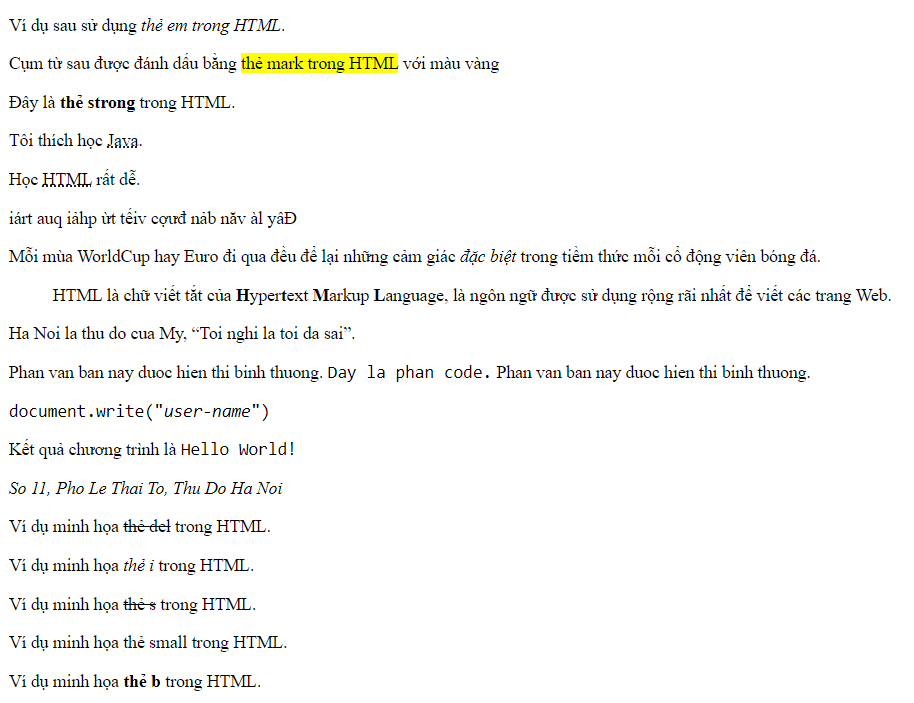

# Các thẻ xử lý Text

- `<em>`: dùng để nhấn mạnh văn bản trong HTML.

```html
<p>Ví dụ sau sử dụng <em>thẻ em trong HTML</em>.</p>
```

- `<mark>`: dùng để đánh dấu văn bản trong HTML.

```html
<p>
  Cụm từ sau được đánh dấu bằng <mark>thẻ mark trong HTML</mark> với màu vàng
</p>
```

- `<strong>`: dùng để hiển thị những văn bản quan trọng. Phần văn bản đó sẽ được in đậm hơn các phần văn bản khác.

```html
<p>Đây là <strong>thẻ strong</strong> trong HTML.</p>
```

- `<abbr>`: dùng để rút gọn văn bản. Thuộc tính title được sử dụng trong thẻ để chỉ ra ý nghĩa đầy đủ của chữ/cụm từ viết tắt khi ta rê chuột qua thẻ này.

```html
<p>Tôi thích học <abbr title="Ngôn ngữ lập trình Java">Java</abbr>.</p>
```

- `<acronym>`: dùng để hiển thị một tên lược danh, với thuộc tính title đi kèm.

```html
<p>Học <acronym title="Hyper Text Markup Language">HTML</acronym> rất dễ.</p>
```

- `<bdo>`: dùng để quyết định phương hướng của văn bản hiện tại.

```html
<p><bdo dir="rtl">Đây là văn bản được viết từ phải qua trái</bdo></p>
```

- `<dfn>` dùng để chỉ rõ rằng bạn đang giới thiệu một mục đặc biệt. Cách sử dụng của nó tương tự với cách làm in nghiêng từ trong giữa của đoạn văn.

```html
<p>
  Mỗi mùa WorldCup hay Euro đi qua đều để lại những cảm giác
  <dfn>đặc biệt</dfn> trong tiềm thức mỗi cổ động viên bóng đá.
</p>
```

- `<blockquote>`: dùng để trích dẫn một đoạn văn từ nguồn khác.

```html
<blockquote>
  HTML là chữ viết tắt của <b>H</b>yper<b>t</b>ext <b>M</b>arkup
  <b>L</b>anguage, là ngôn ngữ được sử dụng rộng rãi nhất để viết các trang Web.
</blockquote>
```

- `<q>`: được sử dụng khi bạn muốn thêm trích dẫn một câu vào trong dấu nháy kép.

```html
<p>Ha Noi la thu do cua My, <q>Toi nghi la toi da sai</q>.</p>
```

- `<code>`: bất kỳ code chương trình nào xuất hiện trên trang Web đều được đặt trong này.

```html
<p>
  Phan van ban nay duoc hien thi binh thuong.
  <code>Day la phan code.</code> Phan van ban nay duoc hien thi binh thuong.
</p>
```

- `<pre>`: thẻ này thường được sử dụng kết hợp với thẻ `<code>` để chỉ rõ rằng nội dung trong thẻ là một biến.

```html
<p><code>document.write("<var>user-name</var>")</code></p>
```

- `<samp>`: chỉ kết quả đầu ra mẫu của một chương trình. Nó hỗ trợ kiểu sample trong máy tính, và được sử dụng chính khi tài liệu lập trình hoặc mã hóa các khái niệm.

```html
<p>Kết quả chương trình là <samp>Hello World!</samp></p>
```

- `<address>`: dùng để hiển thị địa chỉ.

```html
<address>So 11, Pho Le Thai To, Thu Do Ha Noi</address>
```

- `<del>`: được sử dụng để đánh dấu văn bản bị xóa.

```html
<p>Ví dụ minh họa <del>thẻ del</del> trong HTML.</p>
```

- `<i>`:tạo phần văn bản in nghiêng.

```html
<p>Ví dụ minh họa <i>thẻ i</i> trong HTML.</p>
```

- `<s>`: Xác định phần văn bản bị gạch ngang.

```html
<p>Ví dụ minh họa <s>thẻ s</s> trong HTML.</p>
```

- `<small>`: Làm văn bản nhỏ hơn so với xung quanh.

```html
<p>Ví dụ minh họa <small>thẻ small</small> trong HTML.</p>
```

- `<b>`: Xác định phần văn bản bị in đậm.

```html
<p>Ví dụ minh họa <b>thẻ b</b> trong HTML.</p>
```


