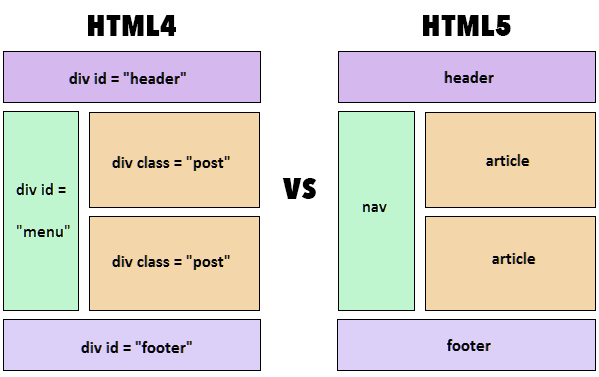

# Một số điểm khác biệt HTML5 vs HTML4

- SVG, canvas và những hình dạng vector đều được hỗ trợ bởi HTML5, khi HTML nếu muốn sử dụng hình vector chỉ có thể dùng nó trong một công nghệ khác như, Flash, VML và silver light.
- HTML5 sử dụng web SQL databases, application cache để lưu dữ liệu tạm, trong khi đó, HTML chỉ có cache của trình duyệt được dùng cho mục đích này.
- Một khác biệt nữa giữa HTML và HTML5 đáng nhắc đến là HTML không cho phép JavaScript chạy trong web browser (thay vì vậy nó chạy trong interface thread của browser), trong khi đó HTML5 hỗ trợ hoàn toàn cho JavaScript để chạy nền (nhờ vào JS web worker API của HTML5).
- HTML5 không dựa trên SGML, cho phép nó tăng luật parsing, có thể tương thích mạnh mẽ hơn
- Trong HTML5, inline MathML và SVG có thể được dùng trong văn bản nơi mà không được hỗ trợ trong HTML.
- Một số elements lỗi thời đã bị loại bỏ hoàn toàn là: isindex, noframes, acronym, applet, basefont, dir, font, frame, frameset, big, center, strike, tt.
- HTML5 hỗ trợ nhiều loại điều khiển form, ví dụ: ngày giờ, email, số lượng, khoảng, số điện thoại, URL, tìm kiếm, vâng vâng
- Có nhiều element được giới thiệu trong HTML. Một vài trong số chúng là quan trọng nhất: summary, time, aside, audio, command, data, datalist, details, embed, wbr, figcaption, figure, footer, header, article, hgroup, bdi, canvas, keygen, mark, meter, nav, output, progress, rp, rt, ruby, section, source, track, video.

    
