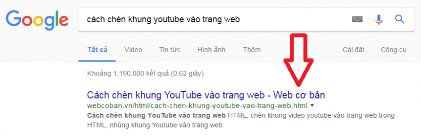
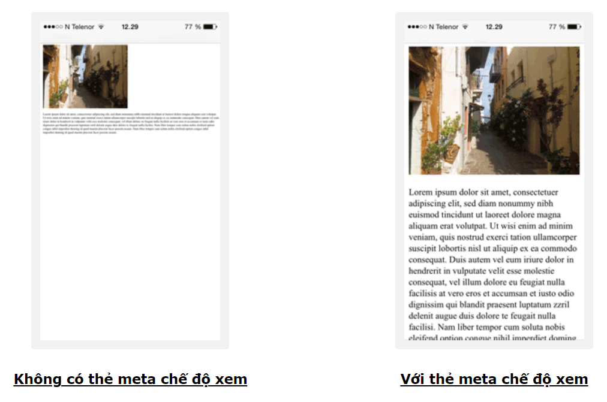

# THẺ `<META>`

## Các thuộc tính:

### 1. `Charset`

Chỉ định mã hoá ký tự cho tài liệu HTML.

```html
<meta charset="UTF-8" />
```

### 2. `name`

Xác định "tên của một loại thông tin" mà bạn muốn cung cấp thêm cho trang web.

- Các giá trị:

  - `application-name`:

    - Đi kèm với thuộc tính `content` - “mô tả tên của ứng dụng Web mà trang đó đại diện”. Nếu trang không phải là một ứng dụng, thẻ này không được sử dụng.
    - Các trình duyệt có thể sử dụng tên ứng dụng trong giao diện người dùng thay vì tên của trang title, vì tiêu đề có thể bao gồm các thông báo trạng thái và những thứ tương tự có liên quan đến trạng thái của trang tại một thời điểm cụ thể thay vì chỉ là tên của ứng dụng.

    ```html
    <meta name="application-name" content="StackOverflow" />
    ```

  - `author`: Xác định tên tác giả của trang web.

    ```html
    <meta name="author" content="Web cơ bản" />
    ```

    

  - `keywords`: Định nghĩa các từ khóa cho các công cụ tìm kiếm.
    ```html
    <meta name="keywords" content="HTML là gì?, Thẻ HTML meta" />
    ```
  - `description`: Mô tả ngắn gọn nội dung chính của trang web.
    ```html
    <meta name="description" content="Hướng dẫn HTML và CSS căn bản " />
    ```
  - `generator`: Xác định một trong các gói phần mềm được sử dụng để tạo tài liệu.
    ```html
    <meta name="generator" content="WordPress 3.0.1" />
    ```
  - `viewport`: Thiết lập khung nhìn để trang web dễ nhìn trên tất cả các thiết bị.

    ```html
    <meta name="viewport" content="width=device-width, initial-scale=1.0" />
    ```

    - `width = device-width` đặt chiều rộng của trang tuân theo chiều rộng màn hình của thiết bị.
    - `initial-scale = 1.0` đặt mức thu phóng ban đầu khi trang được tải lần đầu tiên bởi trình duyệt.

    

  - `geo`: Khai báo vị trí địa lý cụ thể của doanh nghiệp, hỗ trợ công cụ tìm kiếm cho người dùng trong khu vực.
    ```html
    <meta name="geo.region" content="HU" /> - Tên khu vực
    <meta name="geo.placename" content="Huế" /> - Tên địa điểm
    <meta name="geo.position" content="47.181759;19.506094" /> - Vị trí
    <meta name="ICBM" content="47.181759, 19.506094" /> - Vị trí
    ```

### 3. `http-equiv`

Cung cấp tiêu đề HTTP cho thông tin / giá trị của thuộc tính content.

- Các giá trị:
  - `content-security-policy`: Chỉ định chính sách nội dung cho tài liệu.
    ```html
    <meta http-equiv="content-security-policy" content="default-src 'self'" />
    ```
  - `content-type`: Chỉ định mã hóa ký tự cho tài liệu.
    ```html
    <meta http-equiv="content-type" content="text/html; charset=UTF-8" />
    ```
  - `default-style`: Chỉ định biểu định kiểu ưa thích để sử dụng.
    ```html
    <meta
      http-equiv="default-style"
      content="the document's preferred stylesheet"
    />
    ```
  - `refresh`: Xác định khoảng thời gian để tài liệu tự làm mới.
    ```html
    <meta http-equiv="refresh" content="30" />
    ```

### 4. `content`

Xác định nội dung của loại thông tin được liên kết với thuộc tính `http-equiv` hoặc `name`.

### 5. Giá trị `opengraph` của `property

Có mục đích xác định những thông tin chính của trang web và hiển thị thông tin đó khi có ai chia sẻ trang web lên mạng xã hội.

- Có 5 loại thẻ opengraph chính:

  - `og:title`: tiêu đề của trang web tương tự như thẻ `<title>`.

  ```html
  <meta property="og:title" content="The Rock" />
  ```

  - `og:url`: Hiển thị url của trang web (dưới image, ẩn trong image)

  ```html
  <meta property="og:url" content="http://google.com/" />
  ```

  - `og:image`: Thể hiện ảnh đại diện cho trang web.

  ```html
  <meta
    property="og:image"
    content="https://encrypted-tbn0.gstatic.com/images"
  />
  ```

  - `og:description`: Mô tả ngắn gọn về trang web

  ```html
  <meta property="og:desciption" content="Đây là ví dụ về description" />
  ```

    
