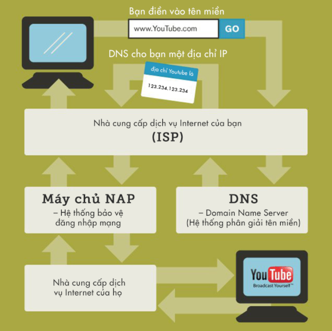

# Phần tìm hiểu thêm

## 1. Internet hoạt động như thế nào?

### `Internet`:

- `Internet` là một mạng lưới cáp vật lý toàn cầu, gồm dây đồng, cáp TV và cáp quang. Kết nối không dây như Wi-Fi và 3G / 4G cũng dựa vào các loại cáp vật lý này để truy cập Internet.

- Mạng lưới này giúp kết nối trung tâm dữ liệu với thiết bị của người dùng.

### `Máy chủ`

- là nơi lưu trữ các trang web
- Hoạt động giống như ổ cứng máy tính thông thường.

### `Địa chỉ IP`

- Mỗi thiết bị được kết nối với `Internet` đều được xác định bởi một chuỗi số duy nhất tương ứng với mỗi thiết bị, gọi là `địa chỉ IP`
- Ví dụ: 192.168.3.4

### `DNS - Domain Name System`

- Hệ thống quản lý tên miền, giúp quản lý `tên miền` với một `địa chỉ IP` cụ thể.
- `Tên miền` là tên của một website hoạt động trên internet, đóng vai trò là một địa chỉ tĩnh, cố định.

### Cách hoạt động của `Internet`

- Nhập tên miền vào thanh tìm kiếm của trình duyệt.
- Trình duyệt sẽ mã hóa thành tín hiệu điện tử (dạng 1 và 0) rồi gửi yêu cầu tới nhà mạng.
- Nhà mạng sẽ truyền yêu cầu đến máy chủ DNS.
- Máy chủ sẽ tra cứu xem địa chỉ IP nào tương ứng với miền mà bạn đã nhập.
- Sau khi có địa chỉ IP, yêu cầu được gửi tới máy chủ có địa chỉ IP tương ứng.
- Máy chủ của địa chỉ IP tương ứng nhận được yêu cầu truy cập vào 1 trang web nào đó sẽ trả dữ liệu về thiết bị của bạn bằng luồng dữ liệu định dạng kỹ thuật số thông(dãy 1 và 0) qua cáp quang theo dạng xung ánh sáng.
- Cáp quang được nối với bộ định tuyến ở nhà của bạn để chuyển đổi tín hiệu ánh sáng sang tín hiệu điện và truyền về thiết bị của bạn. Hoặc là chuyển đổi thành tín hiệu vô tuyến để truyền sang thiết bị của bạn.
- Với kết nối bằng gói cước dữ liệu di động thì tín hiệu quang sẽ gửi đến tháp viễn thông gần nhà bạn để chuyển đổi thành sóng điện từ rồi truyền đến thiết bị của bạn.

  

## 2. Mô tả về Domain, DNS, Hosting:

### `Domain`: hay còn gọi là `tên miền`.

---

Nó đại diện cho một website hoạt động trên `Internet`.

Liên kết với một `địa chỉ IP` và được lưu trên `DNS-Domain Name System`. Nhỡ tên miền dễ hơn nhớ địa chỉ IP.
Hoạt động đăng ký tên miền này được giám sát bởi tổ chức gọi là `ICANN - Internet Corporation for Assigned Names and Numbers`. ICANN quản lý việc tên miền nào có thể đăng ký và là trung tâm cơ sở dữ liệu lưu thông tin tên miền.

Các loại `tên miền` khác nhau:

- `TLD – Top level domain`:

  Tên miền cấp cao nhất – là phần mở rộng sau dấu chấm cuối cùng của một tên miền. Hoặc có thể hiểu nó là phần đầu tiên từ phải sang trái của một tên miền.

- `gTLDs – Generic top-level domain`:

  Tên miền cấp cao chung. Nó bao gồm các miền nổi tiếng như `.com, .org và .net`, cũng như những cái tên nổi bật khác như `.xyz, .biz và .tech`.

- `ccTLD – Country-code top-level domain`:

  Tên miền cấp cao nhất của quốc gia. Sử dụng để xác định một quốc gia cụ thể theo mã ISO. Ví dụ .vn cho Việt Nam, .us cho United States (Mỹ).

- `sTLDs – Sponsored Top Level Domain`

  Tên Miền Cấp Cao Nhất Được Tài Trợ: `.gov` cho các trang web của chính phủ, `.edu` cho các tổ chức giáo dục và `.post` cho các dịch vụ bưu chính...

- `Infrastructure Top-Level Domain`

  Tên miền hạ tầng: chỉ bao gồm một tên miền, là `.arpa`. Dành riêng cho ICANN để giải quyết các vấn đề về cơ sở hạ tầng internet

- `Subdomain`

  Tên miền thứ cấp: có hai phần thay vì chỉ 1 phần mở rộng. Ví dụ: `unitedstate.gov.uk`, `baomoi.com.vn`

### `DNS - Domain Name System`

---

Hệ thống quản lý tên miền.

Giúp quản lý `tên miền` với một `địa chỉ IP` cụ thể.

DNS hoạt động theo từng bước theo cấu trúc của DNS.

- Bước đầu tiên gọi là `DNS query`, một truy vấn để lấy thông tin.
- `DNS server` sẽ tìm thông tin phân giải trong `filehosts` – một file text trong hệ điều hành chịu trách nhiệm chuyển hostname thành địa chỉ IP.
- Nếu không thấy thông tin, nó sẽ tìm trong `cache` – bộ nhớ tạm của phần cứng hay phần mềm (bộ nhớ tạm của trình duyệt và bộ nhớ tạm của `Internet Service Providers (ISP)`).
- Nếu không nhận được thông tin, bạn sẽ thấy mã lỗi hiện lên.

Có 4 loại server tham gia vào trong hệ thống phân giải tên miền

- `DNS Recursor`

  - `DNS recursor` là server đóng vai trò liên lạc với các server khác để thay nó làm nhiệm vụ phản hồi cho client (trình duyệt người dùng).

  - `DNS recursor` có thể sẽ cần gọi đến `Root DNS Server` để trợ giúp.

- `Root Nameserver`: cũng thường được gọi là nameserver

  - `Root DNS Server` là server quan trọng nhất trong hệ thống cấp bậc của DNS, là một thư viện để định hướng tìm kiếm giúp bạn.

  - Server này sẽ phản hồi rằng nó cần tìm trong các `TLD nameserver` cụ thể nào.

- `TLD Nameserver`

  - Nó chịu trách nhiệm quản lý toàn bộ thông tin của một phần mở rộng tên miền chung.

  - Ví dụ như khi bạn gõ www.google.com trên trình duyệt, TLD .com sẽ phản hồi từ một `DNS resolver` để giới thiệu cho nó một `Authoritative DNS server`.

- `Authoritative Nameserver`

  - `Authoritative Name Server` là nơi chính thức chứa nguồn dữ liệu của tên miền mà TLD giới thiệu.

  - Khi một `DNS resolver` tìm thấy một `authoritative nameserver`, đây là việc phân giải tên miền diễn ra. `Authoritative nameserver` có chứa thông tin tên miền gắn với địa chỉ nào. Nó sẽ đưa cho `recursive resolver` địa chỉ IP cần thiết tìm thấy trong danh mục các bản ghi của nó.

  

### `Hosting`:

---

`Hosting` (hay web hosting) là một dịch vụ online giúp bạn xuất bản website hoặc ứng dụng web lên Internet. Khi bạn đăng ký dịch vụ hosting, tức là bạn thuê một chỗ đặt trên server chứa tất cả các files và dữ liệu cần thiết để website của bạn chạy được.

`Nhà cung cấp Web Hosting` của bạn chịu trách nhiệm cho việc giữ server hoạt động, chống tấn công bởi mã độc, và chuyển nội dung (văn bản, hình ảnh, files) từ server xuống trình duyệt người dùng.

Cách Hosting hoạt động:

- Phía nhà cung cấp

  - Các nhà cung cấp dịch vụ sẽ chuẩn bị server lưu trữ cho người sử dụng hosting, bằng cách chia sẻ tài nguyên trên server thành các không gian lưu trữ nhỏ hơn (`hosting`).

  - Tùy theo gói cước mà người dùng đăng ký, nhà cung cấp sẽ cấu hình cho các hosting này để người dùng sử dụng. Khi người dùng có nhu cầu mở rộng hay thu nhỏ gói hosting, nhà cung cấp sẽ điều chỉnh những thông số này.

- Phía người dùng

  - Người thuê hosting chỉ việc upload các files lên hosting và cấu hình hoạt động cho chúng. Người dùng có thể truy cập hosting từ các thiết bị kết nối internet, thông qua việc gửi request đến domain name (tên miền) hoặc địa chỉ IP của hosting.

  - Hosting sẽ trả về các tập tin được yêu cầu tương ứng. Trong quá trình sử dụng, nếu có nhu cầu mở rộng gói hosting, người dùng phải liên hệ với nhà cung cấp để được thực hiện.

## 3. `HTTP / HTTP2 / HTTPS` là gì ?

- `Http (HyperText Transfer Protocol)` là giao thức truyền tải siêu văn bản được sử dụng trong www dùng để truyền tải dữ liệu giữa Web server đến các trình duyệt Web và ngược lại. Giao thức này sử dụng cổng 80 (port 80) là chủ yếu.

### `HTTP`

---

- Giao thức truyền tải siêu văn bản (HTTP) là giao thức cấp cao nhất. Giao thức truyền tải này cho phép các ứng dụng, chẳng hạn như các trình duyệt internet, giao tiếp với máy chủ web tương ứng đang lưu trữ các trang web được yêu cầu.

- HTTP truyền tải văn bản của trang web sang trình duyệt. Sau đó chuyển đổi nội dung này sang văn bản, hình ảnh hoặc video.

### `HTTP2`

---

- HTTP/2 là phiên bản mới nhất của Hypertext Transfer Protocol (HTTP), phát triển dựa trên giao thức SPDY của Google.

- HTTP / 2 sử dụng thủ tục ghép kênh để toàn bộ trang web được tải chỉ bằng một kết nối. Máy chủ cũng có khả năng truyền dữ liệu theo dõi dự đoán cho khách hàng mà không cần phải yêu cầu server push

- Với HTTP / 2, các gói dữ liệu từ các trang web có thể được gửi theo thứ tự ưu tiên của chúng

### `HTTPS`

---

- Https (HyperText Transfer Protocol Secure) là giao thức Http có sử dụng thêm SSL (Secure Sockets Layer) để mã hóa dữ liệu trong lúc truyền tải dữ liệu nhầm gia tăng thêm tính an toàn cho việc truyền dữ liệu giữa Web server và trình duyệt Web. Giao thức Https thì sử dụng cổng 433 để truyền dữ liệu.

## 4. Trình duyệt hoạt động như thế nào ?

Các bước diễn ra trong quá trình hiển thị trang web:

- Yêu cầu được thực hiện khi ai đó click hoặc nhập vào một liên kết
- Trang và các tài nguyên (file) của nó được tải về
- Trình duyệt sử dụng các tài nguyên của trang để xây dựng trang
- Trang sau đó được hiển thị (render) cho người dùng

Tương ứng với 4 thuật ngữ:

- Yêu cầu (Request)
- Đáp ứng (Response)
- Xây dựng (Build)
- Hiển thị (Render)

## 1. `Yêu cầu/Request`

---

- Khi click vào một liên kết (link is clicked).
- Làm mới lại trang (F5/refreshed)
- Khi một URL được nhập vào trong trình duyệt (navigation bar is used).

Khi một liên kết được gửi, một yêu cầu tài liệu được thực hiện.

=> Thời điểm khi một trang web được yêu cầu còn được gọi là “bắt đầu điều hướng/navigation start” và quá trình hiển thị trang bắt đầu.

## 2. `Đáp ứng/Response`

---

- Máy chủ web sau đó gửi file cho trình duyệt web.

- Đáp ứng được hiểu đơn giản là trình duyệt nhận được những gì mà nó đã yêu cầu.

- Giai đoạn đáp ứng sẽ trả về các tài nguyên của trang như là html, hình ảnh, CSS và JS.

## `Phân tích cú pháp`

---

- Một khi trình duyệt nhận được tài liệu (tệp HTML), nó đọc tài liệu đó.

- Khi một máy tính đọc một file đang tìm kiếm điều gì đó, điều này được gọi là “parsing/phân tích cú pháp”

- Trình duyệt web nhìn vào toàn bộ tài liệu HTML và tìm kiếm bất kỳ tài nguyên CSS, JS và hình ảnh nào được tham chiếu (referenced) trong trang.

- Các ảnh, CSS, và JS mà tài liệu HTML liên kết sẽ được tải xuống bởi trình duyệt.

## 3. `Xây dựng trang/Build`

---

- Một khi trình duyệt web có được các tài nguyên cần thiết, nó có thể bắt đầu tiến hành xây dựng trang.

- Cách một trình duyệt web xây dựng trang là thông qua kết hợp thông tin tìm thấy trong tài liệu (file HTML gốc) và thông tin được tìm thấy trong các tài nguyên.

- Có ba bước cơ bản mà trình duyệt thực hiện để xây dựng trang.

  - Xây dựng DOM
  - Xây dựng CSSOM
  - Xây dựng Cây Hiển Thị (Render Tree)

#### `Xây dựng DOM`

    DOM là viết tắt của “Document Object Map/Bản đồ Đối tượng Tài liệu”. Về cơ bản, nó là một bản đồ nơi mọi thứ được hiển thị trên trang theo dạng thức HTML. DOM đại diện cho điều HTML đang nói bằng cách ánh xạ trang theo cách quan hệ (relational manner).

  

#### `Xây dựng CSSOM`

    CSSOM là viết tắt của cụm từ “CSS Object Map/Bản đồ Đối tượng CSS”. Nó về cơ bản là một bản đồ của các style/định dạng cụ thể nào phải được áp dụng vào các phần khác nhau của trang web theo dạng thức CSS. Bản đồ CSSOM vạch ra cách thức mọi thứ nên được hiển thị bằng cách sử dụng style.

  

#### `Xây dựng cây hiển thị (render tree)`

    Cây hiển thị về cơ bản đưa DOM và CSSOM kết hợp lại với nhau để tạo ra bản đồ đầy đủ về cách trang sẽ thực sự được bố cục và định dạng.

  

## 4. `Render/Hiển thị`

---

- Sau khi các bước trên thực hiện, trình duyệt sẽ hiển thị nội dung lên màn hình.

- Có hai điều chính xảy ra ở đây:
  - `Bố cục/Layout`
  - `Định dạng hoàn chỉnh/Paint`

#### `Bố cục`

  

- Trình duyệt ở thời điểm này đã biết cái gì cần phải hiển thị (DOM) và cách thức để hiển thị nó thế nào (CSSOM) và mối quan hệ giữa hai thứ này (cây hiển thị).

- Cái mà nó không biết là kích cỡ để hiển thị mọi thứ và vị trí của những thứ này sẽ kết thúc tại đâu trên màn hình.

- Phần này được gọi là bố cục (layout), và nó là vấn đề cơ bản nơi mà trình duyệt xác định mức độ lớn của màn hình là bao nhiêu và làm thế nào điều đó ảnh hưởng đến cách hiển thị trang.

#### `Định dạng`

- Trong bước cuối cùng này trình duyệt sẽ chuyển đổi mỗi điểm nút trong cây render thành các pixel thực sự trên màn hình của người duyệt web.
- Điều này được gọi là định dạng hoàn chỉnh (`paint`).
