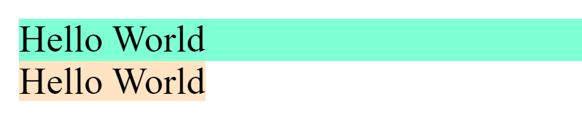
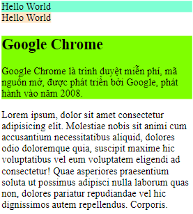
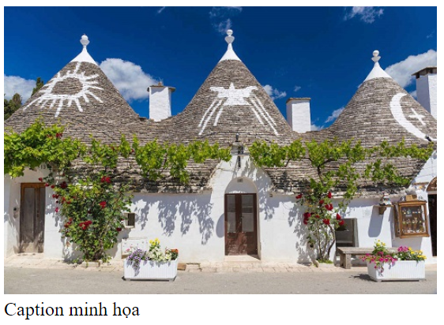
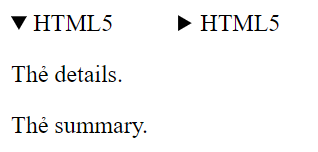

# HTML5

> HTML là từ viết tắt của Hyper Text Markup Language (Ngôn ngữ đánh dấu siêu văn bản). HTML được dùng để mô tả cấu trúc của một trang web.

> HTML5 là phiên bản thứ 5 và cũng là phiên bản mới nhất của HTML tính đến nay.

## DOM HTML

- DOM là viết tắt của Document Object Model – Mô hình Đối tượng Tài liệu
- Là một chuẩn được định nghĩa bởi W3C (Tổ Chức Web Toàn Cầu – World Wide Web Consortium).
- Khi một trang web được tải, trình duyệt sẽ tạo một cây DOM cho trang.
  

## Cấu trúc đơn giản của một trang html:

```html
<!DOCTYPE html>
<html lang="vi">
  <head>
    <title>Tiêu đề</title>
  </head>
  <body>
    <h1>Phần thân</h1>
  </body>
</html>
```

- `<!DOCTYPE>`: Đây là phần khai báo loại tài liệu cho trang, giúp trình duyệt hiển thị thông tin trang web một cách chính xác theo loại tài liệu đó.
  - `Quirks mode`: cung cấp khả năng tương thích với các trang web cũ hơn.
  - `Standard mode`: mô tả theo đúng các đặc tả HTML và CSS.
  - Ví dụ loại trang tài liệu của StackOverflows (chế độ quirks):

```html
<!DOCTYPE html PUBLIC "-//W3C//DTD HTML 4.01//EN" "http://www.w3.org/TR/html4/strict.dtd">
```

- `<html>` Chứa toàn bộ thông tin trang web `</html>`
  - `lang` : Khai báo ngôn ngữ chính mà trang web sử dụng, hỗ trợ công cụ tìm kiếm.
    ```html
    <html lang="en"></html>
    ```
- `<head>` Là khung chứa siêu dữ liệu - metadata `</head>`
- `<body>` Chứa tài liệu của HTML `</body>`

## Các phần tử trong `<head>`

### 1. `<title>` :

- Định nghĩa một tiêu đề trong các tab trình duyệt.
- Cung cấp một tiêu đề cho trang khi nó được thêm vào mục yêu thích.
- Hiển thị tiêu đề của một trang trong kết quả của tìm kiếm.

```html
<title>Tiêu đề trang</title>
```

### 2. `<style>` :

- Phần tử `<style>` được sử dụng để định nghĩa thông tin style cho một tài liệu HTML.
- Trong phần tử `<style>` sẽ chứa các định dạng cho các phần tử HTML để xác định cách nó hiển thị trong trình duyệt.

```html
<style>
  body {
    background-color: yellow;
  }
</style>
```

### 3. `<link>` :

- Phần tử <link> định nghĩa mối quan hệ của trang với một tài nguyên bên ngoài.
- Phần tử <link> thường được sử dụng để liên kết đến các Style sheets.

```html
<link rel="stylesheet" href="style.css" />
```

- Các thuộc tính:

  - `href`: Đường dẫn tới các tài liệu liên kết
  - `hreflang`: Xác định ngôn ngữ text của các tài liệu liên kết
  - `media`: Xác định những "media" gì được hiển thị tối ưu trong tài liệu liên kết
  - `rel`: Xác định mối quan hệ giữa tài liệu hiện hành và các tài liệu liên kết
  - `type`: Xác định loại phương tiện của tài liệu liên kết

  [Chi tiết](./link.md)

### 4. `<meta>` :

- Có công dụng cung cấp thông tin trang web cho các công cụ tìm kiếm.
- Bao gồm những thông tin về mô tả trang, từ khóa, tác giả, và các metadata khác.

```html
<meta charset="UTF-8" />
<meta name="description" content="Mô tả trang web" />
<meta http-equiv="refresh" content="30" />
```

[Chi tiết](./meta.md)

### 5. `<script>`:

Được sử dụng để định nghĩa code JavaScript phía client.

Có thể nhúng mã script hoặc liên kết file script bên ngoài.

```html
<script>
  function myFunction {
  document.getElementById(“demo”).innerHTML = “Hello JavaScript!”;
  }
</script>

<script type="text/javascript" src="script.js"></script>
```

- Các thuộc tính:

  - `src`: chỉ định đường dẫn của file script từ bên ngoài
  - `type`: chỉ định loại phương tiện của script
  - `async`: chỉ định tập lệnh thực thi không đồng bộ
  - `defer`: chỉ định tập lệnh được thực thi khi trang hoàn tất quá trình phân tích cú pháp
  - `nomodule`: Chỉ định tập lệnh có được thực thi không ở các trình duyệt hỗ trợ mô-đun ES6

  [Xem thêm](./script.md)

### 6. `<base>`:

Định nghĩa một address mặc định hoặc một target mặc định đối với tất cả các link trên trang web

```html
<head>
  <base href="https://www.w3schools.com/" target="_blank" />
</head>

<body>
  <a href="tags/tag_base.asp">HTML base Tag</a>
</body>
```

- Các thuộc tính:
  - `href` : Chỉ định URL cơ sở cho tất cả các URL tương đối trong trang
  - `target`: Chỉ định mục tiêu mặc định cho tất cả các siêu liên kết và biểu mẫu trong trang
  - Các giá trị `target`:
    - `_blank`: load đường link ở tab mới.
    - `_top`: load đường link ở tab hiện tại.
    - `_parent`: load đường link ở phần tử cha chứa nó.
    - `_self`: load đường link ở khung chứa nó (chính nó).

## Các phần tử trong `<body>`:

### 1. Block Element và Inline Element

- Block element:

  - Bắt đầu trên một dòng mới.
  - Luôn chiếm toàn bộ chiều rộng có sẵn.
  - Có thể dùng margin, padding.
  - Một số thẻ block như: `<p>, <h1>, <h2>, <h3>, <h4>, <h5>, <h6>, <ul>, <ol>, <dl>, <pre>, <hr />, <blockquote>, và <address>`

  ```html
  <div>Hello World</div>
  ```

- Inline element

  - Không bắt đầu trên một dòng mới.
  - Chỉ chiếm nhiều chiều rộng khi cần thiết
  - Một số thẻ inline như: `<a>,<b>, <i>, <u>, <em>, <strong>, <sup>, <sub>, <big>, <small>, <li>, <ins>, <del>, <code>, <cite>, <dfn>, <kbd>, và <var>`

  ```html
  <span>Hello World</span>
  ```

  

### 2. Các thẻ khối:

- `<section>`:

  - Được sử dụng để tạo thành 1 khu vực bao gồm những nội dung giống nhau (có cùng chủ đề).

  

- `<article>`

  - Dùng để xác định nội dung độc lập, riêng biệt với những phần còn lại của trang web

    ```html
    <article>
      <h1>Google Chrome</h1>
      Google Chrome là trình duyệt miễn phí, mã nguồn mở, được phát triển bởi
      Google, phát hành vào năm 2008.
    </article>
    ```

    

- `<header>`

  - Dùng cho phần đầu trang hoặc phần đầu của một thẻ.
  - Nên dùng để bao ngoài nội dung giới thiệu trang.

  ```html
  <article>
    <header>
      <p>Sứ mệnh của WWF:</p>
    </header>
    <p>
      Sứ mệnh của WWF là ngăn chặn sự xuống cấp môi trường tự nhiên của hành
      tinh chúng ta.
    </p>
  </article>
  ```

- `<footer>`

  - Dùng cho phần cuối trang hoặc phần cuối của một thẻ.

  ```html
  <footer>
    <p>Tác giả: Name Author</p>
    <p>
      Thông tin liên hệ:
      <a href="mailto:someone@example.com"> someone@example.com</a>.
    </p>
  </footer>
  ```

- `<nav>`

  - Được gọi là thanh điều hướng, được dùng để chứa các liên kết điều hướng trong trang.

  ```html
  <nav>
    <a href="/home/">Trang chủ</a>
    <a href="/hoc-html/">Học HTML</a>
  </nav>
  ```

- `<aside>`

  - Dùng để chứa những thông tin bên cạnh nội dung chính.

  ```html
  <p>Google có trụ sở tại Thung lũng Silicon.</p>
  <aside>
    <h4>Thung lũng Silicon</h4>
    <p>
      Thung lũng Silicon nằm ở phía Nam của vùng vịnh San Francisco tại phía Bắc
      California ở Mỹ.
    </p>
  </aside>
  ```

- `<main>`

  - Xác định phần thân của trang, nó thường được dùng để chứa các nội dung chính của trang web.

  ```html
  <body>
    <header>HTML5</header>
    <main>
      <h1>Ngôn ngữ đánh dấu văn bản</h1>
      <p>HTML được dùng để mô tả cấu trúc của một trang web.</p>
    </main>
    <footer>Tác giả: W3C</footer>
  </body>
  ```

- `<figure>` và `<figcaption>`

  - `<figure>` xác định các nội dung liên quan mạch lạc với nhau, như hình ảnh, sơ đồ, code,...
  - `<figcaption>` để chỉ 1 chú thích

  ```html
  <figure>
    
    <figcaption>Hình minh họa</figcaption>
  </figure>
  ```

  

- `<details>` và `<summary>`

  - `<details>` Xác định thêm chi tiết hoặc điều khiển có thể được ẩn hoặc hiển thị theo yêu cầu.
  - `<summary>` dùng làm tiêu đề cho `<details>`
  - `<details>` có attribute là `open=open` (mặc định) nó sẽ hiển thị ra nội dung bên trong thẻ `<details>` thông qua thẻ `<summary>`

  ```html
  <details>
    <summary>HTML5</summary>
    <p>Thẻ details.</p>
    <p>Thẻ summary.</p>
  </details>
  ```

  

### 3. Các thẻ xử lý text:

- Làm nổi bật phần tử muốn nhấn mạnh bên trong cặp thẻ này.
- Một số thẻ block như: `<em>, <mark>, <strong>, <abbr>,<acronym>, <bdo>, <dfn>, <blockquote>, <q>, <code>, <pre>, <samp>, <address>, <del>, <i>, <s>, <small>, <b>`

  [Chi tiết](./formatphrase.md)

### 4. Thẻ tạo phần tử chuyển động `Marquee`:

- Dùng để tạo ra chuyển động cho phần tử như chữ và ảnh, di chuyển được theo hướng định sẵn như trái qua phải hay trên xuống dưới.

```html
<marquee tên-thuộc-tính="giá-trị-thuộc-tính" .... các-thuộc-tính-khác>
  Text hoặc ảnh
</marquee>
```

- Các thuộc tính:
  - `width`: Xác định độ rộng của dòng chạy.
  - `height`: Xác định độ cao của dòng chạy.
  - `direction`: Xác định chiều chạy của dòng chữ. Giá trị có thể là up, down, left, hoặc right.
  - `behavior`: Xác định kiểu cuộn của dòng chạy. Giá trị có thể là scroll, slide và alternate.
  - `scrolldelay`: Xác định khoảng thời gian dừng lại khi xong một lần cuốn. Giá trị có thể là 10...
  - `scrollamount`: Xác định tốc độ của dòng chạy. Giá trị có thể là 10….
  - `loop`: Xác định khoảng thời gian của vòng lặp. Giá trị mặc định là INFINITE, nghĩa là các marquee lặp đi lặp lại vô hạn.
  - `bgcolor`: Xác định màu nền, sử dụng tên màu hoặc giá trị thập lục phân của màu.
  - `hspace`: Xác định khoảng cách chiều ngang của dòng chạy. Giá trị có thể là 10 hoặc 20% ...
  - `vspace`: Xác định khoảng cách dọc của dòng chạy. Giá trị có thể là 10 hoặc 20% ...

### 5. Các thẻ Media:

- ``:
  - Dùng thẻ img để chèn hình ảnh vào website.
  - Các thuộc tính:
    - `src`: đường dẫn tới hình ảnh.
    - `alt`: xác định một văn bản thay thế khi ảnh bị lỗi.
    - `width`: xác định chiều rộng của ảnh.
    - `height`: xác định chiều cao của ảnh.
    - `border`: xác định độ dày của viền ảnh.
    - `align`: cảnh chỉnh vị trí của ảnh.
    ```html
    
    ```
    
    <br>
    <br>
    <br>
    <br>
    <br>
    <br>
    <br>
    <br>
    <br>
    <br>
- `<audio>`:

  - Dùng để chèn file âm thanh vào website.
  - Các thuộc tính:

    - `control` thuộc tính điều khiển thêm các điều khiển audio, như phát, tạm dừng và âm lượng.
    - `width - height` để thiết lập chiều ngang chiều dọc
    - `source` trong audio
    - `src` đường dẫn đến audio
    - `type` loại file của audio
    - `muted` dùng để tắt âm thanh khi audio hiện ra

    ```html
    <audio width="320" height="240" autoplay muted>
      <source src="horse.ogv" type="audio/ogg" />
      <source src="horse.mp3" type="audio/mpeg" />
    </audio>
    ```

    <audio controls="controls" autoplay muted src="./amthanh.mp3">
    </audio>

- `<video>`:

  - Dùng để chèn file video vào website.
  - Các thuộc tính:

    - `control` thuộc tính điều khiển thêm các điều khiển video, như phát, tạm dừng và âm lượng.
    - `width - height` để thiết lập chiều ngang chiều dọc
    - `source` trong video
    - `src` đường dẫn đến video
    - `type` loại file của video
    - `muted` dùng để tắt âm thanh khi video hiện ra

    ```html
    <video width="320" height="240" autoplay muted>
      <source src="movie.mp4" type="video/mp4" />
      <source src="movie.ogg" type="video/ogg" />
    </video>
    ```

    <video controls="controls" width="500" height="300" src="./video.mp4"></video>

- `<iframe>`

  - Giúp nhúng HTML, hình ảnh, video, hay trang web khác vào website của mình.
  - Các thuộc tính của `<iframe>`:

    - `src`: là phần nội dung gốc từ server bên ngoài.
    - `Width` và `height`: là chiều rộng và chiều cao của `iframe`
    - `name`: dùng để đặt tên cho frame. Nó hay được dùng khi muốn hiển thị 1 liên kết nào đó trong 1 frame có thuộc tính name
    - `frameborder`: Tạo đường viền bao quanh frame. Thuộc tính này sẽ có 2 giá trị: 0 – ẩn đường viền, 1 – hiện đường viền, mặc định là 1.

    ```html
    <a href="https://www.youtube.com/" target="framename_a">abc</a>
    <iframe
      src="./form/parent1.html"
      width="680"
      height="480"
      allowfullscreen
    ></iframe>
    ```

- `<svg>`:

  - Là một dạng hình ảnh sử dụng cấu trúc XML để hiển thị ảnh ở dạng vector
  - Ảnh SVG linh hoạt hơn nhiều so với ảnh JPG hoặc PNG và có thể sử dụng CSS và JavaScript để tương tác với chúng.
  - Khi phóng to thu nhỏ ảnh sẽ không bị giảm chất lượng
  - Các thuộc tính

    - `width, height`:
    - `viewbox` với giá trị `x y width heigh` phần muốn hiển thị

    ```html
    <svg
      width="200"
      height="200"
      viewBox="0 0 150 150"
      style="border: 1px solid black"
    >
      <circle cx="100" cy="100" r="100" fill="#529fca" />
    </svg>
    ```

  - Các thẻ thường dùng trong `<svg>`: `<text>, <circle/>, <rect/>, <line/>, <path/>, <defs>, <use>, <text>, <polyline>, <polygon>, <animate>`.

- `<canvas>`

  - Dùng để vẽ đồ họa một cách nhanh chóng, thông qua JavaScript.
  - Dùng width, height để set chiều rồng và dài của thẻ
  - Một số hàm vẽ canvas

    - Xác định chiều vẽ `getContext('2d')`
    - Bắt đầu vẽ `beginPath()`
    - Màu chữ `fillStyle`
    - Điểm bắt đầu vẽ `moveTo(a,b)`
    - Điểm kết thúc vẽ `lineTo(a, b)`
    - Độ dày đường vẽ `lineWidth`
    - Màu đường vẽ `strokeStyle`
    - Vẽ đường tròn `arc`
    - Vẽ `stroke()`

    ```html
    <canvas id="myCanvas" width="578" height="250"></canvas>
    <script>
      var canvas = document.getElementById("myCanvas");
      context = canvas.getContext("2d");
      context.beginPath();
      context.font = "40pt Calibri";
      context.fillStyle = "blue";
      context.moveTo(10, 10);
      context.lineTo(400, 10);
      context.lineWidth = 10;
      context.strokeStyle = "blue";
      context.arc(x, y, radius, startAngle, endAngle, counterClockwise);

      //butt, square stroke();
    </script>
    ```

### 6. Thẻ link `<a>`

- Được dùng để liên kết trực tiếp với các trang khác hay trong một phần của một trang. Gọi là Hyperlinks (siêu liên kết).

  ```html
  <a href="URL" ... danh-sách-thuộc-tính>Link Text</a>
  ```

- Các thuộc tính của thẻ ảnh:
  - `href`: đường dẫn tới trang khác.
  - `target`: để xác định vị trí nơi đường link được mở.
    - `_blank`: Mở trang liên kết trong cửa sổ mới.
    - `_self`: Mở trang liên kết trong cùng một khung giống với khung chứa liên kết.
    - `_parent`: Mở trang liên kết trong khung nguồn chứa đường link.
    - `_top`: Mở trang liên kết trong cửa sổ toàn màn hình.
- Tạo Download Link tài liệu PDF, DOC, hoặc ZIP trong HTML
  ```html
  <a href="../html/test.pdf">Download PDF File</a>
  ```
- Tạo link cho image
  ```html
  <a href="https://vietjack.com" target="_self">
    
  </a>
  ```
- Email Link trong HTML
  ```html
  <a href="mailto:abc@example.com">Send Email</a>
  ```
  Có thể thiết lập mặc định email subject và email body song song với email address.
  ```html
  <a href="mailto:abc@example.com?subject=Tiêu đề&body=Nội dung tin nhắn"
    >Send</a
  >
  ```

### 7. `<form>`:

Được sử dụng để thu thập thông tin đầu vào của người dùng, thường được gửi đến máy chủ để xử lý.

- Một `<form>` có thể chứa thành phần `<input />` như trường text, checkbox, radio-button, button submit,...
- Một `<form>` cũng có thể chứa thành phần `<select>, <textarea>, <fieldset>, <legend> và <label>`.
- Bên trong form cũng có thể chứa các tag khác.

- Các thuộc tính:

  - `action`: Xác định địa chỉ mà dữ liệu form gửi đến khi được submit.

    ```html
    <form action="index.html"></form>
    ```

  - `target`: Chỉ định nơi hiển thị phản hồi sau khi gửi biểu mẫu.

    - \_blank: Khi submit hay nhấn vào link nó sẽ chuyển link đó sang tab mới của trình duyệt.
    - \_top: Tương tự \_blank nhưng nó mở link ngay tab hiện tại.
    - \_self: Tương tự \_blank nhưng nó mở link ngay tab hiện tại ở khung chứa nó.
    - \_parent: Tương tự như \_self nhưng nó mở link ở phần cha chứa nó.
    - `framename`: Trang được liên kết sẽ mở ra trong khung iframe được đặt tên.

    ```html
    <form action="index.html" target="_blank"></form>
    ```

  - `method`: Chỉ định phương thức HTTP sẽ được sử dụng khi gửi dữ liệu biểu mẫu.

    - `get`: các thông tin trong form sẽ mô tả bởi URL, nhìn vào thanh địa chỉ trình duyệt sẽ thấy thông tin. Được dùng khi đọc dữ liệu từ server.
    - `post`: Sẽ không nhìn thấy dữ liệu biểu diễn qua URL như thế này mà dữ liệu sẽ được ẩn. Dùng khi cần cập nhật dữ liệu server.

    ```html
    <form action="index.html" method="get" target="_blank"></form>
    ```

  - `autocomplete`: Khi bật tính năng tự động hoàn thành, trình duyệt sẽ tự động hoàn thành các giá trị dựa trên các giá trị mà người dùng đã nhập trước đó.

    - Có 2 giá trị là `on` và `off`

    ```html
    <form action="index.html" method="get" autocomplete></form>
    ```

  - `novalidate`: Khi bật tính năng novalidate thì khi submit dữ liệu sẽ không được validate. Dùng khi muốn tự code để kiểm tra dữ liệu.

    ```html
    <form action="index.html" method="get" novalidate></form>
    ```

  - `name`

    - Chỉ định tên của một biểu mẫu.
    - Sử dụng để tham chiếu các phần tử trong JavaScript hoặc để tham chiếu dữ liệu biểu mẫu sau khi biểu mẫu được gửi.

    ```html
    <form action="index.html" method="get" name="form1"></form>
    ```

  - `enctype`

    - Chỉ dùng cho method post
    - Chỉ định cách dữ liệu biểu mẫu được mã hóa khi gửi đến máy chủ.
    - Có 3 giá trị:
      - `text/plain`: gửi dữ liệu nhưng không được mã hóa
      - `multipart/form-data`: giá trị này là cần thiết nếu tải tệp lên thông qua form
      - `application/x-www-form-urlencoded`: đây là giá trị mặc định, tất cả các ký tự đều được mã hóa (dấu space sẽ được mã hóa thành dấu +) và các ký tự đặc biệt được chuyển đổi thành giá trị ASCII HEX.

### 8. `<table>`:

- Thẻ `<table>` xác định một bảng HTML.
- Một bảng HTML bao gồm một phần tử `<table>` và một hoặc nhiều phần tử `<tr>, <th>, <td>`.
- Một bảng HTML cũng có thể bao gồm các phần tử `<caption>, <colgroup>, <thead>, <tfoot>, <tbody>`.
- Ý nghĩa của các thẻ trong table:

  - `<tr>` xác định một hàng trong bảng
  - `<th>` xác định ô tiêu đề bảng
  - `<td>` xác định một ô bảng
  - `<caption>` định nghĩa chú thích cho bảng
  - `<colgroup>` định dạng cho một nhóm cột trong `<table>`
  - `<thead>` dùng để nhóm các thành phần đầu trong `<table>`
  - `<tfoot>` dùng để nhóm các thành phần footer trong `<table>`
  - `<tbody>` dùng để nhóm các thành phần nội dung trong `<table>`

- Các thuộc tính:
  - `border`: sử dụng để đặt đường viền cho các ô.
  - `cellspacing`: xác định độ rộng của `border`.
  - `cellpadding`: thay cho khoảng cách giữa `border` và nội dung bên trong một ô.
  - `colspan`: để gộp hai hay nhiều cột vào một cột.
  - `rowspan`: để nhập hai hay nhiều hàng vào một hàng.
  - `bordercolor`: thiết lập màu viền cho bảng.
  - `bgcolor`: thiết lập màu nền cho bảng.
  - `width và height`: để thiết lập độ rộng và chiều cao của bảng.

```html
<table border="3">
  <tbody>
    <tr>
      <td rowspan="2">Row 1 Cell 1</td>
      <td>Row 1 Cell 2</td>
      <td>Row 1 Cell 3</td>
    </tr>
    <tr>
      <td>Row 2 Cell 2</td>
      <td>Row 2 Cell 3</td>
    </tr>
  </tbody>
  <thead>
    <tr>
      <th>Column 1</th>
      <th>Column 2</th>
      <th>Column 3</th>
    </tr>
  </thead>
  <tfoot>
    <tr>
      <td colspan="3">Row 3 Cell 1</td>
    </tr>
  </tfoot>
</table>
```

  <table border="3">
  <tbody>
    <tr>
      <td rowspan="2">Row 1 Cell 1</td>
      <td>Row 1 Cell 2</td>
      <td>Row 1 Cell 3</td>
    </tr>
    <tr>
      <td>Row 2 Cell 2</td>
      <td>Row 2 Cell 3</td>
    </tr>
  </tbody>
  <thead>
    <tr>
      <th>Column 1</th>
      <th>Column 2</th>
      <th>Column 3</th>
    </tr>
  </thead>
  <tfoot>
    <tr>
      <td colspan="3">Row 3 Cell 1</td>
    </tr>
  </tfoot>
</table>
<br>

### 9. Các thẻ list

- Được dùng để xác định danh sách các thông tin.
- Có 3 loại list:

  - `<ul>` - Một danh sách không có thứ tự. Nó được sắp xếp bằng cách sử dụng các bullet thường.
  - `<ol>` - Một danh sách đã qua sắp xếp. Nó sử dụng một lược đồ số để liệt kê danh sách.
  - `<dl>` - Danh sách định nghĩa trong HTML. Sắp xếp danh sách theo cách tương tự như chúng được sắp xếp trong từ điển.

- Các phần tử con

  - Thẻ `<li>` là một mục trong `<ul>` hoặc `<ol>`.
  - Thẻ `<dt>` Xác định một thuật ngữ trong danh sách mô tả `<dl>`.
  - Thẻ `<dd>` Mô tả thuật ngữ trong `<dt>`.

- Các thuộc tính:

  - `type`: xác định kiểu của list.

    ```html
    <ul type="disc">
      <li>dạng hình tròn (thuộc tính mặc định)</li>
    </ul>
    <ul type="square">
      <li>dạng hình vuông</li>
    </ul>
    <ul type="circle">
      <li>dạng đường tròn</li>
    </ul>
    ```

    <ul type="disc">
        <li>dạng hình tròn (thuộc tính mặc định)</li>
    </ul>
    <ul type="square">
        <li>dạng hình vuông</li>
    </ul>
    <ul type="circle">
        <li>dạng đường tròn</li>
    </ul>
     
    ```html
    <ol type="1">
          <li>dạng số (thuộc tính mặc định)</li>
      </ol>
      <ol type="I">
          <li>dạng số La mã hoa</li>
      </ol>
      <ol type="i">
          <li>dạng số La mã thường</li>
      </ol>
      <ol type="a">
          <li>dạng chữ thường</li>
      </ol>
      <ol type="A">
          <li>dạng chữ hoa</li>
      </ol>
    ```
    <ol type="1">
        <li>dạng số (thuộc tính mặc định)</li>
    </ol>
    <ol type="I">
        <li>dạng số La mã hoa</li>
    </ol>
    <ol type="i">
        <li>dạng số La mã thường</li>
    </ol>
    <ol type="a">
        <li>dạng chữ thường</li>
    </ol>
    <ol type="A">
        <li>dạng chữ hoa</li>
    </ol>

  - `start`: xác định vị trí bắt đầu của list.

    ```html
    <ol type="1" start="4">
      <li>Dãy số bắt đầu từ 4</li>
    </ol>
    <ol type="I" start="4">
      <li>Dãy số bắt đầu từ IV</li>
    </ol>
    <ol type="i" start="4">
      <li>Dãy số bắt đầu từ iv</li>
    </ol>
    <ol type="A" start="4">
      <li>Dãy chữ cái bắt đầu từ D</li>
    </ol>
    <ol type="a" start="4">
      <li>Dãy chữ cái bắt đầu từ d</li>
    </ol>
    ```

      <ol type="1" start="4">
          <li>Dãy số bắt đầu từ 4</li>
      </ol>
      <ol type="I" start="4">
          <li>Dãy số bắt đầu từ IV</li>
      </ol>
      <ol type="i" start="4">
          <li>Dãy số bắt đầu từ iv</li>
      </ol>
      <ol type="A" start="4">
          <li>Dãy chữ cái bắt đầu từ D</li>
      </ol>
      <ol type="a" start="4">
          <li>Dãy chữ cái bắt đầu từ d</li>
      </ol>

- Thẻ `<dl>`:

  ```html
  <dl>
    <dt><b>HTML</b></dt>
    <dd>La viet tat cua Hyper Text Markup Language</dd>
    <dt><b>HTTP</b></dt>
    <dd>La viet tat cua Hyper Text Transfer Protocol</dd>
  </dl>
  ```

    <dl>
    <dt><b>HTML</b></dt>
    <dd>La viet tat cua Hyper Text Markup Language</dd>
    <dt><b>HTTP</b></dt>
    <dd>La viet tat cua Hyper Text Transfer Protocol</dd>
  </dl>

### 10. Các thuộc tính chung của đa số các thẻ

- `id`

  - Được sử dụng để chỉ định một id duy nhất cho một phần tử HTML
  - ID là duy nhất.
  - Phân biệt chữ hoa chữ thường.
  - JS có thể truy cập một phần tử có id cụ thể bằng method getElementById()

- `class`

  - Sử dụng được trên nhiều element HTML
  - Phân biệt chữ hoa chữ thường
  - Các đặt tên class: (Quy tắc BEM: Block Element Modifier)
    - Block: Là thành phần của trang web hay ứng dụng đó.
    - Element: Là một thành phần bên trong block, phụ thuộc vào parent block của nó.
    - Modifier: Được dùng để thay đổi cách hiển thị block hoặc phần tử
    - Cú pháp:
      .block{} .block\_\_element{} .block--modifier{}
  - [Link Tham Khảo](https://topdev.vn/blog/bem-la-gi/#_tai-sao-lai-phai-su-dung-bem-1)

- `style`
  - Nhúng style trực tiếp vào element
- `title`
  - Xác định thông tin thêm về một phần tử
  - Khi rê chuột lên phần tử có thuộc tính title thì nó sẽ hiển thị dưới dạng văn bản
- `hidden`
  - Ẩn phần tử

### 11. Một số tính năng khác:

- `comment`: Chú thích cho một đoạn code nào đó.

```html
<!-- Content comment -->
```

- `symbols`: hiển thị ra các ký tự đặc biệt.

```html
&euro; &#8704; &#8712; &nbsp;
```

> &euro; &#8704; &#8712;

- `emojis`: hiển thị ra các ký tự đặc biệt.

```html
&#128512; &#128516; &#128525; &#128151;
```

> &#128512; &#128516; &#128525; &#128151;

[Một số khác biệt giữa HTML5 và HTML4](./html5vshtml4.md)
