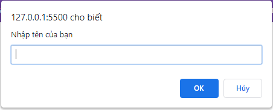
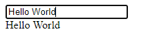
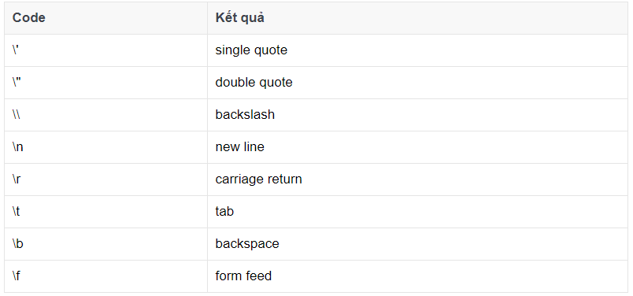
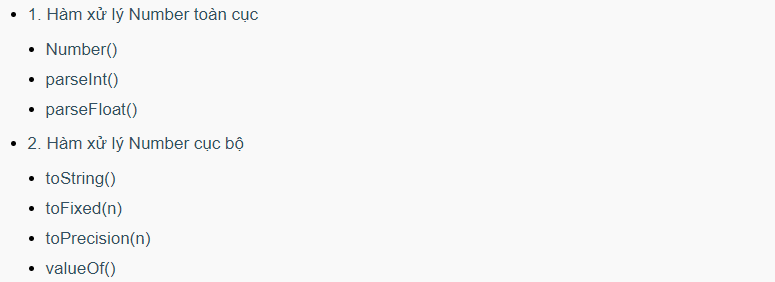
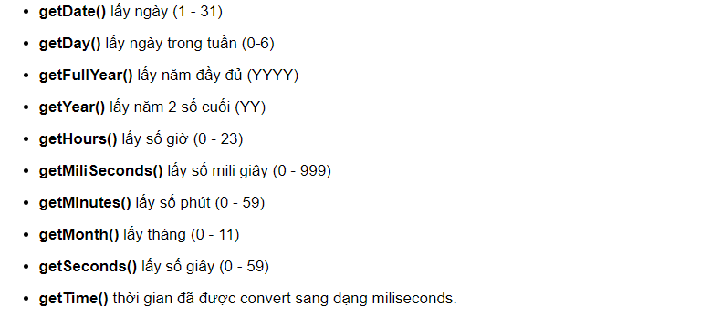
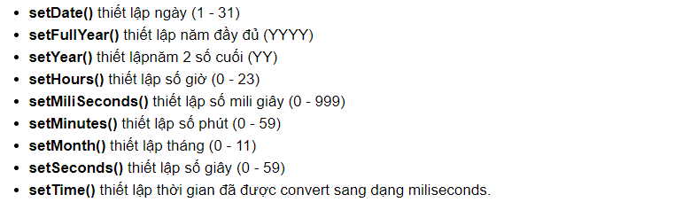

# JAVASCRIPT

> `JavaScript` là một ngôn ngữ lập trình thông dịch được phát triển từ các ý niệm nguyên mẫu. Ngôn ngữ này được dùng rộng rãi cho các trang web (phía người dùng) cũng như phía máy chủ (với Nodejs). (Trích từ Wikipedia)

## I.PHẦN CƠ BẢN:

## 1. Script Tag:

Thẻ `<script>` dùng để khai báo đoạn mã javascript.

```html
<script language="javascript">
  alert("Hello World!");
</script>
```

### 1.1 Vị trí đặt thẻ `<script>`:

- `Internal` - viết trong file html.

```html
<html>
  <head>
    <title></title>
    <script language="javascript">
      alert("Hello World!");
    </script>
  </head>
  <body>
    <script language="javascript">
      alert("Welcome to Javascript!");
    </script>
  </body>
</html>
```

- `External` - viết ra một file js khác rồi import vào file html.

```html
<html>
  <head>
    <title></title>
    <script language="javascript" src="demo.js"></script>
  </head>
  <body></body>
</html>
```

- `Inline` - viết trực tiếp trong thẻ phần tử html.

```html
<html>
  <head>
    <title></title>
  </head>
  <body>
    <input type="button" onclick="alert(1)" value="Click Me" />
  </body>
</html>
```

## 2. Các câu lệnh hiển thị:

- Viết vào một phần tử HTML, sử dụng `innerHTML`.
- Ghi vào đầu ra HTML bằng `document.write()`.
- Viết vào một hộp cảnh báo, sử dụng `window.alert()`.
- Ghi vào bảng điều khiển của trình duyệt, sử dụng `console.log()`.

## 3. Biến trong JS:

### 3.1 Quy tắc:

- Syntax: `var tên_biến;`
- Quy tắc:
  - Tên biến phải là các chữ không dấu, viết hoa hoặc viết thường, các chữ số từ 0-9 và dấu gạch dưới (\_).
  - Tên biến bắt đầu phải là chữ hoặc dấu gạch dưới (\_), nếu bắt đầu bằng số là sai
  - Tên biến có thể đặt dài hay ngắn tùy vào lập trình viên.

```js
// Đúng
var username;

// Đúng
var _username;

// Đúng
var __username;

// Đúng
var username90;

// SAI
var 90thehalfheart;

// Khai báo nhiều biến
var username, _username, __username, username90;
```

### 3.2 Gán giá trị cho biến:

```js
// cách 1
var username = "Nguyen Van A";
// cách 2
var username;
sername = "Nguyen Van A";
```

### 3.3 Thay đổi giá trị và kiểu giá trị:

```js
// Biến website đang kiểu String
var website = "Le Van B";

// Biến website chuyển sang kiểu INT
website = 12;

// Biến website chuyển sang kiểu float
website = 12.5;
```

## 4. alert() - confirm() - prompt():

### 4.1 alert():

Hàm `alert()` có nhiệm vụ in một thông báo popup, nó có một tham số truyền vào chính là nội dung thông báo với người dùng.

```html
<input type="button" onclick="alert('Hello World!')" value="Click Me" />
```


### 4.2 confirm():

Hàm `confirm()` in một thông báo popup nhưng nó có thêm hai sự lựa chọn là Yes và No, chọn Yes thìtrả về TRUE và ngược lại chọn NO thì trả về FALSE. Nó cũng có một tham số truyền vào là nội dung thông báo.

```html
<script language="javascript">
  confirm("Do you like javascript!!!");
</script>
```


### 4.3 prompt():

Hàm `prompt()` dùng để lấy thông tin từ người dùng, gồm có hai tham số truyền vào là nội dung thông báo và giá trị ban đầu. Nếu người dùng không nhập vào thì giá trị nó sẽ trả về là NULL.

```html
<script language="javascript">
  var t = prompt("Nhập tên của bạn", "");
  // alert(t);
</script>
```



## 5. Các toán tử trong JS:

### 5.1 Toán tử toán học:

- Phép cộng `+`: Nếu là chuỗi thì nó sẽ thực hiện thao tác nối chuỗi, còn nêu là số thì nó sẽ cộng hai số lại.
- Phép trừ `-`: dùng với number.
- Phép nhân `*`: dùng với number.
- Phép chia `-`: dùng với number.
- Phép chia lấy phần dư `%`: khi chia hai số lại với nhau và kết quả nó sẽ lấy phần dư của phép toán.
- Phép tăng 1 đơn vị `++`:
  - `++i;`Trường hợp đứng trước biến thì nó sẽ tăng trước khi lấy giá trị
  - `i++;`Trường hợp đứng sau biến thì nó sẽ lấy giá trị rồi tăng lên
- Phép trừ 1 đơn vị `--`:
  - `--i;`Trường hợp đứng trước biến thì nó sẽ giảm trước khi lấy giá trị
  - `i--;`Trường hợp đứng sau biến thì nó sẽ lấy giá trị rồi giảm xuống

```html
<script language="javascript">
  var a = 20;
  var b = 5;
  var c = 5;
  var d = 5;
  console.log(a + b); //25
  console.log(a - b); // 15
  console.log(a * b); // 100
  console.log(a / b); // 4
  console.log(a % b); // 0
  console.log(a++); // 20
  console.log(++b); // 6
  console.log(c--); // 5
  console.log(--d); // 4
</script>
```

### 5.2 Toán tử gán:

- `x = y`: Gán giá trị của biến x bằng giá trị của biến y.
- `x += y`: Gán giá trị biến x bằng (x + y).
- `x -= y`: Gán giá trị biến x bằng (x - y).
- `x *= y`: Gán giá trị biến x bằng (x \* y).
- `x /= y`: Gán giá trị biến x bằng (x / y).
- `x %= y`: Gán giá trị biến x bằng (x % y).

```html
<script language="javascript">
  var x,
    y = 20;
  console.log((x = y)); // 20
  console.log((x += y)); // 40
  console.log((x -= y)); // 20
  console.log((x *= y)); // 400
  console.log((x /= y)); // 20
  console.log((x %= y)); // 0
</script>
```

### 5.3 Toán tử quan hệ:

- `a > b`: Trả về TRUE nếu a lớn hơn b và FALSE nếu b lớn hơn a
- `a < b`: Trả về TRUE nếu a nhỏ hơn b và FALSE nếu b nhỏ hơn a
- `a >= b`: Trả về TRUE nếu a lớn hơn hoặc bằng b và FALSE nếu a nhỏ hơn b
- `a <= b`: Trả về TRUE nếu a nhỏ hơn hoặc bằng b và FALSE nếu a lớn hơn b
- `a == b`: Trả về TRUE nếu a bằng b và FALSE nếu a khác b
- `a != b`: Trả về TRUE nếu a khác b và FALSE nếu a bằng b
- `a === b`: Trả về TRUE nếu a bằng b cả về giá trị lẫn kiểu dữ liệu và FALSE nếu ngược lại.
- `a !== b`: Trả về TRUE nếu a khác b cả về giá trị lẫn kiểu dữ liệu và FALSE nếu ngược lại.

```html
<script language="javascript">
  var a = 12;
  var b = 20;
  var c = "12";
  console.log(a == b); // False
  console.log(a > b); // False
  console.log(a >= b); // False
  console.log(a < b); // True
  console.log(a <= b); // True
  console.log(a != b); // True
  console.log(a === c); // False
  console.log(a !== c); // True
</script>
```

### 5.4 Toán tử lý luận:

- `&&` (AND): trả về kết quả là TRUE khi cả hai toán hạng đều TRUE
- `||` (OR): trả về kết quả là TRUE khi cả hai hoặc một trong hai toán hàng là TRUE
- `!` (NOT): Chuyển đổi giá trị của toán hạng từ TRUE sang FALSE hoặc từ FALSE sang TRUE

```html
<script language="javascript">
  var a = false;
  var b = true;
  console.log(a && b); // FALSE
  console.log(a || b); // TRUE
  console.log(!a); // TRUE
  console.log(!b); // FALSE
</script>
```

## 6. Câu lệnh điều kiện if else:

### 6.1 Lệnh if:

- Syntax:

```js
if (condition) {
  // statements
}
```

- Condition trả về True/False;
  - NULL => False
  - Rỗng => False
  - Số khác 0 => TRUE
  - Số 0 => FALSE

```html
<script language="javascript">
  var a = 12;
  var b = 12;
  if (a == b) alert("a và b bằng nhau");
</script>
```

### 6.2 Lệnh if else:

- Syntax:

```js
if (condition) {
  // Code cho lệnh if
} else {
  // Code cho lệnh else
}
```

```html
<script language="javascript">
  var a = 12;
  var b = 10;

  if (a == b) {
    alert("a và b bằng nhau");
  } else {
    alert("a và b khác nhau");
  }
</script>
```

### 6.3 Lệnh if else lồng nhau:

- Syntax:

```js
if (condition1) {
  // Code cho lệnh if 1
} else if (condition2) {
  // Code cho lệnh if 2
} else {
  // Code cho lệnh else
}
```

```html
<script language="javascript">
  var a = 13;

  // Nếu a > 12
  if (a > 12) {
    // Khai báo biến b
    var b = 20;

    // Nếu a bằng b
    if (a == b) {
      alert(" a = b ");
    } else {
      // ngược lại a khác b
      alert(" a != b ");
    }
  }
</script>
```

### 7. Câu lệnh switch case trong JS:

- Syntax:

```js
switch (variable) {
  case value_1: {
    // do some thing
    break;
  }
  case value_2: {
    // do some thing
    break;
  }
  default: {
    // do something
  }
}
```

```js
var number = parseInt(prompt("Nhập số cần kiểm tra"));

var mod = number % 2;

switch (mod) {
  case 0: {
    document.write(number + " là số chẵn");
    break;
  }
  case 1: {
    document.write(number + " là số lẽ");
    break;
  }
  default: {
    document.write("Ký tự bạn nhập không phải số");
  }
}
```

- Gom nhóm case:

```js
var color = prompt("Nhập màu cần kiểm tra");

switch (color) {
  case "red":
  case "yellow":
  case "blue":
    document.write("Bạn nhập màu " + color + ", đúng rồi đó");
    break;
  default:
    document.write("Màu bạn nhập không có trong hệ thống");
}
```

## 8. Hàm trong JS:

> Hàm sẽ gom một số đoạn code vào một khối xử lý và khi cần thì gọi ra dùng.

- Syntax:

```js
function name_of_function(var1, var2, var3, ...)
{
    // Some code
}
```

- Trong đó:

  - `function`: là từ khóa của javascript nên bắt buộc phải như vậy
  - `name_of_function`: là tên của function, thông thường chúng ta tạo những tên có ý nghĩa như find_max, find_min, ...
  - `var1, var2 var3, ...` là các tham số truyền vào hàm.

```js
// Tạo hàm kiểm tra chẵn lẻ
function check_number(number) {
  if (number % 2 == 0) {
    alert(number + " là số chẵn");
  } else {
    alert(number + "Số lẻ");
  }
}

// Sử dụng hàm kiểm tra cho 5 số
check_number(1);
check_number(2);
check_number(3);
check_number(4);
check_number(5);
```

### 8.1 Hàm có return và hàm không có return

- `Hàm có return` là hàm có sử dụng từ khóa return để đặt ở cuối hàm với mục đích trả kết quả về để sử dụng tiếp ở những đoạn code bên ngoài.

```js
// Khai báo hàm
function tinh_tong(a, b) {
  // trả về kết quả là a + b
  return a + b;
}

// Sử dụng
var so1 = 1;
var so2 = 2;

// truyền so1 và so2 vào hàm
var ketqua = tinh_tong(so1, so2);

alert(ketqua);
```

- `Hàm không có return` là hàm không có sử dụng từ khóa return đặt trong hàm. Ví dụ viết chương trình in ra tổng của hai số a và b.

```js
// Khai báo hàm
function tinh_tong(a, b) {
  document.write("Tổng là " + (a + b));
}

// Sử dụng
var so1 = 1;
var so2 = 2;

// truyền so1 và so2 vào hàm
tinh_tong(so1, so2);
```

### 8.2 Giá trị mặc định của tham số

- Có một số trường hợp bạn muốn một tham số nào đó có thể được truyền hoặc không cần truyền vào đều được, sử dụng toán tử || để tạo tham số mặc định.

```js
function showMessage(message) {
  message = message || "Không có tin nhắn <br/>";
  document.write(message);
}

// Cách 1: không truyền tham số
showMessage();

// Cách 2: Truyền tham số
showMessage("Chào mừng bạn đến với javascript!");
```

## 9. Biến toàn cục và biến cục bộ trong JS:

### 9.1 Biến cục bộ:

> Biến cục bộ là biến được khai báo bên trong một hàm cụ thể nào đó, biến này sẽ không sử dụng được ở bên ngoài hàm.

```js
function add_comment() {
  var comment = "Nội dung comment";
  // Đoạn code này đúng vì biến comment đã tồn tại
  alert(comment);
}
add_comment();
// Đoạn code này sẽ sai vì không tồn tại biến comment
alert(comment);
```

### 9.2 Biến toàn cục:

> Biến toàn cục là biến được khai báo bên ngoài và không nằm bên trong một hàm cụ thể nào cả.

```js
// Biến toàn cục
var comment = "Nội dung comment bên ngoài";
// Hàm có sử dụng biến toàn cục
function add_comment() {
  alert(comment);
}
// In biến toàn cục
alert(comment);
```

## 10. setTimeout() và setInterval():

### 10.1 setTimeout()

Hàm `setTimeout()` dùng để thực hiện một nhiệm vụ nào đó sau một khoảng thời gian nhất định và nó chỉ thực hiện đúng một lần.

- Syntax:

```js
setTimeout(function, time)
```

- Trong đó:
  - `function`: là hàm cần thực hiện.
  - `time`: là khoảng thời gian (tính bằng mili giây) mà function đó sẽ thực hiện.

```js
var do_alert = function () {
  alert("Chào mừng bạn đến với javascript!");
};
setTimeout(do_alert, 3000);
```

### 10.2 clearTimeout():

> Hàm `clearTimeout()` hủy đi nhiệm vụ mà ta đã thiết lập trong hàm `setTimeout()`.

Tham số truyền vào hàm clearTimeout() là đối tượng setTimeout() nên lúc này ban phải đặt hàm setTimeout() vào một biến cụ thể.

- Syntax:

```js
// hành động
var action = setTimeout(function () {
  // something
}, time);

// hủy hành động
clearTimeout(action);
```

```html
<script language="javascript">
  var do_alert = setTimeout(function () {
    alert("Chào mừng bạn đến với freetuts.net");
  }, 3000);

  function clearAlert() {
    clearTimeout(do_alert);
  }
</script>

<input type="button" onclick="clearAlert()" value="Clear" />
```

### 10.3 setInterval():

Hàm `setInterval()` dùng để thực hiện một nhiệm vụ nào đó sau một khoảng thời gian nhất định và nó lặp lại vô hạn.

```js
setInterval(function () {
  alert("Chào mừng bạn đến với javascript!");
}, 3000);
```

### 10.4 clearInterval():

> Hàm `clearInterval()` hủy đi nhiệm vụ mà ta đã thiết lập trong hàm `setInterval()`.

Ta cũng phải đặt `setInterval()` trong một biến thì mới clear được.

```js
var interval_obj = setInterval(function () {
  alert("Chào mừng bạn đến với javascript!");
  clearInterval(interval_obj);
}, 3000);
```

# II. VÒNG LẶP:

## 1.Vòng lặp for:

> Vòng lặp for trong javascript thường dùng để lặp một mảng hoặc một khoảng (min max) nào đó nhằm mục đích xử lý giải quyết vấn đề cho bài toán.

- Syntax:

```js
for (var i = 0; i < 100; i++) {
  // Dòng lệnh xử lý vòng lặp
}
```

- Trong đó:
  - `var i = 0;` là khai báo biến điều khiển vòng lặp i.
  - `(i < 100)` là điều kiện dừng vòng lặp, nghĩa là lặp nếu i < 100.
  - `(i++)` là tăng bước nhảy.

```js
for (var i = 0; i < 10; i++) {
  document.write(i + "<br/>");
}
```

\* Chú ý: cẩn thận với điều kiện lặp nếu không dễ xảy ra trường hợp lặp vô hạn gây treo máy.

- Vòng lặp for lồng nhau:

```js
for (var i = 0; i < 10; i++) {
  for (var j = 0; j < 10; j++) {
    // Statment
  }
}
```

Ví dụ ma trận 10x10

```js
for (var i = 0; i <= 9; i++) {
  for (var j = 0; j <= 9; j++) {
    // In ra vị trí của ma trận [i][j]
    document.write("([" + i + "][" + j + "])");
  }
  // Xuống hàng
  document.write("<br/>");
}
```

## 2.Vòng lặp while - do while:

### 2.1 Vòng lặp while:

- Syntax:

```js
while (condition) {
  // do something
}
```

Trong đó, `condition` là điều kiện dừng vòng lặp, nếu condition đúng thì vòng lặp sẽ được thực thi cho tới khi condition có giá trị sai. Khi condition luôn luôn đúng thì vòng lặp sẽ dẫn tới lặp vô hạn.

Ví dụ:

```js
var i = 1;
while (i <= 10) {
  document.write(i + "<br/>");
  i++; // tăng i lên nếu không sẽ bị lặp vô hạn
}
```

### 2.2 Vòng lặp do - while:

vòng lặp do while sẽ thực hiện đoạn code bên trong lệnh do mới kiểm tra điều kiện. Nghĩa là nó sẽ thực hiện ít nhất một lần.

- Syntax:

```js
do {
  // some thing
} while (condition);
```

Ví dụ:

```js
// Biến lưu giá trị người dùng nhập vào
var value = null;

// Thực thi
do {
  value = prompt("Nhập vào số từ 1 -> 10");
} while (value < 1 || value > 10);

// Sau khi nhập đúng thì in ra màn hình
alert("Số bạn vừa nhập là " + value);
```

### 2.3 Vòng lặp while, do-while lồng nhau:

Ví dụ ma trận 10x10

```js
var i = 0;
// Vòng lặp ngoài
while (i <= 9) {
  // Mỗi lần lặp gan j = 0;
  var j = 0;

  // Lặp nếu j <= 9
  while (j <= 9) {
    // In ra màn hình
    document.write("[" + i + "][" + j + "] ");

    // Tăng j lên nếu không sẽ bị lặp vô hạn
    j++;
  }
  // Xuống hàng
  document.write("<br/>");

  //Tăng i lên nếu không sẽ bị lặp vô hạn
  i++;
}
```

## 3.Vòng lặp break - continue:

### 3.1 Lệnh break:

Lệnh `break` có tác dụng dừng vòng lặp cho dù điều kiện của vòng lặp vẫn đang đúng, hay nói cách khác là nó thoát khỏi vòng lặp một cách đột xuất và không quan tâm đến điều kiện lặp.

```js
for (var i = 1; i <= 10; i++) {
  document.write(i + " - ");
  if (i == 5) {
    document.write("Vòng lặp bị dừng");
    break;
  }
}
```

### 3.2 Lệnh continue:

Lệnh `continue` trong javascript có tác dụng bỏ qua một bước lặp nào đó, nghĩa là lúc gặp lệnh continue thì tất cả những đoạn code nằm bên dưới sẽ không được thực hiện mà nó sẽ nhảy qua vòng lặp mới luôn.

```js
for (var i = 1; i <= 10; i++) {
  if (i == 5) {
    continue;
  }
  document.write(i + " - ");
}
```

# III. Events

## 1. Sự kiện (Event) trong Javascript:

### 1.1 Định nghĩa:

Sự kiện là một hành động nào đó tác động lên đối tượng HTML mà ta có thể bắt được sự kiện này và thực hiện những hành động nào đó.

### 1.2 Các sự kiện (Events):


### 1.3 Các ví dụ về xử lý sự kiện trong javascript:

- `onkeyup`, đề: nhập vào input và hiển thị ra thẻ div.

```html
<body>
  <script language="javascript">
    // Hàm show kết quả
    function show_result() {
      // Lấy hai thẻ HTML
      var input = document.getElementById("message");
      var div = document.getElementById("result");

      // Gán nội dung ô input vào thẻ div
      div.innerHTML = input.value;
    }
  </script>
  <input type="text" id="message" value="" onkeyup="show_result()" />
  <div id="result"></div>
</body>
```

- `oncopy`. đề: khi copy nội dung thì thông báo copy thành công.

```html
<body>
  <script language="javascript">
    // Hàm show kết quả
    function show_message() {
      alert("Bạn đã copy thành công");
    }
  </script>
  <h3>Hãy copy dòng chữ dưới đây:</h3>
  <div oncopy="show_message()">
    Chào mừng các bạn đến với website freetuts.net
  </div>
</body>
```

- `onclick`: để: nhấn nút xóa để hiện thông báo xóa hay không.

```html
<input
  type="button"
  onclick="confirm('Bạn có chắc chắn muốn xóa không?')"
  value="Delete"
/>
```

## 2. Thêm sự kiện Event:

### 2.1 Thêm sự kiện cho một thẻ HTML

- Syntax:

```js
elementObject.eventName = function () {
  // do something
};
```

- Trong đó:

  - `elementObject` là đối tượng HTML mà chúng ta sử dụng DOM để lấy.
  - `eventName` là tên của event như onclick, onchange, ...

```html
<body>
  <input type="button" id="show-btn" value="Click me" />

  <script language="javascript">
    // Lấy đối tượng
    var button = document.getElementById("show-btn");

    // Thêm sự kiện cho đối tượng
    button.onclick = function () {
      alert("Bạn vừa click vào button");
    };
  </script>
</body>
```

### 2.2 Thêm sự kiện cho nhiều thẻ HTML

Sử dụng truy vấn `DOM theo selector` thì kết quả nó sẽ trả về `một mảng các đối tượng`, lúc này ban phải sử dụng vòng lặp để thiết lập sự kiện.

- Syntax:

```js
// Lấy đối tượng html, bạn có thể sử dụng các DOM Element khác để lấy
var elementObjs = document.getElementsByTagName("element");

// Lặp qua từng phần tử trong kết quả và gán sự kiện
for (var i = 0; i < elementObjs.length; i++) {
  elementObjs[i].eventName = function () {
    // Do simething
  };
}
```

Ví dụ: Thêm sự kiện khi click vào tất cả các thẻ a có class="show" thì thông báo lên câu chào.

```html
<body>
  <ul>
    <li><a href="#" class="show">Tin công nghệ</a></li>
    <li><a href="#">Tin trong nước</a></li>
    <li><a href="#" class="show">Tin thời sự</a></li>
  </ul>
  <script language="javascript">
    // Lấy đối tượng
    var a_list = document.getElementsByClassName("show");

    // Lặp và gán sự kiện
    for (var i = 0; i < a_list.length; i++) {
      a_list[i].onclick = function () {
        alert("Xin chào, bạn vừa click vào tôi");

        // return false để khỏi reload trang
        return false;
      };
    }
  </script>
</body>
```

## 3. Return TRUE/FALSE của Events

Để thể hiện hai trạng thái đúng sai của event thì ta sử dụng cú pháp return TRUE/FAlSE trong function của event.

Có hai cách return thông dụng nhất như sau:

- Cách 1: Return tại đoạn code event trong HTML luôn, ví dụ:

```html
<input type="text" onkeypress="return false" />
```

- Cách 2: Tạo một hàm xử lý sự kiện, lúc này hàm này phải return và trong HTML bạn cũng phải return, ví dụ:

```html
<script language="javascript">
  function check() {
    return false;
  }
</script>
<input type="text" onkeypress="return check()" />
```

Ví dụ: Bài tập validate form đơn giản

```html
<body>
  <script language="javascript">
    function validate() {
      // Lấy giá trị
      var username = document.getElementById("username").value;
      var password = document.getElementById("password").value;
      var re_password = document.getElementById("re-password").value;

      // Kiểm tra các giá trị
      if (username == "") {
        alert("Bạn chưa nhập tên đăng nhập");
        return false;
      }

      if (password == "") {
        alert("Bạn chưa nhập mật khẩu");
        return false;
      }

      if (password != re_password) {
        alert("Mật khẩu nhập lại không đúng");
        return false;
      }

      return true;
    }
  </script>
  <form method="post" action="# ">
    Username: <input type="text" value="" name="username" id="username" />
    <br />
    Password: <input type="text" value="" name="password" id="password" />
    <br />
    Re Password:
    <input type="text" value="" name="re-password" id="re-password" /> <br />
    <input type="submit" value="Register" onclick="return validate()" />
  </form>
</body>
```

## 4. Sự kiện onload:

### 4.1 Quá trình biên dịch code JS:

Javascript sẽ chạy biên dịch từ trên xuống dưới và từ trái qua phải. Nên khi sử dụng một hàm mà phía trên nó không tồn tại hàm đó thì sẽ bị báo lỗi `undefined`. Và để giải quyết vấn đề này thì ta sẽ dùng sự kiện `onload trong javascript`.

```js
console.log(a); // undefined
var a = do_validate();
console.log(a); // Hello!
function do_validate() {
  return "Hello!";
}
```

### 4.2 Sự kiện onload:

Sự kiện `onload` có ý nghĩa rằng khi trình duyệt đã load xong mọi thứ (image, js, css) thì những đoạn code nằm bên trong đó mới được chạy. Đặt ở một thẻ HTML thì chỉ có tác dụng với chính thẻ đó, nên dùng `window` sẽ áp dụng cho toàn trang.

=> Tóm lại, sự kiện `onload` sẽ được chạy sau cùng khi mà trình JS đã được biên dịch 1 lần.

```js
alert(1);
window.onload = function () {
  alert(3);
};
alert(2);
```

## 5. Hàm addEventListener():

Hàm `addEventListener()` để thêm một sự kiện vào đối tượng HTML.

### 5.1 Giới thiệu:

- Syntax:

```js
elementObject.addEventListener("eventName", function (e) {
  // do something
});
```

- Trong đó:
  - `eventName` là tên của sự kiện bỏ đi chữ on, ví dụ click, change, ...
  - `function` là hàm sẽ được chạy khi sự kiện eventName được kích hoạt.

```html
<body>
  <input type="text" id="txt-val" value="" />
  <div id="result"></div>
  <script language="javascript">
    // Lấy đối tượng
    var input = document.getElementById("txt-val");

    // Thêm sự kiện cho đối tượng
    input.addEventListener("keyup", function () {
      // Gán giá trị vào div
      document.getElementById("result").innerHTML = input.value;
    });
  </script>
</body>
```



- Thêm sự kiện cho đối tượng Window:

```html
<body>
  <h4>Bạn hãy zoom trình duyệt</h4>
  <div id="result"></div>
  <script language="javascript">
    window.addEventListener("resize", function () {
      document.getElementById("result").innerHTML = "Bạn vừa zoom Browser";
    });
  </script>
</body>
```

### 5.2 Truyền tham số vào Event trong hàm addEventListener():

Để truyền tham số vào thì bắt buộc phải tạo một hàm khác rồi gọi nó từ hàm addEventListener().

```html
<body>
  <button id="btn">BTN</button>
  <script language="javascript">
    // Lấy đối tượng
    var button = document.getElementById("btn");

    // Thêm sự kiện cho đối tượng
    button.addEventListener("click", function () {
      do_something(2, 3);
    });

    function do_something(a, b) {
      alert(a + b);
    }
  </script>
</body>
```

## 6. Hàm removeEventListener() trong Javascript

Hàm `removeEventListener()` sẽ xóa đi một hành động đã được gán cho một sự kiện.

- Syntax:

```js
object.removeEventListener("eventName", some_action);
```

- Trong đó:
  - `eventName` là tên của sự kiện bỏ đi chữ on, ví dụ click, change, ...
  - `function` là hàm muốn gỡ bỏ khi sự kiện eventName được kích hoạt.
- Ví dụ:

```html
<body>
  <div id="result"></div>
  <input type="button" value="Stop Random" id="stop_random" />

  <script language="javascript">
    // Bước 1: Lấy các đối tượng
    var result = document.getElementById("result");
    var button = document.getElementById("stop_random");
    var html = document.getElementsByTagName("html")[0];

    // Bước 2: Định nghĩa hành động hiển thị dãy số random
    function do_random() {
      var randomString = Math.random();
      result.innerHTML = randomString;
    }

    // Bước 3: Thêm hành động do_random cho sự kiện mousemove thẻ <html>,
    html.addEventListener("mousemove", do_random);

    // Bước 4: Thêm sự kiện click cho button
    button.addEventListener("click", function () {
      // Xóa hành động do_random khỏi sự kiện mousemove
      html.removeEventListener("mousemove", do_random);
    });
  </script>
</body>
```

## IV. DOM:

### 1. Giới thiệu:


Mỗi thẻ HTML có những thuộc tính (Properties) và có phân cấp cha - con với các thẻ HTML khác. Sự phân cấp này được gọi là `selector` và DOM có nhiệm vụ xử lý các vấn đề như đổi thuộc tính của thẻ, đổi cấu trúc HTML của thẻ,...

=> Để thao tác với các thẻ HTML ta phải thông qua đối tượng `document`.

### 2. DOM Element trong javascript:

`DOM Element` dùng để truy xuất đến một thẻ HTML bất kì thông qua các thuộc tính như id, class, name hay thậm chí là tên của thẻ HTML và cú pháp CSS Selector .

- Tìm thẻ HTML theo ID

```js
var element = document.getElementById("idname");
```

- Tìm thẻ HTML theo class

```js
var element = document.getElementsByClassName("input");
```

- Tìm thẻ HTML theo tên thẻ

```js
var element = document.getElementsByTagName("tagname");
```

- Tìm thẻ HTML theo selector

```js
var element = document.querySelectorAll("selector.css");
```

### 3. DOM HTML trong Javascript

- Thay đổi và lấy nội dung bên trong thẻ HTML

```js
// SYNTAX:
// Lấy nội dung
var html = document.getElementById("content").innerHTML;
// Thay đổi nội dung
var html = (document.getElementById("content").innerHTML = "<h1>Nội dung</h1>");
```

- Thay đổi và lấy giá trị thuộc tính thẻ HTML bằng Javascript

```js
//SYNTAX
// Lấy giá trị thuộc tính
var value = document.getElementById("element").attributeName;
// Thay đổi giá trị thuộc tính
document.getElementById("element").attributeName = "new value";
```

### 4. DOM CSS trong Javascript

`Style` bản chất nó cũng là một thuộc tính của các thẻ HTML nhưng không thể sử dụng DOM HTML để thiết lập hay xóa bỏ CSS được mà phải thông qua một đối tượng biệt khác đó là `style`.

```js
// Lấy giá trị CSS
var value = document.getElementById("object").style.cssName;
//Thiết lập CSS
document.getElementById("object").style.cssName = "something";
```

### 5. DOM Nodes trong Javascript

`DOM Nodes` chính là các đối tượng trả về khi sử dụng DOM Element để truy vấn.

- DOM Node - document.createElement(): để tạo một node mới.

```js
var p = document.createElement("p");
```

- DOM Node - document.createTextNode(): để tạo ra 1 chuỗi string.

```js
var text = document.createTextNode("Nội dung");
```

- Phương thức appendChild(): bổ sung vào vị trí cuối của đối tượng HTML.

```js
p.appendChild(text);
```

- Phương thức insertBefore(): để thêm một Node vào đằng trước một node con nào đó.

```js
element.insertBefore(node_insert, node_child);
// node_insert: node bạn muốn thêm vào
// node_child: node con mà bạn muốn thêm vào đằng trước nó.
```

- Phương thức removeChild(): để xóa một node con ra khỏi node hiện tại.

```js
document.getElementById("content").removeChild(need_remove);
```

- Phương thức replaceChild(): để replace (thay thế) một node con nào đó bằng một node khác mới hoàn toàn.

```js
document.getElementById("content").replaceChild(p, replace);
```

### 6. Đối tượng this trong Javascript

> Đối tượng `this` chính là đối tượng hiện tại đang được sử dụng hoặc đang truy cập tới.

Ví dụ khi bạn viết một hành động cho sự kiện click thì nếu trong hành động đó có sử dụng this lúc này this chính là thẻ HTML mà ta click.

```js
//Đối tượng this trong event
//===========================

var button = document.getElementById("btn");
button.addEventListener("click", function () {
  // 'this' chính là button có id="btn"
  alert(this.type);
});
```

```html
<!-- Truyền đối tượng this trong HTML -->
<!-- ================================ -->
<script language="javascript">
  function show_type(obj) {
    alert(obj.type);
  }
</script>
<input type="button" onclick="show_type(this)" value="Check" />
<!-- 'this' chính là thẻ input -->
```

# V. Data Types

- Hàm typeof được dùng để kiểm tra kiểu dữ liệu của một biến nào đó (hoặc một giá trị nào đó).

```js
var x = typeof value;
// Kết quả trả về gồm
//  - number
//  - string
//  - object
//  - undefined
```

## 1. Chuỗi (string) trong Javascript

> Chuỗi là một đoạn text có thể có một hoặc nhiều ký tự, được lưu trữ vào một biến có kiểu dữ liệu là String.

```js
var website = "Chuỗi trong dấu nhát kép";
var email = \'Chuỗi trong dấu nhát đơn';
```

- Muốn sử dụng dấu `"",''` trong chuỗi phải kết hợp dấu `\`. Một ký hiệu đi kèm với `\`:

  

Một số hàm xử lý chuỗi phổ biến:

- Tìm kiếm chuỗi con:
  - `indexOf()`: trả về vị trí xuất hiện đầu tiên(bắt đầu: 0, ko tìm thấy: -1).
  - `lastIndexOf()`: giống indexOf() nhưng trả về vị trí tìm thấy cuối cùng.
  - `search()`: giống như indexOf().
- Cắt chuỗi con:
  - `slice(start, end)`:truyền số âm thì sẽ tính ngược lại.
  - `substring(start, end)`: không truyền được số âm.
  - `substr(start, length)`: start có thể truyền số âm, length phải là số dương.
- Tìm kiếm và lặp chuỗi:
  - `replace(str_find, str_replace)`: tr_find là chuỗi cần tìm và str_replace là chuỗi thay thế.
- Chuyển thành chữ hoa và chữ thường:
  - `toUpperCase()`: chuyển chuỗi thành chữ hoa
  - `toLowerCase()`: chuyển chuỗi thành chữ thường
- Nối thêm chuỗi
  - toán tử `+`
  - `concat(str1,str2)`
- Tìm ký tự hoặc mã ASCII của một ký tự:
  - `charAt(index)`: xem ký tự của một vị trí nào đó
  - `charCodeAt(index)`: xem mã ASCII của một vị trí nào đó
- Chuyển đổi chuỗi sang mảng:
  - `split(...)`: Để chuyển một chuỗi sang mảng với tham số truyền vào là ký tự ngăn cách giữa các phần tử.

## 2. Mảng trong Javascript:

> Mảng là một tập hợp các phần tử lại và mỗi phần tử sẽ được đánh dấu một vị trí trong tập hợp đó.

```js
var name_array = new Array();
// Hoặc
var name_array = [];
```

- Các hàm xử lý mảng
  

[Link tham khảo](https://freetuts.net/cac-ham-xu-ly-mang-trong-javascript-289.html)

## 3. Number trong Javascript:

Javascript có hai giá trị lưu trữ kiểu `Number` đó là số có dấu chấm động và không có dấu chấm động.

```js
var x = 12; // không có dấu chấm động
var y = 12.5; // có dấu chấm động
```

Xử lý Number:

- Chuyển Number sang String:
  - `number.toString(type)`:type chính là kiểu dữ liệu mà ban muốn chuyển về. Ví dự: nhị phân(2),thập phân(10)...
- Số Infinity:
  - `Infinity` cũng là một kiểu dữ liệu Number và khi một biến có giá trị là Infinity thì tức là nó đã vượt mức lưu trữ cho phép nên theo mặc định nó sẽ chuyển về dạng đó.
- NaN - Not a Number:
  - Khi thực hiện một phép toán liên quan đến Number nhưng vi phạm quy tắc tính toán thì kết quả sẽ trả về một giá trị gọi là `NaN (Not a Number)`.
  ```js
  var x = 2 / "freetuts.net"; // NaN
  ```
- Numbers - Objects:
  - Có thể gán biến kiểu số thông qua đối tượng Object Number.
  ```js
  var x = 123; // number
  var y = new Number(123); // object
  ```

Các hàm xử lý Number:



[Link tham khảo](https://freetuts.net/ham-xu-ly-number-trong-javascript-399.html)

## 4. Date trong Javascript:

> Date là đối tượng liên quan đến thời gian

```js
var timeObj = new Date();
```

- Các cách khai báo:

```js
// Thời gian hiện tại
new Date();

// Tham số truyền vào là mili giây
new Date(milliseconds);

// Tham số truyền vào là chuỗi ngày tháng
new Date(dateString);

// Tham số truyền vào gồm
//  - year:         năm
//  - month:        tháng
//  - day:          ngày
//  - hours:        giờ
//  - minutes:      phút
//  - seconds:      giây
//  - milliseconds: mini giây
new Date(year, month, day, hours, minutes, seconds, milliseconds);
```

Các định dạng Date:

- Định dạng ISO:
  - (ISO 8601) là (YYYY-MM-DD) hoặc (YYYY-MM) hoặc (YYYY).
  ```js
  var ISO_1 = new Date("2014-11-20");
  ```
- Định dạng Long:
  - Truyền vào với tên của tháng là ba chữ cái đầu tiên ghi bằng tiếng Anh.
  ```js
  var LONG_1 = new Date("Mar 25 2015");
  ```
- Định dạng Short:
  - Lưu trữ dưới dạng MM/DD/YYYY hoặc YYYY/MM/DD hoặc MM-DD-YYYY
  ```js
  var SHORT_1 = new Date("03-25-2015");
  ```
- Các hàm Get Date:
  
- Các hàm Set Date:
  

## 5. Object trong Javascript:

> `Object` là một khái niệm trừu tượng thể hiện cho một đối tượng cụ thể và nó có sẵn một số đối tượng như Date, Number.

- Khai báo:

```js
var Comment = new Object();
var Comment = {};
```
