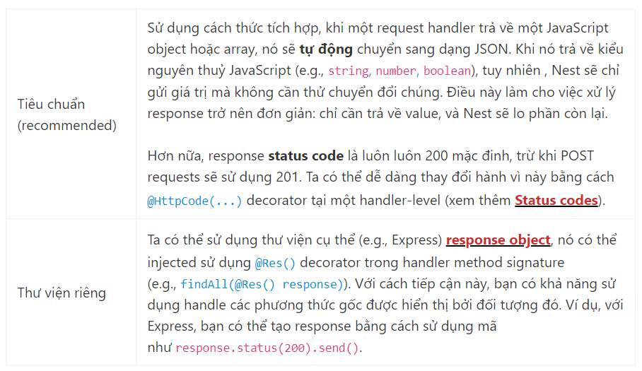
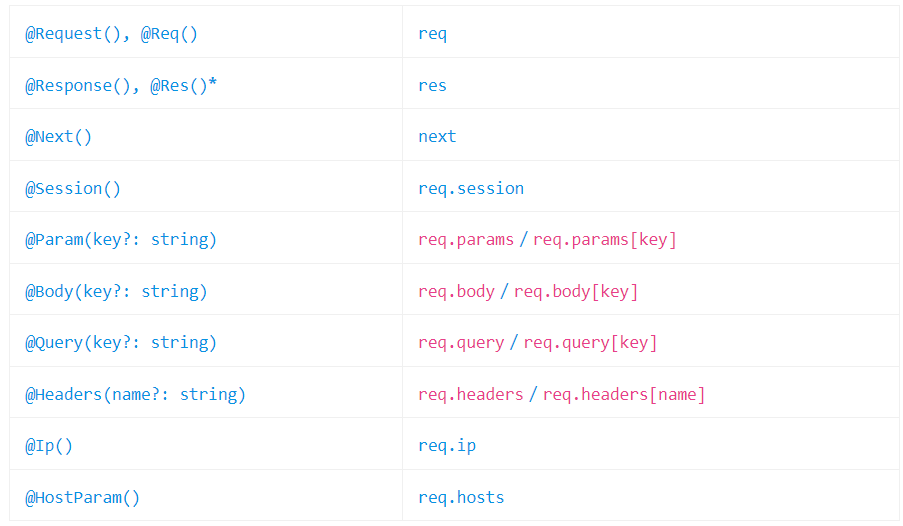

# Controller

## Routing:

`@Controller() decorator` được yêu cầu để định nghĩa một controller cơ bản. Ta sẽ chỉ định tiền tố đường dẫn tuỳ chọn của đối tượng(ở đây là `cats`). Sử dụng tiền tố đường dẫn trong một @Controller() decorator cho phép chúng ta dễ ràng nhóm một tập các route liên quan, giảm thiểu đoạn mã lặp.

```TypeScript
import { Controller, Get } from "@nestjs/common";

@Controller("cats")
export class CatsController {
  @Get()
  findAll(): string {
    return "This action returns all cats";
  }
}
```

Tạo controller bằng CLI:

```cmd
 $ nest g controller [route]
```

Phương thức `@Get()` HTTP request decorator phía trước phương thức `findAll()` yêu cầu Nest tạo một handler cho một endpoint cụ thể cho các request HTTP.Ví dụ: `@Get('info')` thì tạo ra một ánh xạ route cho `GET /cats/info`

Phương thức GET trả về status code 200 và response liên quan. Điều này liên quan đến khái niệm Nest sử dụng 2 tuỳ chọn khác nhau để điều khiển response:



<ins>Cảnh báo</ins>: Khi sử dụng @Res() hoặc @Next() nghĩa là chọn tùy chọn thư viện riêng. Nếu cả 2 cách tiếp cận được sử dụng đồng, thì cách tiếp cận Tiêu chuẩn sẽ tự động bị vô hiểu hóa cho một route duy nhất này và sẽ không còn hoạt động như mong đợi, bạn phải đặt passthrough tùy chọn thành true trong @Res({ passthrough: true }) decorator.

## Request object:

Handler thường cần truy cập vào các chi tiết request của client. Nest cung cấp quyền truy cập vào các request object của platform bên dưới (Express mặc định). Ta có thể truy cập vào request object bằng cách cung cấp Nest để inject nó bằng cách thêm @Req() decorator vào signature của handler

```TypeScript
import { Controller, Get, Req } from '@nestjs/common';
import { Request } from 'express';

@Controller('cats')
export class CatsController {
  @Get()
  findAll(@Req() request: Request): string {
    return 'This action returns all cats';
  }
}
```

<ins>Gợi ý</ins>: Để tận dụng các kiểu gõ express nên cài đặt gói @types/express.

Request object đại diện cho request HTTP và các thuộc tính của chuỗi query, request, parameters, HTTP headers, và body. Ta có thể sử dụng các decorator chuyên dụng, chẳng hạn như @Body() hoặc @Query(), sẵn có dùng được luôn. Dưới đây là danh sách các decorator được cung cấp và các đối tượng đơn giản dành riêng cho platform mà chúng đại diện.



\* Để tương thích với các kiểu chữ trên platform HTTP (eg, Express và Fastify), Nest cung cấp @Res() và @Response() decorator. @Res() đơn giản là viết tắt cho @Response(). Khi sử dụng phải đưa ra một số loại response bằng cách gọi response object (eg, res.json(…) hoặc res.send(…) ), hoặc nếu không máy chủ HTTP sẽ bị treo.

## Resources:

Nest cung cấp decorator cho tất cả các phương thức HTTP tiêu chuẩn: `@Get(), @Post(), @Put(), @Delete(), @Patch(), @Options(), and @Head()`. Ngoài ra, `@All()` xác định một endpoint – handle tất cả chúng.

```TypeScript
import { Controller, Get, Post } from '@nestjs/common';

@Controller('cats')
export class CatsController {
  @Post()
  create(): string {
    return 'This action adds a new cat';
  }

  @Get()
  findAll(): string {
    return 'This action returns all cats';
  }
}
```

## Route wildcards:

Pattern dựa trên route cũng được hỗ trợ. Ví dụ, dấu hình sao (\*) được sử dụng làm wildcard (ký tự đại diện), và sẽ khớp với bất kỳ tổ hợp ký tự nào.

```TypeScript
@Get('ab*cd')
findAll() {
  return 'This route uses a wildcard';
}
```

Đường dẫn route `ab*cd` sẽ khớp với `abcd, ab_cd, abecd, v.v`. Những ký tự `?, +, *, và ()` có thể được sử dụng trong đường dẫn route, và là các tập con của các regular expression counterparts của chúng. Dấu gạch nối (-) và dấu chấm (.) được hiểu theo nghĩa đen bằng các đường dẫn dựa trên chuỗi.

## Status code:

Status code – response luôn mặc định là 200, các POST request sẽ là 201. Nếu muốn thay đổi thì thêm @HttpCode(…) decorator ở handler-level.

```TypeScript
@Post()
@HttpCode(204)
create() {
  return 'This action adds a new cat';
}
```

Thông thường, status code của bạn không tĩnh mà phụ thuộc vào các yếu tố khác nhau. Trong trường hợp đó, bạn có thể sử dụng một response dành riêng cho thư viện (inject sử dụng `@Res()`) object (hoặc, trong trường hợp lỗi, ném ra 1 exception)

## Headers:

Chỉ định một tùy chỉnh response header bằng cách sử dụng một `@Header()` decorator hoặc response object thư viện riêng (và gọi trực tiếp res.header()).

```TypeScript
@Post()
@Header('Cache-Control', 'none')
create() {
  return 'This action adds a new cat';
}
```

## Redirection:

Để redirect một response tới một URL cụ thể, bạn có thể sử dụng @Redirect() decorator hoặc một thư viện riêng response object (và gọi trực tiếp res.redirect()).

`@Redirect()` nhận 2 đối số (arguments), url và statusCode, cả 2 đều là tùy chọn. Giá trị mặc định của statusCode is 302 (Found) nếu bị bỏ qua ko truyền gì.

```TypeScript
@Get()
@Redirect('https://nestjs.com', 301)
```

Đôi khi bạn có thể muốn xác định status code HTTP hoặc URL redirect động. Thực hiện việc này bằng cách trả về một object từ phương thức route handler có hình dạng:

```TypeScript
{
  "url": string,
  "statusCode": number
}
```

Các giá trị trả về sẽ ghi đè bất kỳ đối số nào được truyền đến @Redirect() decorator. Ví dụ:

```TypeScript
@Get('docs')
@Redirect('https://docs.nestjs.com', 302)
getDocs(@Query('version') version) {
  if (version && version === '5') {
    return { url: 'https://docs.nestjs.com/v5/' };
  }
}
```

## Route parameters:

`@Param()` được sử dụng để decorate một phương thức tham số và làm cho các tham số route có sẵn dưới dạng thuộc tính của tham số phương thức được decorated đó bên trong phần thân của phương thức. Như đoạn mã dưới, ta có thể truy cập tham số params.id. Bạn cũng có thể truyền 1 mã token cụ thể vào decorator, và sau đó tham chiếu trực tiếp tham số route theo tên trong thân phương thức.

```TypeScript
@Get(':id')
findOne(@Param() params): string {
  console.log(params.id);
  return `This action returns a #${params.id} cat`;
}
```

## Sub-Domain Routing:

`@Controller` decorator có thể có một tùy chọn host để yêu cầu máy chủ HTTP của các request đến khớp với một số giá trị cụ thể.

```TypeScript
@Controller({ host: 'admin.example.com' })
export class AdminController {
  @Get()
  index(): string {
    return 'Admin page';
  }
}
```

Tùy chọn host có thể sử dụng token để nắm bắt giá trị động tại vị trí đó trong tên máy chủ. Tham số token host trong @Controller() decorator. Các tham số host được khai báo theo cách này có thể được truy cập bằng cách sử dụng @HostParam() decorator, cần được thêm vào method signature.

```TypeScript
@Controller({ host: ':account.example.com' })
export class AccountController {
  @Get()
  getInfo(@HostParam('account') account: string) {
    return account;
  }
}
```

## Scopes:

Trong Nest, hầu hết mọi thứ đều được chia sẻ qua các request gửi đến. Chúng ta có một nhóm kết nối đến cơ sở dữ liệu, các singleton service với trạng thái toàn cục, v.v. Node.js không tuân theo Mô hình không trạng thái đa luồng yêu cầu / phản hồi mà một request được xử lý bởi một luồng riêng biệt. Do đó, việc sử dụng các instance singleton hoàn toàn an toàn cho các ứng dụng của chúng tôi.

Tuy nhiên, có những trường hợp cạnh khi thời gian tồn tại dựa trên request của controller có thể là hành vi mong muốn, ví dụ như bộ nhớ đệm theo request trong các ứng dụng GraphQL, theo dõi request hoặc cho thuê nhiều lần.

## Asynchronicity:

Nest hỗ trợ và hoạt động tốt với các function không đồng bộ.

Mọi hàm không đồng bộ phải trả về một Promise. Điều này có nghĩa là bạn có thể trả về giá trị hoãn lại mà Nest sẽ có thể tự resolve.

```TypeScript
@Get()
async findAll(): Promise<any[]> {
  return [];
}
```

Các route hander Nest thậm chí còn mạnh mẽ hơn khi có thể trả về các RxJS observable streams. Nest sẽ tự động subscribe nguồn bên dưới và lấy giá trị phát ra cuối cùng.

```TypeScript
@Get()
findAll(): Observable<any[]> {
  return of([]);
}
```

## Request payloads:

Thêm `@Body()` decorator để handler route POST chấp nhận các client params. Xác định lược đồ DTO (Đối tượng truyền dữ liệu). DTO là một đối tượng xác định cách dữ liệu sẽ được gửi qua mạng. Chúng tôi có thể xác định lược đồ DTO bằng cách sử dụng các interface TypeScript hoặc bằng các class đơn giản. Các lớp là một phần của tiêu chuẩn JavaScript ES6, và do đó chúng được giữ nguyên như các thực thể thực trong JavaScript đã biên dịch. Mặt khác, vì các interfaces TypeScript bị xóa trong quá trình chuyển đổi, Nest không thể tham chiếu đến chúng trong thời gian chạy. Điều này rất quan trọng vì các tính năng như Pipes cho phép các khả năng bổ sung khi chúng có quyền truy cập vào metatype của biến trong runtime.

Tạo lớp CreateCatDto ở create-cat.dto.ts:

```TypeScript
export class CreateCatDto {
  name: string;
  age: number;
  breed: string;
}
```

```TypeScript
@Post()
async create(@Body() createCatDto: CreateCatDto) {
  return 'This action adds a new cat';
}
```

Sau đó, chúng ta có thể sử dụng DTO mới được tạo bên trong CatsController:

```TypeScript
@Post()
async create(@Body() createCatDto: CreateCatDto) {
  return 'This action adds a new cat';
}
```

## Handling errors:

Có một chương riêng về xử lý lỗi (tức là làm việc với các ngoại lệ).

## Full resource sample:
