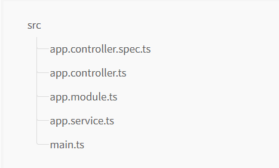
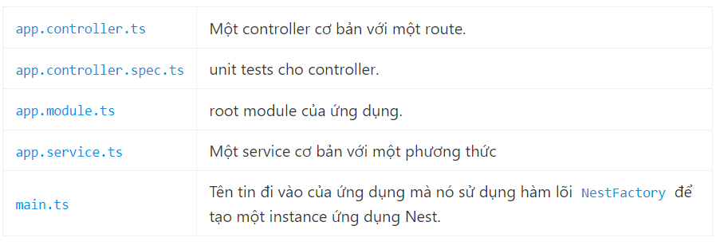
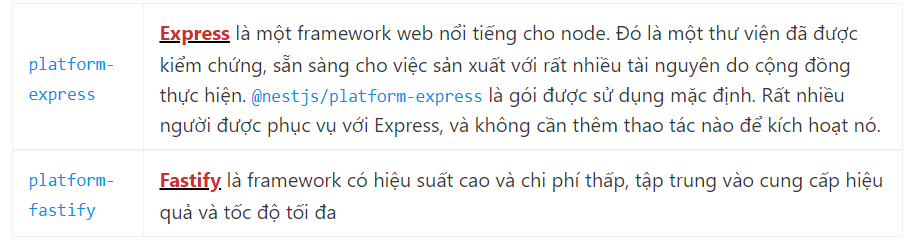
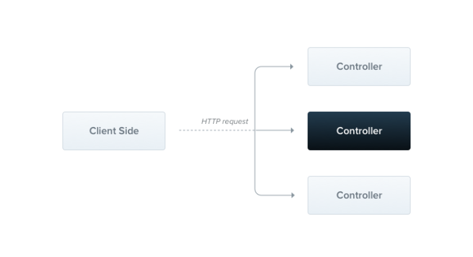
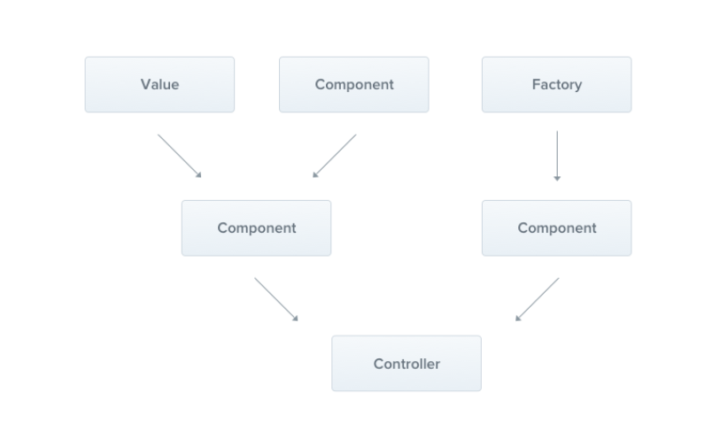
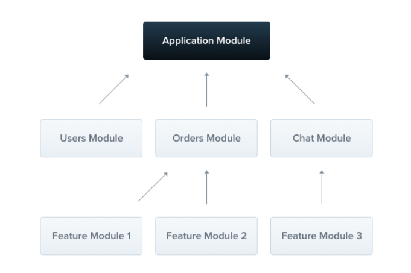
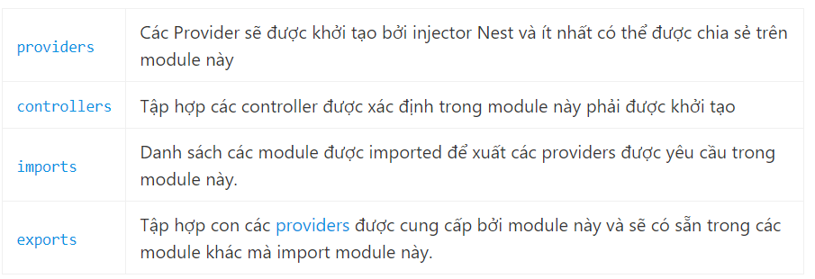
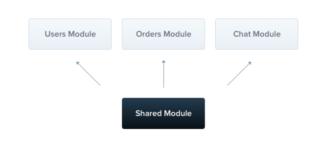

# NEST JS

## Tổng quát:

`NestJS` là một khuôn khổ để xây dựng các ứng dụng phía máy chủ `Node.js` hiệu quả, có thể mở rộng . Nó sử dụng JavaScript tiến bộ, được xây dựng và hỗ trợ đầy đủ TypeScript (vẫn cho phép viết mã bằng JavaScript thuần túy) và kết hợp các yếu tố của OOP (Lập trình hướng đối tượng), FP (Lập trình chức năng) và FRP (Lập trình phản ứng chức năng).

Nhờ `Node.js`, `JavaScript` đã trở thành “ngôn ngữ phổ biến” của web cho cả ứng dụng front và backend. Điều này đã làm nảy sinh các dự án tuyệt vời như `Angular, React và Vue`, tuy nhiên không có thư viện nào trong số chúng giải quyết hiệu quả vấn đề chính của - Kiến trúc. `NestJS` cung cấp kiến ​​trúc ứng dụng sẵn có cho phép các nhà phát triển và nhóm tạo ra các ứng dụng có thể kiểm tra cao, có thể mở rộng, kết hợp lỏng lẻo và dễ bảo trì.

## Tạo dự án mới:

```cmd
$ npm i -g @nestjs/cli
$ nest new project-name
```

Thư mục dự án sẽ được tạo, các root module và một vài tệp tin soạn sẵn khác sẽ được cài đặt, và một thư mục `src` sẽ được tạo và điển vào một số tệp lõi (core).





`Main.ts` bao gồm một hàm không đồng bộ, sẽ khởi động ứng dụng.

```TypeScript
import { NestFactory } from "@nestjs/core";
import { AppModule } from "./app.module";

async function bootstrap() {
  const app = await NestFactory.create(AppModule);
  await app.listen(3000);
}
bootstrap();
```

<ins>Lưu ý</ins>: một dự án được lồng ghép với Nest CLI sẽ tạo ra cấu trúc dự án ban đầu khuyến khích các nhà phát triển tuân theo quy ước giữ từng mô-đun trong thư mục chuyên dụng của riêng nó.

Nest có thể hoạt động với bất kỳ Framework Node HTTP nào sau khi tạo bộ chuyển đổi. Có hai nền tảng HTTP được hỗ trợ ngay lập tức: `express` và `fastify`.



Cho dù nền tảng nào được sử dụng, nó sẽ để lộ giao diện ứng dụng của riêng nó. Chúng được xem tương ứng là NestExpressApplicationvà NestFastifyApplication.

Chạy ứng dụng ta dùng lệnh:

```bash
$ npm run start
```

Truy cập `http://localhost:3000/` thì sẽ nhận được kết quả trả về.

## Controller:

Controllers có trách nhiệm xử lý các request gửi đến và trả lại response cho client.

Mục đích của controller là nhận các request cụ thể cho ứng dụng. Cơ chế định tuyến (route) kiểm soát controller nào nhận được request nào. Mỗi controller có nhiều hơn một định tuyến (route) và các định tuyến khác nhau thực hiện các hành động khác nhau.

Một controller cơ bản gồm các class và các decorator. Decorator liên kết với các class với metadata bắt buộc và cho phép Nest tạo ra bản đồ định tuyến (route map) (liên kết các request với controller tương ứng).

Tạo nhanh một controller CRUD với validation bằng lệnh CLI:

```bash
$ nest g resource [name]
```



[Những nội dung cụ thể của Controller](./controller.md)

## Providers:

Providers là một khái niệm cơ bản trong Nest. Nhiều Class Nest cơ bản có thể được coi như một provider như service, repository, factory, helpers, v.v. Ý tưởng chính của một provider là nó có thể inject dependencies; điều này có nghĩa là các đối tượng có thể tạo ra nhiều mối quan hệ khác nhau với nhau và chức năng “nối dây” các instances của đối tượng phần lớn có thể được ủy quyền cho hệ thống runtime Nest.



Trong chương trước, chúng ta đã xây dựng một CatsController đơn giản. Các Controllers nên handle các HTTP request và ủy quyền các tác vụ phức tạp hơn cho các providers. Các Providers là các class JavaScript thuần túy được khai báo là providers trong một module.

[Những nội dung cụ thể của Provider](./provider.md)

## Modules:

Module là một class được chú thích bằng @Module() decorator. @Module() decorator cung cấp metadata mà Nest sử dụng để tổ chức cấu trúc ứng dụng.



Mỗi ứng dụng có ít nhất một module, một module gốc. Module gốc là điểm khởi đầu Nest sử dụng để xây dựng biểu đồ ứng dụng – cấu trúc dữ liệu nội bộ mà Nest sử dụng để giải quyết các mối quan hệ và phụ thuộc của Module và các Providers. Module được khuyến khích sử dụng như một cách hiệu quả để tổ chức các thành phần dự án và mỗi module đóng gói một bộ khả năng có liên quan chặt chẽ.

@Module() decorator nhận một đối tượng duy nhất có thuộc tính mô tả module:



Module đóng gói các providers theo mặc định. Điều này có nghĩa là không thể inject providers mà ko trực tiếp là 1 phần của module hiện tại cũng như đã exported từ các module đã imported. Do đó, bạn có thể coi các providers đã exported từ một module là giao diện công khai của module hay API.

### Feature modules

CatsController và CatsService thuộc cùng một miền ứng dụng. Vì chúng có liên quan chặt chẽ với nhau, nên chuyển chúng vào một module tính năng sẽ rất hợp lý. Module tính năng chỉ đơn giản là tổ chức mã phù hợp với một tính năng cụ thể, giữ cho mã có tổ chức và thiết lập ranh giới rõ ràng. Điều này giúp chúng tôi quản lý sự phức tạp và phát triển với các nguyên tắc SOLID, đặc biệt là khi quy mô của ứng dụng và / hoặc nhóm ngày càng tăng.

```TypeScript
import { Module } from '@nestjs/common';
import { CatsController } from './cats.controller';
import { CatsService } from './cats.service';

@Module({
  controllers: [CatsController],
  providers: [CatsService],
})
export class CatsModule {}
```

Để tạo một module sử dụng CLI, dùng lệnh

```cmd
 $ nest g module [name]
```

```TypeScript
import { Module } from '@nestjs/common';
import { CatsModule } from './cats/cats.module';

@Module({
  imports: [CatsModule],
})
export class AppModule {}
```


### Shared modules

Trong Nest, các module là singleton theo mặc định, và do đó bạn có thể chia sẻ cùng một thực thể của bất kỳ provider nào giữa nhiều module một cách dễ dàng.



Mỗi module tự động là một module được chia sẻ. Sau khi được tạo, nó có thể được sử dụng lại bởi bất kỳ module nào. Hãy tưởng tượng rằng chúng ta muốn chia sẻ một thực thể của CatsService giữa một số module khác. Để làm điều đó, trước tiên chúng ta cần export provider CatsService bằng cách thêm nó vào mảng exports của module, như được hiển thị bên dưới:

```TypeScript
import { Module } from '@nestjs/common';
import { CatsController } from './cats.controller';
import { CatsService } from './cats.service';

@Module({
  controllers: [CatsController],
  providers: [CatsService],
  exports: [CatsService]
})
export class CatsModule {}
```

Bây giờ bất kỳ module nào import CatsModule đều có quyền truy cập vào CatsService và sẽ chia sẻ cùng một instance với tất cả các module khác cũng import nó.

### Module re-exporting

Như đã thấy ở trên, Module có thể export các providers nội bộ của chúng. Ngoài ra, họ có thể re-import các module mà họ đã import. Trong ví dụ bên dưới, CommonModule được imported và export từ CoreModule, làm cho nó có sẵn cho các module khác nhập module này.

```TypeScript
@Module({
  imports: [CommonModule],
  exports: [CommonModule],
})
export class CoreModule {}
```

### Dependency injection

Một class module cũng có thể inject các providers (ví dụ: cho mục đích cấu hình):

```TypeScript
import { Module } from '@nestjs/common';
import { CatsController } from './cats.controller';
import { CatsService } from './cats.service';

@Module({
  controllers: [CatsController],
  providers: [CatsService],
})
export class CatsModule {
  constructor(private catsService: CatsService) {}
}
```

### Global modules:

Nếu bạn phải import cùng một tập hợp các module ở khắp mọi nơi, nó có thể trở nên tẻ nhạt. Không giống như trong Nest, Angular providers được đăng ký trên phạm vi toàn cục. Sau khi được xác định, chúng có sẵn ở khắp mọi nơi. Nest, tuy nhiên, đóng gói các providers bên trong phạm vi module. Bạn không thể sử dụng các providers của ở nơi khác mà không nhập module đóng gói trước.

Khi bạn muốn cung cấp một tập hợp các providers nên có sẵn ở mọi nơi ngay lập tức (ví dụ: helpers, database connections, v.v.), hãy đặt module toàn cục với @Global() decorator.

```TypeScript
import { Module, Global } from '@nestjs/common';
import { CatsController } from './cats.controller';
import { CatsService } from './cats.service';

@Global()
@Module({
  controllers: [CatsController],
  providers: [CatsService],
  exports: [CatsService],
})
export class CatsModule {}
```

@Global() làm cho module có phạm vi toàn cục. Module toàn cục chỉ nên được đăng ký một lần, thường là module gốc hoặc module lõi. Trong ví dụ trên, provider CatsService sẽ phổ biến và các module muốn đưa service vào sẽ không cần nhập CatsModule trong mảng imports của chúng.

<ins>Chú ý</ins>: Làm cho mọi thứ toàn cục không phải là một quyết định thiết kế tốt. Các module toàn cục có sẵn để giảm số lượng bản mẫu cần thiết. Mảng imports nói chung là cách ưa thích để cung cấp API của module cho người tiêu dùng.

### Dynamic modules

Hệ thống module Nest bao gồm một tính năng mạnh mẽ được gọi là module động. Tính năng này cho phép bạn dễ dàng tạo các module có thể tùy chỉnh có thể đăng ký và cấu hình động các providers. Các mô-đun động được đề cập rộng rãi ở đây. Trong chương này, chúng tôi sẽ trình bày tổng quan ngắn gọn để hoàn thành phần giới thiệu về các module.

Sau đây là một ví dụ về định nghĩa mô-đun động cho DatabaseModule:

```TypeScript
import { Module, DynamicModule } from '@nestjs/common';
import { createDatabaseProviders } from './database.providers';
import { Connection } from './connection.provider';

@Module({
  providers: [Connection],
})
export class DatabaseModule {
  static forRoot(entities = [], options?): DynamicModule {
    const providers = createDatabaseProviders(options, entities);
    return {
      module: DatabaseModule,
      providers: providers,
      exports: providers,
    };
  }
}
```

Mô-đun này xác định provider kết nối theo mặc định (trong metadata @Module() decorator), nhưng ngoài ra – tùy thuộc vào các thực thể và đối tượng tùy chọn được truyền vào phương thức forRoot() – hiển thị một tập hợp các provider, ví dụ, repositories Lưu ý rằng các thuộc tính do mô-đun động trả về sẽ mở rộng (thay vì ghi đè) metadata mô-đun cơ sở được xác định trong @Module() decorator. Đó là cách cả provider kết nối được khai báo tĩnh và nhà cung cấp kho lưu trữ được tạo động đều được xuất từ mô-đun.

Nếu bạn muốn đăng ký một mô-đun động trong phạm vi toàn cục, hãy đặt thuộc tính global thành true.

```TypeScript
{
  global: true,
  module: DatabaseModule,
  providers: providers,
  exports: providers,
}
```

<ins>Cảnh báo</ins>: Biến mọi thứ thành toàn cục không phải là một quyết định tốt.

DatabaseModule có thể được nhập và xuất theo cách sau:

```TypeScript
import { Module } from '@nestjs/common';
import { DatabaseModule } from './database/database.module';
import { User } from './users/entities/user.entity';

@Module({
  imports: [DatabaseModule.forRoot([User])],
  exports: [DatabaseModule],
})
export class AppModule {}
```

## 8. Guards:

Guard là một lớp bảo vệ được chú thích bằng decorator @Injectable() và implement interface CanActivate.


Các Guards có một single responsibility. Họ xác định xem một request nhất định sẽ được xử lý bởi route handler hay không, tùy thuộc vào các điều kiện nhất định (như quyền/permissons, vai trò/roles, ACLs, v.v.) hiện có tại thời điểm chạy. Điều này thường được gọi là ủy quyền/authorization. Ủy quyền/Authorization thường được xử lý bởi middleware trong các ứng dụng Express truyền thống. Middleware là một lựa chọn tốt để xác thực/authentication, vì những thứ như token validation thông báo và đính kèm thuộc tính vào request object không được kết nối chặt chẽ với ngữ cảnh route cụ thể.

Nhưng middleware không biết handler nào sẽ được thực thi sau khi gọi hàm next(). Mặt khác, Guards có quyền truy cập vào instance ExecutionContext và do đó biết chính xác những gì sẽ được thực thi tiếp theo. Chúng được thiết kế, giống như exception filters, pipes và interceptors, để cho phép sử dụng logic xử lý chính xác vào đúng điểm trong chu kỳ request/response và làm như vậy một cách khai báo. Điều này giúp giữ cho code của bạn DRY và dễ khai báo.

<ins>Chú ý</ins>: Guards được thực thi sau mỗi middleware, nhưng trước bất kỳ interceptor hoặc pipe.

### Authorization guard:

Authorization/ủy quyền là một trường hợp sử dụng tuyệt vời cho các Guards vì các route cụ thể chỉ khả dụng khi người gọi (thường là người dùng được authenticated/xác thực cụ thể) có đủ quyền/permissions. AuthGuard mà chúng tôi sẽ xây dựng bây giờ giả định một người dùng đã được xác thực/authenticated (và do đó, một token được đính kèm với các request headers). Nó sẽ trích xuất và validate token, đồng thời sử dụng thông tin được trích xuất để xác định xem liệu request có thể tiếp tục hay không.

```TypeScript
import { Injectable, CanActivate, ExecutionContext } from '@nestjs/common';
import { Observable } from 'rxjs';

@Injectable()
export class AuthGuard implements CanActivate {
  canActivate(
    context: ExecutionContext,
  ): boolean | Promise<boolean> | Observable<boolean> {
    const request = context.switchToHttp().getRequest();
    return validateRequest(request);
  }
}
```

Logic bên trong hàm validateRequest() có thể đơn giản hoặc phức tạp nếu cần. Điểm chính của ví dụ này là chỉ ra cách các guards phù hợp với chu trình request/response.

Mọi guard phải implement một hàm canActivate(). Hàm này sẽ trả về một boolean, cho biết request hiện tại có được phép hay không. Nó có thể trả về response đồng bộ hoặc không đồng bộ (thông qua Promise hoặc Observable). Nest sử dụng giá trị trả về để kiểm soát hành động tiếp theo:

- Nếu trả về true, request sẽ được thực hiện.
- Nếu trả về false, Nest sẽ từ chối request.

### Execution context:

Hàm canActivate() nhận một đối số duy nhất là instance ExecutionContext. ExecutionContext kế thừa từ ArgumentsHost. Trong ví dụ trên, chúng tôi chỉ đang sử dụng cùng một phương thức helper được định nghĩa trên ArgumentsHost mà chúng tôi đã sử dụng trước đó, để nhận tham chiếu đến Request object.

Bằng cách mở rộng ArgumentsHost, ExecutionContext cũng bổ sung một số phương thức helper mới cung cấp chi tiết bổ sung về quy trình thực thi hiện tại. Những chi tiết này có thể hữu ích trong việc xây dựng nhiều guards chung hơn có thể hoạt động trên nhiều controllers, phương thức và execution contexts.

### Role-based authentication:

Xây dựng một function guard nhiều chức năng hơn chỉ cho phép truy cập vào những người dùng có vai trò cụ thể. Bắt đầu một mẫu guard cơ bản và dần dần hoàn thiện ở các phần tiếp theo.

```TypeScript
import { Injectable, CanActivate, ExecutionContext } from '@nestjs/common';
import { Observable } from 'rxjs';

@Injectable()
export class RolesGuard implements CanActivate {
  canActivate(
    context: ExecutionContext,
  ): boolean | Promise<boolean> | Observable<boolean> {
    return true;
  }
}
```

### Binding guards:

Giống như các pipes và exception filters, các guards có thể là phạm vi controller, phạm vi phương thức hoặc phạm vi toàn cục. Dưới đây, chúng tôi thiết lập bộ phận bảo vệ có phạm vi controller bằng cách sử dụng decorator @UseGuards(). Decorator này này có thể nhận một đối số duy nhất hoặc một danh sách các đối số được phân tách bằng dấu phẩy. Điều này cho phép bạn dễ dàng áp dụng nhóm guards thích hợp với một tuyên bố.

```TypeScript
@Controller('cats')
@UseGuards(RolesGuard)
export class CatsController {}
```

Cấu trúc bên trên gắn guard vào mọi handler do controller này khai báo. Nếu chúng ta muốn guard chỉ áp dụng cho một phương thức, chúng ta áp dụng decorator @UseGuards() ở cấp phương thức.

Để thiết lập bảo vệ toàn cục, hãy sử dụng phương thức useGlobalGuards() của instance ứng dụng Nest:

```TypeScript
const app = await NestFactory.create(AppModule);
app.useGlobalGuards(new RolesGuard());
```

Guards toàn cục được sử dụng trên toàn bộ ứng dụng, cho mọi controller và mọi route handler. Về mặt dependency injection, các guards toàn cầu được đăng ký từ bên ngoài của bất kỳ mô-đun nào (với useGlobalGuards() như trong ví dụ trên) không thể inject dependencies vì điều này được thực hiện bên ngoài ngữ cảnh của bất kỳ mô-đun nào. Để giải quyết vấn đề này, bạn có thể thiết lập bảo vệ trực tiếp từ bất kỳ mô-đun nào bằng cách sử dụng cấu trúc sau:

```TypeScript
import { Module } from '@nestjs/common';
import { APP_GUARD } from '@nestjs/core';

@Module({
  providers: [
    {
      provide: APP_GUARD,
      useClass: RolesGuard,
    },
  ],
})
export class AppModule {}
```

### Setting roles per handler:

RolesGuard của chúng tôi đang hoạt động, nhưng nó chưa thông minh lắm. Chúng tôi vẫn chưa tận dụng tính năng guard quan trọng nhất – execution context. Nó vẫn chưa biết về các roles, hoặc những roles nào được phép cho mỗi handler. Ví dụ, CatsController có thể có các sơ đồ quyền khác nhau cho các route khác nhau. Một số có thể chỉ có sẵn cho người dùng quản trị và những cái khác có thể mở cho tất cả mọi người. Làm thế nào chúng ta có thể kết hợp các role với các routes một cách linh hoạt và có thể tái sử dụng?

Đây là nơi metadata tùy chỉnh phát huy tác dụng. Nest cung cấp khả năng đính kèm metadata tùy chỉnh để route handlers thông qua decorator @SetMetadata(). Metadata này cung cấp dữ liệu vai trò còn thiếu của chúng tôi, mà một guard thông minh cần đưa ra quyết định.

```TypeScript
@Post()
@SetMetadata('roles', ['admin'])
async create(@Body() createCatDto: CreateCatDto) {
  this.catsService.create(createCatDto);
}
```

Với cách xây dựng ở trên, chúng tôi đã đính kèm metadata roles (roles là một khóa, trong khi [‘admin’] là một giá trị cụ thể) vào phương thức create(). Mặc dù điều này hoạt động, nhưng thực tế không tốt nếu sử dụng @SetMetadata() trực tiếp trong các routes của bạn. Thay vào đó, hãy decorator của riêng bạn, như được hiển thị bên dưới:

```TypeScript
import { SetMetadata } from '@nestjs/common';

export const Roles = (...roles: string[]) => SetMetadata('roles', roles);
```

Cách tiếp cận này rõ ràng hơn và dễ đọc hơn, và được kiểu mạnh mẽ. Bây giờ chúng ta đã có một decorator @Roles() tùy chỉnh, chúng ta có thể sử dụng nó để decorator cho phương thức create().

```TypeScript
@Post()
@Roles('admin')
async create(@Body() createCatDto: CreateCatDto) {
  this.catsService.create(createCatDto);
}
```

### Putting it all together:

Bây giờ chúng ta hãy quay lại và liên kết điều này với RolesGuard của chúng ta. Hiện tại, nó chỉ trả về true trong mọi trường hợp, cho phép mọi request được tiến hành. Chúng tôi muốn đặt giá trị trả về có điều kiện dựa trên việc so sánh các vai trò được chỉ định cho người dùng hiện tại với các vai trò thực tế được yêu cầu bởi route hiện tại đang được xử lý. Để truy cập (các) vai trò của route (metadata tùy chỉnh), chúng tôi sẽ sử dụng lớp helper Reflector, được cung cấp bên ngoài bởi framework và được lấy từ gói @nestjs/core.

```TypeScript
import { Injectable, CanActivate, ExecutionContext } from '@nestjs/common';
import { Reflector } from '@nestjs/core';

@Injectable()
export class RolesGuard implements CanActivate {
  constructor(private reflector: Reflector) {}

  canActivate(context: ExecutionContext): boolean {
    const roles = this.reflector.get<string[]>('roles', context.getHandler());
    if (!roles) {
      return true;
    }
    const request = context.switchToHttp().getRequest();
    const user = request.user;
    return matchRoles(roles, user.roles);
  }
}
```

Khi người dùng không có đủ đặc quyền yêu cầu một endpoint. Nest sẽ tự động trả về response sau:

```json
{
  "statusCode": 403,
  "message": "Forbidden resource",
  "error": "Forbidden"
}
```

Nếu bạn muốn trả về một response lỗi khác, bạn nên đưa ra ngoại lệ cụ thể của riêng mình. Ví dụ:

```TypeScript
throw new UnauthorizedException();
```
