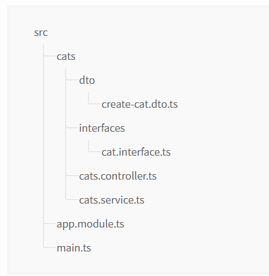

# Provider

## Services:

Hãy bắt đầu bằng cách tạo một CatsService đơn giản. Service này sẽ chịu trách nhiệm lưu trữ và truy xuất dữ liệu và được thiết kế để sử dụng bởi CatsController, vì vậy nó là một ứng cử viên sáng giá để được xác định là một provider.

```TypeScript
import { Injectable } from '@nestjs/common';
import { Cat } from './interfaces/cat.interface';

@Injectable()
export class CatsService {
  private readonly cats: Cat[] = [];

  create(cat: Cat) {
    this.cats.push(cat);
  }

  findAll(): Cat[] {
    return this.cats;
  }
}
```

Tạo một service bằng câu lệnh CLI:

```cmd
$ nest g service cats
```

CatsService của chúng tôi là một class cơ bản với một thuộc tính và hai phương thức. Tính năng mới duy nhất là nó sử dụng @Injectable() decorator. @Injectable() decorator đính kèm metadata, metadata này tuyên bố rằng CatsService là một class có thể được quản lý bởi Nest IoC container. Nhân tiện, ví dụ này cũng sử dụng interface Cat, có thể trông giống như sau:

```TypeScript
export interface Cat {
  name: string;
  age: number;
  breed: string;
}
```

Bây giờ chúng ta có một lớp Service để truy xuất Cats, hãy sử dụng nó bên trong CatsController:

```TypeScript
import { Controller, Get, Post, Body } from '@nestjs/common';
import { CreateCatDto } from './dto/create-cat.dto';
import { CatsService } from './cats.service';
import { Cat } from './interfaces/cat.interface';

@Controller('cats')
export class CatsController {
  constructor(private catsService: CatsService) {}

  @Post()
  async create(@Body() createCatDto: CreateCatDto) {
    this.catsService.create(createCatDto);
  }

  @Get()
  async findAll(): Promise<Cat[]> {
    return this.catsService.findAll();
  }
}
```

CatsService được injected vào thông qua constructor của lớp. Lưu ý việc sử dụng cú pháp private. Cách viết tắt này cho phép chúng ta vừa khai báo vừa khởi tạo thực thể catService ngay lập tức ở cùng một vị trí.

# Provider

## Dependency injection:

Nest được xây dựng dựa trên design pattern mạnh mẽ thường được gọi là Dependency injection. Chúng tôi khuyên bạn nên đọc một bài viết tuyệt vời về khái niệm này trong tài liệu Angular chính thức.

Trong Nest, nhờ các khả năng của TypeScript, việc quản lý các dependencty trở nên cực kỳ dễ dàng vì chúng chỉ được giải quyết theo kiểu. Trong ví dụ dưới, Nest sẽ giải quyết các catsService bằng cách tạo và trả về 1 instance của CatsService (hoặc, trong trường hợp bình thường là một singleton, trả về instance hiện có nếu nó đã được yêu cầu ở nơi khác). Dependency này được resolved và truyền tới constructor của controller của bạn (hoặc được gán thuộc tính được chỉ định):

```TypeScript
constructor(private catsService: CatsService) {}
```

# Provider

## Scopes

Các Providers thường có vòng đời (“phạm vi”) được đồng bộ hóa với vòng đời ứng dụng. Khi ứng dụng được khởi động, mọi dependency phải được resolved và do đó mọi Provider phải được khởi tạo. Tương tự, khi ứng dụng tắt, mỗi Provider sẽ bị hủy. Tuy nhiên, có nhiều cách để làm cho phạm vi vòng đợi request của Provider của bạn là tốt.

# Provider

## Custom providers

Nest tích hợp sẵn bộ chứa đảo ngược kiểm soát (“IoC”) để giải quyết các mối quan hệ giữa các Provider. Tính năng này làm cơ sở cho tính năng dependency injection được mô tả ở trên, nhưng trên thực tế, nó mạnh hơn nhiều so với những gì chúng tôi đã mô tả cho đến nay. Có một số cách để xác định Provider: bạn có thể sử dụng các giá trị thuần túy, các class và các factory không đồng bộ hoặc đồng bộ. Nhiều ví dụ hơn được cung cấp ở đây.

# Provider

## Optional providers

Đôi khi, bạn có thể có các dependency không nhất thiết phải được resolved. Ví dụ: Class của bạn có thể phụ thuộc vào một đối tượng cấu hình, nhưng nếu không có đối tượng nào được truyền, thì các giá trị mặc định sẽ được sử dụng. Trong trường hợp như vậy, phần phụ thuộc trở thành tùy chọn, vì thiếu Provider cấu hình sẽ không dẫn đến lỗi.

Để chỉ ra Provider là tùy chọn, hãy sử dụng @Optional() decorator trong signature của Provider.

```TypeScript
import { Injectable, Optional, Inject } from '@nestjs/common';

@Injectable()
export class HttpService<T> {
  constructor(@Optional() @Inject('HTTP_OPTIONS') private httpClient: T) {}
}
```

Lưu ý rằng trong ví dụ trên, chúng tôi đang sử dụng Provider tùy chỉnh, đó là lý do chúng tôi bao gồm mã thông báo tùy chỉnh HTTP_OPTIONS. Các ví dụ trước đây cho thấy việc inject dựa trên constructor chỉ ra sự phụ thuộc thông qua một lớp trong constructor.

# Provider

## Property-based injection

Kỹ thuật mà chúng tôi đã sử dụng cho đến nay được gọi là inject dựa trên constructor, vì các Provider được đưa vào thông qua constructor. Trong một số trường hợp rất cụ thể, inject dựa trên thuộc tính có thể hữu ích. Ví dụ: nếu top-level class của bạn phụ thuộc vào một hoặc nhiều Provider, việc chuyển chúng lên bằng cách gọi super() trong các lớp con từ constructor có thể rất tẻ nhạt. Để tránh điều này, bạn có thể sử dụng trình @Inject() decorator ở cấp thuộc tính.

```TypeScript
import { Injectable, Inject } from '@nestjs/common';

@Injectable()
export class HttpService<T> {
  @Inject('HTTP_OPTIONS')
  private readonly httpClient: T;
}
```

<ins>Cảnh báo</ins>: Nếu lớp của bạn không mở rộng Provider khác, bạn nên sử dụng inject dựa trên constructor.

# Provider

## Provider registration:

Bây giờ chúng tôi đã xác định một Provider (CatsService) và chúng tôi có một client sử dụng Service đó (CatsController), chúng tôi cần đăng ký Service với Nest để nó có thể thực hiện việc inject. Chúng tôi thực hiện việc này bằng cách chỉnh sửa tệp module của mình (app.module.ts) và thêm Service vào mảng providers của @Module() decorator.

```TypeScript
app.module.tsJS

import { Module } from '@nestjs/common';
import { CatsController } from './cats/cats.controller';
import { CatsService } from './cats/cats.service';

@Module({
  controllers: [CatsController],
  providers: [CatsService],
})
export class AppModule {}
```

Nest bây giờ sẽ có thể resolve các dependency của lớp CatsController.

Đây là cách cấu trúc thư mục của chúng ta sẽ trông như bây giờ:


