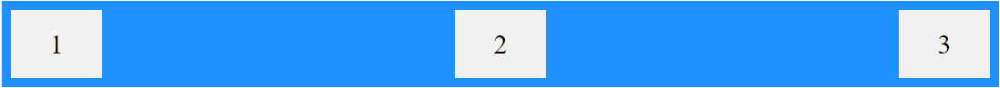

# CSS3

## 1. Giới thiệu

- CSS là viết tắt của Cascading Style Sheets (tập tin định dạng theo tầng).
- CSS quy định cách các thành phần HTML sẽ hiển thị trên màn hình, giấy hay trong các phương tiện truyền thông khác.
- CSS giúp bạn tiết kiệm rất nhiều công sức. Nó có thể kiểm soát giao diện của nhiều trang web khác nhau cùng một lúc.

## 2. CSS SELECTOR

### 2.1 Simple selectors

- Chọn các element dựa trên `tag name`, `id`, `class`

### 2.2 Combinator selectors

- Chọn các element dựa trên mối quan hệ cụ thể giữa chúng.

#### a. Descendant Selector (Bộ chọn con cháu)

- Bộ chọn con cháu khớp với tất cả các element là con của một element được chỉ định.

#### b. Child Selector (>)

- Bộ chọn con chọn tất cả các element là con của một element được chỉ định.

#### c. Adjacent Sibling Selector (+)

- Chọn một element nằm ngay sau một element cụ thể khác.

#### d. General Sibling Selector (~)

- Chọn tất cả các element là anh chị em của một element được chỉ định.

### 2.3 CSS Pseudo-classes

- Cú pháp:

```css
selector:pseudo-class {
  property: value;
}
```

- Được sử dụng để xác định trạng thái đặc biệt của một element.
- Một số pseudo-classes thường dùng:

  - `Anchor Pseudo-class`: các liên kết có thể được hiển thị theo nhiều cách khác nhau.

    - `:link`: Trạng thái hiện tại của thẻ (chỉ dùng cho thẻ `a`).
    - `:visited`: Trạng thái khi đã click vào thẻ (chỉ dùng cho thẻ `a`).
    - `:hover`: Trạng thái khi di chuyển chuột vào thẻ (dùng cho nhiều thẻ).
    - `:active`: Trạng thái khi click chuột vào thẻ (dùng cho nhiều thẻ).

  - Các `Pseudo-class` khác:

    - `:First-child `: element được chỉ định là element con đầu tiên của element khác.
    - `:Last-child `: Tương tự first-child nhưng là element con cuối cùng
    - `:first-of-type` Với mọi element là element con đầu tiên, của một kiểu cụ thể, của element cha của nó.
    - `:last-of-type` Với mọi element là element con cuối cùng, của một kiểu cụ thể, của element cha của nó.
    - `:nth-child(n)`: Với mọi element là element con thứ n , bất kể kiểu, của element cha của nó. (n có thể là một số, một từ khóa hoặc một công thức.).
    - `:nth-last-child(n)`: Tương tự như child nhưng tính từ element cuối cùng lên.
    - `:nth-last-of-type(n)`:Với mọi element là element con thứ n , của một kiểu cụ thể, của cha mẹ của nó, tính từ element cuối cùng.
    - `:nth-of-type(n)`:Với mọi element là element con thứ n , của một kiểu cụ thể, của element cha của nó.
    - `:only-of-type`: chọn element là con duy nhất của loại nó là con của element cha.
    - `only-child`: trong element cha chỉ có duy nhất 1 element nếu có > 1 thì không được chọn.
    - `:checked `: Với mọi element `<input>` đã chọn (chỉ dành cho các type radio và checkbox) và element `<option>`.
    - `:disabled`: Với mọi element bị disable (chủ yếu được sử dụng trên các element biểu mẫu).
    - `:enabled`: Với mọi element enable (chủ yếu được sử dụng trên các element biểu mẫu).
    - `:empty `: Với mọi element không có element con (bao gồm cả các nút văn bản).
    - `:focus`: dùng để chọn element được focus vào.
    - `:in-range`: chọn tất cả các element có giá trị nằm trong một phạm vi xác định.(trong vùng min - max).
    - `:out-of-range`: chọn tất cả các element có giá trị nằm trong một phạm vi xác định.(ngoài vùng min - max).
    - `:invalid`: chọn các form elements có giá trị không xác thực theo cài đặt của element. (chỉ hoạt động cho các form elements có giới hạn, chẳng hạn như element đầu vào có thuộc tính tối thiểu và tối đa, trường email không có email hợp pháp hoặc trường số không có giá trị số, v.v.).
    - `:valid`: chọn các form elements có giá trị xác thực theo cài đặt của element. (chỉ hoạt động cho các form elements có giới hạn, chẳng hạn như element đầu vào có thuộc tính tối thiểu và tối đa, trường email không có email hợp pháp hoặc trường số không có giá trị số, v.v.).
    - `:lang()`: chọn được sử dụng để chọn các element có attribute lang với giá trị được chỉ định. Giá trị của `lang="value"` thường là mã ngôn ngữ gồm 2 chữ cái.
    - `:not(selector)`: Mọi element KHÔNG phải là element / bộ chọn được chỉ định.
    - :`optional`: Những input không có attribute `required` thì sẽ được chọn (chỉ dùng cho thẻ `input`, `select`, `textarea`)
    - `:read-only`: Những form elements có attribute `readonly` sẽ được chọn
    - `:read-write`: Những form elements `có thể đọc` và `có thể ghi` sẽ được chọn (những element có attribute `readonly` và `disable` sẽ không được chọn).
    - `:required`: Những form elements có attribute `required` sẽ được chọn (chỉ áp dụng cho các thẻ `input`, và `textarea`.)
    - `:root`: Chọn phần tử `root`.
    - `:target`: chọn những element có `id` trùng với `href` trong thẻ `a`

## 3. Grid

### 3.1 Giới thiệu

- Cung cấp một hệ thống bố cục dựa trên lưới, với các hàng và cột, giúp thiết kế các web dễ dàng hơn mà không cần sử dụng float và position.
- Bố cục lưới bao gồm một element container, với 1 hoặc nhiều element item.
- Tất cả các item trực tiếp của `grid container` sẽ tự động trở thành các `grid items`.
- `grid columns`: Các đường thẳng đứng của các `grid items` được gọi là `cột`.
  
- `grid rows`: Các đường ngang của các `grid items` được gọi là `hàng`.
  
- `Grid Gaps`: Khoảng cách giữ mỗi `cột` / `hàng` gọi là `gaps`.
- Chúng ta sẽ dùng thuộc tính `grid-gap = value` để set khoảng cách.
  

- `Grid Lines`

  - Các line giữa các cột được gọi là `column lines`.
  - Các line giữa các hàng được gọi là `row lines`.

  - Cách tính lines như sau: `row lines = số hàng+ 1`, và `column lines = số cột+ 1`
    

### 3.2 grid-template-columns

- Dùng để xác định số lượng `cột` trong `grid layout` và nó có thể xác định `width` của mỗi `cột`.
- Ở đây có thể chia bao nhiêu cột tùy ý, thường dựa vào thiết kế là 12 cột bằng nhau.
- Chúng ta muốn thêm bao nhiêu cột thì chỉ cần thêm như thế này: `grid-template-columns: cột1 cột2 cột3.... cộtN`.
- Đơn vị ở đây có thể dùng là: `px`, `%`, `em`, `rem`, `auto` và `fr`.
- Ví dụ: dưới đây sẽ chia 5 cột và có `width` bằng nhau là 20%.

```css
.container {
  grid-template-columns: 50% 50%;
}
```


### 3.3 grid-template-rows

- Dùng để xác định số lượng `hàng` trong `grid layout` và nó có thể xác định `height` của mỗi `hàng`.
- Chúng ta muốn thêm bao nhiêu hàng thì chỉ cần thêm như thế này: `grid-template-rows: hàng1 hàng2 hàng3.... hàngN`.
- Ví dụ: dưới đây sẽ chia 2 hàng và có `height` bằng nhau là 50%.

```css
.container {
  grid-template-rows: 25% 25% 25% 25%;
}
```


### 3.4 fraction-unit (`fr`)

- Đây là giá trị được dùng trong `CSS GRID`.
- Giá trị này sẽ chiếm khoảng trống lớn nhất có thể.
- ví dụ:
  `css grid-template-columns: 15% 1fr 25% 15%;`
  

### 3.5 grid-auto-flow

- Giả sử trường hợp khi có 1 hoặc nhiều element bị dư do không đủ cột hay không đủ hàng thì nó sẽ rớt xuống hàng mới, thì mình muốn set cho các element bị rớt đó có `height` nhất định chúng ta sẽ dùng `grid-auto-flow` kết hợp với `grid-auto-rows` để set cho các element đó.

```css
.container {
  grid-template-rows: 100px 150px;
  grid-auto-flow: row;
  grid-auto-columns: 50px;
}
```


- Về column thì tương tự như row

```css
.container {
  width: 600px;
  display: grid;
  grid-template-columns: 100px 200px;
  grid-auto-flow: column;
  grid-auto-columns: 250px;
}
```


### 3.6 repeat()

- Hàm này giúp chúng ta tạo cột/hàng có cùng giá trị 1 cách nhanh chóng.

- Giả sử chúng ta muốn tạo 6 cột và muốn rằng cột đầu và cột cuối cùng có giá trị là 10% còn 4 cột giữa mỗi cột là 20% chúng ta sẽ làm như sau:

```css
grid-template-columns: 10% repeat(4, 20%) 10%;
```


### 3.7 grid-column

- Thuộc tính này viết tắt của 2 thuộc tính `grid-column-start` và `grid-column-end`giúp chúng ta thiết lập vị trí và kích thước của element theo cột.
- Cú pháp của nó như sau

```css
grid-column: grid-column-start / grid-column-end.;
```

-Trong đó giá trị của `grid-column-start` và `grid-column-end` là các `column lines` hoặc `row lines`

```css
#grid {
  display: grid;
  height: 200px;
  grid-template-columns: repeat(6, 1fr);
  grid-template-rows: 200px;
}
#item2 {
  background-color: green;
  grid-column: 2 / 4;
}
#item3 {
  background-color: red;
  grid-column: span 2 / 7;
}
```


### 3.8 grid-row

- Cũng như `grid-column` nhưng thuộc tính này giúp chúng ta thiết lập vị trí và kích thước của phần tử theo hàng.

### 3.9 grid-area

- Có thể được sử dụng làm thuộc tính viết tắt cho các thuộc tính `grid-row-start`, `grid-column-start`, `grid-row-end` và `grid-column-end`.
  cũng có thể được sử dụng để gán tên cho các `grid item`.
- Cú pháp như sau:

```css
grid-area: grid-row-start / grid-column-start / grid-row-end / grid-column-end;
```


- Cú pháp gán tên cho `grid item`:

```css
grid-area: myItem1;
```

### 3.10 grid-template-areas

- Giúp chúng ta tạo bố cục layout một cách nhanh chóng, dễ dàng mà lại đơn giản bằng tên của grid-area.
- Ví dụ:

```css
#container {
  display: grid;
  width: 100%;
  height: 250px;
  grid-template-areas:
    "head head"
    "nav  main"
    "nav  foot";
  grid-template-rows: 50px 1fr 30px;
  grid-template-columns: 150px 1fr;
}
```


### 3.11 minmax

- Hàm này giúp chúng ta thiết lập độ rộng của cột hoặc chiều cao
  của dòng theo giá trị tối thiểu và tối đa cho element.
- Cú pháp: `grid-template-columns: minmax(300px, 500px)` sẽ tạo ra 1 cột
  có độ rộng tối thiểu là 300px và độ rộng tối đa là 500px.
- Ví dụ

```css
#container {
  display: grid;
  grid-template-columns:
    minmax(min-content, 300px)
    minmax(max-content, 300px) 1fr;
}
```


### 3.12 grid-auto-flow: dense

- `grid-auto-flow` còn một giá trị khác nữa đó là dense.
- Giá trị này sẽ làm cho các element tự động lấp đầy vào các chỗ trống trong grid một cách hợp lý sao cho không bị dư khoảng trống.

- Giá trị này sẽ làm cho các element sắp xếp không còn theo thứ tự nữa.

[demo](https://codepen.io/enxaneta/pen/QpjvBx)

### 3.13 Một số thuộc tính của Grid Container

#### a. justify-content

- Dùng để căn chỉnh toàn bộ `grid item` bên trong `container` theo chiều ngang.
- Tổng chiều rộng của `grid` phải nhỏ hơn `width` của `container` để thuộc tính `justify-content` có hiệu lực.
- Ví dụ dưới đây dùng `justify-content: space-around;`
  

#### b. align-content

- Dùng để căn chỉnh toàn bộ `grid item` bên trong `container` theo chiều dọc.
  

#### c. Các giá trị của align-content và justify-content thường dùng

- `start`
- `end`
- `center`
- `space-between`
- `space-around`
- `space-evenly`

## 4. FLEXBOX

### 4.1 Thuộc tính Display: Flex

- Để sử dụng flex trong css thì chúng ta chỉ cần sử dụng thuộc tính `display: flex`.
  
  

### 4.2 Flex-direction

- Trong flexbox có 2 trục chính là x và y.
- Mặc định những `item` trog flexbox được sắp xếp theo trục x từ trái qua phải.
- Trong `flex-direction` có 4 giá trị là: `row, row-reverse, column, column-reverse`
- Với giá trị là `row` là giá trị mặc định.
  
- Với giá trị là `row-reverse` thì các element sẽ được sắp xếp từ phải sang trái.
  
- Với giá trị là `column` thì các element sẽ được sắp xếp từ trên xuống dưới.
  
- Với giá trị là `column-reverse` thì các element sẽ được sắp xếp từ dưới lên trên.
  

### 4.3 Flex-wrap

- Cho phép các `item` tự động xuống hàng hoặc vẫn luôn nằm trên cùng một hàng khi kích thước container thay đổi.
- Có 3 giá trị đó là `nowrap`(giá trị mặc định), `wrap và wrap-reverse`.

#### a. nowrap

- Khi resize trình duyệt thì các `item` sẽ co lại chứ không có rớt xuống.
  
  

#### b. wrap

- Khi resize trình duyệt thì các `item` sẽ nhảy xuống khi thay đổi kích thước `container`.
  
  

#### c. wrap-reverse

- Tương tự `wrap` nhưng thay vì rớt xuống thì nó rớt lên.
  
  

### 4.4 flex-flow

- Đây là thuộc tính viết tắt của `flex-direction` và `flex-wrap`.

```css
flex-flow: row wrap;
```

\


### 4.5 Justify-content

- Thuộc tính này cho phép các bạn căn chỉnh các `element` theo chiều ngang hoặc chiều dọc tùy thuộc vào thuộc tính `flex-direction`.

- Trong justify-content có 5 giá trị đó là:`flex-start, flex-end, center, space-between, space-evenly và space-around`.
- Flex-start
  
- Flex-end
  
- center
  
- space-between
  
- space-evenly
  
- space-around

  

### 4.6 Align-items

- Ngược lại với thuộc tính `justify-content` thì mặc định `align-items` canh các phần tử theo chiều dọc thay vì chiều ngang như justify-content.

- Tuy nhiên nếu đổi flex-direction sang column thì align-items sẽ canh theo chiều ngang.
- `align-items: center`

  

- `align-items: baseline`

  

- `align-items: stretch`

  

### 4.7 Align-self

- Thuộc tính này tương tự với thuộc tính align-items, nhưng khác ở chỗ là áp dụng riêng lẻ cho các phần tử mà bạn muốn thay đổi giá trị của nó.

  

### 4.8 align content

- Dùng để căn chỉnh các dòng flex.
- `align-content:flex-end`
  
- `align-content:space-around`
  
- Nếu trong 1 hàng gồm 10 item thì `height` của tất cả `item` sẽ bằng với `height` lớn nhất trong 10 `item` đó.

### 4.9 Order

- Thuộc tính này cho phép đổi vị trí hiển thị của các `element`
- Giá trị mặc định là 0.

```html
<div class="flex-container">
  <div style="order: 3">1</div>
  <div style="order: 4">2</div>
  <div style="order: 2">3</div>
  <div style="order: 1">4</div>
</div>
```


### 4.10 Flex-basis

- Dùng để set `width` hoặc `height` của `element` dựa vào `flex-direction` là `row` hay `column`.
- Mặc định là `flex-direction: row` cho nên lúc này `flex-basis` sẽ tương ứng với thuộc tính `width` của `element`.
- khi `flex-direction: column` thì lúc này `flex-basis` sẽ là `height` của `element`.
- `flex-basis` sẽ đè lên thuộc tính `width` hoặc `height` của `element`.

```html
<div class="flex-container">
  <div>1</div>
  <div>2</div>
  <div style="flex-basis:200px">3</div>
  <div>4</div>
</div>
```


### 4.11 Flex-grow

- Thuộc tính này nó cho các `element` giãn theo `width` của `container`.
- Mặc định giá trị trong thuộc tính `flex-grow` là 0.


- Công thức tính tỉ lệ `width` của các `element` như sau: `width-item = (flex-grow của item hiện tại/Tổng flex-grow của các item)* width-container`.
- Nếu áp dụng công thức ra bằng 0 thì width sẽ phụ thuộc vào nội dung bên trong `element`.


### 4.12 Flex-shrink

- Thuộc tính này nó cho các `element` co lại theo `width` của `container`.
- Mặc định giá trị trong thuộc tính `flex-shrink` là 1 nghĩa là cho phép `element` được co lại khi `width` của `container` giảm xuống.
- Nếu giá trị `flex-shrink: 0` thì khi co lại `element` sẽ không bị thay đổi `width`

### 4.13 Flex

- Thuộc tính này là viết tắt của `flex-grow`, `flex-shrink` và `flex-basis`.
- Cú pháp `flex: flex-grow flex-shrink flex-basis`.
