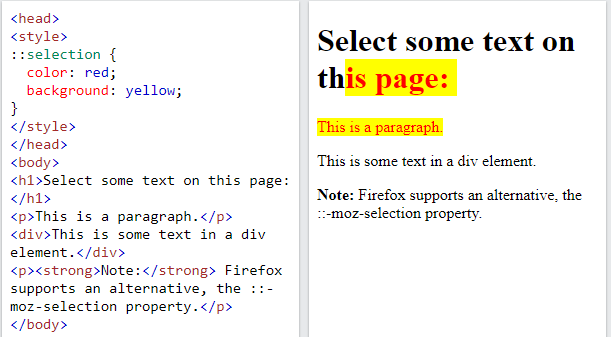

# CSS3

## 1. Giới thiệu

- CSS là viết tắt của Cascading Style Sheets (tập tin định dạng theo tầng).
- CSS quy định cách các thành phần HTML sẽ hiển thị trên màn hình, giấy hay trong các phương tiện truyền thông khác.
- CSS giúp bạn tiết kiệm rất nhiều công sức. Nó có thể kiểm soát giao diện của nhiều trang web khác nhau cùng một lúc.

## 2. CSS SELECTOR

### 2.1 Simple selectors

- Chọn các element dựa trên `tag name`, `id`, `class`

### 2.2 Combinator selectors

- Chọn các element dựa trên mối quan hệ cụ thể giữa chúng.

#### a. Descendant Selector (Bộ chọn con cháu)

- Bộ chọn con cháu khớp với tất cả các element là con của một element được chỉ định.

#### b. Child Selector (>)

- Bộ chọn con chọn tất cả các element là con của một element được chỉ định.

#### c. Adjacent Sibling Selector (+)

- Chọn một element nằm ngay sau một element cụ thể khác.

#### d. General Sibling Selector (~)

- Chọn tất cả các element là anh chị em của một element được chỉ định.

### 2.3 CSS Pseudo-classes

- Cú pháp:

```css
selector:pseudo-class {
  property: value;
}
```

- Được sử dụng để xác định trạng thái đặc biệt của một element.
- Một số pseudo-classes thường dùng:

  - `Anchor Pseudo-class`: các liên kết có thể được hiển thị theo nhiều cách khác nhau.

    - `:link`: Trạng thái hiện tại của thẻ (chỉ dùng cho thẻ `a`).
    - `:visited`: Trạng thái khi đã click vào thẻ (chỉ dùng cho thẻ `a`).
    - `:hover`: Trạng thái khi di chuyển chuột vào thẻ (dùng cho nhiều thẻ).
    - `:active`: Trạng thái khi click chuột vào thẻ (dùng cho nhiều thẻ).

  - Các `Pseudo-class` khác:

    - `:First-child `: element được chỉ định là element con đầu tiên của element khác.
    - `:Last-child `: Tương tự first-child nhưng là element con cuối cùng
    - `:first-of-type` Với mọi element là element con đầu tiên, của một kiểu cụ thể, của element cha của nó.
    - `:last-of-type` Với mọi element là element con cuối cùng, của một kiểu cụ thể, của element cha của nó.
    - `:nth-child(n)`: Với mọi element là element con thứ n , bất kể kiểu, của element cha của nó. (n có thể là một số, một từ khóa hoặc một công thức.).
    - `:nth-last-child(n)`: Tương tự như child nhưng tính từ element cuối cùng lên.
    - `:nth-last-of-type(n)`:Với mọi element là element con thứ n , của một kiểu cụ thể, của cha mẹ của nó, tính từ element cuối cùng.
    - `:nth-of-type(n)`:Với mọi element là element con thứ n , của một kiểu cụ thể, của element cha của nó.
    - `:only-of-type`: chọn element là con duy nhất của loại nó là con của element cha.
    - `only-child`: trong element cha chỉ có duy nhất 1 element nếu có > 1 thì không được chọn.
    - `:checked `: Với mọi element `<input>` đã chọn (chỉ dành cho các type radio và checkbox) và element `<option>`.
    - `:disabled`: Với mọi element bị disable (chủ yếu được sử dụng trên các element biểu mẫu).
    - `:enabled`: Với mọi element enable (chủ yếu được sử dụng trên các element biểu mẫu).
    - `:empty `: Với mọi element không có element con (bao gồm cả các nút văn bản).
    - `:focus`: dùng để chọn element được focus vào.
    - `:in-range`: chọn tất cả các element có giá trị nằm trong một phạm vi xác định.(trong vùng min - max).
    - `:out-of-range`: chọn tất cả các element có giá trị nằm trong một phạm vi xác định.(ngoài vùng min - max).
    - `:invalid`: chọn các form elements có giá trị không xác thực theo cài đặt của element. (chỉ hoạt động cho các form elements có giới hạn, chẳng hạn như element đầu vào có thuộc tính tối thiểu và tối đa, trường email không có email hợp pháp hoặc trường số không có giá trị số, v.v.).
    - `:valid`: chọn các form elements có giá trị xác thực theo cài đặt của element. (chỉ hoạt động cho các form elements có giới hạn, chẳng hạn như element đầu vào có thuộc tính tối thiểu và tối đa, trường email không có email hợp pháp hoặc trường số không có giá trị số, v.v.).
    - `:lang()`: chọn được sử dụng để chọn các element có attribute lang với giá trị được chỉ định. Giá trị của `lang="value"` thường là mã ngôn ngữ gồm 2 chữ cái.
    - `:not(selector)`: Mọi element KHÔNG phải là element / bộ chọn được chỉ định.
    - :`optional`: Những input không có attribute `required` thì sẽ được chọn (chỉ dùng cho thẻ `input`, `select`, `textarea`)
    - `:read-only`: Những form elements có attribute `readonly` sẽ được chọn
    - `:read-write`: Những form elements `có thể đọc` và `có thể ghi` sẽ được chọn (những element có attribute `readonly` và `disable` sẽ không được chọn).
    - `:required`: Những form elements có attribute `required` sẽ được chọn (chỉ áp dụng cho các thẻ `input`, và `textarea`.)
    - `:root`: Chọn phần tử `root`.
    - `:target`: chọn những element có `id` trùng với `href` trong thẻ `a`

### 2.4 CSS Pseudo Element

Cú pháp: `selector::pseudo-element { property: value; }`

`:first-line`

- Áp dụng cho `element` con dòng đầu tiên trong `element container`.


`:first-letter`

- Áp dụng cho chữ cái đầu tiên trong element.


`before` và `after`: giống Pseudo Class

`::mark`

- Sử dụng cho các điểm đánh dấu của các mục danh sách.


`::selection`

- Áp dụng kiểu cho các `element` được người dùng đánh dấu (bôi đen)



## 3. Grid

### 3.1 Giới thiệu

- Cung cấp một hệ thống bố cục dựa trên lưới, với các hàng và cột, giúp thiết kế các web dễ dàng hơn mà không cần sử dụng float và position.
- Bố cục lưới bao gồm một element container, với 1 hoặc nhiều element item.
- Tất cả các item trực tiếp của `grid container` sẽ tự động trở thành các `grid items`.
- `grid columns`: Các đường thẳng đứng của các `grid items` được gọi là `cột`.
  
- `grid rows`: Các đường ngang của các `grid items` được gọi là `hàng`.
  
- `Grid Gaps`: Khoảng cách giữ mỗi `cột` / `hàng` gọi là `gaps`.
- Chúng ta sẽ dùng thuộc tính `grid-gap = value` để set khoảng cách.
  

- `Grid Lines`

  - Các line giữa các cột được gọi là `column lines`.
  - Các line giữa các hàng được gọi là `row lines`.

  - Cách tính lines như sau: `row lines = số hàng+ 1`, và `column lines = số cột+ 1`
    

### 3.2 grid-template-columns

- Dùng để xác định số lượng `cột` trong `grid layout` và nó có thể xác định `width` của mỗi `cột`.
- Ở đây có thể chia bao nhiêu cột tùy ý, thường dựa vào thiết kế là 12 cột bằng nhau.
- Chúng ta muốn thêm bao nhiêu cột thì chỉ cần thêm như thế này: `grid-template-columns: cột1 cột2 cột3.... cộtN`.
- Đơn vị ở đây có thể dùng là: `px`, `%`, `em`, `rem`, `auto` và `fr`.
- Ví dụ: dưới đây sẽ chia 5 cột và có `width` bằng nhau là 20%.

```css
.container {
  grid-template-columns: 50% 50%;
}
```


### 3.3 grid-template-rows

- Dùng để xác định số lượng `hàng` trong `grid layout` và nó có thể xác định `height` của mỗi `hàng`.
- Chúng ta muốn thêm bao nhiêu hàng thì chỉ cần thêm như thế này: `grid-template-rows: hàng1 hàng2 hàng3.... hàngN`.
- Ví dụ: dưới đây sẽ chia 2 hàng và có `height` bằng nhau là 50%.

```css
.container {
  grid-template-rows: 25% 25% 25% 25%;
}
```


### 3.4 fraction-unit (`fr`)

- Đây là giá trị được dùng trong `CSS GRID`.
- Giá trị này sẽ chiếm khoảng trống lớn nhất có thể.
- ví dụ:
  `css grid-template-columns: 15% 1fr 25% 15%;`
  

### 3.5 grid-auto-flow

- Giả sử trường hợp khi có 1 hoặc nhiều element bị dư do không đủ cột hay không đủ hàng thì nó sẽ rớt xuống hàng mới, thì mình muốn set cho các element bị rớt đó có `height` nhất định chúng ta sẽ dùng `grid-auto-flow` kết hợp với `grid-auto-rows` để set cho các element đó.

```css
.container {
  grid-template-rows: 100px 150px;
  grid-auto-flow: row;
  grid-auto-rows: 50px;
}
```


- Về column thì tương tự như row

```css
.container {
  width: 600px;
  display: grid;
  grid-template-columns: 100px 200px;
  grid-auto-flow: column;
  grid-auto-columns: 250px;
}
```


### 3.6 repeat()

- Hàm này giúp chúng ta tạo cột/hàng có cùng giá trị 1 cách nhanh chóng.

- Giả sử chúng ta muốn tạo 6 cột và muốn rằng cột đầu và cột cuối cùng có giá trị là 10% còn 4 cột giữa mỗi cột là 20% chúng ta sẽ làm như sau:

```css
grid-template-columns: 10% repeat(4, 20%) 10%;
```


### 3.7 grid-column

- Thuộc tính này viết tắt của 2 thuộc tính `grid-column-start` và `grid-column-end`giúp chúng ta thiết lập vị trí và kích thước của element theo cột.
- Cú pháp của nó như sau

```css
grid-column: grid-column-start / grid-column-end.;
```

-Trong đó giá trị của `grid-column-start` và `grid-column-end` là các `column lines` hoặc `row lines`

```css
#grid {
  display: grid;
  height: 200px;
  grid-template-columns: repeat(6, 1fr);
  grid-template-rows: 200px;
}
#item2 {
  background-color: green;
  grid-column: 2 / 4;
}
#item3 {
  background-color: red;
  grid-column: span 2 / 7;
}
```


### 3.8 grid-row

- Cũng như `grid-column` nhưng thuộc tính này giúp chúng ta thiết lập vị trí và kích thước của phần tử theo hàng.

### 3.9 grid-area

- Có thể được sử dụng làm thuộc tính viết tắt cho các thuộc tính `grid-row-start`, `grid-column-start`, `grid-row-end` và `grid-column-end`.
  cũng có thể được sử dụng để gán tên cho các `grid item`.
- Cú pháp như sau:

```css
grid-area: grid-row-start / grid-column-start / grid-row-end / grid-column-end;
```


- Cú pháp gán tên cho `grid item`:

```css
grid-area: myItem1;
```

### 3.10 grid-template-areas

- Giúp chúng ta tạo bố cục layout một cách nhanh chóng, dễ dàng mà lại đơn giản bằng tên của grid-area.
- Ví dụ:

```css
#container {
  display: grid;
  width: 100%;
  height: 250px;
  grid-template-areas:
    "head head"
    "nav  main"
    "nav  foot";
  grid-template-rows: 50px 1fr 30px;
  grid-template-columns: 150px 1fr;
}
```


### 3.11 minmax

- Hàm này giúp chúng ta thiết lập độ rộng của cột hoặc chiều cao
  của dòng theo giá trị tối thiểu và tối đa cho element.
- Cú pháp: `grid-template-columns: minmax(300px, 500px)` sẽ tạo ra 1 cột
  có độ rộng tối thiểu là 300px và độ rộng tối đa là 500px.
- Ví dụ

```css
#container {
  display: grid;
  grid-template-columns:
    minmax(min-content, 300px)
    minmax(max-content, 300px) 1fr;
}
```


### 3.12 grid-auto-flow: dense

- `grid-auto-flow` còn một giá trị khác nữa đó là dense.
- Giá trị này sẽ làm cho các element tự động lấp đầy vào các chỗ trống trong grid một cách hợp lý sao cho không bị dư khoảng trống.

- Giá trị này sẽ làm cho các element sắp xếp không còn theo thứ tự nữa.

[demo](https://codepen.io/enxaneta/pen/QpjvBx)

### 3.13 Một số thuộc tính của Grid Container

#### a. justify-content

- Dùng để căn chỉnh toàn bộ `grid item` bên trong `container` theo chiều ngang.
- Tổng chiều rộng của `grid` phải nhỏ hơn `width` của `container` để thuộc tính `justify-content` có hiệu lực.
- Ví dụ dưới đây dùng `justify-content: space-around;`
  

#### b. align-content

- Dùng để căn chỉnh toàn bộ `grid item` bên trong `container` theo chiều dọc.
  

#### c. Các giá trị của align-content và justify-content thường dùng

- `start`
- `end`
- `center`
- `space-between`
- `space-around`
- `space-evenly`

## 4. FLEXBOX

### 4.1 Thuộc tính Display: Flex

- Để sử dụng flex trong css thì chúng ta chỉ cần sử dụng thuộc tính `display: flex`.
  
  

### 4.2 Flex-direction

- Trong flexbox có 2 trục chính là x và y.
- Mặc định những `item` trog flexbox được sắp xếp theo trục x từ trái qua phải.
- Trong `flex-direction` có 4 giá trị là: `row, row-reverse, column, column-reverse`
- Với giá trị là `row` là giá trị mặc định.
  
- Với giá trị là `row-reverse` thì các element sẽ được sắp xếp từ phải sang trái.
  
- Với giá trị là `column` thì các element sẽ được sắp xếp từ trên xuống dưới.
  
- Với giá trị là `column-reverse` thì các element sẽ được sắp xếp từ dưới lên trên.
  

### 4.3 Flex-wrap

- Cho phép các `item` tự động xuống hàng hoặc vẫn luôn nằm trên cùng một hàng khi kích thước container thay đổi.
- Có 3 giá trị đó là `nowrap`(giá trị mặc định), `wrap và wrap-reverse`.

#### a. nowrap

- Khi resize trình duyệt thì các `item` sẽ co lại chứ không có rớt xuống.
  
  

#### b. wrap

- Khi resize trình duyệt thì các `item` sẽ nhảy xuống khi thay đổi kích thước `container`.
  
  

#### c. wrap-reverse

- Tương tự `wrap` nhưng thay vì rớt xuống thì nó rớt lên.
  
  

### 4.4 flex-flow

- Đây là thuộc tính viết tắt của `flex-direction` và `flex-wrap`.

```css
flex-flow: row wrap;
```

\


### 4.5 Justify-content

- Thuộc tính này cho phép các bạn căn chỉnh các `element` theo chiều ngang hoặc chiều dọc tùy thuộc vào thuộc tính `flex-direction`.

- Trong justify-content có 5 giá trị đó là:`flex-start, flex-end, center, space-between, space-evenly và space-around`.
- Flex-start
  
- Flex-end
  
- center
  
- space-between
  
- space-evenly
  
- space-around

  

### 4.6 Align-items

- Ngược lại với thuộc tính `justify-content` thì mặc định `align-items` canh các phần tử theo chiều dọc thay vì chiều ngang như justify-content.

- Tuy nhiên nếu đổi flex-direction sang column thì align-items sẽ canh theo chiều ngang.
- `align-items: center`

  

- `align-items: baseline`

  

- `align-items: stretch`

  

### 4.7 Align-self

- Thuộc tính này tương tự với thuộc tính align-items, nhưng khác ở chỗ là áp dụng riêng lẻ cho các phần tử mà bạn muốn thay đổi giá trị của nó.

  

### 4.8 align content

- Dùng để căn chỉnh các dòng flex.
- `align-content:flex-end`
  
- `align-content:space-around`
  
- Nếu trong 1 hàng gồm 10 item thì `height` của tất cả `item` sẽ bằng với `height` lớn nhất trong 10 `item` đó.

### 4.9 Order

- Thuộc tính này cho phép đổi vị trí hiển thị của các `element`
- Giá trị mặc định là 0.

```html
<div class="flex-container">
  <div style="order: 3">1</div>
  <div style="order: 4">2</div>
  <div style="order: 2">3</div>
  <div style="order: 1">4</div>
</div>
```


### 4.10 Flex-basis

- Dùng để set `width` hoặc `height` của `element` dựa vào `flex-direction` là `row` hay `column`.
- Mặc định là `flex-direction: row` cho nên lúc này `flex-basis` sẽ tương ứng với thuộc tính `width` của `element`.
- khi `flex-direction: column` thì lúc này `flex-basis` sẽ là `height` của `element`.
- `flex-basis` sẽ đè lên thuộc tính `width` hoặc `height` của `element`.

```html
<div class="flex-container">
  <div>1</div>
  <div>2</div>
  <div style="flex-basis:200px">3</div>
  <div>4</div>
</div>
```


### 4.11 Flex-grow

- Thuộc tính này nó cho các `element` giãn theo `width` của `container`.
- Mặc định giá trị trong thuộc tính `flex-grow` là 0.


### 4.12 Flex-shrink

- Thuộc tính này nó cho các `element` co lại theo `width` của `container`.
- Mặc định giá trị trong thuộc tính `flex-shrink` là 1 nghĩa là cho phép `element` được co lại khi `width` của `container` giảm xuống.
- Nếu giá trị `flex-shrink: 0` thì khi co lại `element` sẽ không bị thay đổi `width`

### 4.13 Flex

- Thuộc tính này là viết tắt của `flex-grow`, `flex-shrink` và `flex-basis`.
- Cú pháp `flex: flex-grow flex-shrink flex-basis`.

## 5. Box model

- CSS box model là một hộp bao quanh mọi phần tử HTML.
- Nó bao gồm: `margins`, `borders`, `padding`, và `Content `.
  

### 5.1 Content

- Nội dung của box có thể là chữ hoặc hình ảnh.

### 5.2 Margin

Được dùng để tạo khoảng cách xung quanh của một thành phần. Có 4 thuộc tính:

- `margin-top`: chỉ định
- `margin-bottom`: chỉ định
- `margin-left`: chỉ định
- `margin-right`: chỉ định

ShortHand

- `margin: top right bottom left`
- `margin: top right-left bottom`
- `margin: top-bottom right-left`
- `margin: top-bottom-right-left`

Margin collapse

```html
<div>
  <p style=" margin-bottom: 50px">param 1</p>
  <p style=" margin-top: 50px">param 2</p>
</div>
```


- Dễ hiểu nhầm là khoảng cách giữa 2 thẻ `p` là `100px` nhưng thực ra là `50px`. Để `margin` được `100px` thì ta set 1 trong 2 thẻ `p` là `display:inline-block;`

### 5.3 Padding

- Tương tự `margin` nhưng nó tạo khoảng cách giữa `content` và `border` trong 1 phần tử.

### 5.4 Border

Đường viền của 1 phần tử

- `border-style`: Xác định hình dạng của đường viền.
- `border-color`: Xác định màu sắc của đường viền.
- `border-width`: Xác định bề dày của đường viền.

Vị trí của `border`: `top`, `right`, `bottom`, `left`.

- Ví dụ: chúng ta có thể chỉ set `style/color/width` cho border ở phía `top/right/bottom/left `

  - `border-top-style: solid `
  - `border-top-color: blue `
  - `border-bottom-color: 2px `

ShortHand

- `border: width style color`
- Ví dụ: `border: 10px solid red`
  

Border-radius

- Dùng để bo tròn các đường viền

Outline

- Là một đường được vẽ bên ngoài `border` của phần tử.
- Nó có cú pháp shorthand giống như border.
- Nó có thuộc tính `outline-offset` là khoảng trống giữa `outline` và `border`.

- `outline: 10px solid green; outline-offset: 5px;`
  

## 6. Position

- Thuộc tính `position` có thể giúp thao tác vị trí của một `element`.

- Có năm giá trị vị trí khác nhau:

  - `static`: `element` sẽ nằm theo thứ tự trong văn bản, đây là dạng mặc định.
  - `relative`: vị trí ban đầu của `element` vẫn nằm trong luồng tài liệu, giống như giá trị tĩnh.
  - `absolute`: `element` bị xóa khỏi luồng tài liệu và các `element` khác sẽ hoạt động như thể nó không có ở đó trong khi tất cả các thuộc tính vị trí khác sẽ hoạt động trên đó.
  - `fixed` Giống như absolute. Nhưng nó sẽ cố định ở màn hình khi chúng ta scroll.
  - `sticky` tương tự như `fixed`.

[demo](https://codepen.io/cuong021099/pen/JjWRLwX)

## 7. Responsive & Media Queries

- Làm trang web thích ứng trên tất cả thiết bị.
- Trang web của bạn phải trông đẹp và dễ sử dụng, bất kể thiết bị nào.
- Các trang web không nên bỏ đi thông tin để phù hợp với các thiết bị nhỏ hơn, mà phải điều chỉnh nội dung của nó phù hợp với bất kỳ thiết bị nào.

Các trang web không nên bỏ đi thông tin để phù hợp với các thiết bị nhỏ hơn, mà phải điều chỉnh nội dung của nó để phù hợp với bất kỳ thiết bị nào:

### 7.1 Viewport

- Là vùng hiển thị của người dùng trên một trang web.
- Viewport sẽ thay đổi theo thiết bị và sẽ nhỏ hơn trên điện thoại so với màn hình máy tính.
- Kiểm soát viewport thông qua thẻ

  `<meta name="viewport" content="width=device-width, initial-scale=1.0">`

### 7.2 Grid-View

- Nhiều trang web dựa trên chế độ xem lưới, có nghĩa là trang được chia thành các cột.
- Chế độ xem lưới thường có 12 cột và có tổng chiều rộng là 100% và sẽ thu nhỏ và mở rộng khi thay đổi kích thước cửa sổ trình duyệt.
  

### 7.3 Media Queries

- CSS3 sử dụng `@media` để chỉ bao gồm một khối thuộc tính CSS trong một điều kiện nhất định là đúng.
- Truy vấn `@media` được viết với cấu trúc như sau

```css
@media only|not Media-type and (media-future and|or|not media-future) {
  tag {
    property: value;
  }
}
```

- `Media-type` có 4 giá trị: `screen`, `print`, `all`(mặc định), `speech` (Dành cho phiên bản hỗ trợ đọc thành tiếng).
- `media-future`: thường dùng là `max-width` và `min-width`

#### Breakpoint

- Là những điểm (chiều rộng màn hình của thiết bị) mà ở đó giao diện được chuyển đổi cho phù hợp với thiết bị hiện tại


#### Mobile First

- Nghĩa là thiết kế cho thiết bị di động trước khi thiết kế cho máy tính để bàn hoặc bất kỳ thiết bị nào khác (Điều này sẽ giúp trang hiển thị nhanh hơn trên các thiết bị nhỏ hơn).

## 8. CSS Specificity

- Nếu có 2 hay nhiều CSS rule cùng nhắm vào một phần tử thì khi đó trình duyệt sẽ chỉ tuân theo một nguyên tắc, xem trong list CSS rule đâu là quy tắc cao nhất để chọn ra và apply vào phần tử.
- Ở đây chúng ta sẽ có bảng xếp hạng cho CSS rule để trình duyệt tuân theo khi áp dụng CSS, được sắp xếp theo thứ tự ưu tiên từ trên xuống dưới:

  - `!important`:sẽ ghi đè tất cả các quy tắc tạo kiểu trước đó cho thuộc tính cụ thể trên phần tử đó.

    `h1{color: white!important;}`

  - `Inline style`: thiết lập các thuộc tính CSS trực tiếp bên trong một phần tử bằng thuộc tính `style`

    `<h1 style="color: #ffffff;">Đây là thẻ h1</h1>`

  - ID: thiết lập các thuộc tính CSS cho một phần tử được định danh duy nhất trong một trang.

    `#nav, #header`

  - Class, attribute, pseudo-class:

    `.menu, .header,... , attribute như a[target] và pseudo-class như :hover, :focus...`

  - Element, pseudo-element

    `h1, h2, div, p... và pseudo-element như là ::before, ::after, ::selection.`

## 9. Transform

`Syntax`

```css
transform: value;
```

- Một số value (method) của transform: `translate(), rotate(), scaleX(), scaleY(), scale(), skewX(), skewY(), skew()`

### Transform 2D

- Các phần tử có thể bị bóp méo hoặc bị biến đổi trên cả mặt phẳng hai chiều hoặc mặt phẳng ba chiều.

#### Rotate()

- `rotate` cung cấp khả năng xoay một `element` từ 0 đến 360 độ.
- Sử dụng giá trị dương sẽ xoay `element` theo chiều kim đồng hồ và sử dụng giá trị âm sẽ xoay `element` ngược chiều kim đồng hồ.
- Điểm xoay mặc định là tâm của `element`, 50% theo cả chiều ngang và chiều dọc.
- Các `element` có thể xoay chỉ chiều x hoặc chỉ chiều y.

[demo](https://codepen.io/cuong021099/pen/QWpGNPg)

#### Scale()

- Các `element` có thể thay đổi kích thước xuất hiện theo tỉ lệ.
- Tỉ lệ mặc định là 1.
- Bất kỳ giá trị nào từ 0,01 đến 0,99 đều làm cho một `element` có vẻ nhỏ hơn trong khi bất kỳ giá trị nào lớn hơn hoặc bằng 1,01 làm cho một `element` có vẻ lớn hơn.
- Các `element` có thể thay đổi kích thước chỉ chiều x hoặc chỉ chiều y.

[demo](https://codepen.io/cuong021099/pen/QWpGELM)

#### Translate()

- Dùng `Translate` để thay đổi vị trí của một `element` trên trục x và y.
- Dùng translateX để thay đổi vị trí của `element` theo trục X, translateY để thay đổi vị trí của `element` theo trục Y.

[demo](https://codepen.io/cuong021099/pen/oNZYLLN)

#### Skew()

- Được sử dụng để làm nghiêng các phần tử trên trục x, trục y hoặc cả hai.
- Tính toán khoảng cách của giá trị `skew` được đo bằng đơn vị độ. Các phép đo độ dài, chẳng hạn như pixel hoặc tỷ lệ phần trăm, không áp dụng ở đây.

[demo](https://codepen.io/cuong021099/pen/YzZpWrq)

#### Kết hợp

- Nhiều phép biến đổi có thể sử dụng cùng 1 lúc.

[demo](https://codepen.io/cuong021099/pen/KKWNMxG)

#### Transform Origin

- Điểm biến đổi mặc định là tâm của `element`, 50% theo cả chiều ngang và chiều dọc.
- Với `transform origin` chúng ta có thể thay đổi điểm biến đổi đó.

[demo](https://codepen.io/cuong021099/pen/MWpbJbB)

#### Perspective (Phối cảnh)

- Thay đổi góc nhìn.

[demo](https://codepen.io/cuong021099/pen/abJBmNN)

#### Perspective Origin

- Thay đổi gốc của góc nhìn

[demo](https://codepen.io/cuong021099/pen/WNpoRzz)

### Transform 3D

- Tương tự transform 2D nhưng có thêm trục Z.

#### Rotate()

[demo](https://codepen.io/cuong021099/pen/NWpbdOM)

#### Scale()

[demo](https://codepen.io/cuong021099/pen/mdWOWbB)

#### Skew()

- Không thể biến đổi trên trục Z.

#### Translate()

[demo](https://codepen.io/cuong021099/pen/NWpbpxE)

#### Transform Style

- Đôi khi, các phép biến đổi ba chiều sẽ được áp dụng trên một phần tử được lồng trong một phần tử mẹ cũng đang được chuyển đổi.
- Trong trường hợp này, các phần tử được lồng nhau, được biến đổi sẽ không xuất hiện trong không gian ba chiều của riêng chúng.
- Để cho phép các phần tử lồng nhau biến đổi trong mặt phẳng ba chiều của riêng chúng, hãy sử dụng thuộc tính kiểu biến đổi với giá trị `preserve-3d`.
- Cú pháp như sau:

  `transform-style: preserve-3d`

[demo](https://codepen.io/shayhowe/pen/jBhbk)

#### Backface Visibility

- Khi làm việc với các phép biến đổi ba chiều, các phần tử đôi khi sẽ được biến đổi theo cách khiến chúng quay mặt ra khỏi màn hình.
- `backface-visibility`: cho phép chúng ta ẩn/ hiện nội dung khi bị quay mặt ra khỏi màn hình đó

[demo](https://codepen.io/cuong021099/pen/PopbpjB)
