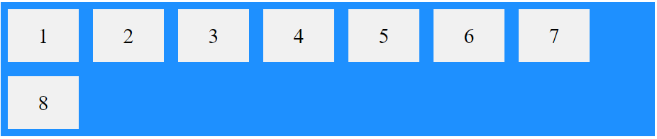
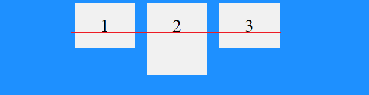
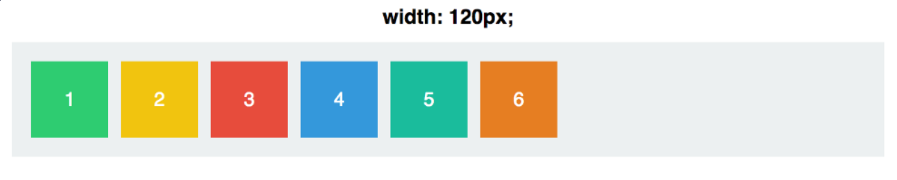
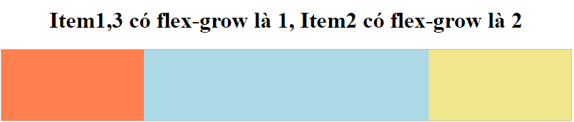

## 4. FLEXBOX

### 4.1 Thuộc tính Display: Flex

- Để sử dụng flex trong css thì chúng ta chỉ cần sử dụng thuộc tính `display: flex`.
  
  

### 4.2 Flex-direction

- Trong flexbox có 2 trục chính là x và y.
- Mặc định những `item` trog flexbox được sắp xếp theo trục x từ trái qua phải.
- Trong `flex-direction` có 4 giá trị là: `row, row-reverse, column, column-reverse`
- Với giá trị là `row` là giá trị mặc định.
  
- Với giá trị là `row-reverse` thì các element sẽ được sắp xếp từ phải sang trái.
  
- Với giá trị là `column` thì các element sẽ được sắp xếp từ trên xuống dưới.
  
- Với giá trị là `column-reverse` thì các element sẽ được sắp xếp từ dưới lên trên.
  

### 4.3 Flex-wrap

- Cho phép các `item` tự động xuống hàng hoặc vẫn luôn nằm trên cùng một hàng khi kích thước container thay đổi.
- Có 3 giá trị đó là `nowrap`(giá trị mặc định), `wrap và wrap-reverse`.

#### a. nowrap

- Khi resize trình duyệt thì các `item` sẽ co lại chứ không có rớt xuống.
  
  

#### b. wrap

- Khi resize trình duyệt thì các `item` sẽ nhảy xuống khi thay đổi kích thước `container`.
  
  

#### c. wrap-reverse

- Tương tự `wrap` nhưng thay vì rớt xuống thì nó rớt lên.
  
  

### 4.4 flex-flow

- Đây là thuộc tính viết tắt của `flex-direction` và `flex-wrap`.

```css
flex-flow: row wrap;
```

\



### 4.5 Justify-content

- Thuộc tính này cho phép các bạn căn chỉnh các `element` theo chiều ngang hoặc chiều dọc tùy thuộc vào thuộc tính `flex-direction`.

- Trong justify-content có 5 giá trị đó là:`flex-start, flex-end, center, space-between, space-evenly và space-around`.
- Flex-start
  
- Flex-end
  
- center
  
- space-between
  
- space-evenly
  
- space-around

  

### 4.6 Align-items

- Ngược lại với thuộc tính `justify-content` thì mặc định `align-items` canh các phần tử theo chiều dọc thay vì chiều ngang như justify-content.

- Tuy nhiên nếu đổi flex-direction sang column thì align-items sẽ canh theo chiều ngang.
- `align-items: center`

  

- `align-items: baseline`

  

- `align-items: stretch`

  

### 4.7 Align-self

- Thuộc tính này tương tự với thuộc tính align-items, nhưng khác ở chỗ là áp dụng riêng lẻ cho các phần tử mà bạn muốn thay đổi giá trị của nó.

  

### 4.8 align content

- Dùng để căn chỉnh các dòng flex.
- `align-content:flex-end`
  
- `align-content:space-around`
  
- Nếu trong 1 hàng gồm 10 item thì `height` của tất cả `item` sẽ bằng với `height` lớn nhất trong 10 `item` đó.

### 4.9 Order

- Thuộc tính này cho phép đổi vị trí hiển thị của các `element`
- Giá trị mặc định là 0.

```html
<div class="flex-container">
  <div style="order: 3">1</div>
  <div style="order: 4">2</div>
  <div style="order: 2">3</div>
  <div style="order: 1">4</div>
</div>
```


### 4.10 Flex-basis

- Dùng để set `width` hoặc `height` của `element` dựa vào `flex-direction` là `row` hay `column`.
- Mặc định là `flex-direction: row` cho nên lúc này `flex-basis` sẽ tương ứng với thuộc tính `width` của `element`.
- khi `flex-direction: column` thì lúc này `flex-basis` sẽ là `height` của `element`.
- `flex-basis` sẽ đè lên thuộc tính `width` hoặc `height` của `element`.

```html
<div class="flex-container">
  <div>1</div>
  <div>2</div>
  <div style="flex-basis:200px">3</div>
  <div>4</div>
</div>
```


### 4.11 Flex-grow

- Thuộc tính này nó cho các `element` giãn theo `width` của `container`.
- Mặc định giá trị trong thuộc tính `flex-grow` là 0.






### 4.12 Flex-shrink

- Thuộc tính này nó cho các `element` co lại theo `width` của `container`.
- Mặc định giá trị trong thuộc tính `flex-shrink` là 1 nghĩa là cho phép `element` được co lại khi `width` của `container` giảm xuống.
- Nếu giá trị `flex-shrink: 0` thì khi co lại `element` sẽ không bị thay đổi `width`

### 4.13 Flex

- Thuộc tính này là viết tắt của `flex-grow`, `flex-shrink` và `flex-basis`.
- Cú pháp `flex: flex-grow flex-shrink flex-basis`.
