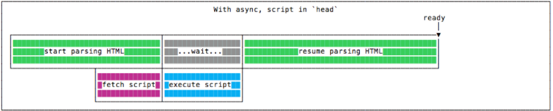
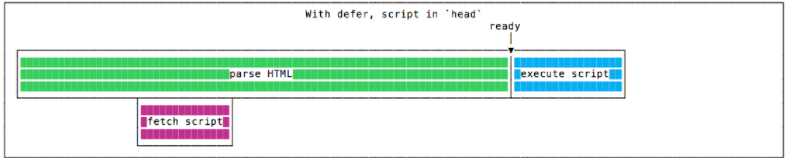
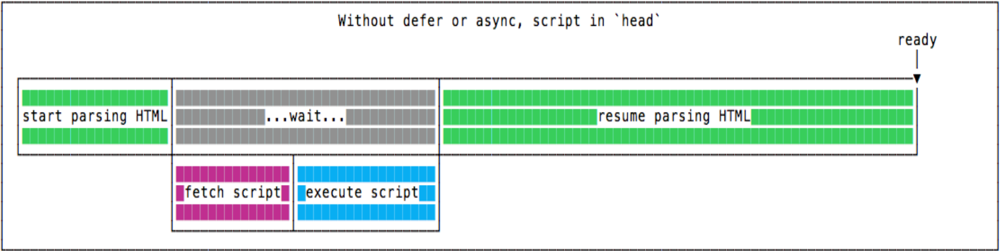
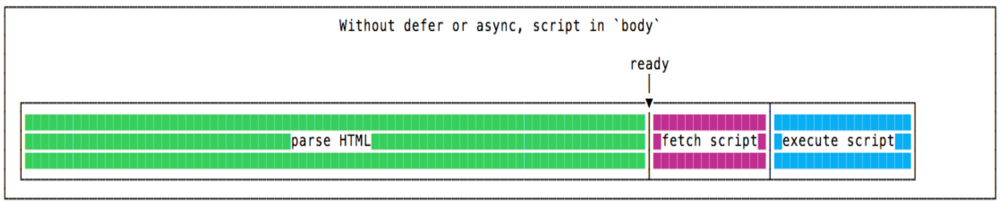

# HTML5

## Thẻ meta

- Thẻ `meta` dùng để cung cấp thông tin về trang web cho công cụ tìm kiếm.
- Thường được đặt ở phần đầu trong `<head>` của trang html để cung cấp thông tin về trang web cho công cụ tìm kiếm.
- Bao gồm: nhan đề, từ khóa chính, tóm tắt nội dung, ngôn ngữ chính được sử dụng...
- Những thẻ `meta` quan trọng:

  - Thẻ meta description: tóm tắt nội dung chính của trang

  ```html
  <meta name="description" content="Nội dung chính của trang" />
  ```

  - Thẻ meta viewport:
    - Để cần tối ưu website cho phù hợp với nhiều thiết bị thì bạn cần phải dùng đến thẻ này. Thẻ này sẽ hướng dẫn trình duyệt cách điều khiển kích thước cũng như tỉ lệ phóng to thu nhỏ.
    - Ý nghĩa:
      - width=devivce-width là để diều chỉnh cho khớp độ rộng màn hình với số pixel của thiết bị.
      - initial-scale=1 thiết lập tỉ lệ zoom ban đầu là 1:1 giữa pixel CSS và pixel của thiết bị.

  ```html
  <meta name="viewport" content="width=device-width, initial-scale=1.0" />
  ```

  - Thẻ meta content-type: Khai báo hệ thống ký tự mà trang web sử dụng, cho biết nội dung trang web dược mã hóa ký tự, để có thể hiển thị thông tin 1 cách tốt nhất.

  ```html
  <meta charset="UTF-8" />
  ```

- Thẻ meta open graph:

  - Là thẻ cung cấp thông tin của trang web.
  - Mục đích của thẻ OG là để xác định những thông tin chính của trang web và hiển thị thông tin đó khi có ai chia sẻ trang web lên mạng xã hội như FB, Zalo,...
  - Có 5 loại thẻ OG chính:

    - `title`: tiêu đề của trang web tương tự như thẻ `<title>`.

    ```html
    <meta property="og:title" content="The Rock" />
    ```

    - `url`: Hiển thị `url` của trang web (Dưới image ẩn trong image)

    ```html
    <meta property="og:url" content="http://google.com/" />
    ```

    - `image`: Thể hiện ảnh đại diện cho trang web.

    ```html
    <meta
      property="og:image"
      content="https://encrypted-tbn0.gstatic.com/images"
    />
    ```

    - `description`: Mô tả ngắn gọn về trang web

    ```html
    <meta property="og:desciption" content="Đây là ví dụ về description" />
    ```

    ` `lang`: Dùng để khai báo về ngôn ngữ mà trang web đang sử dụng, để công cụ tìm kiếm có định hướng tốt hơn cho người dùng.

    ```html
    <meta lang="en" />
    ```

    - `geo`: Dùng để khai báo vị trí địa lý cụ thể cho doanh nghiệp. Mục đích để công cụ tìm kiếm có định hướng tốt hơn với người nằm trong khu vực đang cung cấp.

    ```html
    <meta name="geo.region" content="HU" /> - Khu vực
    <meta name="geo.placename" content="Huế" /> - Tên địa điểm
    <meta name="geo.position" content="47.181759;19.506094" /> - Định vị
    <meta name="ICBM" content="47.181759, 19.506094" />
    ```

## Block element và Inline element

- Block element:

  - Bắt đầu trên một dòng mới.
  - Luôn chiếm toàn bộ chiều rộng có sẵn.
  - Có thể margin, padding tự do.
  - Một số thẻ block như: div, p, các thẻ heading, form, pre,...

  ```html
  <div>Hello World</div>
  ```

- Inline element

  - Không bắt đầu trên một dòng mới.
  - Chỉ chiếm nhiều chiều rộng khi cần thiết.
  - Một số thẻ inline như: a, b, br, span, label, input, img,...

  ```html
  <span>Hello World</span>
  ```

## Thẻ script

- Được sử dụng để viết code javascript trong file html.
- Các attribute của thẻ `script`:

  - `src`: truyền file javascript từ ngoài vào.
  - `type`: chỉ định loại
  - `async`: cho phép việc thực hiện (execute) các scripts bất đồng bộ.
    - Các file sẽ được tải xuống một cách bất đồng bộ và được thực thi sau khi nó vừa được tải xuống (cùng lúc).
    - 
  - `Defer`: cho phép việc thực hiện (execute) chỉ sau khi toàn bộ Document đã được Parse.

    - Các file sẽ được tải xuống một cách bất đồng bộ và được thực thi sau khi document được phân tích.
    - 

  - Nếu đặt thẻ `script` không chứa `async` và `defer` ở thẻ head thì sẽ diễn ra quá trình như sau: phân tích HTML -> Lấy mã `script` -> thực thi `script` (nếu gặp lỗi sẽ dừng lại) -> tiếp tục phân tích HTML -> hiển thị giao diện.
    
  - Nếu đặt thẻ `script` không chứa `async` và `defer` ở thẻ body thì sẽ diễn ra quá trình như sau: phân tích HTML -> hiển thị -> Lấy mã `script` -> thực thi `script`.
    

## Các thẻ có ý nghĩa trong HTML

### `<section>`

- Được sử dụng để tạo thành 1 khu vực bao gồm những nội dung giống nhau(có cùng chủ đề).

```html
<section>
  <h1>WWF</h1>
  <p>Quỹ Quốc Tế Bảo Vệ Thiên nhiên (WWF),được thành lập vào năm 1961.</p>
</section>
```

### `<article>`

- Dùng để xác định nội dung độc lập, riêng biệt với những phần còn lại của trang web

```html
<article>
  <h1>Google Chrome</h1>
  Google Chrome là trình duyệt miễn phí, mã nguồn mở, được phát triển bởi
  Google, phát hành vào năm 2008.
</article>
```

### `<header>`

- Dùng cho phần đầu trang hoặc phần đầu của một thẻ.
- Nên được dùng để bao ngoài nội dung giới thiệu trang.

```html
<article>
  <header>
    <p>Sứ mệnh của WWF:</p>
  </header>
  <p>
    Sứ mệnh của WWF là ngăn chặn sự xuống cấp môi trường tự nhiên của hành tinh
    chúng ta.
  </p>
</article>
```

### `<footer>`

- Dùng cho phần cuối trang hoặc phần cuối của một thẻ.

```html
<footer>
  <p>Tác giả: Nguyễn Văn A</p>
  <p>
    Thông tin liên hệ:
    <a href="mailto:someone@example.com"> someone@example.com</a>.
  </p>
</footer>
```

### `<nav>`

- Được gọi là thanh điều hướng, được dùng để chứa các liên kết điều hướng trong trang.

```html
<nav>
  <a href="/hoc-html/">Học HTML</a>
  <a href="/canvas-trong-html5/">Đồ họa HTML5</a>
</nav>
```

### `<aside>`

- Dùng để chứa những thông tin bên cạnh nội dung chính.

```html
<p>Google có trụ sở tại Thung lũng Silicon.</p>
<aside>
  <h4>Thung lũng Silicon</h4>
  <p>
    Thung lũng Silicon nằm ở phía Nam của vùng vịnh San Francisco tại phía Bắc
    California ở Mỹ.
  </p>
</aside>
```

### `<figure>` và `<figcaption>`

- `<figure>` xác định các nội dung liên quan mạch lạc với nhau, như hình ảnh, sơ đồ, code,...
- `<figcaption>` để chỉ 1 chú thích

```html
<figure>
  <figcaption>Hình minh họa</figcaption>
  <p></p>
  <figure></figure>
</figure>
```

### `<details>` và `<summary>`

- `<details>` Xác định thêm chi tiết hoặc điều khiển có thể được ẩn hoặc hiển thị theo yêu cầu.
- `<summary>` dùng làm tiêu đề cho `<details>`
- `<details>` có attribute là `open=open` (mặc định) nó sẽ hiển thị ra nội dung bên trong thẻ `<details>` thông qua thẻ `<summary>`

```html
<details>
<summary>HTML5<summary>
<p>Thẻ details.</p>
<p>Thẻ summary.</p>
</details>
```

### `<main>`

- Xác định phần thân của trang, nó thường được dùng để chứa các nội dung chính của trang web.

```html
<body>
  <header>HỌC</header>
  <main>
    <h1>Muc dich</h1>
    <p>Hoc tap de tiep thu kien thuc va chia se cho moi nguoi.</p>
  </main>
  <footer>Tác giả: google</footer>
</body>
```

## iframe

- Giúp nhúng HTML, hình ảnh, video, hay trang web khác vào website của mình.
- Các attribute của `<iframe>`:

  - `src`: là phần nội dung gốc từ server bên ngoài.
  - `Width` và `height`: là chiều rộng và chiều cao của `iframe`
  - `name`: dùng để đặt tên cho frame. Nó hay được dùng khi muốn hiển thị 1 liên kết nào đó trong 1 frame có thuộc tính name
  - `frameborder`: Tạo đường viền bao quanh frame. Thuộc tính này sẽ có 2 giá trị: 0 – ẩn đường viền, 1 – hiện đường viền, mặc định là 1.

```html
<a href="https://www.youtube.com/" target="framename_a">abc</a>
<iframe
  src="./form/parent1.html"
  width="680"
  height="480"
  allowfullscreen
></iframe>
```

## Form

### action

- Xác định hành động sẽ được thực hiện khi biểu mẫu được gửi.

```html
<form action="index.html"></form>
```

### target

- Chỉ định nơi hiển thị phản hồi nhận được sau khi gửi biểu mẫu.
- Các giá trị của target:

  - \_blank: Khi submit hay nhấn vào link nó sẽ chuyển link đó sang tab mới của trình duyệt.
  - \_top: Tương tự \_blank nhưng nó mở link ngay tab hiện tại.
  - \_self: Tương tự \_blank nhưng nó mở link ngay tab hiện tại ở khung chứa nó.
  - \_parent: Tương tự như \_self nhưng nó mở link ở phần cha chứa nó.
  - framename: Trang được liên kết sẽ mở ra trong khung được đặt tên.

```html
<form action="index.html" target="_blank"></form>
```

### method

- Chỉ định phương thức HTTP sẽ được sử dụng khi gửi dữ liệu biểu mẫu.
- các giá trị của method: get và post

  - get: các thông tin trong form sẽ mô tả bởi URL và nhìn vào thanh địa chỉ trình duyệt sẽ thấy thông tin. Nên những dữ liệu nhạy cảm sẽ không sử dụng nó, độ dài của URL bị giới hạn (2048 ký tự)
  - post: Sẽ không nhìn thấy dữ liệu biểu diễn qua URL như thế này mà dữ liệu sẽ được ẩn.

```html
<form action="index.html" method="get" target="_blank"></form>
```

### autocomplete

- Khi bật tính năng tự động hoàn thành, trình duyệt sẽ tự động hoàn thành các giá trị dựa trên các giá trị mà người dùng đã nhập trước đó.

- Có 2 giá trị là on và off

```html
<form action="index.html" method="get" autocomplete></form>
```

### novalidate

- Khi bật tính năng novalidate thì khi submit dữ liệu sẽ không được validate

```html
<form action="index.html" method="get" novalidate></form>
```

### name

```html
<form action="index.html" method="get" name="form1"></form>
```

- Chỉ định tên của một biểu mẫu.
- Sử dụng để tham chiếu các phần tử trong JavaScript hoặc để tham chiếu dữ liệu biểu mẫu sau khi biểu mẫu được gửi.

### enctype

- Chỉ dùng cho method post
- Chỉ định cách dữ liệu biểu mẫu được mã hóa khi gửi đến máy chủ.
- Có 3 giá trị:

  - text/plain: gửi dữ liệu nhưng không được mã hóa
  - multipart/form-data: giá trị này là cần thiết nếu tải tệp lên thông qua form
  - application/x-www-form-urlencoded: đây là giá trị mặc định, tất cả các ký tự đều được mã hóa (dấu space sẽ được mã hóa thành dấu +) và các ký tự đặc biệt được chuyển đổi thành giá trị ASCII HEX.

## Form elements

### input element

#### accept

- Thuộc tính `accept` chỉ có thể được sử dụng với `<input type = "file">`.
- Chỉ định những loại tệp mà người dùng có thể chọn từ hộp thoại nhập tệp.
- các value như: `audio/*` , `video/*` , `image/*`, `file_extension` (gif, .jpg, doc,...),

```html
<form action="#" id="form1">
  <input type="file" id="img" name="img" accept="image/*" />
</form>
```

#### autocomplete

- Tương tự như của form

```html
<form action="#" id="form1">
  <input type="text" autocomplete />
</form>
```

#### autofocus

- Chỉ định một element `<input>` sẽ tự động focus khi tải trang

```html
<form action="#" id="form1">
  <input type="text" autofocus />
</form>
```

#### checked

- Chỉ định rằng một element `<input>` nên được chọn trước khi tải trang
- Nó có thể được sử dụng với `<input type = "checkbox">` và `<input type = "radio">` .

```html
<form action="/action_page.php">
  <input type="checkbox" checked />
  <input type="submit" value="Submit" />
</form>
```

#### disabled

- Vô hiệu hóa thẻ `input` đó

```html
<form action="#" id="form1">
  <input type="text" disabled />
</form>
```

#### form

- Chỉ định `form` mà phần tử `<input>` thuộc về thông qua `id` của `form` đó.

```html
<form action="#" id="form1"><input type="text" " /></form>
<input type="text" form="form1" />
```

#### max - min

- Chỉ định giá trị lớn nhất và nhỏ nhất cho phần tử `<input>`
- Chỉ sử dụng với các type: number, range, date, datetime-local, month, time and week.

```html
<form action="/action_page.php">
  <label for="quantity">Quantity (between 1 and 5):</label>
  <input type="number" min="1" max="5" /><br />
  <input type="submit" />
</form>
```

#### maxlength - minlength

- chỉ định số ký tự tối đa và tối thiểu được phép trong phần tử `<input>`.

```html
<form action="/action_page.php">
  <label for="username">Username:</label>
  <input type="text" minlength="1" maxlength="10" /><br />
  <input type="submit" value="Submit" />
</form>
```

#### multiple

- Hoạt động với các loại đầu vào sau: email và tệp
- Chỉ định rằng người dùng được phép nhập nhiều hơn một giá trị vào phần tử `<input>`.

```html
<form action="/action_page.php">
  <label for="files">Select files:</label>
  <input type="file" id="files" name="files" multiple />
  <input type="submit" />
</form>
```

#### pattern

- Chỉ định một biểu thức chính quy mà giá trị của phần tử `<input>` được kiểm tra khi gửi biểu mẫu.
- Chỉ hoạt động với: văn bản, ngày tháng, tìm kiếm, url, số điện thoại, email và mật khẩu.

```html
<form action="/action_page.php">
  <label for="country_code">Country code:</label>
  <input type="text" pattern="[A-Za-z]{3}" />
  <input type="submit" />
</form>
```

#### readonly

- Chỉ để đọc không thể sửa đổi trường đầu vào chỉ đọc (tuy nhiên, người dùng có thể gắn thẻ, đánh dấu và sao chép văn bản từ trường đó)

```html
<form action="/action_page.php">
  <input type="text" value="abc" readonly />
  <input type="submit" />
</form>
```

#### type

- Dùng để chỉ định loại phần tử `<input>` để hiển thị
- Các giá trị của type
  - button
  - checkbox
  - color
  - date
  - datetime-local
  - email
  - file
  - hidden
  - image
  - month
  - number
  - password
  - radio
  - range
  - reset
  - search
  - submit
  - tel
  - text
  - time
  - url
  - week

```html
<input type="url" />
```

#### value

- Chỉ định giá trị của phần tử `<input>`

```html
<form action="/action_page.php">
  <input type="text" value="country" />
</form>
```

### lable element

- Dùng làm nhãn cho các element của form
- Attribute `for`: phải bằng thuộc tính id của element `<input>` để liên kết chúng với nhau

```html
<form action="/action_page.php">
  <label for="country_code">Country code:</label>
  <input type="text" id="country_code" />
  <input type="submit" />
</form>
```

### select element

- Danh sách thả xuống
- Chứa các `<option>` element
- Attribute `size` chỉ định số lượng giá trị hiển thị

- Attribute `multiple` cho phép chọn nhiều `option`

```html
<label for="cars">Choose a car:</label>
<select id="cars" name="cars" size="3" multiple>
  <option value="volvo">Volvo</option>
  <option value="saab">Saab</option>
  <option value="fiat">Fiat</option>
  <option value="audi">Audi</option>
</select>
```

### option element

- Xác định một tùy chọn có thể được chọn
- Mặc định, mục đầu tiên trong danh sách thả xuống được chọn.
- Để xác định một tùy chọn đã chọn trước, thêm attribure `selected` vào `<option>`
- attribute `value` nội dung của `value` sẽ được gửi khi submit `form`, nếu `value` trống thì nội dung của `<option>nội dung</option>` sẽ thay thế

### textarea element

- Xác định trường nhập nhiều dòng
- có 2 attribute là `rows` và `cols` để xác định chiều ngang chiều dọc
- có thể sử dụng css `width` và `height` để xác định chiều ngang chiều dọc

```html
<form action="#" multiple>
  <textarea cols="30" rows="10"></textarea>
</form>
```

### fieldset element

- Được sử dụng để nhóm các element trong một `form`.
- Thẻ `legend` dùng làm caption của fieldset
- Attribute `form` dùng để xác định `form` của các field trong `fieldset` thuộc về
- Attribute `disabled` dùng để vô hiệu hóa các element trong fieldset

```html
<fieldset>
  <legend>Personalia:</legend>
  <label for="fname">First name:</label>
  <input type="text" id="fname" name="fname" />
</fieldset>
```

## video

1. Attribute `control` thuộc tính điều khiển thêm các điều khiển video, như phát, tạm dừng và âm lượng.
2. width - height để thiết lập chiều ngang chiều dọc
3. `source` trong video

- attribute `src` đường dẫn đến video
- attribute `type` loại file của video

4. `muted` dùng để tắt âm thanh khi video hiện ra

```html
<video width="320" height="240" autoplay muted>
  <source src="movie.mp4" type="video/mp4" />
  <source src="movie.ogg" type="video/ogg" />
</video>
```

## audio

1. Attribute `control` thuộc tính điều khiển thêm các điều khiển audio, như phát, tạm dừng và âm lượng.
2. width - height để thiết lập chiều ngang chiều dọc
3. `source` trong audio

- attribute `src` đường dẫn đến audio
- attribute `type` loại file của audio

4. `muted` dùng để tắt âm thanh khi audio hiện ra

```html
<audio width="320" height="240" autoplay muted>
  <source src="horse.ogv" type="audio/ogg" />
  <source src="horse.mp3" type="audio/mpeg" />
</audio>
```

## canvas

- Dùng để vẽ đồ họa một cách nhanh chóng, thông qua JavaScript.
- Dùng width, height để set chiều rồng và dài của thẻ

### Một số hàm vẽ canvas

- Xác định chiều vẽ `getContext('2d')`
- Bắt đầu vẽ `beginPath()`
- Màu chữ `fillStyle`
- Điểm bắt đầu vẽ `moveTo(a,b)`
- Điểm kết thúc vẽ `lineTo(a, b)`
- Độ dày đường vẽ `lineWidth`
- Màu đường vẽ `strokeStyle`
- Vẽ đường tròn `arc`
- Vẽ `stroke()`

```html
<canvas id="myCanvas" width="578" height="250"></canvas>
<script>
  var canvas = document.getElementById("myCanvas");
  context = getContext("2d");
  context.beginPath();
  context.font = "40pt Calibri";
  context.fillStyle = "blue";
  context.moveTo(10, 10);
  context.lineTo(400, 10);
  context.lineWidth = 10;
  context.strokeStyle = "blue";
  context.arc(x, y, radius, startAngle, endAngle, counterClockwise);

  //butt, square stroke();
</script>
```

## SVG

- Là một dạng hình ảnh sử dụng cấu trúc XML để hiển thị ảnh ở dạng vector
- Ảnh SVG linh hoạt hơn nhiều so với ảnh JPG hoặc PNG và có thể sử dụng CSS và JavaScript để tương tác với chúng.
- Khi phóng to thu nhỏ ảnh sẽ không bị giảm chất lượng
- Các attribute của svg
  - width, height
  - viewbox với giá trị x y width heigh phần muốn hiển thị

```html
<svg
  width="200"
  height="200"
  viewBox="0 0 150 150"
  style="border: 1px solid black"
>
  <circle cx="100" cy="100" r="100" fill="#529fca" />
</svg>
```

- Các thẻ thường dùng trong svg
- `<text>` với x y là vị trí vẽ đi kèm với thẻ `<tspan>` dùng để định dạng thêm chữ trong `<text>`

```html
<svg>
  <text x="0" y="120">
    <tspan font-weight="bold" fill="red">A nice rectangle</tspan>
  </text>
</svg>
```

- circle(hình tròn) với cx cy là tọa độ tâm, r là bán kính, fill là màu nền, storke là màu đường vẽ, stroke-width là độ rộng đường vẽ

```html
<svg>
  <circle
    cx="50"
    cy="50"
    r="50"
    stroke="green"
    stroke-width="4"
    fill="#529fca"
  />
</svg>
```

- rect(hình chữ nhật) với x y là tọa độ bắt đầu, width và heigh là chiều dài và chiều rộng hình chủ nhật, fill là màu nèn

```html
<svg>
  <rect x="0" y="0" width="100" height="100" fill="#529fca" />
</svg>
```

- line (đường thẳng) với x1 y1 là tọa độ điểm bắt đầu, x2 y2 là tọa độ điểm kết thúc, stroke là màu đường vẽ

```html
<svg>
  <line x1="0" y1="0" x2="100" y2="100" stroke="#529fca" />
</svg>
```

- path là một chuỗi các đường thẳng và đường cong. Là công cụ mạnh nhất để vẽ bằng cách sử dụng svg, và nó rất phức tạp. Dùng attribute d chứa các lệnh điều hướng như:
  - M(Move): x y tọa độ điểm bắt đầu
  - L(Line): x y tọa độ điểm để vẽ đường
  - H(Horizontal Line): là 1 đường thẳng nằm ngang chỉ nhận x
  - V (Vertical Line) là một đường thẳng đứng chỉ nhận toạ độ y
  - Z (Close Path), tạo một đường quay trở lại điểm ban đầu
  - Q : Đường cong với x1 y1 x2 y2

```html
<svg height="300" width="300">
  <path
    d="M 100 100 L 200 200 H 10 V 40 H 70 Z"
    fill="#59fa81"
    stroke="#d85b49"
    stroke-width="3"
  />
</svg>
```

- `<defs>` Dùng để định nghĩa phần tử khai báo 1 lần và tái sử dụng được nhiều lần. Tất cả những gì bên trong sẽ không được hiển thị lên màng hình trừ khi ta gọi nó ra
- `<use>` Giúp ta sử dụng các phần tử được định nghĩa ở các vị trí mình cần
- `<text>` chứa `<textPath>` để sử dụng các phần tử được định nghĩa ở các vị trí mình cần

```html
<svg height="500" width="500" style="border: 1px solid black">
  <defs>
    <path id="MyPath" d="M 20 20 Q 200 300 500 500" />
  </defs>
  <use x="100" y="100" xlink:href="#MyPath" fill="none" stroke="red" />
  <use xlink:href="#MyPath" fill="none" stroke="#59fa81" />
  <text font-family="Courier New" font-size="42.5">
    <textPath xlink:href="#MyPath">Wow such a nice SVG tut</textPath>
  </text>
</svg>
```

- polyline: Dùng <polyline> để vẽ đường gấp khúc
- polygon: bao gồm những đoạn thẳng. Điểm cuối sẽ kết nối với điểm đầu. Với attribute `points` để xác định các tọa độ điểm vẽ bao gồm các cặp x y để vẽ các đa giác.

```html
<svg width="130" height="160">
  <polygon
    points="50,50 100,100 50,100"
    stroke-width="5"
    fill="black"
    stroke="blue"
  />
  <polyline
    points="0,40 40,40 40,80 80,80 80,120 120,120 120,160"
    fill="#F9F38C"
    stroke="green"
    stroke-width="6"
  />
</svg>
```

- `<animate>`: Dùng để tạo ảnh động. Các attribute:

  - attributeName: thuộc tính sẽ bị tác động để tạo ảnh động.
  - from: giá trị thuộc tính nhận được ban đầu
  - to: giá trị thuộc tính nhận được ở điểm cuối của hoạt động.
  - dur: thời gian ảnh động diễn ra.
  - repeatCount : chỉ ra số lần lặp lại.

  ```html
  <svg width="500" height="300">
    <rect x="50" y="50" width="20" height="20" fill="orange">
      <animate
        attributeName="x"
        from="0"
        to="300"
        dur="1s"
        repeatCount="indefinite"
      />
    </rect>
  </svg>
  ```
