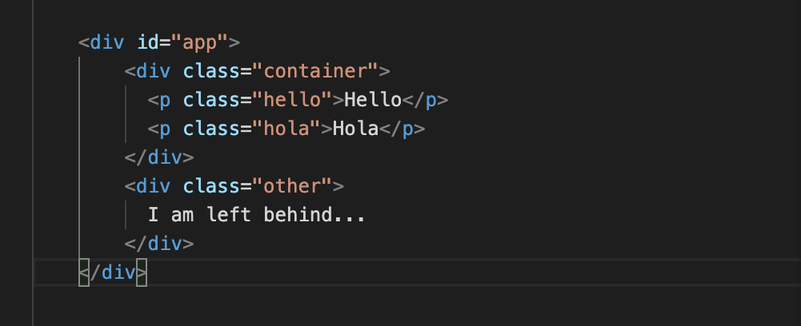
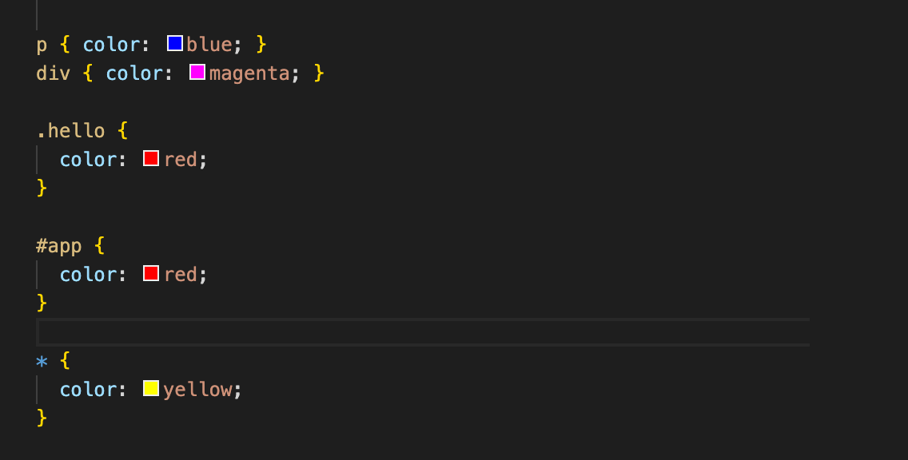

## `CSS`

- CSS là chữ viết tắt của Cascading Style Sheets, nó là một ngôn ngữ được sử dụng để tìm và định dạng lại các phần tử được tạo ra bởi các ngôn ngữ đánh dấu (HTML).
- CSS sẽ giúp chúng ta có thể thêm style vào các phần tử HTML như đổi bố cục, màu sắc trang, đổi màu chữ, font chữ, thay đổi cấu trúc.

### `Selector`

- Về cú pháp: 
    - CSS được viết với quy tắc về style nhằm giúp cho trình duyệt tương tác được và áp kiểu thích hợp cho các phần tử trong HTML

    - Quy tắc về style có ba thành phần: selector, property, value

  (phần tử chọn, thuộc tính, giá trị thuộc tính)

  ```css
  selector {property: value}
  ```
    - Ví dụ CSS sau:
    ```css
      h1 { color: orange; }
    ```
    - `h1` là selector - phần tử chọn để thiết lập các thuộc tính CSS cho nó
    - `color` là thuộc tính (property)
    - `orange` là giá trị (value) được thiết lập cho thuộc tính
- `Basic CSS Selector`
    - Bộ chọn CSS cơ bản (Basic CSS Selector) sử dụng chọn element / class / id.
    - `Element Selector`: Element Nó chọn bất kỳ phần tử nào đó.
    - `Class Selector`: class Nó chọn tất cả các phần tử có class đã cho.
    - `ID Selector`: #id Nó chọn tất cả các phần tử có id đã cho.
    - `Universal selector`: * Nó chọn tất cả các phần tử.
     
- `Descendant CSS Selector`
    - Đây là các CSS Selector để chọn hậu duệ của bất kỳ phần tử nào.
    
    - `Any descendant selector`: `A` `B`. Chọn bất kỳ phần tử `B` nào là hậu duệ của `A`. Hậu duệ có thể được lồng rất sâu.
    ```css
    .container .hello-class {
    color: red; }
    ```
    - Chúng ta có thể kết hợp với `*` để chọn tất cả các phần tử hậu duệ.
    - `Child Selector`: `A` > `B`. Không giống như Any Descendant CSS Selector, CSS Selector này chỉ chọn hậu duệ trực tiếp.
- `Multiple CSS Selector`
    - Cho phép chúng ta chọn nhiều phần tử không liên quan với nhau. (A, B, C, D ... . Để chọn nhiều phần tử / class / id).
    ```css
    .a .b .c {color:pink;}
    ```
-  `Combination CSS Selector`
    - Conbination CSS Selector cho phép chọn thành phần rất cụ thể bằng nhiều tham chiếu.
    - Combination CSS Selector: `AB` Cho phép chọn phần tử chứa cả `A` và `B` Cú pháp trông giống như Descendant CSS Selector, ngoại trừ phần này không có khoảng trắng.
    ```css
    p.active {
    color: yellow;
    }
    .hello-class.active {
    color: red;}
    ```
    - Ngoài ra không chỉ có class mà có thể là id hoặc có thể kết hợp nhiều thứ khác...
- `Sibling CSS Selector`
    - Sibling CSS Selector nhắm chọn các phần tử anh chị em.
    ```html
    <div class="container">
      <div class="paragraph-container">
        <p id="hola-id" class="hola-class">Hola world</p>
        <p class="hello-class">Hello world</p>
        <p class="hello-class again-class">Hello again world</p>
      </div>
      <p class="outside-class">I'm outside</p>
    </div>
    ```
    - Bộ chọn Anh / Chị / Em liền kề (Nghiêm ngặt): A + B. Nhắm mục tiêu một phần tử anh chị em được đặt ngay sau phần tử đó.
    ```css
    #hola-id + .hello-class {
    color: blue;
    }
    ```
    - Bộ chọn Anh / Chị / Em liền kề (Không nghiêm ngặt): A ~ B. Giống như bộ chọn bên trên nhưng không giới hạn 1 phần tử đầu tiên.
    ```css
    #hola-id ~ .hello-class {
    color: purple;
    }
    ```
  - `Pesudo CSS Selector`
    - 
    


- Phần tử Css :
  - Thành phần `selector` chỉ ra phần tử HTML mà ta muốn định nghĩa kiểu, chọn phần tử có thể là một phần tử hoặc nhiều phần tử cách nhau bằng dấu `,`
  - Thiết lập nội dung style bằng cặp thuộc tính:giá trị (cách nhau bởi dấu :), mỗi cặp này kết thúc bởi ;
  ```css
  h1,h2 {
    color: orange;
    font-size: 25px;
  }
  ```
   `ID & selector`
    - Chọn phần tử bằng id của phần tử, cách này áp dụng nếu phần tử HTML có thiết lập thuộc tính id
    - Ví dụ HTML sau có phần tử div với id là intro
  ```html
  <div id="intro">
    <p>Văn bản trong intro.</p>
  </div>
  <p>Đoạn văn ngoài intro.</p>
  ```
  - Để chọn phần tử có id, sử dụng ký hiệu hash # tiếp theo là tên id : #tên-id
  - Lúc đó CSS chọn đến phần tử có id là intro sẽ như sau:
  ```css
  #intro {
   color: white;
   background-color: green;
    }
    ```
    
  `Class & Selector`
    - Trong phần tử HTML khi thiết lập `id` thì id đó là duy nhất cho phần tử (1 phần tử), còn thuộc tính `class` thì được phép lặp lại cho nhiều phần tử.
    - Tương tự như `id` thay` #` bằng dấu `.`
    ```html
    <div>
        <p class="first">Đây là một đoạn văn</p>
        <p> Đoạn văn thứ 2. </p>
    </div>
    <p class="first"> Đây là đoạn văn ABC</p>
    <p> Đoạn văn thứ XYZ. </p>
    ```
    - Dùng CSS chọn phần tử p có class là first và thay đổi cỡ chữ lên 200% :
    ```css
    .first {font-size: 200%;}
    ```
    
- Phần tử con Css
    - Selector trong CSS cũng cho phép chọn ra cụ thể một phần tử nằm trong một phần tử khác. Chọn kiểu này bằng cách chỉ ra các phần tử cha theo cấp, dần dẫn đến phần tử chọn bên trong.
    - Ví dụ chọn phần tử `<em>` trong đoạn văn `p` đầu tiên của khối `intro`
    ```html
    <div id="intro">
        <p class="first">Đây là một <em> đoạn văn.</em></p>
        <p> Đây là đoạn thứ hai. </p>
    </div>
    ```
    - Code css sẽ là:
    ```css
    #intro .first em {
    color: pink; 
    background-color:green;}
    ```
    
- Ngoài ra còn có chú thích dưới dạng CSS là (`/* Chú thích được viết trong này */`)
### `Display`
  - `Display block`
    - Thuộc tính `display:block` có tác dụng xác định thành phần hiển thị theo các hàng độc lập.
    ```css
    span{
    display: block;
    }
    ```
    - Khi sử dụng thẻ `block` thì `<span>` sẽ xuống dòng thì vì nằm trên 1 dòng.
  - `Display inline`
    - Thuộc tính `display: inline` có tác dụng xác định thành phần được hiển thị theo chiều ngang (không ngắt dòng khi chiều rộng vẫn nhỏ hơn chiều rộng của màn hình). Đây là dạng mặc định của các thẻ a,span,...
    ```css
    p{
    display: inline;
    }
    ```
    - Khi sử dụng thẻ `inline` thì `<p>` sẽ không xuống dòng ngược lại với mặc định của nó.
  - `Display inline-block`
    - Thuộc tính display: inline-block có tác dụng xác định các thành phần sẽ được hiển thị theo khối nhưng là các khối inline.
    ```css
    p{
    display: inline-block;
    background: orange;
    }   
    ```
    - Có thể dùng width or height chỉnh cho khối đó.
  - `Display none`
    - Thuộc tính display: none có tác dụng ẩn thành phần được chọn.
    ```css
    p{
    display: none;
    }
    ```
  - `Display inline-table`
    - Thuộc tính display: inline-table các tác dụng xác định thành phần được hiển thị theo dạng khối nột tuyến. Không xuống dòng trước và sau các thành phần cạnh nó.
    ```css
    p{
    display: inline-table;
    background: orange;
     }
    ```
  - `Display list-item`
    - Thuộc tính display: list-item có tác dụng xác định thành phần sẽ được hiển thị như một thẻ `li`.
  - `Display table`
    - Thuộc tính display: table có tác dụng xác định thành phần được chọn như một thẻ `<table>`.
  - `Display inherit`
    - Thuộc tính này có tác dụng xác định thành phần được chọn kế thừa từ thuộc tính của thành phần cha.
  - Một số giá trị khác của display
    - Ngoài những thuộc tính ở trên thì display còn hỗ trợ một số các giá trị như sau:
    


