## `CSS`

- CSS là chữ viết tắt của Cascading Style Sheets, nó là một ngôn ngữ được sử dụng để tìm và định dạng lại các phần tử được tạo ra bởi các ngôn ngữ đánh dấu (HTML).
- CSS sẽ giúp chúng ta có thể thêm style vào các phần tử HTML như đổi bố cục, màu sắc trang, đổi màu chữ, font chữ, thay đổi cấu trúc.

### `Selector`

- Về cú pháp: 
    - CSS được viết với quy tắc về style nhằm giúp cho trình duyệt tương tác được và áp kiểu thích hợp cho các phần tử trong HTML

    - Quy tắc về style có ba thành phần: selector, property, value

  (phần tử chọn, thuộc tính, giá trị thuộc tính)

  ```css
  selector {property: value}
  ```
    - Ví dụ CSS sau:
    ```css
      h1 { color: orange; }
    ```
    - `h1` là selector - phần tử chọn để thiết lập các thuộc tính CSS cho nó
    - `color` là thuộc tính (property)
    - `orange` là giá trị (value) được thiết lập cho thuộc tính
- `Basic CSS Selector`
    - Bộ chọn CSS cơ bản (Basic CSS Selector) sử dụng chọn element / class / id.
    - `Element Selector`: Element Nó chọn bất kỳ phần tử nào đó.
    - `Class Selector`: class Nó chọn tất cả các phần tử có class đã cho.
    - `ID Selector`: #id Nó chọn tất cả các phần tử có id đã cho.
    - `Universal selector`: * Nó chọn tất cả các phần tử.
      ```html
      <div id="app">
        <div class="container">
          <p class="hello">Hello</p>
          <p class="hola">Hola</p>
        </div>
        <div class="other">
             I am left behind...
        </div>
      </div>
      ```
      ```css
      p { color: blue; }
      div { color: magenta; }

      .hello {
        color: red;
      }

      #app {
        color: red;
      }

      * {
        color: yellow;
      }
      ```

- `Descendant CSS Selector`
    - Đây là các CSS Selector để chọn hậu duệ của bất kỳ phần tử nào.
    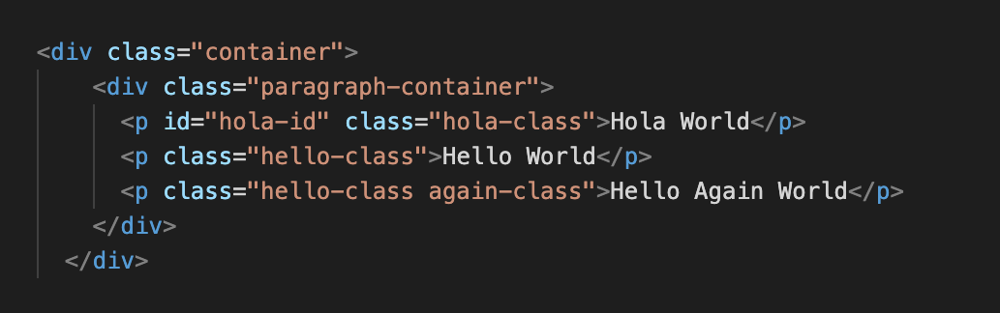
    - `Any descendant selector`: `A` `B`. Chọn bất kỳ phần tử `B` nào là hậu duệ của `A`. Hậu duệ có thể được lồng rất sâu.
    ```css
    .container .hello-class {
    color: red; }
    ```
    - Chúng ta có thể kết hợp với `*` để chọn tất cả các phần tử hậu duệ.
    - `Child Selector`: `A` > `B`. Không giống như Any Descendant CSS Selector, CSS Selector này chỉ chọn hậu duệ trực tiếp.
- `Multiple CSS Selector`
    - Cho phép chúng ta chọn nhiều phần tử không liên quan với nhau. (A, B, C, D ... . Để chọn nhiều phần tử / class / id).
    ```css
    .a .b .c {color:pink;}
    ```
-  `Combination CSS Selector`
    - Conbination CSS Selector cho phép chọn thành phần rất cụ thể bằng nhiều tham chiếu.
    - Combination CSS Selector: `AB` Cho phép chọn phần tử chứa cả `A` và `B` Cú pháp trông giống như Descendant CSS Selector, ngoại trừ phần này không có khoảng trắng.
    ```css
    p.active {
    color: yellow;
    }
    .hello-class.active {
    color: red;}
    ```
    - Ngoài ra không chỉ có class mà có thể là id hoặc có thể kết hợp nhiều thứ khác...
- `Sibling CSS Selector`
    - Sibling CSS Selector nhắm chọn các phần tử anh chị em.
    ```html
    <div class="container">
      <div class="paragraph-container">
        <p id="hola-id" class="hola-class">Hola world</p>
        <p class="hello-class">Hello world</p>
        <p class="hello-class again-class">Hello again world</p>
      </div>
      <p class="outside-class">I'm outside</p>
    </div>
    ```
    - Bộ chọn Anh / Chị / Em liền kề (Nghiêm ngặt): A + B. Nhắm mục tiêu một phần tử anh chị em được đặt ngay sau phần tử đó.
    ```css
    #hola-id + .hello-class {
    color: blue;
    }
    ```
    - Bộ chọn Anh / Chị / Em liền kề (Không nghiêm ngặt): A ~ B. Giống như bộ chọn bên trên nhưng không giới hạn 1 phần tử đầu tiên.
    ```css
    #hola-id ~ .hello-class {
    color: purple;
    }
    ```
- `Pseudo-class`
    - Một lớp giả được sử dụng để xác định trạng thái đặc biệt của một phần tử.
    - Ví dụ, nó có thể được sử dụng để:
        - Tạo kiểu cho một phần tử khi người dùng di chuột qua nó
        - Phong cách các liên kết được truy cập và không được truy cập khác nhau
        - Tạo kiểu cho một phần tử khi nó được lấy nét


  ```html
  <div class="container">
    <div class="paragraph-container">
      <p id="hola-id" class="hola-class">Hola world</p>
      <p class="hello-class">Hello world</p>
      <p class="hello-class again-class">Hello again world</p>
    </div>

    <p class="outside-class">I'm outside</p>

    <ul id="list-id" class="list-class">
      <li class="list-item-class">First</li>
      <li class="list-item-class">Second</li>
      <li class="list-item-class">Third</li>
      <li class="list-item-class">Fourth</li>
      <li class="list-item-class">Fifth</li>
    </ul>

    <div class="single-paragraph-container">
      <p>I'm the only child of this span</p>
    </div>
  </div>
  ```
  - Chọn phần tử đầu tiên: A:first-child. Nó chọn đến phần tử con đầu tiên. (A phải có cha mẹ).
  ```css
      li:first-child {
      color: blue;
    }
  ```
  - `Anchor Pseudo-class`: các liên kết có thể được hiển thị theo nhiều cách khác nhau.

    - `:link`: Trạng thái hiện tại của thẻ (chỉ dùng cho thẻ `a`).
    - `:visited`: Trạng thái khi đã click vào thẻ (chỉ dùng cho thẻ `a`).
    - `:hover`: Trạng thái khi di chuyển chuột vào thẻ (dùng cho nhiều thẻ).
    - `:active`: Trạng thái khi click chuột vào thẻ (dùng cho nhiều thẻ).

  - Các `Pseudo-class` khác:

    - `:First-child `: element được chỉ định là element con đầu tiên của element khác.
    - `:Last-child `: Tương tự first-child nhưng là element con cuối cùng
    - `:first-of-type` Với mọi element là element con đầu tiên, của một kiểu cụ thể, của element cha của nó.
    - `:last-of-type` Với mọi element là element con cuối cùng, của một kiểu cụ thể, của element cha của nó.
    - `:nth-child(n)`: Với mọi element là element con thứ n , bất kể kiểu, của element cha của nó. (n có thể là một số, một từ khóa hoặc một công thức.).
    - `:nth-last-child(n)`: Tương tự như child nhưng tính từ element cuối cùng lên.
    - `:nth-last-of-type(n)`:Với mọi element là element con thứ n , của một kiểu cụ thể, của cha mẹ của nó, tính từ element cuối cùng.
    - `:nth-of-type(n)`:Với mọi element là element con thứ n , của một kiểu cụ thể, của element cha của nó.
    - `:only-of-type`: chọn element là con duy nhất của loại nó là con của element cha.
    - `only-child`: trong element cha chỉ có duy nhất 1 element nếu có > 1 thì không được chọn.
    - `:checked `: Với mọi element `<input>` đã chọn (chỉ dành cho các type radio và checkbox) và element `<option>`.
    - `:disabled`: Với mọi element bị disable (chủ yếu được sử dụng trên các element biểu mẫu).
    - `:enabled`: Với mọi element enable (chủ yếu được sử dụng trên các element biểu mẫu).
    - `:empty `: Với mọi element không có element con (bao gồm cả các nút văn bản).
    - `:focus`: dùng để chọn element được focus vào.
    - `:in-range`: chọn tất cả các element có giá trị nằm trong một phạm vi xác định.(trong vùng min - max).
    - `:out-of-range`: chọn tất cả các element có giá trị nằm trong một phạm vi xác định.(ngoài vùng min - max).
    - `:invalid`: chọn các form elements có giá trị không xác thực theo cài đặt của element. (chỉ hoạt động cho các form elements có giới hạn, chẳng hạn như element đầu vào có thuộc tính tối thiểu và tối đa, trường email không có email hợp pháp hoặc trường số không có giá trị số, v.v.).
    - `:valid`: chọn các form elements có giá trị xác thực theo cài đặt của element. (chỉ hoạt động cho các form elements có giới hạn, chẳng hạn như element đầu vào có thuộc tính tối thiểu và tối đa, trường email không có email hợp pháp hoặc trường số không có giá trị số, v.v.).
    - `:lang()`: chọn được sử dụng để chọn các element có attribute lang với giá trị được chỉ định. Giá trị của `lang="value"` thường là mã ngôn ngữ gồm 2 chữ cái.
    - `:not(selector)`: Mọi element KHÔNG phải là element / bộ chọn được chỉ định.
    - :`optional`: Những input không có attribute `required` thì sẽ được chọn (chỉ dùng cho thẻ `input`, `select`, `textarea`)
    - `:read-only`: Những form elements có attribute `readonly` sẽ được chọn
    - `:read-write`: Những form elements `có thể đọc` và `có thể ghi` sẽ được chọn (những element có attribute `readonly` và `disable` sẽ không được chọn).
    - `:required`: Những form elements có attribute `required` sẽ được chọn (chỉ áp dụng cho các thẻ `input`, và `textarea`.)
    - `:root`: Chọn phần tử `root`.
    - `:target`: chọn những element có `id` trùng với `href` trong thẻ `a`
- `Pseudo-Elements`
  - Phần tử giả CSS được sử dụng để tạo kiểu cho các phần cụ thể của phần tử.
  - Ví dụ, nó có thể được sử dụng để:
      - Định kiểu chữ cái đầu tiên hoặc dòng, của một phần tử
      - Chèn nội dung trước hoặc sau nội dung của một phần t
```css
p.intro::first-letter {
  color: #ff0000;
  font-size: 200%;
}
```
   - Thẻ `<p>` sẽ được thay đổi màu và cỡ chữ.
  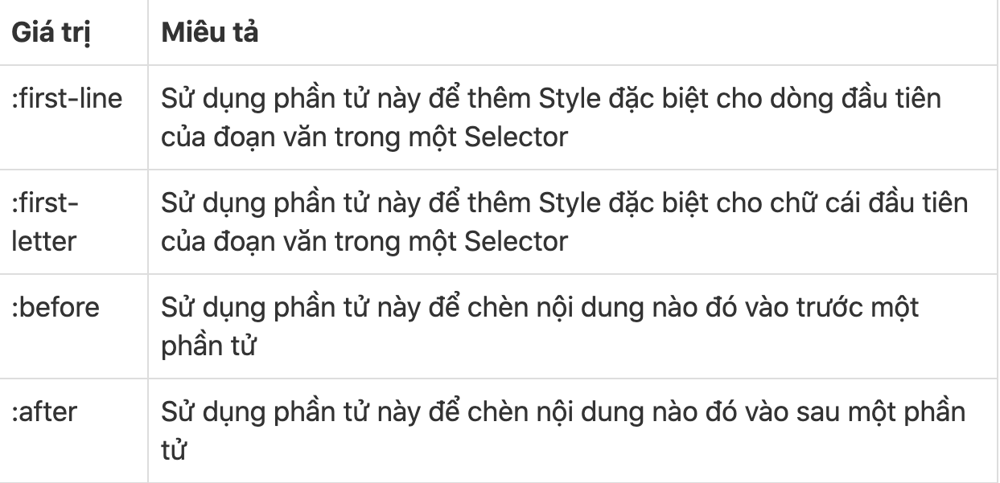
- `Attribute CSS Selector`
```html
  <div for="chocolate">Chocolate</div>
  <div for="peanut">Peanut</div>
  <div for="butter">Butter</div>
  <div>Jelly</div>
```
  - Bộ chọn thuộc tính cơ bản: `A[B]` Chọn tất cả các phần tử `A` có thuộc tính `B`.
    ```css
    div[for] {
      color: red;
    }
    ```
  - Bộ chọn thuộc tính cụ thể: `A[B="C"]`. Chọn các phần tử A có thuộc tính `B` với giá trị là `C`.
    ```css
    div[for="chocolate"]{
      color: blue;
    }
    ```
- `Attribute CSS Selector`
  - Bộ chọn thuộc tính CSS (Attribute CSS Selector) sử dụng để chọn thuộc tính HTML
    ```html
    <div for="chocolate">Chocolate</div>
    <div for="peanut">Peanut</div>
    <div for="butter">Butter</div>
    <div>Jelly</div>
    ```
  - Bộ chọn thuộc tính cơ bản: `A[B]`. Chọn tất cả các phần tử `A` có thuộc tính `B`.
    ```css
    div[for] {
      color: red;
    }
    ```
  - Bộ chọn thuộc tính cụ thể: `A[B="C"]`. Chọn các phần tử A có thuộc tính `B` với giá trị là `C`.
    ```css
    div[for="chocolate"]{
      color: blue;
    }
    ```
  - Bộ chọn thuộc tính cụ thể (Bắt đầu với ...): `A[B^="C"]`. Chọn tất cả các phần tử A có thuộc tính B với giá trị bắt đầu là `C`. Ký tự `^` là ký tự thể hiện chuỗi bắt đầu (trong Biểu thức chính quy (Regex)).
    ```css
    div[for^="cho"] {
      color: magenta;
    }
    ```
  - Bộ chọn thuộc tính cụ thể (Kết thúc với ...): `A[B$="C"]`. Chọn tất cả các phần tử `A` có thuộc tính `B` với giá trị kết thúc là `C`. Ký tự `$` là ký tự thể hiện chuỗi kết thúc trong (Biểu thức chính quy (Regex)).
    ```css
    div[for$="er"] {
      color: yellow;
    }
    ```
  - Bộ chọn thuộc tính cụ thể (Chứ ký tự ...): `A[B*="C"]`. Chọn tất cả phần tử `A` với thuộc tính `B` chứa giá trị `C`.
    ```css
    div[for*="ut"]{
      color: cyan;
    }
    ```
- Phần tử Css :
  - Thành phần `selector` chỉ ra phần tử HTML mà ta muốn định nghĩa kiểu, chọn phần tử có thể là một phần tử hoặc nhiều phần tử cách nhau bằng dấu `,`
  - Thiết lập nội dung style bằng cặp thuộc tính:giá trị (cách nhau bởi dấu :), mỗi cặp này kết thúc bởi ;
  ```css
  h1,h2 {
    color: orange;
    font-size: 25px;
  }
  ```
   `ID & selector`
    - Chọn phần tử bằng id của phần tử, cách này áp dụng nếu phần tử HTML có thiết lập thuộc tính id
    - Ví dụ HTML sau có phần tử div với id là intro
  ```html
  <div id="intro">
    <p>Văn bản trong intro.</p>
  </div>
  <p>Đoạn văn ngoài intro.</p>
  ```
  - Để chọn phần tử có id, sử dụng ký hiệu hash # tiếp theo là tên id : #tên-id
  - Lúc đó CSS chọn đến phần tử có id là intro sẽ như sau:
  ```css
  #intro {
   color: white;
   background-color: green;
    }
    ```
    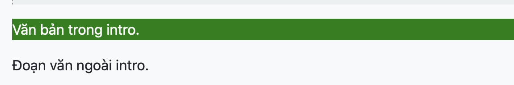
  `Class & Selector`
    - Trong phần tử HTML khi thiết lập `id` thì id đó là duy nhất cho phần tử (1 phần tử), còn thuộc tính `class` thì được phép lặp lại cho nhiều phần tử.
    - Tương tự như `id` thay` #` bằng dấu `.`
    ```html
    <div>
        <p class="first">Đây là một đoạn văn</p>
        <p> Đoạn văn thứ 2. </p>
    </div>
    <p class="first"> Đây là đoạn văn ABC</p>
    <p> Đoạn văn thứ XYZ. </p>
    ```
    - Dùng CSS chọn phần tử p có class là first và thay đổi cỡ chữ lên 200% :
    ```css
    .first {font-size: 200%;}
    ```
    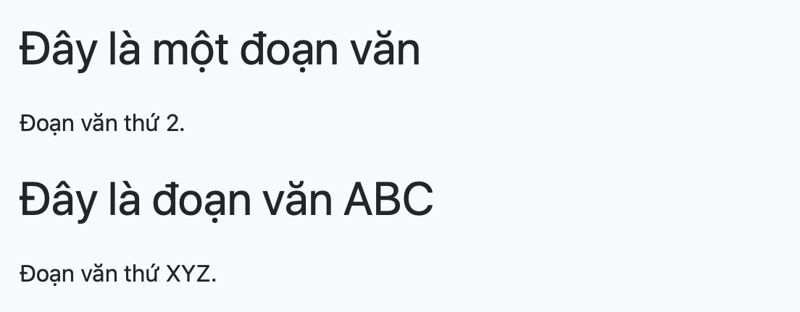
- Phần tử con Css
    - Selector trong CSS cũng cho phép chọn ra cụ thể một phần tử nằm trong một phần tử khác. Chọn kiểu này bằng cách chỉ ra các phần tử cha theo cấp, dần dẫn đến phần tử chọn bên trong.
    - Ví dụ chọn phần tử `<em>` trong đoạn văn `p` đầu tiên của khối `intro`
    ```html
    <div id="intro">
        <p class="first">Đây là một <em> đoạn văn.</em></p>
        <p> Đây là đoạn thứ hai. </p>
    </div>
    ```
    - Code css sẽ là:
    ```css
    #intro .first em {
    color: pink; 
    background-color:green;}
    ```
    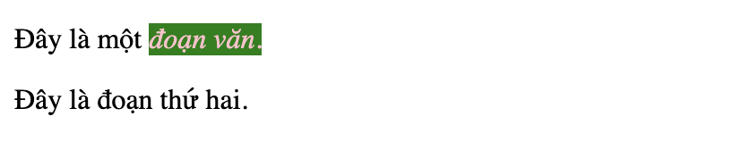
- Ngoài ra còn có chú thích dưới dạng CSS là (`/* Chú thích được viết trong này */`)
### `Display`
  - `Display block`
    - Thuộc tính `display:block` có tác dụng xác định thành phần hiển thị theo các hàng độc lập.
    ```css
    span{
    display: block;
    }
    ```
    - Khi sử dụng thẻ `block` thì `<span>` sẽ xuống dòng thì vì nằm trên 1 dòng.
  - `Display inline`
    - Thuộc tính `display: inline` có tác dụng xác định thành phần được hiển thị theo chiều ngang (không ngắt dòng khi chiều rộng vẫn nhỏ hơn chiều rộng của màn hình). Đây là dạng mặc định của các thẻ a,span,...
    ```css
    p{
    display: inline;
    }
    ```
    - Khi sử dụng thẻ `inline` thì `<p>` sẽ không xuống dòng ngược lại với mặc định của nó.
  - `Display inline-block`
    - Thuộc tính display: inline-block có tác dụng xác định các thành phần sẽ được hiển thị theo khối nhưng là các khối inline.
    ```css
    p{
    display: inline-block;
    background: orange;
    }   
    ```
    - Có thể dùng width or height chỉnh cho khối đó.
  - `Display none`
    - Thuộc tính display: none có tác dụng ẩn thành phần được chọn.
    ```css
    p{
    display: none;
    }
    ```
  - `Display inline-table`
    - Thuộc tính display: inline-table các tác dụng xác định thành phần được hiển thị theo dạng khối nột tuyến. Không xuống dòng trước và sau các thành phần cạnh nó.
    ```css
    p{
    display: inline-table;
    background: orange;
     }
    ```
  - `Display list-item`
    - Thuộc tính display: list-item có tác dụng xác định thành phần sẽ được hiển thị như một thẻ `li`.
  - `Display table`
    - Thuộc tính display: table có tác dụng xác định thành phần được chọn như một thẻ `<table>`.
  - `Display inherit`
    - Thuộc tính này có tác dụng xác định thành phần được chọn kế thừa từ thuộc tính của thành phần cha.
  - Một số giá trị khác của display
    - Ngoài những thuộc tính ở trên thì display còn hỗ trợ một số các giá trị như sau:
    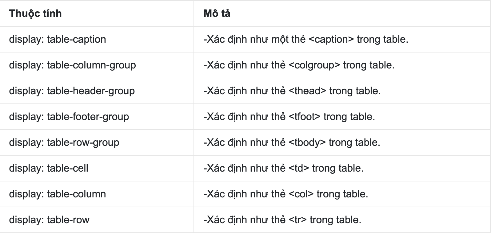
### `Flexbox`
  - Flexbox Layout (hay còn gọi là Flexible Box) là một kiểu bố cục trang có khả năng tự cân đối kích thước, thay đổi chiều rộng/chiều cao và thứ tự phần tử bên trong để phù hợp với tất cả các loại thiết bị hiển thị và kích thước màn hình.
    ```html
    <div class="box">
      <div class="item"></div>
      <div class="item"></div>
      <div class="item"></div>
    </div>
    ```
    ```css
    .box {
      display: flex;
      width: 100%;
      background-color: #1a1c28;
      height: auto;
      }
    .item {
        width: 150px;
        height: 150px;
      }
    .item:nth-of-type(1) {
        background-color: #bf4470;
      }
    .item:nth-of-type(2) { 
        background-color: #ffa400; 
      }
    .item:nth-of-type(3) {
        background-color: #07a787;
      }
    ```
    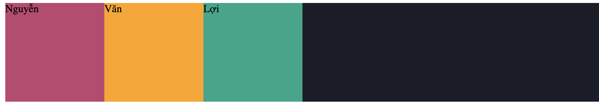
#### `Flex-direction`
  - Như tên gọi của nó là hướng(trục), thì trong flexbox có 2 trục chính đó là trục X và trục Y giống như biểu đồ toán học. Lưu ý là flexbox chỉ hiển thị theo 1 trong 2 hướng.Mặc định thì những items trong flexbox được sắp xếp theo trục X và từ trái qua phải.
  - `flex-direction:row` là giá trị mặc định trong `flex-direction` các items sẽ được sắp xếp theo chiều ngang(trục X) và hiển thị từ trái sang phải.
  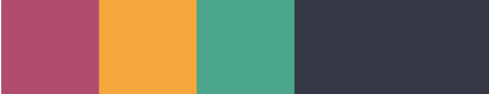
  - `flex-direction:row-reverse ` Thì ngược lại với mặc định.
  - `flex-direction: column` các items được sắp xếp chiều dọc(trục Y) và hiển thị từ trên xuống dưới
  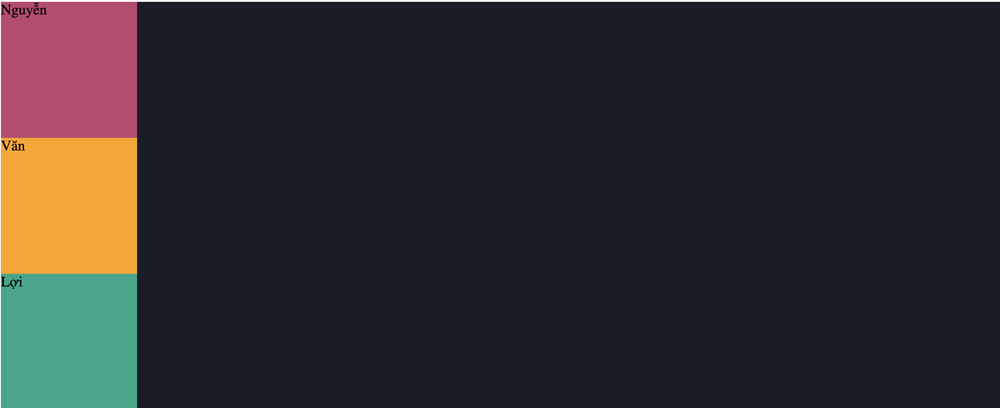
  - `flex-direction: column-reserve` Thị ngược lại với `column`
#### `Flex-wrap`
  - Cho phép các items tự động xuống hàng hoặc vẫn luôn nằm trên cùng một hàng khi kích thước container thay đổi.
  - `Flex-wrap` có 3 giá trị đó là `wrap`, `nowrap` và `wrap-reverse`.
  - `nowrap` mặc định nằm trên 1 hàng nên ta không cần set
  - `wrap` ngược lại với `nowrap` khi kích thước thay đổi lớn hơn chiều dài và rộng của container thì nó rớt xuống.
  - `wrap-reverse` tương tự như `wrap` nhưng nó ngược từ dưới lên.
  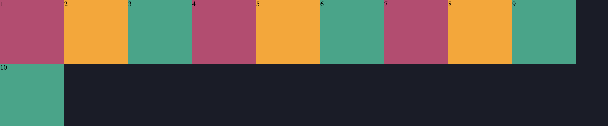
#### `Justify-content`
  - Thuộc tính này cho phép các bạn căn chỉnh các phần tử theo chiều ngang hoặc chiều dọc tùy thuộc vào thuộc tính `flex-direction` ở trên.
  - Trong `justify-content` có 6 giá trị đó là `flex-start`, `flex-end`, `center`, `space-between` và `space-around`. Khi sử dụng thuộc tính này thì nên xem thêm đó là chúng ta đang làm với `flex-direction` theo `row`(chiều ngang) hay `column`(chiều dọc). 
  - Trường hợp đầu tiên là khi làm với `flex-direction: row`. Lúc này những phần tử(items) sẽ được căn chỉnh theo chiều ngang.
  - `flex-start`: Giá trị mặc định trong thuộc tính justify-content khi sử dụng giá trị này thì những phần tử sẽ nằm sát lề bên trái của container.
  - `flex-end`: Sử dụng giá trị này thì các phần tử sẽ nằm sát lề bên phải, đừng nhầm với cái row-reverse nhá(row-reverse ở trên là đổi hướng hiển thị.)
  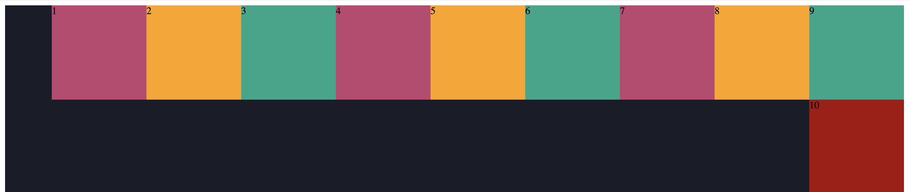
  - `center` Giá trị này làm cho các phần tử nằm giữa container.
  - `space-between`: Giá trị này tạo khoảng cách giữa các phần tử bằng nhau, phần tử đầu tiên sát lề bên trái, phần tử cuối cùng sát lề bên phải, container sẽ tự động canh khoảng cách giữa các phần tử với nhau sao cho luôn bằng nhau.
  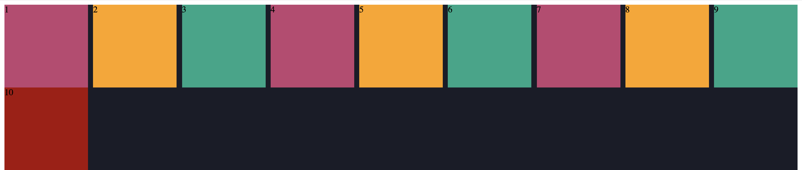
  - `space-around`: Giá trị này thì na ná space-between nhưng khác ở chỗ là có khoảng cách 2 bên giữa các phần tử và những khoảng cách này bằng nhau.
  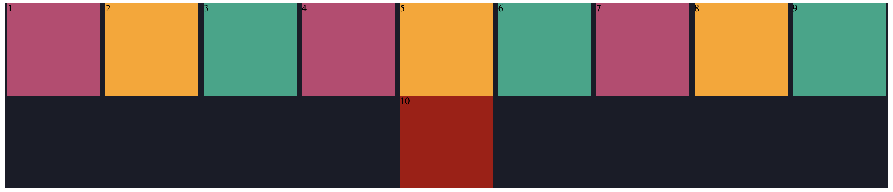
  - `space-evenly` : các mục được phân phối sao cho khoảng cách giữa hai mục bất kỳ (và khoảng trống đến các cạnh) là bằng nhau.
  - Trường hợp thứ 2 là khi làm việc với `flex-direction: column`. Thì lúc này `justify-content` sẽ căn chỉnh các phần tử theo chiều dọc còn về căn như nào thì giống `flex-direction: row`
#### `Order`
  - Thay đổi ví trị 1 cách dễ dàng 
  - Cú pháp `oder:n;` (n: là thứ tự đánh số vị trí muốn di chuyển trong container)
  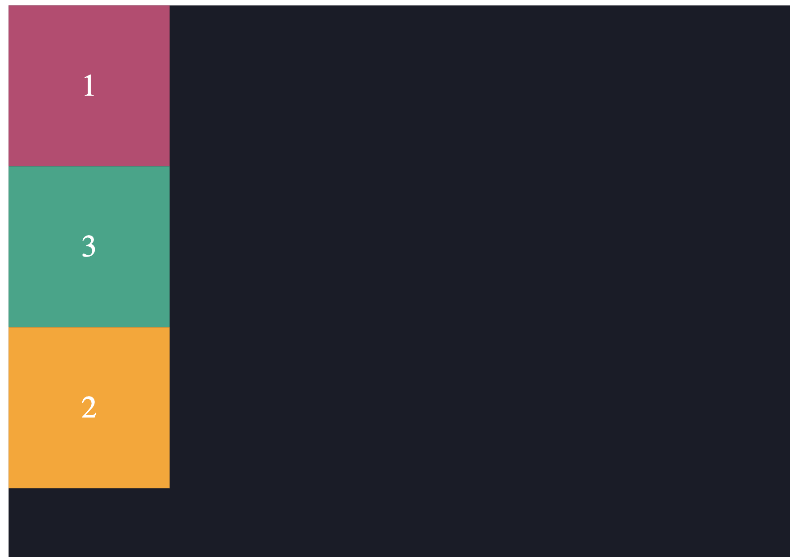
#### `Align-items`
  - Ngược lại với thuộc tính `justify-content` thì mặc định `align-items` canh các phần tử theo chiều dọc thay vì chiều ngang như `justify-content`. Tuy nhiên nếu đổi `flex-direction` sang `column` thì `align-items` sẽ canh theo chiều ngang.
  - Trường hợp đầu tiên khi làm việc với `flex-direction: row`(mặc định). Các phần tử sẽ được canh theo chiều dọc. Trong `align-items` có 5 giá trị đó là `flex-start`, `flex-end`, `center`, `stretch`(default), `baseline`(typography).
  
  - Mặc định trong `align-items` là `stretch`, nếu các phần tử các bạn set height: auto thì nó sẽ cao full hết container chứa nó, nhưng nếu các bạn set height cố định thì nó sẽ đè lên thuộc tính `stretch` này và tất nhiên nó sẽ không cao full mà chỉ lấy giá trị height mà bạn set.
  - Còn 1 giá trị đó là `baseline`, nghĩa là nó sẽ canh các phần tử với nhau dựa vào chữ bên trong(Dòng chữ đầu tiên).
  - Trường hợp thứ 2 khi làm việc với flex-direction: column. Các phần tử sẽ được canh theo chiều ngang. Cũng là 5 giá trị như trên.
  
  - Riêng giá trị `baseline` thì ở với trường hợp này nó không có tác dụng, nó chỉ canh baseline của các chữ theo chiều ngang khi ở `flex-direction: row`.
#### `Align-self`
  - Thuộc tính  này tương tự với thuộc tính `align-items` ở trên nhưng khác ở chỗ là áp dụng riêng lẻ cho các phần tử mà bạn muốn thay đổi giá trị của nó.

  - Giả sử bạn có các phần tử đều là `align-items: flex-start`(mặc định) nhưng bạn muốn thẻ div màu vàng ở giữa chứ không phải ở trên thì lúc này các bạn chỉ cần css cho thẻ div màu vàng `align-self: center` là được.
  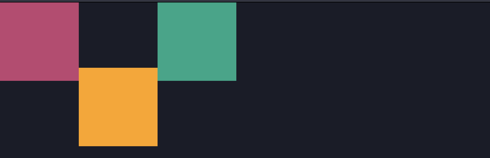
#### `Flex-basis`
  - Set chiều rộng hoặc chiều cao của phần tử dựa vào flex-direction row hay column. Mặc định là `flex-direction: row` cho nên lúc này `flex-basis` sẽ tương ứng với thuộc tính `width` của phần tử và khi `flex-direction: column` thì lúc này `flex-basis` sẽ là `height` của phần tử.
  
#### `Flex-grow`
  - Nó cho các phần tử giãn theo độ rộng của container, mặc định giá trị trong thuộc tính `flex-grow` là 0. Nghĩa là các phần tử sẽ không tự động co giãn kích thước khi chiều rộng của container bao ngoài thay đổi. 
  - Giá trị của `flex-grow` rất là linh động chứ không tuyệt đối nghĩa là khi set giá trị `flex-grow` cho các phần tử thì các phần tử đều có tỉ lệ với nhau. Ví dụ set tất cả các phần tử `flex-grow` là 1 thì tất cả đều như nhau tỉ lệ 1:1, nếu set 999 cho toàn bộ thì cũng vậy vì bằng nhau hết mà đơn giản về hết cũng là 1:1.
  
  
  - Nhưng mà giả sử set các phần tử đều là flex-grow: 1, nhưng set riêng phần tử thứ 3 giá trị khác thì :
  

#### `Flex-shrink`
  - Thuộc tính này thì nó ngược lại so với thuộc tính `flex-grow` ở trên, nó không giãn ra mà lại co lại khi chúng ta thay đổi độ rộng của container xuống. Mặc định giá trị trong `flex-shrink` là 1 nghĩa là cho phép các phần tử co lại khi độ rộng container giảm xuống.
  
#### `Flex`
  - Flex là viết tắt của 3 thuộc tính flex-grow flex-shrink và flex-basis. Nó như thế này. flex: flex-grow flex-shrink flex-basis. Mặc định grow(0) shrink(1) và basis(auto).
### `Responsive - media queries`
  - Để xử lý thay đổi giao diện giữa các dạng màn hình khác nhau (chiều rộng màn hình khác nhau), ta sẽ sử dụng truy vấn @media.
    ```css
    @media only|not Media-type and (Media-future and|or|not Media-future) {
        tag {
          property: value;
        }
    }
    ```
    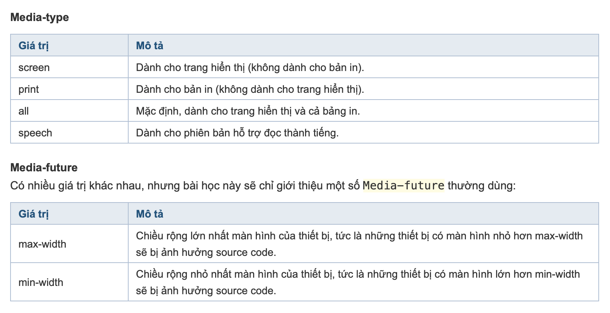
   - Ví dụ:
      ```css
      div {
          background-color: blue;
      }

      @media only screen and (max-width: 1024px) {
      div {
          background-color: red;
        }
      }
      ```

      - Tất cả các thiết bị sẽ có `background-color: blue`, riêng các thiết bị có màn hình nhỏ hơn 1024px sẽ có `background-color: red`.
      - `only screen`: chỉ dành cho trang hiển thị (không dành cho bản in (print)).
      - `max-width`: chỉ tác dụng cho chiều rộng màn hình lớn nhất là 1024px, tức là những màn hình nào nhỏ hơn 1024px đều sẽ bị ảnh hưởng code bên trong, cụ thể là div sẽ có background-color: red.
  - Giờ sẽ thử thay đổi background-color khác nhau tương ứng với các màn hình khác nhau:
    ```html
    <div>Học Web Chuẩn</div>
    ```
  - CSS viết - khi chưa sử dụng @media:
    ```css
    div {
    background-color: #92dfc8;
    height: 150px;
    line-height: 150px;
    text-align: center;
    width: 200px;
    }

    ```
  - Hiển thị trình duyệt - khi chưa sử dụng @media:
  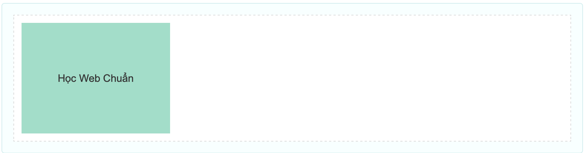
  - CSS viết - sử dụng @media để chỉnh hiện thị theo chiều rộng màn hình:
    ```css
    div {
      background-color: #333333;
      height: 150px;
      line-height: 150px;
      text-align: center;
      width: 200px;
    }

    @media only screen and (max-width: 1024px) {
      div {
          background-color: red;
      }
    }

      @media only screen and (max-width: 768px) {
      div {
         background-color: blue;
     }
    }

    @media only screen and (max-width: 640px) {
     div {
         background-color: yellow;
      }
    }

    @media only screen and (max-width: 480px) {
      div {
         background-color: pink;
     }
    }
    ```
    [Demo](https://hocwebchuan.com/reference/tester/responsive.php#/tutorial/responsive/example/responsive_media_queries.html)
### `Box model`
  - `Box Model` là một kỹ thuật cơ bản nhất trong CSS Layout và được sử dụng để bạn mô tả về khoảng cách mà mỗi phần tử  trên website được sở hữu, hay nói cách khác là kỹ thuật tinh chỉnh khoảng cách hiển thị cho mỗi phần tử trên website.
  - Kỹ thuật Box Model trong CSS bao gồm 4 phần quan trọng đó là:
      - Margin: Khoảng cách tính từ bên ngoài của phần tử.
      - Border: Đường viền của phần tử.
      - Padding: Khoảng cách tính từ bên trong của phần tử.
      - ontent: Nội dung trong phần tử.
    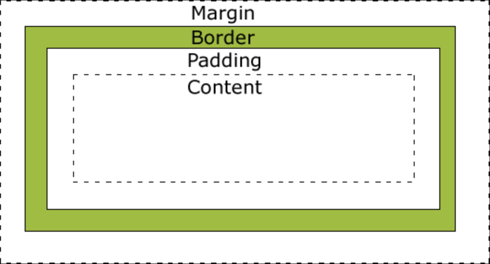
  - Và trong 4 thành phần trên thì phần content chúng ta sẽ không có thuộc tính CSS nào đại diện cả vì nó là nội dung trong phần tử. Còn 3 phần còn lại thì sẽ có các thuộc tính CSS đại diện như sau:
#### `Padding`
  - Padding nghĩa là chúng ta sẽ thiết lập khoảng cách được tính từ phần Content trở ra viền của phần tử.
  - Padding được khai báo trong CSS bởi thuộc tính padding với giá trị theo tuần tự top right bottom left (trên > phải > dưới > trái) và giá trị là số kèm theo đơn vị đo lường.
  [Demo](https://codepen.io/thachpham92/pen/yydjYd)
#### `Border`
- Border nghĩa là thuộc tính để bạn tạo viền cho phần tử và nó sẽ được khai báo bằng thuộc tính border trong CSS.
- Thuộc tính border này bạn sẽ viết theo cấu trúc như sau:
    ```css
      border: [size] [type] [color];
    ```
- Ví dụ mình muốn tạo một cái viền, viền có kích thước 1px, kiểu trơn và màu viên là đỏ thì sẽ viết như sau:
    ```css
      border: 1px solid red;
    ```
    [Demo](https://www.w3schools.com/css/css_border.asp)
#### `Margin`
- Trong khi Padding có nhiệm vụ tạo khoảng cách giữa phần Content với Border thì Margin sẽ có tác dụng tạo khoảng cách từ Border trở ra ngoài, nói dễ hiểu thì nó sẽ giúp bạn tinh chỉnh khoảng cách giữa các phần tử với nhau.
[Demo](https://codepen.io/thachpham92/pen/qEzYNR)
### `Positioning`

- Thuộc tính `position` có thể giúp thao tác vị trí của một `element`.

- Có năm giá trị vị trí khác nhau:

  - `static`: `element` sẽ nằm theo thứ tự trong văn bản, đây là dạng mặc định.
  - `relative`: vị trí ban đầu của `element` vẫn nằm trong luồng tài liệu, giống như giá trị tĩnh.
  - `absolute`: `element` bị xóa khỏi luồng tài liệu và các `element` khác sẽ hoạt động như thể nó không có ở đó trong khi tất cả các thuộc tính vị trí khác sẽ hoạt động trên đó.
  - `fixed` Giống như absolute. Nhưng nó sẽ cố định ở màn hình khi chúng ta scroll.
  - `sticky` tương tự như `fixed`.
[Demo](https://codepen.io/cuong021099/pen/JjWRLwX)
### `CSS Specificity`

- Nếu có 2 hay nhiều CSS rule cùng nhắm vào một phần tử thì khi đó trình duyệt sẽ chỉ tuân theo một nguyên tắc, xem trong list CSS rule đâu là quy tắc cao nhất để chọn ra và apply vào phần tử.
- Ở đây chúng ta sẽ có bảng xếp hạng cho CSS rule để trình duyệt tuân theo khi áp dụng CSS, được sắp xếp theo thứ tự ưu tiên từ trên xuống dưới:

  - `!important`:sẽ ghi đè tất cả các quy tắc tạo kiểu trước đó cho thuộc tính cụ thể trên phần tử đó.

    `h1{color: white!important;}`

  - `Inline style`: thiết lập các thuộc tính CSS trực tiếp bên trong một phần tử bằng thuộc tính `style`

    `<h1 style="color: #ffffff;">Đây là thẻ h1</h1>`

  - ID: thiết lập các thuộc tính CSS cho một phần tử được định danh duy nhất trong một trang.

    `#nav, #header`

  - Class, attribute, pseudo-class:

    `.menu, .header,... , attribute như a[target] và pseudo-class như :hover, :focus...`

  - Element, pseudo-element

    `h1, h2, div, p... và pseudo-element như là ::before, ::after, ::selection.`
### ` Transition`
  - Transition hoạt động bằng cách thay đổi giá trị thuộc tính một cách trơn tru từ giá trị này sang giá trị khác trong khoảng thời gian nhất định. Nếu duration không được chỉ định thì giá trị mặc định bằng 0. Các tham số thường được sử dụng:

      - transition-delay: khoảng thời gian dừng cho mỗi hiệu ứng chuyển đổi.
      - transition-duration: khoảng thời gian chuyển đổi diễn ra.
      - transition-property: thuộc tính cần chuyển đổi.
      - transition-timing-function: tốc độ chuyển đổi diễn ra.
          - ease: tạo hiệu ứng chuyển đổi khi bắt đầu thì chậm sau đó nhanh dần và gần kết thúc lại chậm từ từ (giá trị mặc định).
          
          - linear: tạo hiệu ứng chuyển đổi từ lúc bắt đầu với lúc kết thúc tốc độ là như nhau.
          
          - ease-in: tạo hiệu ứng chuyển đổi chậm ở lúc bắt đầu.
          
          - ease-out: tạo hiệu ứng chuyển đổi chậm ở lúc kết thúc.
          
          - ease-in-out: tạo hiệu ứng chuyển đổi chậm ở lúc bắt đầu và lúc kết thúc.

            
### `Transform`

`Syntax`

```css
transform: value;
```

- Một số value (method) của transform: `translate(), rotate(), scaleX(), scaleY(), scale(), skewX(), skewY(), skew()`

### Transform 2D

- Các phần tử có thể bị bóp méo hoặc bị biến đổi trên cả mặt phẳng hai chiều hoặc mặt phẳng ba chiều.

#### Rotate()

- `rotate` cung cấp khả năng xoay một `element` từ 0 đến 360 độ.
- Sử dụng giá trị dương sẽ xoay `element` theo chiều kim đồng hồ và sử dụng giá trị âm sẽ xoay `element` ngược chiều kim đồng hồ.
- Điểm xoay mặc định là tâm của `element`, 50% theo cả chiều ngang và chiều dọc.
- Các `element` có thể xoay chỉ chiều x hoặc chỉ chiều y.

[demo](https://codepen.io/cuong021099/pen/QWpGNPg)

#### Scale()

- Các `element` có thể thay đổi kích thước xuất hiện theo tỉ lệ.
- Tỉ lệ mặc định là 1.
- Bất kỳ giá trị nào từ 0,01 đến 0,99 đều làm cho một `element` có vẻ nhỏ hơn trong khi bất kỳ giá trị nào lớn hơn hoặc bằng 1,01 làm cho một `element` có vẻ lớn hơn.
- Các `element` có thể thay đổi kích thước chỉ chiều x hoặc chỉ chiều y.

[demo](https://codepen.io/cuong021099/pen/QWpGELM)

#### Translate()

- Dùng `Translate` để thay đổi vị trí của một `element` trên trục x và y.
- Dùng translateX để thay đổi vị trí của `element` theo trục X, translateY để thay đổi vị trí của `element` theo trục Y.

[demo](https://codepen.io/cuong021099/pen/oNZYLLN)

#### Skew()

- Được sử dụng để làm nghiêng các phần tử trên trục x, trục y hoặc cả hai.
- Tính toán khoảng cách của giá trị `skew` được đo bằng đơn vị độ. Các phép đo độ dài, chẳng hạn như pixel hoặc tỷ lệ phần trăm, không áp dụng ở đây.

[demo](https://codepen.io/cuong021099/pen/YzZpWrq)

#### Kết hợp

- Nhiều phép biến đổi có thể sử dụng cùng 1 lúc.

[demo](https://codepen.io/cuong021099/pen/KKWNMxG)

#### Transform Origin

- Điểm biến đổi mặc định là tâm của `element`, 50% theo cả chiều ngang và chiều dọc.
- Với `transform origin` chúng ta có thể thay đổi điểm biến đổi đó.

[demo](https://codepen.io/cuong021099/pen/MWpbJbB)

#### Perspective (Phối cảnh)

- Thay đổi góc nhìn.

[demo](https://codepen.io/cuong021099/pen/abJBmNN)

#### Perspective Origin

- Thay đổi gốc của góc nhìn

[demo](https://codepen.io/cuong021099/pen/WNpoRzz)

### Transform 3D

- Tương tự transform 2D nhưng có thêm trục Z.

#### Rotate()

[demo](https://codepen.io/cuong021099/pen/NWpbdOM)

#### Scale()

[demo](https://codepen.io/cuong021099/pen/mdWOWbB)

#### Skew()

- Không thể biến đổi trên trục Z.

#### Translate()

[demo](https://codepen.io/cuong021099/pen/NWpbpxE)

#### Transform Style

- Đôi khi, các phép biến đổi ba chiều sẽ được áp dụng trên một phần tử được lồng trong một phần tử mẹ cũng đang được chuyển đổi.
- Trong trường hợp này, các phần tử được lồng nhau, được biến đổi sẽ không xuất hiện trong không gian ba chiều của riêng chúng.
- Để cho phép các phần tử lồng nhau biến đổi trong mặt phẳng ba chiều của riêng chúng, hãy sử dụng thuộc tính kiểu biến đổi với giá trị `preserve-3d`.
- Cú pháp như sau:

  `transform-style: preserve-3d`

[demo](https://codepen.io/shayhowe/pen/jBhbk)

#### Backface Visibility

- Khi làm việc với các phép biến đổi ba chiều, các phần tử đôi khi sẽ được biến đổi theo cách khiến chúng quay mặt ra khỏi màn hình.
- `backface-visibility`: cho phép chúng ta ẩn/ hiện nội dung khi bị quay mặt ra khỏi màn hình đó

[demo](https://codepen.io/cuong021099/pen/PopbpjB)
### `Animation`

- Cho phép tạo ra hiệu ứng chuyển động mà không cần sử dụng đến JS hay Flash.
- Animation là hiệu ứng chuyển động.
- Để tạo ra một chuyển động Animation cần phải có các keyframe.
- Mỗi Keyframe được chạy ở 1 thời điểm xác định và trong keyframe đó nó quy định việc phần tử sẽ di chuyển ra sao.
- Ngoài ra Animation còn quy định một số thuộc tính quy định các chi tiết khá quan trọng :
  - `animation-name`: Khai báo tên Keyframe được sử dụng.
  - `animation-duration`: Tương tự như transition.
  - `animation-timing-function`:Tương tự như transition.
  - `animation-delay`: Tương tự như transition.
  - `animation-iteration-count`: Sử dụng để thiết lập số lần thực hiện một animation. Giá trị thường là 1 số nhất định hoặc là `infinite` lặp lại vô hạn.
  - `aniamtion-direction`: Xác định chiều chạy của animation. Các giá trị:
    - `normal`: animation di chuyển bình thường tiến về phía trước (mặc định)
    - `reverse`: animation di chuyển theo hướng ngược lại, lui về sau.
    - `alternate`: animation di chuyển tiến về trước, sau đó lui theo hướng ngược lại
    - `alternate-reverse`: animation di chuyển ngược lại trước, rồi đổi chiều tiến về trước.
  - `animation-play-state`:
    - `paused` : Xác định chuyển động dừng lại
    - `running` : Xác định chuyển động chạy

`Rule Keyframe`

- Quy định phần tử sẽ chuyển động ra sao tại mỗi thời điểm nhất định
- Syntax:
  - Name: tên của animation bạn muốn tạo
  - Code: Các đoạn code quy định tiến trình chuyển động. Có 2 dạng:
    - Sử dụng phần trăm từ 0% đến 100%.
    - from...to: thiết lập giá trị từ khởi đầu (from - tương đương với 0%) đến kết thúc (to - tương đương với 100%).

```css
@keyframes Name {
  /*code*/
}
```

[demo](https://codepen.io/Sadioho/pen/XWMNjXb)
### `Css Float`
  - Với CSS float, một phần tử có thể đẩy về trái hoặc phải, có phép các phần tử khác bám quanh nó.
  - Thuộc tính float thường sử dụng với ảnh, nhưng nó cũng làm việc với các phần tử khác để dàn trang. Giá trị của float là: left right none, trong đó none là mặc định.
  - left right là hướng mà phần tử được đẩy đi (trái, phải), none thì phần tử không trôi về trái hay phải
  - Phần tử float trôi theo phương ngang về trái hoặc phải chứ không thể thiết lập trôi theo phương đứng lên trên, xuống dưới


      
    


