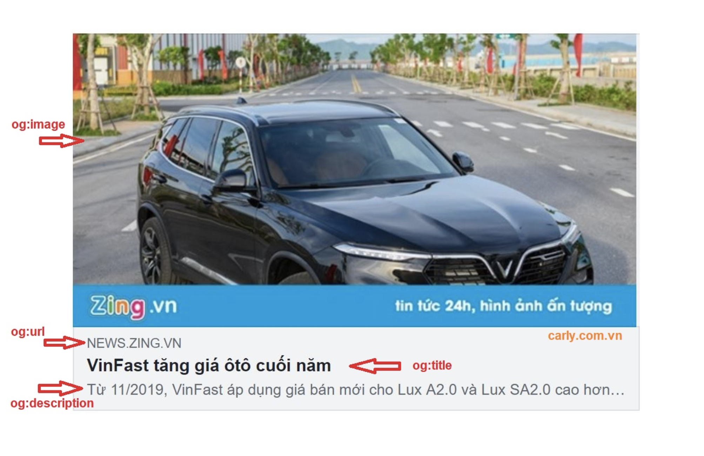
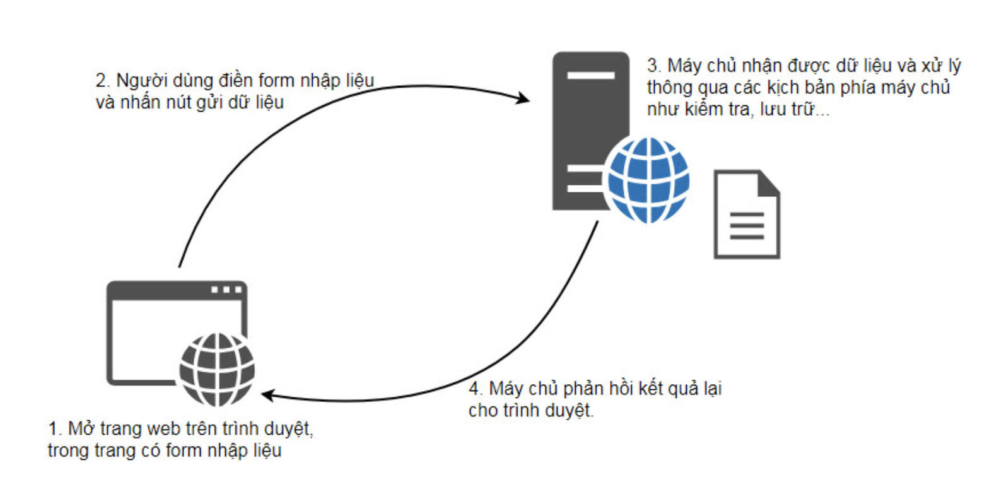
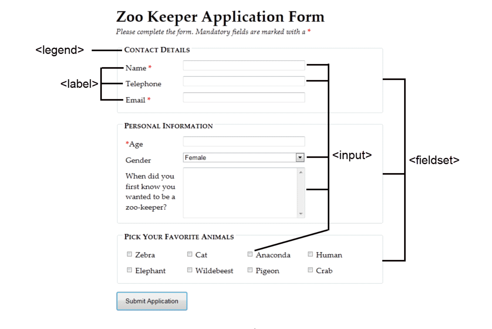
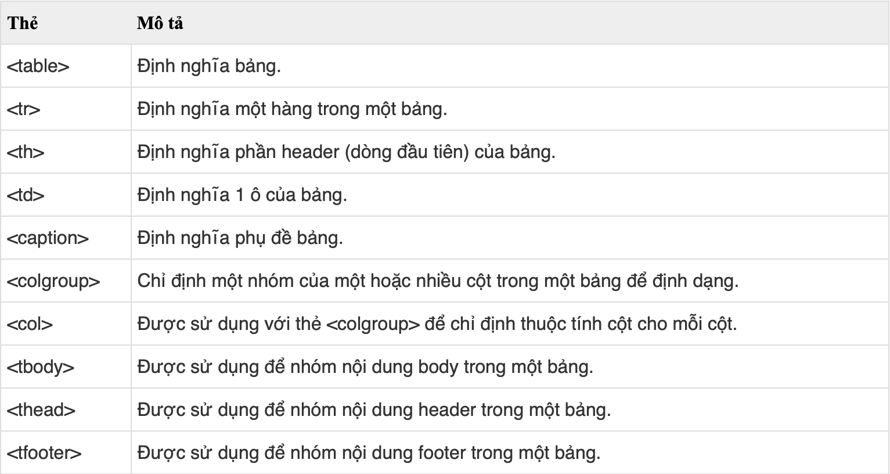

# HTML5
## HTML 

- HTML không phải là ngôn ngữ lập trình, html là ngôn ngữ đánh dấu (markup language), ngôn ngữ đánh dấu là một nhóm các thẻ đánh dấu (các tag) để mô tả trang WEB.

## Thẻ meta 
- Được sử dụng để cung cấp metadata về tài liệu HTML.(Metadata sẽ không được hiển thị trên trình duyệt, nhưng nó sẽ được bộ máy tìm kiếm phân tích để lấy thông tin cơ bản về trang web). Để định nghĩa các thông tin cơ bản như mô tả trang web, từ khóa, tác giả, chỉnh sửa cuối cùng.
#### Một số ví dụ thẻ meta :
``` html
<meta name ="keyword" content="HTML là gì?">
```
``` html
<meta name = "description" content="Viết tắt HMTL ?">
```
```html
<meta name = "author" content="Loi">
```
``` html
<meta name = "refesh" content="30">
```
``` html
<meta name="viewport" content="width=device-width, initial-scale=1.0">
```
#### Các thuộc tính của thẻ meta

- Thẻ meta open graph:

  - Là thẻ cung cấp thông tin về trang web.
  - Mục đích của thẻ OG là để xác định những thông tin chính của trang web và hiển thị thông tin đó khi có ai chia sẻ trang web lên mạng xã hội như FB, Zalo,...
  - Có 4 loại thẻ OG chính:
  

    - `title`: tiêu đề của trang web tương tự như thẻ `<title>`.

    ```html
    <meta property="og:title" content="The Rock" />
    ```

    - `url`: Hiển thị `url` của trang web (Dưới image ẩn trong image)

    ```html
    <meta property="og:url" content="http://google.com/" />
    ```

    - `image`: Thể hiện ảnh đại diện cho trang web.

    ```html
    <meta
      property="og:image"
      content="https://encrypted-tbn0.gstatic.com/images"
    />
    ```

    - `description`: Mô tả ngắn gọn về trang web

    ```html
    <meta property="og:desciption" content="Đây là ví dụ về description" />
    ```
    Ngoài ra:

    - ` lang`: Dùng để khai báo về ngôn ngữ mà trang web đang sử dụng, để công cụ tìm kiếm có định hướng tốt hơn cho người dùng.


    ```html
    <meta lang="en" />
    ```

    - `geo`: Dùng để khai báo vị trí địa lý cụ thể cho doanh nghiệp. Mục đích để công cụ tìm kiếm có định hướng tốt hơn với người nằm trong khu vực đang cung cấp.

    ```html
    <meta name="geo.region" content="HU" /> - Khu vực
    <meta name="geo.placename" content="Huế" /> - Tên địa điểm
    <meta name="geo.position" content="47.181759;19.506094" /> - Định vị
    ```
   ## Thẻ link

- Xác định mối quan hệ giữa một tài liệu HTML và các tài nguyên bên ngoài.
- Được viết bên trong thẻ `<head>`
- Một số attribute thường dùng:
  - `rel` Xác định mối quan hệ giữa tài liệu hiện tại và tài liệu liên quan(stylesheet, alternate,...).
  - `type` Xác định kiểu MIME của tài liệu liên quan.
    ("Multipurpose Internet Mail Extensions" là một chuẩn Internet về định dạng cho thư điện tử)
  - `href` Đường dẫn tới các tại liệu liên quan.
  - `media` Xác định những thiết bị nào được hiển thị trong tài liệu liên quan(screen, print, all).

```html
<head>
  <link rel="stylesheet" type="text/css" href="filecss.css" media="screen" />
</head>
```
## Block element và Inline element

- Block element:
  Là một khu vực hay là 1 khối, khối này có nghĩa là một thẻ khi mà bạn khai báo thì nó sẽ được hiển thị ở mỗi dòng riêng biệt bao gồm các nội dung nằm bên trong. Đó là các thẻ: h1, from, li, ol, ul, p, pre, table, div ...
  ```html
  <div>Hello World
    <p>Loi</p>
    <h2>Nguyen</h2>
  </div>
  ```
- Inline element :
    Là thuật ngữ chỉ chung các thẻ HTML khi mà khai báo vào nội dung thì nó vẫn sẽ nằm chung một dòng với các văn bản khác.. Đó là các phần tử: b, a, strong, img, input, span ...
```html
  <span>Hello Hahalolo</span>
  ```
## Thẻ script

- Được sử dụng để viết code javascript trong file html.
- Các attribute của thẻ `script`:
  - `src` Xác định đường dẫn đến tập tin JavaScript mà bạn muốn sử dụng cho trang web
  - `async` Đảm bảo việc mã lệnh JavaScript chỉ được thực thi sau khi trang web đã được tải xong hoàn toàn
  - `defer` Đảm bảo việc mã lệnh JavaScript chỉ được thực thi sau khi trang web đã được tải xong hoàn toàn
  - `charset` Xác định kiểu mã hóa ký tự được sử dụng trong tập tin JavaScript
  - `src`: truyền file javascript từ ngoài vào.
  ## Các thẻ có ý nghĩa trong HTML

### `<section>`

- Được sử dụng để tạo thành 1 khu vực bao gồm những nội dung giống nhau(có cùng chủ đề).

```html
<section>
  <h1>WWF</h1>
  <p>Quỹ Quốc Tế Bảo Vệ Thiên nhiên (WWF),được thành lập vào năm 1961.</p>
</section>
```

### `<article>`

- Dùng để xác định nội dung độc lập, riêng biệt với những phần còn lại của trang web

```html
<article>
  <h1>Google Chrome</h1>
  Google Chrome là trình duyệt miễn phí, mã nguồn mở, được phát triển bởi
  Google, phát hành vào năm 2008.
</article>
```

### `<header>`

- Dùng cho phần đầu trang hoặc phần đầu của một thẻ.
- Nên dùng để bao ngoài nội dung giới thiệu trang.

```html
<article>
  <header>
    <p>Sứ mệnh của WWF:</p>
  </header>
  <p>
    Sứ mệnh của WWF là ngăn chặn sự xuống cấp môi trường tự nhiên của hành tinh
    chúng ta.
  </p>
</article>
```

### `<footer>`

- Dùng cho phần cuối trang hoặc phần cuối của một thẻ.

```html
<footer>
  <p>Tác giả: Nguyễn Văn A</p>
  <p>
    Thông tin liên hệ:
    <a href="mailto:someone@example.com"> someone@example.com</a>.
  </p>
</footer>
```

### `<nav>`

- Được gọi là thanh điều hướng, được dùng để chứa các liên kết điều hướng trong trang.

```html
<nav>
  <a href="/hoc-html/">Học HTML</a>
  <a href="/canvas-trong-html5/">Đồ họa HTML5</a>
</nav>
```

### `<aside>`

- Dùng để chứa những thông tin bên cạnh nội dung chính.

```html
<p>Google có trụ sở tại Thung lũng Silicon.</p>
<aside>
  <h4>Thung lũng Silicon</h4>
  <p>
    Thung lũng Silicon nằm ở phía Nam của vùng vịnh San Francisco tại phía Bắc
    California ở Mỹ.
  </p>
</aside>
```

### `<figure>` và `<figcaption>`

- `<figure>` xác định các nội dung liên quan mạch lạc với nhau, như hình ảnh, sơ đồ, code,...
- `<figcaption>` để chỉ 1 chú thích

```html
<figure>
  <figcaption>Hình minh họa</figcaption>
  <p></p>
</figure>
```

### `<details>` và `<summary>`

- `<details>` Xác định thêm chi tiết hoặc điều khiển có thể được ẩn hoặc hiển thị theo yêu cầu.
- `<summary>` dùng làm tiêu đề cho `<details>`
- `<details>` có attribute là `open=open` (mặc định) nó sẽ hiển thị ra nội dung bên trong thẻ `<details>` thông qua thẻ `<summary>`

```html
<details>
<summary>HTML5</summary>
  <p>Thẻ details.</p>
  <p>Thẻ summary.</p>
</details>
```

### `<main>`

- Xác định phần thân của trang, nó thường được dùng để chứa các nội dung chính của trang web.

```html
<body>
  <header>HỌC</header>
  <main>
    <h1>Muc dich</h1>
    <p>Hoc tap de tiep thu kien thuc va chia se cho moi nguoi.</p>
  </main>
  <footer>Tác giả: google</footer>
</body>
```
## iframe

- Giúp nhúng HTML, hình ảnh, video, hay trang web khác vào website của mình.
- Các attribute của `<iframe>`:

  - `src`: là phần nội dung gốc từ server bên ngoài.
  - `Width` và `height`: là chiều rộng và chiều cao.
  - `name`: dùng để đặt tên cho frame. Nó hay được dùng khi muốn hiển thị 1 liên kết nào đó trong 1 frame có thuộc tính name
  - `frameborder`: Tạo đường viền bao quanh frame. Thuộc tính này sẽ có 2 giá trị: 0 – ẩn đường viền, 1 – hiện đường viền, mặc định là 1.

```html
<a href="https://www.youtube.com/" target="framename_a">abc</a>
<iframe
  src="./form/parent1.html"
  width="680"
  height="480"
  farameboder="0"
  allowfullscreen
></iframe>
```
## Form 
Form nhập liệu là một phần đặc biệt trong trang web, để thu nhập thông tin từ người dùng. Trong thực tế, form có thể sử dụng trong các phần phản hồi người dùng. Form có thể chứa rất nhiều các thành phần HTML mà người dùng có thể sử dụng để nhập thông tin vào và nó giúp tương tác giữa người dùng với trang web, nếu không có form người dùng chỉ có thể đọc mà không thể làm gì hơn.
- Cách hoạt đông

    
- Đây là Form nhập dữ liệu cơ bản :
    
- Với form nhập liệu trên ta có thể thực hiện 3 hành động như sau:

  - Nhập thông tin vào ô nhập liệu
  - Chọn thông tin phù hợp
  - Nhấp chuột vào nút gửi dữ liệu
- Một số thuộc tính hay dùng:
    - `action` Định nghĩa hành động sẽ được thực hiện khi nhấn nút gửi dữ liệu, hành động này có thể là gửi dữ liệu lên web server, gửi dữ liệu đến một mail server...
    ```html
    <form action="....."></form>
    ```
    - `method` Xác định phương thức HTTP sẽ sử dụng để gửi dữ liệu, có hai loại phương thức thường dùng là GET và POST.
    - `target` giống như thuộc tính target của thẻ a thiết lập sau khi ấn nút submit sẽ vẫn ở nguyên màn hình trình duyệt (giá trị _self: mặc định) hay sẽ mở một cửa sổ hoặc một tab mới (giá trị _blank)
    - `Get và Post` 
    ```html
    <form action="login.php" method="GET">
    Username: <input type="text" name="username"><br>
    Password: <input type="password" name="password"><br>
    <input type="submit">
    </form>
    ``` 
  - Khi người dùng nhập username là abc và password là xyz và bấm submit thì bản chất là thực hiện đường dẫn (login.php?username=abc&password=xyz) và đó là GET giúp người dùng đánh dấu URL để sử dụng lại.
  - Còn với POST các dữ liệu form sẽ không được hiển thị trong URL mà nó sẽ đóng gói trong header của gói tin gửi đi, do đó các thông tin sẽ được bảo mật hơn.
- Các thành phần nhập dữ liệu:
  - `Input` tạo ra các thành phần nhập liệu như ô nhập liệu, nút lựa chọn dạng checkbox, radio...
    - Thuộc tính của thẻ `<Input>`
        - `autocomplete` Giá trị của thuộc tính này là on/off, nó xác định xem trình duyệt cứ tự động gợi ý text đã nhập trước đây không?
        ```html
        <input class="typeahead" type="text" autocomplete="off"> 
        ```
        - `autofocus` Khi thẻ `<input>` khi trang web tải, con trỏ nhập liệu sẽ ngay lập tức ở ô nhập liệu này.
        ```html
        <input type="text" autofocus="">
        ```
        - `form` Mặc định, các thành phần nhập liệu nằm giữa thẻ <form> sẽ thuộc về form, tuy nhiên nếu thành phần nhập liệu nằm ngoài form thì sao? Chúng ta sử dụng thuộc tính form để xác định xem ô nhập liệu thuộc về nào.
        ```html
        <form action="/register_page.php" id="register-form">
            Họ và đệm: <input type="text" name="firstname"><br>
            <input type="submit" value="Đăng ký">
            </form>
            Tên: <input type="text" name="lastname"
            form="register-form">
        ```
        - `formaction` Mặc định URL mà form gửi dữ liệu đến được xác định trong thuộc tính action của thẻ `<form>` tuy nhiên trong một số tình huống chúng ta muốn với trường hợp này thì gửi đến URL mặc định còn trường hợp khác thì gửi dữ liệu đến một URL khác. 
        ```html
        <form action="/user_login.php">
        Họ: <input type="text" name="firstname"><br>
        Tên: <input type="text" name="lastname"><br>
        <input type="submit" value="Người dùng đăng nhập"><br>
        <input type="submit" formaction="/admin_login.php" value="Quản trị đăng nhập">
        </form>
        ```
        - `formenctype`  Dữ liệu form được mã hóa khi được gửi đi, thuộc tính này chỉ được sử dụng khi form gửi đi với phương thức POST thiết lập này sẽ ghi đè thiết lập trong thẻ và thiết lập này chỉ sử dụng cho các thẻ `<input>` có thuộc tính type là submit và image.
        ```html
        <form action="/binary_process.php" method="post">
        Họ: <input type="text" name="firstname"><br>
        <input type="submit" value="Gửi">
        <input type="submit" formenctype="multipart/form-data" value="Gửi dạng Multipart/form-data">
        </form>
        ```
        - `formmethod` Ghi đè phương thức gửi của form nhập liệu`
        ```html
        <form action="/action_page.php" method="get">
        Họ: <input type="text" name="firstname"><br>
        Tên: <input type="text" name="lastname"><br>
        <input type="submit" value="Gửi dữ liệu kiểu GET">
        <input type="submit" formmethod="post" value="Gửi dữ liệu kiểu POST">
        </form>
        ```
        - `formnovalidate` Ghi đè thuộc tính novalidate của thẻ `<form>`, sử dụng với thẻ `<input>` có type là submit:
        ```html
        <form action="/action_page.php">
        Địa chỉ email: <input type="email" name="user_email"><br>
        <input type="submit" value="Gửi"><br>
        <input type="submit" formnovalidate value="Gửi không kiểm tra">
        </form>
        ```
        -`formtarget` Thuộc tính formtarget xác định nơi hiển thị hồi đáp từ máy chủ web khi nhận được dữ liệu gửi lên từ form. Thuộc tính này có thể ghi đè thuộc tính target của thẻ `<form>` và thuộc tính này chỉ sử dụng cho thẻ `<input>` có type là submit và image.
        ```html
        <form action="/action_page.php">
        Họ: <input type="text" name="firstname"><br>
        Tên: <input type="text" name="lastname"><br>
        <input type="submit" value="Đăng ký">
        <input type="submit" formtarget="_blank" value="Đăng ký trong cửa sổ mới">
        </form>
        ```
        - `height & width` Xác định độ rộng, cao của thẻ `<input>` với type là image: 
        ```html
        <input type="image" src="img_submit.gif" alt="Gửi" width="68" height="68">
        ```
        - `list`: Thuộc tính list sử dụng để tham chiếu đến thành phần HTML <datalist> chứa các tùy chọn được định nghĩa trước với thẻ <input>
        ```html
        <input list="php-frameworks">
        <datalist id="php-frameworks">
        <option value="Laravel">
        <option value="PHPCake">
        <option value="Zend">
         <option value="Codeigniter">
        <option value="Symfony">
        </datalist>
        ```
        - `min, max` Thuộc tính min, max xác định giá trị tối thiểu và tối đa của một thẻ `<input>`, sử dụng cho các dạng nhập liệu: number, range, date, datetime-local, month, time và week.
        ```html
        Nhập một ngày trước 01/01/1981: <input type="date" name="birthday" max="1980-12-31">
        Nhập một ngày sau 01/01/2000: <input type="date" name="birthday" min="2000-01-02">
        Đánh giá nội dung (từ 1 đến 5): <input type="number" name="review" min="1" max="5">
        ```
        - `multiple` Cho phép người dùng nhập liệu nhiều giá vào thẻ `<input>`, sử dụng cho các dạng email, file. Ví dụ cho phép người dùng có thể chọn nhiều file ảnh:
        ```html
        Ảnh cá nhân: <input type="file" name="images" multiple>
        ```
        - `pattern` (regexp) Thuộc tính pattern xác định biểu thức chính quy (regular expression) mà thẻ `<input>` sử dụng để kiểm tra giá trị trong value. Thuộc tính này hoạt động với các dạng text, search, url, tel, email và password.
        ```html
        Nhập số thẻ Visa: <input type="text" name="visa" pattern="^(?:4[0-9]{12}(?:[0-9]{3})?" title="Nhập số thẻ Visa card">
        ```
        - `placeholder` Thuộc tính placeholder để hiển thị gợi ý nhập liệu trong chính thành phần HTML, sử dụng cho các dạng nhập liệu text, search, url, tel, email và password.
        ```html
        <input type="text" name="fullname" placeholder="Nhập họ và tên đầy đủ">
        ```
        - `required` Thẻ required xác định thẻ `<input>` có phải nhập liệu hay không trước khi gửi dữ liệu form.
        ```html
        Username *: <input type="text" name="username" required>
        ```
        - `step` Thuộc tính này sẽ đưa vào điều khiển tăng giảm theo một số được thiết lập trước
        ```html
        <input type="number" name="points" step="3">
        ```
        - Các thẻ `Input` :
            - button
            - checkbox
            - color
            - date
            - datetime-local
            - email
            - file
            - hidden
            - image
            - month
            - number
            - password
            - radio
            - range
            - reset
            - search
            - submit
            - tel
            - text
            - time
            - url
            - week
### textarea element

- Xác định trường nhập nhiều dòng
- có 2 attribute là `rows` và `cols` để xác định chiều ngang chiều dọc

```html
<form action="#">
  <textarea cols="30" rows="10"></textarea>
</form>
```
`<select> <option> <optgroup>` 

Trong form nhập liệu, có những trường hợp chúng ta muốn người dùng lựa chọn một giá trị từ một danh sách dài, ví dụ chọn ngành nghề mà một ứng viên muốn tuyển dụng, chọn kích thước một loại quảng cáo mà bạn muốn đưa vào website... Khi đó chúng ta sẽ xây dựng một danh sách dạng drop-down tức là khi bấm vào thì danh sách sẽ xổ xuống bằng thẻ HTML `<select>` để đánh dấu bắt đầu danh sách và kết hợp với thẻ
```html
<select name="work_categories"><option value="1">Giáo dục</option>
   <option value="2">Công nghệ thông tin</option>
   <option value="3">Công nghiệp</option>
   <option value="4">Dịch vụ công</option>
   <option value="5">Nghệ thuật</option>
</select>
```
 - Có thể đưa thứ tự mặc định lên đầu (Công Nghệ Thông Tin) dùng `selected`
 ```html
 <option value="3" selected="">Công nghệ thông tin</option>
 ```
- Có thể hiện thì ra danh sách 3 trong 5 mục dùng `size="3"`:
```html
<select name="work_categories" size="3">
   <option value="1">Giáo dục</option>
   <option value="2">Công nghệ thông tin</option>
   <option value="3">Công nghiệp</option>
   <option value="4">Dịch vụ công</option>
   <option value="5">Nghệ thuật</option>
</select>
```
- Có thể chọn 3 mục liên tục (Ctrl + Click) dùng `multiple`:
```html
<select name="work_categories" size="3" multiple="">
   <option value="1">Giáo dục</option>
   <option value="2">Công nghệ thông tin</option>
   <option value="3">Công nghiệp</option>
   <option value="4">Dịch vụ công</option>
   <option value="5">Nghệ thuật</option>
</select>
```
- Danh sách đã cấp

```html
<select name="work_categories" size="5" multiple>
<optgroup label="Giáo dục">
<option value="1.1">Tiểu học</option>
<option value="1.2">Trung học học</option>
<option value="1.3">Đại học</option>
</optgroup>
<optgroup label="Công nghệ thông tin">
<option value="2.1">Phần mềm</option>
<option value="2.2">Mạng và viễn thông</option>
<option value="2.3">Phần cứng</option>
</optgroup>
<option value="3">Công nghiệp</option>
<option value="4">Dịch vụ công</option>
<option value="5">Nghệ thuật</option>
</select>
```
- `Datalist`
Trong quá trình nhập nó có thể gợi ý theo những gì người dùng đang nhập.
```html
    Bạn thích nhất PHP framework nào: <input list="frameworks">
    <datalist id="frameworks">
    <option value="Laravel">
    <option value="Symfony">
    <option value="CodeIgniter">
    <option value="Yii 2">
    <option value="PHPCake">
    <option value="Phalcon">
    </datalist>
```
- `progress`
Thể hiện mới độ phần trăm hoàn thành (bài thi, nhập form,...)
```html
Bạn đã hoàn thành: 6/10 bài<br>
<progress value="6" max="10"></progress>
```
## video

1. Attribute `controls` thuộc tính điều khiển thêm các điều khiển video, như phát, tạm dừng và âm lượng.
2. width - height để thiết lập chiều ngang chiều dọc
3. `source` trong video

- attribute `src` đường dẫn đến video
- attribute `type` loại file của video

4. `muted` dùng để tắt âm thanh khi video hiện ra

```html
<video width="320" height="240" controls autoplay muted>
  <source src="movie.mp4" type="video/mp4" />
  <source src="movie.ogg" type="video/ogg" />
</video>
```

## audio

1. Attribute `control` thuộc tính điều khiển thêm các điều khiển audio, như phát, tạm dừng và âm lượng.
2. width - height để thiết lập chiều ngang chiều dọc
3. `source` trong audio

- attribute `src` đường dẫn đến audio
- attribute `type` loại file của audio

4. `muted` dùng để tắt âm thanh khi audio hiện ra

```html
<audio width="320" height="240" autoplay muted>
  <source src="horse.ogv" type="audio/ogg" />
  <source src="horse.mp3" type="audio/mpeg" />
</audio>
```
## canvas

- Dùng để vẽ đồ họa một cách nhanh chóng, thông qua JavaScript.
- Dùng width, height để set chiều rồng và dài của thẻ

### Một số hàm vẽ canvas

- Xác định chiều vẽ `getContext('2d')`
- Bắt đầu vẽ `beginPath()`
- Màu chữ `fillStyle`
- Điểm bắt đầu vẽ `moveTo(a,b)`
- Điểm kết thúc vẽ `lineTo(a, b)`
- Độ dày đường vẽ `lineWidth`
- Màu đường vẽ `strokeStyle`
- Vẽ đường tròn `arc`
- Vẽ `stroke()`

```html
<canvas id="myCanvas" width="578" height="250"></canvas>
<script>
  var canvas = document.getElementById("myCanvas");
  context = canvas.getContext("2d");
  context.beginPath();
  context.font = "40pt Calibri";
  context.fillStyle = "blue";
  context.moveTo(10, 10);
  context.lineTo(400, 10);
  context.lineWidth = 10;
  context.strokeStyle = "blue";
  context.arc(x, y, radius, startAngle, endAngle, counterClockwise);

  //butt, square stroke();
</script>
```

## SVG

- Là một dạng hình ảnh sử dụng cấu trúc XML để hiển thị ảnh ở dạng vector
- Ảnh SVG linh hoạt hơn nhiều so với ảnh JPG hoặc PNG và có thể sử dụng CSS và JavaScript để tương tác với chúng.
- Khi phóng to thu nhỏ ảnh sẽ không bị giảm chất lượng
- Các attribute của svg
  - width, height
  - viewbox với giá trị x y width heigh phần muốn hiển thị

```html
<svg
  width="200"
  height="200"
  viewBox="0 0 150 150"
  style="border: 1px solid black"
>
  <circle cx="100" cy="100" r="100" fill="#529fca" />
</svg>
```

- Các thẻ thường dùng trong svg
- `<text>` với x y là vị trí vẽ đi kèm với thẻ `<tspan>` dùng để định dạng thêm chữ trong `<text>`

```html
<svg>
  <text x="0" y="120">
    <tspan font-weight="bold" fill="red">A nice rectangle</tspan>
  </text>
</svg>
```

- circle(hình tròn) với cx cy là tọa độ tâm, r là bán kính, fill là màu nền, storke là màu đường vẽ, stroke-width là độ rộng đường vẽ

```html
<svg>
  <circle
    cx="50"
    cy="50"
    r="50"
    stroke="green"
    stroke-width="4"
    fill="#529fca"
  />
</svg>
```

- rect(hình chữ nhật) với x y là tọa độ bắt đầu, width và heigh là chiều dài và chiều rộng hình chủ nhật, fill là màu nèn

```html
<svg>
  <rect x="0" y="0" width="100" height="100" fill="#529fca" />
</svg>
```

- line (đường thẳng) với x1 y1 là tọa độ điểm bắt đầu, x2 y2 là tọa độ điểm kết thúc, stroke là màu đường vẽ

```html
<svg>
  <line x1="0" y1="0" x2="100" y2="100" stroke="#529fca" />
</svg>
```

- path là một chuỗi các đường thẳng và đường cong. Là công cụ mạnh nhất để vẽ bằng cách sử dụng svg, và nó rất phức tạp. Dùng attribute d chứa các lệnh điều hướng như:
  - M(Move): x y tọa độ điểm bắt đầu
  - L(Line): x y tọa độ điểm để vẽ đường
  - H(Horizontal Line): là 1 đường thẳng nằm ngang chỉ nhận x
  - V (Vertical Line) là một đường thẳng đứng chỉ nhận toạ độ y
  - Z (Close Path), tạo một đường quay trở lại điểm ban đầu
  - Q : Đường cong với x1 y1 x2 y2

```html
<svg height="300" width="300">
  <path
    d="M 100 100 L 200 200 H 10 V 40 H 70 Z"
    fill="#59fa81"
    stroke="#d85b49"
    stroke-width="3"
  />
</svg>
```

- `<defs>` Dùng để định nghĩa phần tử khai báo 1 lần và tái sử dụng được nhiều lần. Tất cả những gì bên trong sẽ không được hiển thị lên màng hình trừ khi ta gọi nó ra
- `<use>` Giúp ta sử dụng các phần tử được định nghĩa ở các vị trí mình cần
- `<text>` chứa `<textPath>` để sử dụng các phần tử được định nghĩa ở các vị trí mình cần

```html
<svg height="500" width="500" style="border: 1px solid black">
  <defs>
    <path id="MyPath" d="M 20 20 Q 200 300 500 500" />
  </defs>
  <use x="100" y="100" xlink:href="#MyPath" fill="none" stroke="red" />
  <use xlink:href="#MyPath" fill="none" stroke="#59fa81" />
  <text font-family="Courier New" font-size="42.5">
    <textPath xlink:href="#MyPath">Wow such a nice SVG tut</textPath>
  </text>
</svg>
```

- polyline: Dùng <polyline> để vẽ đường gấp khúc
- polygon: bao gồm những đoạn thẳng. Điểm cuối sẽ kết nối với điểm đầu. Với attribute `points` để xác định các tọa độ điểm vẽ bao gồm các cặp x y để vẽ các đa giác.

```html
<svg width="130" height="160">
  <polygon
    points="50,50 100,100 50,100"
    stroke-width="5"
    fill="black"
    stroke="blue"
  />
  <polyline
    points="0,40 40,40 40,80 80,80 80,120 120,120 120,160"
    fill="#F9F38C"
    stroke="green"
    stroke-width="6"
  />
</svg>
```

- `<animate>`: Dùng để tạo ảnh động. Các attribute:

  - attributeName: thuộc tính sẽ bị tác động để tạo ảnh động.
  - from: giá trị thuộc tính nhận được ban đầu
  - to: giá trị thuộc tính nhận được ở điểm cuối của hoạt động.
  - dur: thời gian ảnh động diễn ra.
  - repeatCount : chỉ ra số lần lặp lại.

  ```html
  <svg width="500" height="300">
    <rect x="50" y="50" width="20" height="20" fill="orange">
      <animate
        attributeName="x"
        from="0"
        to="300"
        dur="1s"
        repeatCount="indefinite"
      />
    </rect>
  </svg>
  ```
- `Table`
     là một định dạng dùng để hiển thị dữ liệu ở dạng danh sách. Mỗi table sẽ được chia ra gồm hai thành phần là hàng và cột,

    - Trong HTML chúng được tạo ra bởi các thẻ table, tr,th, td, tbody, thead, tfood.
    
    - Một thẻ table thì thường có cấu trúc mặc định như sau:
    
    ```html
    <table border="1" cellpadding="2" cellspacing="2">
    <thead>
        <tr>
        <th>Tiêu đề cột 1 hàng 1</th>
        <th>Tiêu đề cột 2 hàng 1</th>
        </tr>
    </thead>
    <tbody>
    <tr>
      <td>Phần thân cột 1 hàng 2</td>
      <td>Phần thân cột 2 hàng 2</td>
    </tr>
    <tr>
      <td>Phần thân cột 1 hàng 3</td>
      <td>Phần thân cột 2 hàng 3</td>
    </tr>
    </tbody>
    </table>
    ```
    - Thuộc tính border="1" là khai báo đường viền cho table.
    Thuộc tính cellpadding="2" là khai báo khoảng cách giữa nội dung trong ô so với đường viền.
    Thuộc tính cellspacing="2" là khai báo khoảng cách giữa viền trên và viền dưới của đường viền.
    - `Rowspan` để gộp 2 hoặc nhiều hàng vào làm một.
    ```html
    <table border="1" cellpadding="2" cellspacing="2">
	<thead>
		<tr>
			<th >Tiêu đề cột 1 hàng 1</th>
			<th>Tiêu đề cột 2 hàng 1</th>
		</tr>
	</thead>
	<tbody>
		<tr>
			<td rowspan="2">Phần thân cột 1 hàng 2</td>
			<td>Phần thân cột 2 hàng 2</td>
		</tr>
		<tr>
			<td>Phần thân cột 2 hàng 3</td>
		</tr>
	</tbody>
    </table>
    ```
    - `colspan` dùng để gộp 2 hoặc nhiều cột vào làm một.
    ```html
    <table border="1" cellpadding="2" cellspacing="2">
	<thead>
		<tr>
		<th >Tiêu đề cột 1 hàng 1</th>
			<th>Tiêu đề cột 2 hàng 1</th>
		</tr>
	</thead>
	<tbody>
		<tr>
			<td colspan="2">Phần thân cột 1 hàng 2</td>
		</tr>
		<tr>
			<td>Phần thân cột 1 hàng 3</td>
			<td>Phần thân cột 2 hàng 3</td>
		</tr>
	</tbody>
    </table>    
    ```


    
