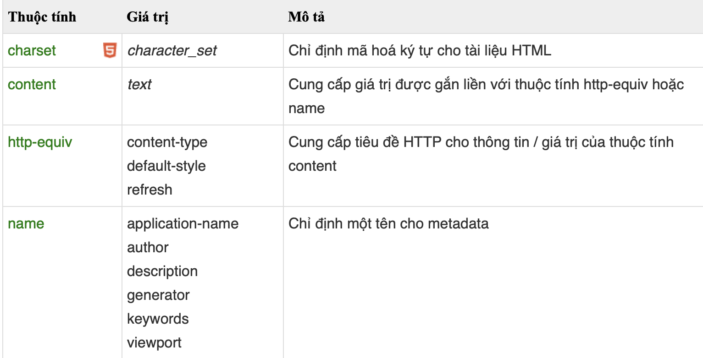

# HTML5
## HTLM là gì ?

- HTML không phải là ngôn ngữ lập trình, html là ngôn ngữ đánh dấu (markup language), ngôn ngữ đánh dấu là một nhóm các thẻ đánh dấu (các tag) để mô tả trang WEB.

## Thẻ meta là gì ?
- Được sử dụng để cung cấp metadata về tài liệu HTML.(Metadata sẽ không được hiển thị trên trình duyệt, nhưng nó sẽ được bộ máy tìm kiếm phân tích để lấy thông tin cơ bản về trang web). Để định nghĩa các thông tin cơ bản như mô tả trang web, từ khóa, tác giả, chỉnh sửa cuối cùng.
#### Một số ví dụ thẻ meta :
``` html
<meta name ="keyword" content="HTML là gì?">
```
``` html
<meta name = "description" content="Viết tắt HMTL ?">
```
```html
<meta name = "author" content="Loi">
```
``` html
<meta name = "refesh" content="30">
```
``` html
<meta name="viewport" content="width=device-width, initial-scale=1.0">
```
#### Các thuộc tính của thẻ meta

