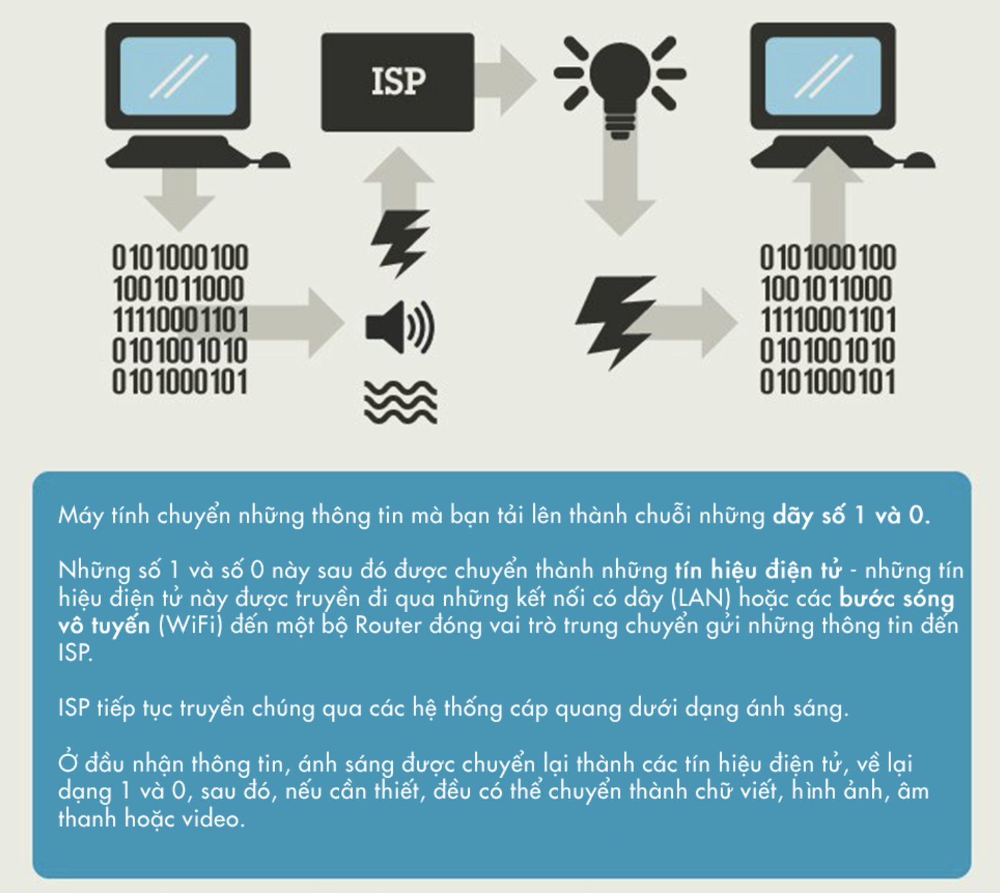
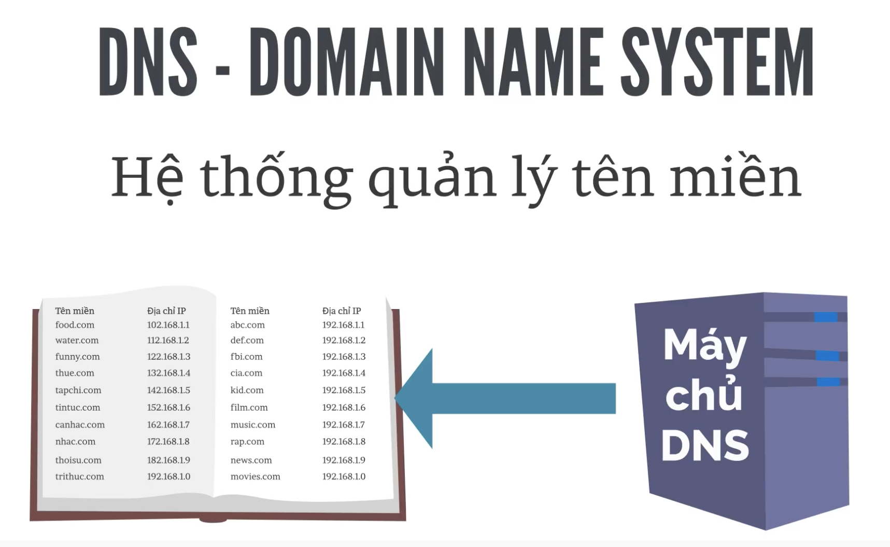
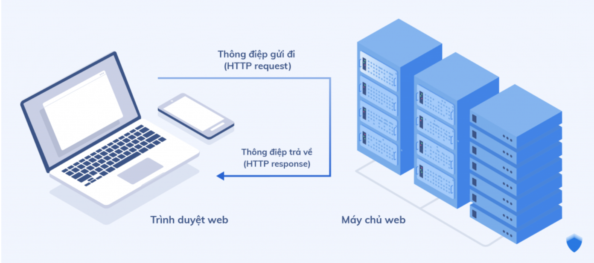
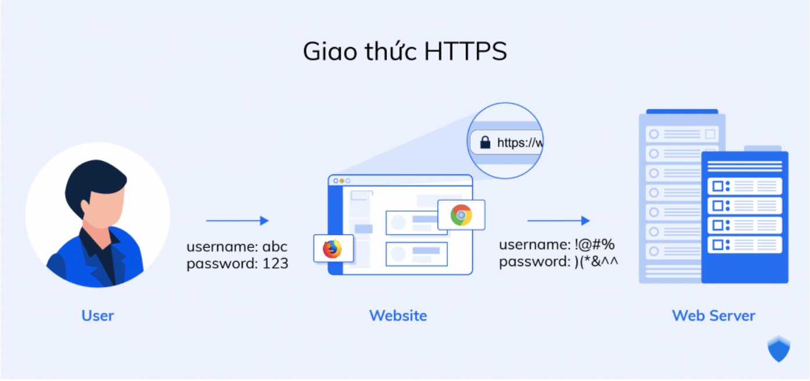

## HTML5
### `Internet` :
 Là một hệ thống thông tin toàn cầu có thể được truy nhập công cộng gồm các mạng máy tính được liên kết với nhau. 
 - Cách thức hoạt động của Internet
   
   - `IPS` : là dịch vụ cung cấp Internet, là đường dây kết nối moị thứ trên mạng.
   - Địa chỉ `IP` : là một địa chỉ nơi mà ta muốn truyền dữ liệu dến (102.168.1.1, 192.168.1.2,...)
   - `Domain` : Là tên miền của một địa chỉ IP(fb.com, youtube.com,..)
   - `DNS` : là một hệ thống quản lí tên miền.
   
- `Hosting` : (hay web hosting) là một dịch vụ online giúp bạn xuất bản website hoặc ứng dụng web lên Internet. Khi bạn đăng ký dịch vụ hosting, tức là bạn thuê mộ chỗ đặt trên server chứa tất cả các files và dữ liệu cần thiết để website của bạn chạy được.
- `HTTP` (Hypertext Transfer Protocol) là giao thức truyền tải siêu văn bản. Đây là giao thức tiêu chuẩn cho World Wide Web (www) để truyền tải dữ liệu dưới dạng văn bản, âm thanh, hình ảnh, video từ Web Server tới trình duyệt web của người dùng và ngược lại.
   
   - HTTP hoạt động theo mô hình Client (máy khách) – Server (máy chủ). Việc truy cập website được tiến hành dựa trên các giao tiếp giữa 2 đối tượng trên. Khi bạn truy cập một trang web qua giao thức HTTP, trình duyệt sẽ thực hiện các phiên kết nối đến server của trang web đó thông qua địa chỉ IP do hệ thống phân giải tên miền DNS cung cấp. Máy chủ sau khi nhận lệnh, sẽ trả về lệnh tương ứng giúp hiển thị website, bao gồm các nội dung như: văn bản, ảnh, video, âm thanh,…

- `HTTPS` (Hypertext Transfer Protocol Secure) là giao thức truyền tải siêu văn bản an toàn. Thực chất, đây chính là giao thức HTTP nhưng tích hợp thêm Chứng chỉ bảo mật SSL nhằm mã hóa các thông điệp giao tiếp để tăng tính bảo mật. Có thể hiểu, HTTPS là phiên bản HTTP an toàn, bảo mật hơn.
   
   - HTTPS hoạt động tương tự như HTTP, tuy nhiên được bổ sung thêm chứng chỉ SSL (Secure Sockets Layer – tầng ổ bảo mật) hoặc TLS (Transport Layer Security – bảo mật tầng truyền tải). Hiện tại, đây là các tiêu chuẩn bảo mật hàng đầu cho hàng triệu website trên toàn thế giới.
- Các bước diễn ra trong quá trình trang web hiển thị là gì?

   - Yêu cầu được thực hiện khi ai đó click vào một liên kết
   - Trang và các tài nguyên (file) của nó được tải về
   - Trình duyệt sử dụng các tài nguyên của trang để xây dựng trang
   - Trang sau đó được hiển thị (render) cho người dùng
- Mỗi cái trong từng bước trên có nhiều thành phần và chi tiết, nhưng bốn bước đó là những yếu tố chính diễn ra để hiển thị trang web cho người dùng.
- Về mặt kỹ thuật

  - Bốn bước liệt kê ở trên thường được đề cập về mặt kỹ thuật dưới những thuật ngữ như:

      - Yêu cầu (Request)
      - Đáp ứng (Response)
      - Xây dựng (Build)
      - Xuất trang/Hiển thị (Render)
   - Mỗi bước này thường được thực hiện lặp lại nhiều lần trong khi tải trang.

